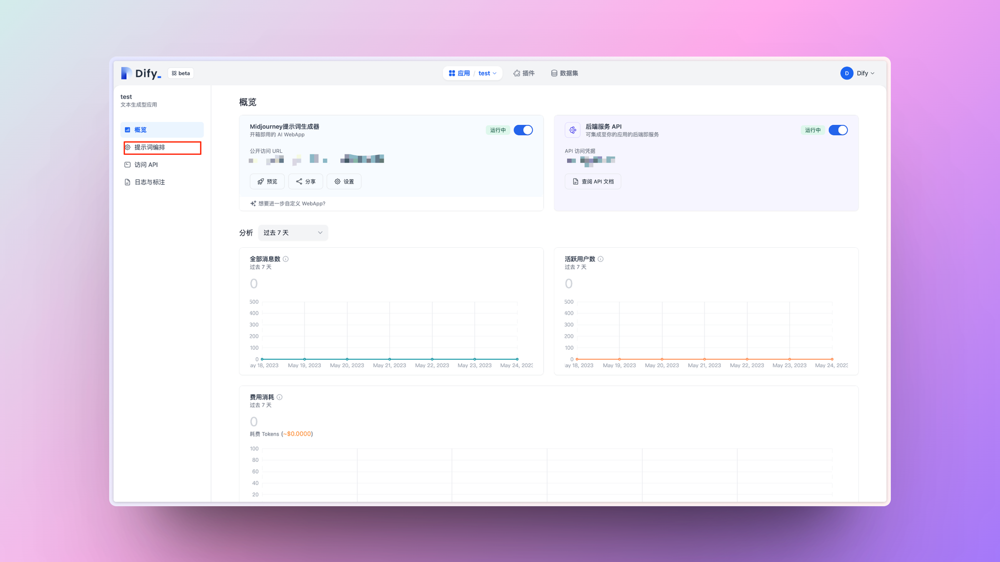
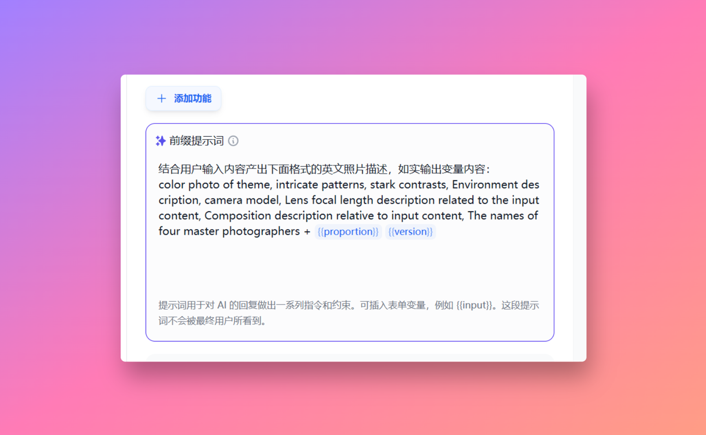
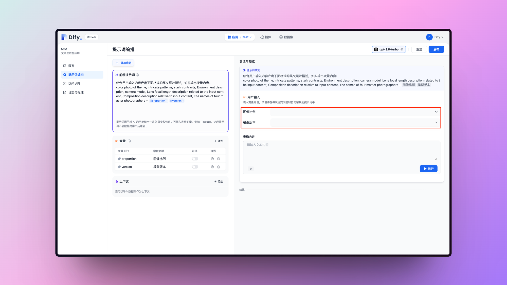
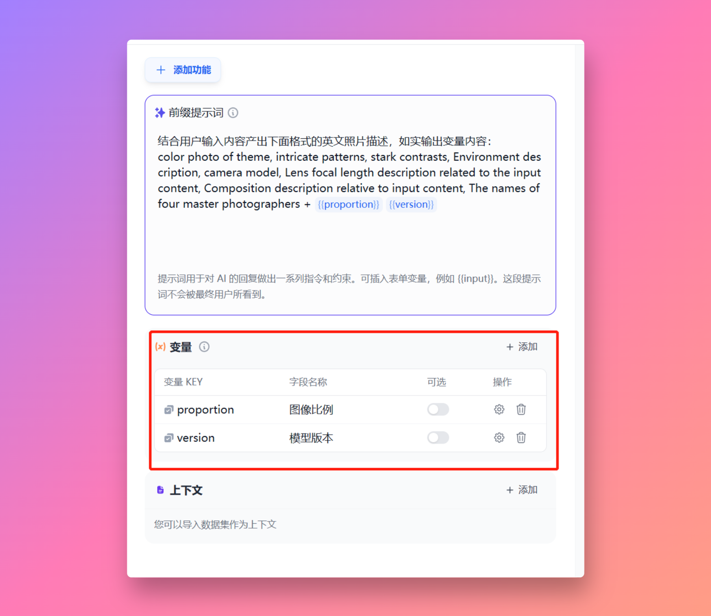
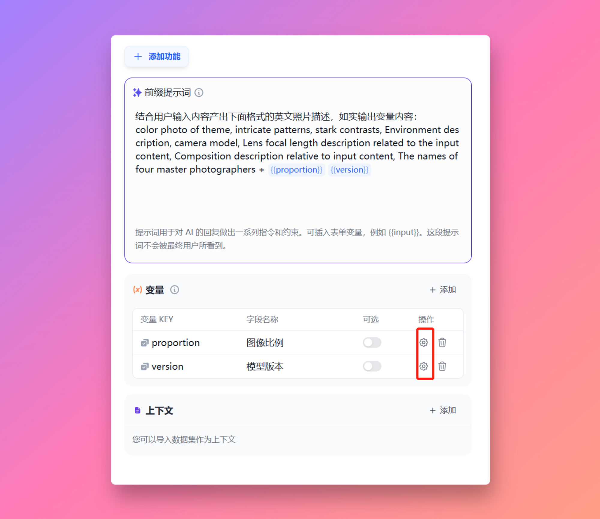
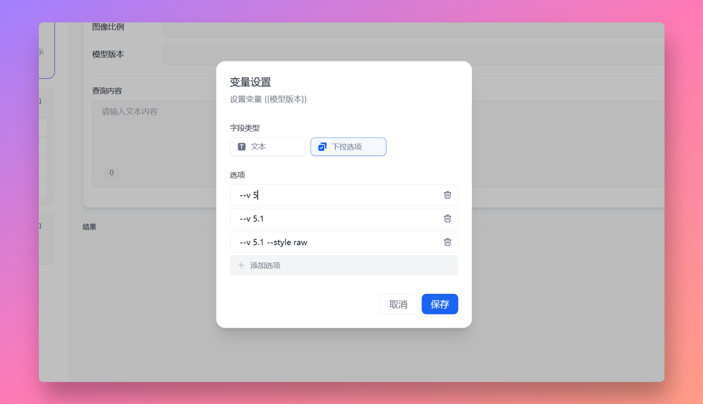
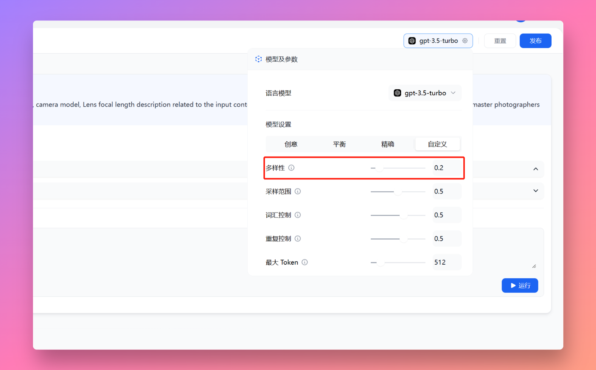
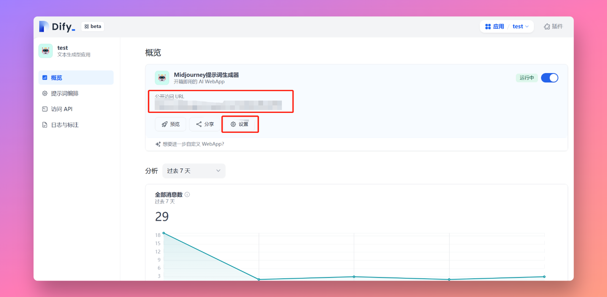

# 教你十几分钟不用代码创建 Midjoureny 提示词机器人

_作者：歸藏的 AI 工具箱_

试用了一下前几天我周刊里推荐的自然语言编程工具 Dify，它是 @goocarlos 开发的能够让一个不会代码的人只通过编写提示词生成一个 Web 应用，甚至连 API 也生成好了，你可以接入以后部署到你希望部署的平台上去。

下面这个应用就是我花 20 分钟写的，效果非常好，如果没有 Dify 我可能需要搞好久才能搞定。具体的功能就是根据输入的简短的主题生成 Midjourney 的提示词，也能帮助你快速填写常见的 Midjourney 命令。下面我会写一下这个应用的创建过程帮大家熟悉一下这个平台。

Dify 可以选择两种应用一种是对话型应用类似于 ChatGPT 那种，另一种是文本生成类应用没有多轮对话的机制点击按钮直接生成文本内容。我们要创建的 Midjoureny 提示词机器人，所以我们选择文本生成应用就行。

你可以在这里访问 Dify：https://dify.ai/

<figure><figcaption></figcaption></figure>

我们输入名称创建完成之后看到的页面就是我们的看板页面里面有一些数据监控和应用设置。我们先点击左侧的提示词编排，这里就是主要的工作页面了。

<figure><figcaption></figcaption></figure>

这个页面左侧是提示词设置和一些其他功能，右侧可以实时预览和使用你创建的内容。前缀提示词就是用户每次输入内容后触发的提示词了，可以理解为每次 GPT 都会按照你的前缀提示词内容去处理用户输入的信息。

<figure><figcaption></figcaption></figure>

可以看一下我的前缀提示词结构，主要有两部分前面是中文写的让 GPT 按照下面英文的结构输出照片的描述。英文的结构就是生成提示词的模板了，主要意思是【主题彩色照片，错综复杂的图案，鲜明的对比，环境描述，相机型号，与输入内容相关的镜头焦距描述，与输入内容相关的构图描述，四位摄影师的名字】这个就是提示词的主要内容了。理论上你现在保存到右边预览区域输入你想生成的主题就能生成对应提示词了。

<figure><figcaption></figcaption></figure>

那可能有人注意到了后面的 \{{proportion\}} 和 \{{version\}} 是什么呢，可以看到我右边需要用户选择图像比例和模型版本这两个变量就是用来传递用户选择的信息的。我们看一下如何设置。

<figure><figcaption></figcaption></figure>

我们的功能是把用户选择的信息填到提示词的最后方便用户直接复制不用重新填写和记忆这些命令，这里就要用到下面的变量功能。

变量的作用就是把用户表单填写或者选择的内容动态的带入到提示词里面。比如我这里创建了两个变量一个代表图像比例一个代表模型版本。点击添加按钮创建变量。

<figure><figcaption></figcaption></figure>

创建之后首先需要填写前面的变量 Key 和字段名称，变量 Key 需要英文。后面的可选开启之后这个字段就会是选填的。之后我们需要点击操作栏的设置来设置变量内容。

<figure><figcaption></figcaption></figure>

变量包括两种内容一种是文本变量一种是下拉选项，文本的就是用户需要手动输入，下拉的话就是选择了。这里我们主要是不想用户手打命令，所以我们选择下拉选项。增加需要的选项就行。

<figure><figcaption></figcaption></figure>

之后就是使用变量了，我们需要把变量 Key 用两个 {} 包起来填写到前缀提示词里。这里由于我们不想让 GPT 改用户选择的内容，我加了一句提示词“如实输出变量内容”。

<figure><figcaption></figcaption></figure>

加了上面那句话 GPT 还是有一定几率改掉我们的变量内容怎么办，我们可以在右侧模型选择这里把多样性调低，这样创造性输出就会降低，他就不容易改写我们的变量内容了。其他的几个参数的意思可看小叹号了解。

<figure><figcaption></figcaption></figure>

好了到这里我们的应用就创建完成了，测试输出没问题以后点击右上角的发布按钮，你的应用就发布了。你你和用户可以通过公开访问 URL 的地址访问你的应用。可以在设置里设置应用名称以及简介、图标之类的内容。

<figure><figcaption></figcaption></figure>

这就是利用 Dify 创建一个简单 AI 应用的流程，你还可以通过生成的 API 把你的应用部署在其他平台或者更改它的 UI。同时 Dify 还支持上传你自己的数据，比如你可以建一个客服机器人帮助你回答自己产品的相关问题。教程到这里就结束了，感谢 @goocarlos 创建了这么好的产品。
