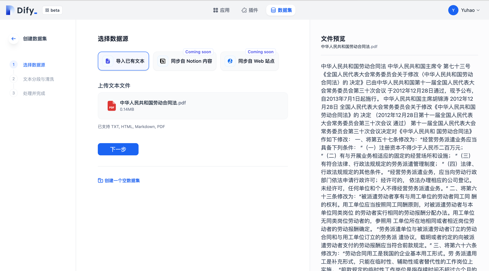
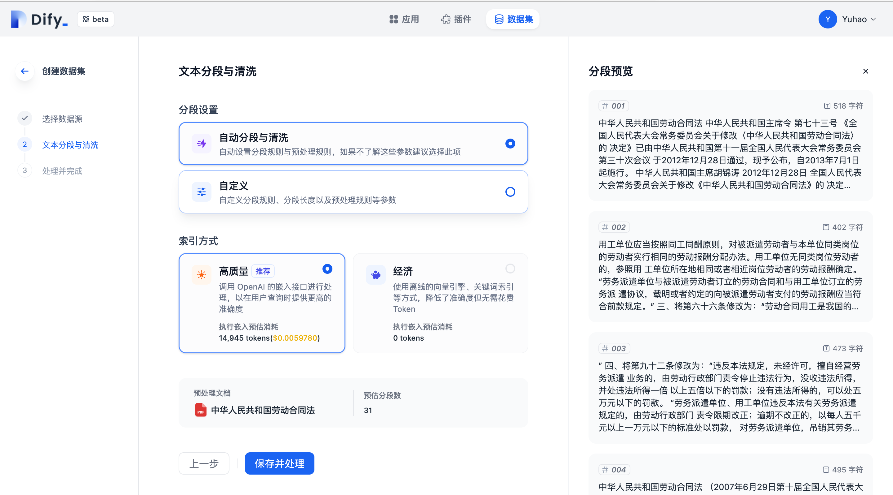
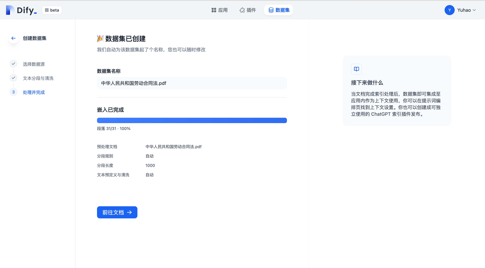
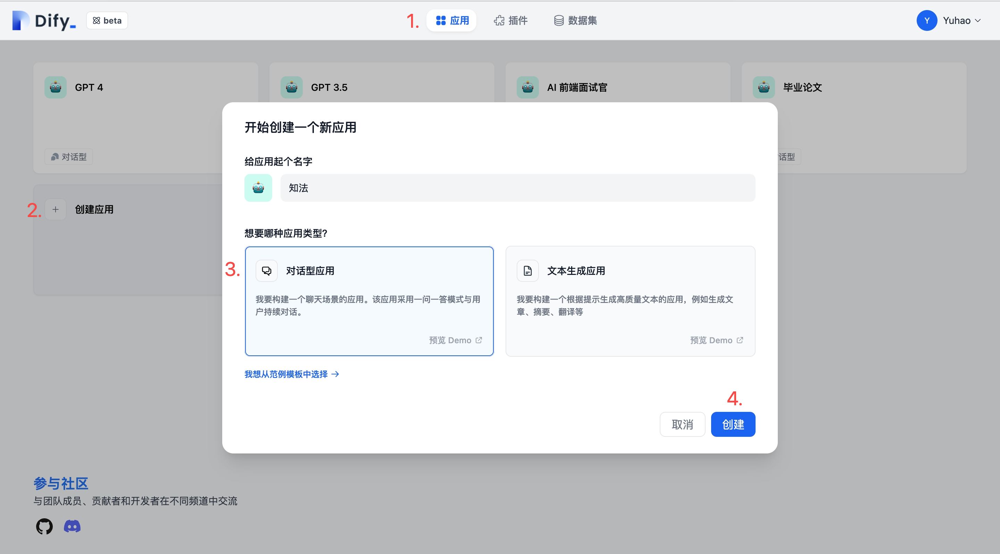
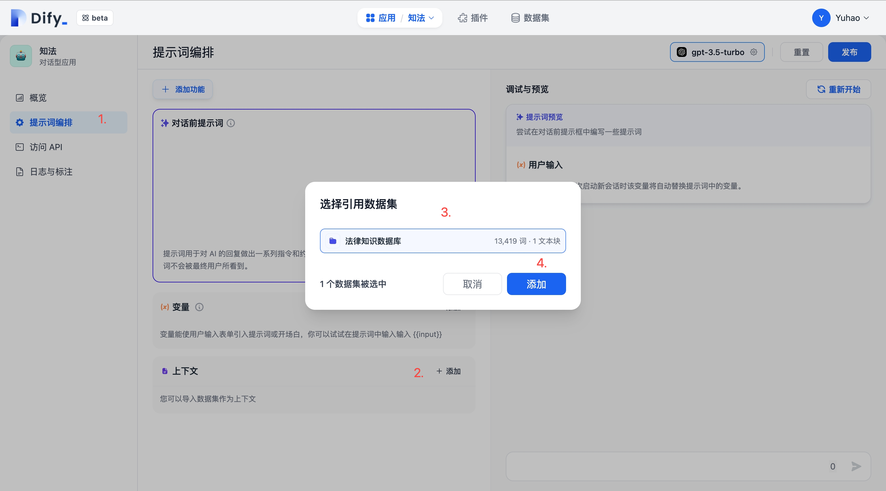
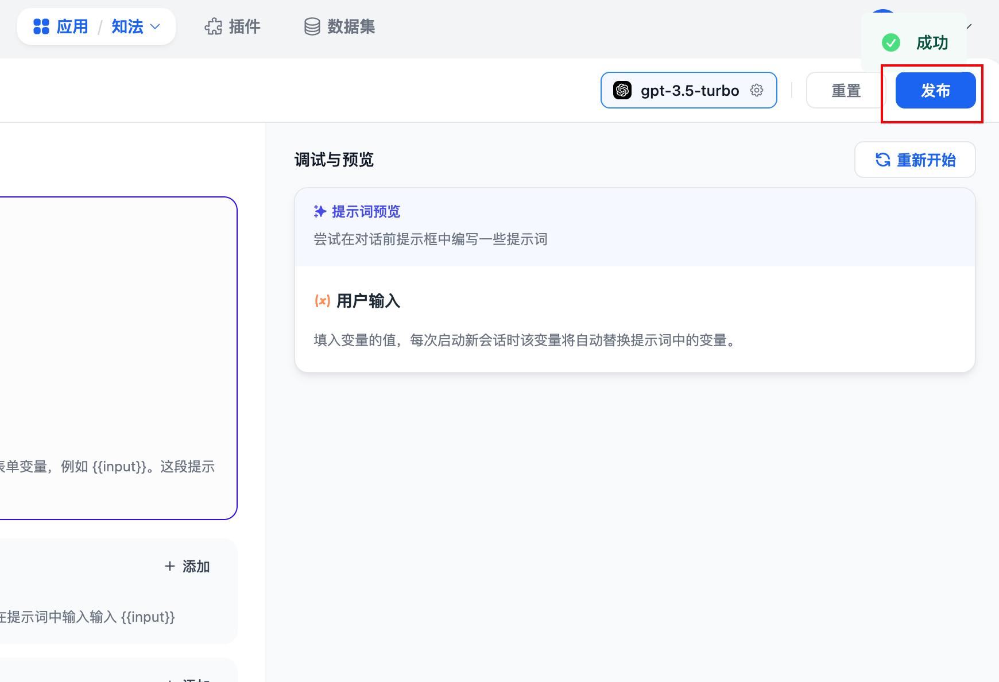

# 零代码，使用 Dify 两分钟接入企业微信

_作者：小聚乙烯人_

Dify 允许创建 AI 应用，并提供二次开发的能力。这里我将演示创建一个法律问答助手的 AI 应用，称作“知法”。在本篇教程中，我将指导你为“知法”接入企业微信。


## 前置准备

* 企业微信的管理员权限
* 一个 [Dify](https://dify.ai/) 的帐号
* 一个 [Laf](https://laf.run/) 云的帐号
* （可选）一个 OpenAI 的 API Key。如果没有，可以使用 Dify 免费提供的 200 次调用机会用于测试。
* （可选）在电脑上新建一个 env.txt 的文件，将下面内容复制到 env.txt 中。在接下来的教程中，我们会一步步把相关的信息填入这个文件。需要保存信息的步骤会高亮显示。

```JavaScript
WXWORK_TOKEN=""
WXWORK_AESKEY=""
WXWORK_CORPID=""
WXWORK_AGENTID=""
WXWORK_CORPSECRET=""
DIFY_APPTOKEN=""
```

## 在 Dify 上制作应用

这一章节将会介绍如何创建一个法律知识的数据集，并将数据集和应用关联起来。

### 搭建法律知识数据集

> 随时查看文档中关于搭建数据集的更多操作：[【数据集管理】](https://docs.dify.ai/v/zh-hans/advanced/datasets)

为了让“知法”了解到更多的上下文，我们需要创建一个法律知识的数据库。


* **导入文档：**从电脑上导入法律知识的 PDF 文档。

<figure><figcaption></figcaption></figure>

* **文本分段和清洗**：上传的文本需要经过二次加工，才能被大语言模型理解。这里我们不需要关注具体的实现逻辑，直接选择自动分段即可，然后点击“保存并处理”。

<figure><figcaption></figcaption></figure>

* **文本嵌入：**大约 30s 时间，数据集就创建成功了。你可以随时回来向数据库里添加更多文件。

<figure><figcaption></figcaption></figure>

<figure><figcaption></figcaption></figure>

### 搭建的应用

> 随时查看文档中关于创建应用的更多操作 [【创建应用】](https://docs.dify.ai/v/zh-hans/application/creating-an-application)

* **创建应用：**根据图中的指示，创建一个对话型应用，并命名为“知法”。

<figure><figcaption></figcaption></figure>

* **关联数据集：**在“提示词编排”页，在“上下文”模块中添加选择刚刚创建的数据集。

<figure><figcaption></figcaption></figure>

* **发布模型：**完成关联数据集后，点击页面右上角的“发布”，使模型生效。

<figure><figcaption></figcaption></figure>

* **获取 API 访问密钥。**在“访问 API”页面，创建一个 API 密钥并复制保存为`DIFY_APPTOKEN`。请注意不要把密钥泄漏给任何人，以免造成财产损失。

<figure><figcaption></figcaption></figure>

## 创建企业微信应用

* **记录企业信息：**进入企业微信管理后台-我的企业，记录这里的企业 ID 为 `WXWORK_CORPID`

<figure><figcaption></figcaption></figure>

* **创建企业微信应用：**进入应用管理页面，点击【创建应用】进入创建页面，填写应用信息后点击【创建应用】。如果已经有现成的应用，可以跳过此步骤。

<figure><figcaption></figcaption></figure>

<figure><figcaption></figcaption></figure>

* **记录企业微信应用信息：**在应用管理页面点击刚刚创建好的应用，进入应用详情页面。记录这里的 AgentId 和 Secret（需要点击获取按钮，在企业微信聊天窗口里面获取），分别为WXWORK_AGENTID和WXWORK_CORPSECRET。

<figure><figcaption></figcaption></figure>

* **企业微信应用接收信息：**在应用详情页面，接收消息处点击【设置 API 接收】。

<figure><figcaption></figcaption></figure>

在 API 接收消息页面，点一下两个【随机获取】按钮，它会自动生成一个 Token 和 EncodingAESKey，我们分别记为 WXWORK_TOKEN 和 WXWORK_AESKEY。注意，不要关掉这个页面，Laf 侧配置完毕后我们再来填写 URL。


<figure><figcaption></figcaption></figure>

## 在 Laf 云上创建云函数

* **新建 Laf 云应用：**进入 Laf 后，点击新建，创建一个云应用。这里选择免费的计划即可。

<figure><figcaption></figcaption></figure>

* **添加依赖：**企业微信应用需要添加`@wecom/crypto`, `xml2js` 两个依赖。添加好后，你的依赖列表应该像下面一样。

<figure><figcaption></figcaption></figure>

* **添加环境变量：**从第二行开始，将上面步骤中收集到的所有内容全部粘贴到这里，点击更新。

<figure><figcaption></figcaption></figure>

* **创建云函数：**点击创建一个云函数，注意“请求方法”中勾选上`POST`, `GET`，点击确定。

<figure><figcaption></figcaption></figure>

在创建好云函数中，删除默认的代码，并将文末**“附录”**中的代码全部粘贴到这里。

<figure><figcaption></figcaption></figure>

* **发布云函数：**点击发布后，云函数就生效了。

<figure><figcaption></figcaption></figure>

现在把 URL 粘贴到企业微信后台【设置 API 接收】的页面中刚刚留白的地方，然后点击保存。

<figure><figcaption></figcaption></figure>

* **配置 IP 白名单：**在企业微信中找到刚刚创建应用，发送一句消息。不出意外收不到任何消息。这是因为企业微信默认屏蔽了 Laf 云的 IP。

点击日志，应当能看到这样一条报错 '`not allow to access from your ip`'

<figure><figcaption></figcaption></figure>

点击查看这条日志详情，记录日志中给出的 Laf 云 IP。

<figure><figcaption></figcaption></figure>

回到企业微信的管理后台，点击刚刚创建的应用，为应用配置可行 IP。

<figure><figcaption></figcaption></figure>

在这里把刚刚的日志中记录的 IP 填入即可。

<figure><figcaption></figcaption></figure>

## 验证效果

1. **测试聊天：**在企业微信中找到刚刚创建应用，发送一句消息。现在应当能收到推送的消息了。

<figure><figcaption></figcaption></figure>

## 引用

这篇深度参考以下文章，感谢原作者的辛勤付出。[https://forum.laf.run/d/556/3](https://forum.laf.run/d/556/3)

## 附录

### 企业微信应用代码 - (伪流式响应)

```JavaScript
import cloud from '@lafjs/cloud'
import { decrypt, getSignature } from '@wecom/crypto'
import xml2js from 'xml2js'

function genConversationKey(userName) {
  return `${process.env.WXWORK_AGENTID}:${userName}`
}

function genWxAppAccessTokenKey() {
  return `${process.env.WXWORK_AGENTID}:access-token`
}

async function getToken() {
  console.log('[getToken] called')

  const cache = cloud.shared.get(genWxAppAccessTokenKey())
  if (cache && cache.expires >= Date.now()) return cache.token

  const res = await cloud.fetch({
    url: 'https://qyapi.weixin.qq.com/cgi-bin/gettoken',
    method: 'GET',
    params: {
      corpid: process.env.WXWORK_CORPID,
      corpsecret: process.env.WXWORK_CORPSECRET,
    }
  })

  const token = res.data.access_token
  cloud.shared.set(genWxAppAccessTokenKey(), { token, expires: Date.now() + res.data.expires_in * 1000 })
  return token
}

async function sendWxMessage(message, user) {
  console.log('[sendWxMessage] called', user, message)

  const res = await cloud.fetch({
    url: 'https://qyapi.weixin.qq.com/cgi-bin/message/send',
    method: 'POST',
    params: {
      access_token: await getToken()
    },
    data: {
      "touser": user,
      "msgtype": "text",
      "agentid": process.env.WXWORK_AGENTID,
      "text": {
        "content": message
      },
      "safe": 0,
      "enable_id_trans": 0,
      "enable_duplicate_check": 0,
      "duplicate_check_interval": 1800
    },
  })
  console.log('[sendWxMessage] received', res.data)
}

async function sendDifyMessage(message, userName, onMessage) {
  console.log('[sendDifyMessage] called', message, userName)

  const conversationId = cloud.shared.get(genConversationKey(userName)) || null
  let newConversationId = ''
  let responseText = ''

  try {
    const response = await cloud.fetch({
      url: 'https://api.dify.ai/v1/chat-messages',
      method: 'POST',
      headers: {
        'Authorization': `Bearer ${process.env.DIFY_APPTOKEN}`
      },
      data: {
        inputs: {},
        response_mode: "streaming",
        query: message,
        user: userName,
        conversation_id: conversationId
      },
      responseType: "stream"
    })

    let firstHalfMessage = ''
    response.data.on('data', (data) => {
      let message = data.toString()
      try {
        if (firstHalfMessage) {
          message += firstHalfMessage
          firstHalfMessage = ''
        }

        // 检查是不是sse协议
        if (!message.startsWith('data: ')) return

        const parsedChunk: Record<string, any> = JSON.parse(message.substring(6))

        if (!newConversationId) {
          newConversationId = parsedChunk.conversation_id
          cloud.shared.set(genConversationKey(userName), newConversationId)
        }
        const { answer } = parsedChunk
        responseText += answer

        // 伪流式响应
        if (answer.endsWith('\n\n') || (responseText.length > 120 && /[?。；！]$/.test(responseText))) {
          onMessage(responseText.replace('\n\n', ''))
          console.log('[sendDifyMessage] received', responseText, newConversationId)
          responseText = ''
        }
      } catch (e) {
        firstHalfMessage = message
        console.error('[sendDifyMessage] error', message)
      }

    })

    // stream结束时把剩下的消息全部发出去
    response.data.on('end', () => {
      onMessage(responseText.replace('\n\n', ''))
    })
  } catch (e) {
    console.error("[sendDifyMessage] error", e)
  }
}

async function asyncSendMessage(xml) {
  console.log('[asyncSendMessage] called', xml)

  if (xml.MsgType[0] !== 'text') return

  const message = xml.Content[0]
  const userName = xml.FromUserName[0]

  if (message === '/new') {
    // 重置conversation id
    cloud.shared.set(genConversationKey(userName), null)
    sendWxMessage('新建成功，开始新的对话吧~~', userName)
    return
  }

  sendWxMessage('AI思考中, 请耐心等待~~', userName)

  try {
    sendDifyMessage(message, userName, (message) => {
      sendWxMessage(message, userName)
    })
  }
  catch (e) {
    console.error('[sendDifyMessage] error', e)
    sendWxMessage('接口请求失败，请联系管理员查看错误信息', userName)
  }
}

export default async function (ctx: FunctionContext) {
  const { query } = ctx
  const { msg_signature, timestamp, nonce, echostr } = query
  const token = process.env.WXWORK_TOKEN
  const key = process.env.WXWORK_AESKEY
  console.log('[main] called', ctx.method, ctx.request.url)

  // 签名验证专用
  if (ctx.method === 'GET') {
    const signature = getSignature(token, timestamp, nonce, echostr)
    if (signature !== msg_signature) {
      return { message: '签名验证失败', code: 401 }
    }
    const { message } = decrypt(key, echostr)
    return message
  }

  const payload = ctx.body.xml
  const encrypt = payload.encrypt[0]
  const signature = getSignature(token, timestamp, nonce, encrypt)
  if (signature !== msg_signature) {
    return { message: '签名验证失败', code: 401 }
  }

  const { message } = decrypt(key, encrypt)
  const {
    xml
  } = await xml2js.parseStringPromise(message)
  // 由于GPT API耗时较久，这里提前返回，防止企业微信超时重试，后续再手动调用发消息接口
  ctx.response.sendStatus(200)

  await asyncSendMessage(xml)

  return { message: true, code: 0 }
}
```
