# 如何训练出专属于“你”的问答机器人？

_作者：阿乔_

_火枪击穿了专属于骑士阶层身披的铠甲与荣耀，武力对等才会有真正的平权。_

技术平权的速度从未来得如此之快。

作为兢兢业业的 CODING DevOps 项目的技术文档工程师，在为产品贡献数百篇文档后，依然止不住要在各种用户群 / 技术支持群里为客户解答问题。即使在每条答复中贴上文档链接，依然架不住新用户反复提问。（没办法，DevOps 产品中间又包含多项子产品）

_注：CODING DevOps 是腾讯云旗下的一站式研发管理平台及云原生开发工具，旨在让软件研发如同工业生产般简单高效，助力提升企业研发管理效能。_

虽然由 ChatGPT 掀起 AI 革命已来，但是它并不能够回答“我的”问题，也不能回答“你的”问题。但它却可以回答“大家”的问题。

为什么？ChatGPT 本身便是由庞大的互联网语料库训练而成，并且这部分训练数据截止于 2021 年 9 月。如果你的产品在这个日期之前就有幸在互联网中占有一席之地，那恭喜你，GPT 可以大概率可以回答出你的产品是大概是干嘛用的。因为它会从你的官网收集已有的描述语料。具体到单独的产品或公司的细节时它便开始靠胡言乱语来敷衍你了。

例如这样 🔽

<figure>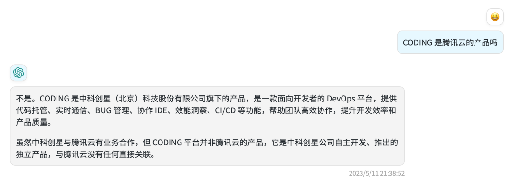<figcaption></figcaption></figure>

这里的“胡言乱语”指的是它会用其他不相关的概念进行回答，并且**你并不能够预期什么问题会有什么回答，这在商业场景下十分致命。**在大多数情况下，ChatGPT 对于一些带有**公理性质**的知识回答是没有问题的，作为一个可以日常侃大山闲聊的对象依然是合格的，可是你却看着它的强大的学习和理解能力望洋兴叹。

**“你这个孙悟空什么时候才能懂我，给我想要的回答？”**

这也是为什么说它能够回应大家的问题，但是缺不能够回答出“我”想要的问题。

### **改变发生**

直到，Dify 横空出世。

你可以简单地将 Dify 理解为是一个能够帮助你进行数据清理和文档训练的地方。咱们也给狗屁通（GPT）补补课，手动给它补上缺失的语料。把它从通用型聊天机器人，变成你的专业问答机器人。是的，从侃大山到对答如流，这中间的鸿沟不是一点半点，需要强大的理解、归纳总结能力。不过这正是狗屁通（GPT）的强项。

###

### **注册并生成应用**

现在，我们打开 Dify 并注册一个聊天机器人，我们在这里选择“对话型应用”。

<figure>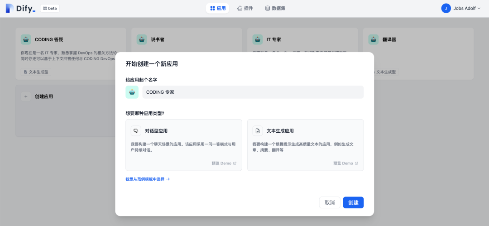<figcaption></figcaption></figure>

Duang，一个聊天机器人就做好了。

<figure><figcaption></figcaption></figure>

访问这个链接就可以看到一个聊天机器人了。但是，它现在也只是一个**通用型聊天机器人**，离商业可用的**专用型问答机器人**还很差一个语料的距离。

<figure>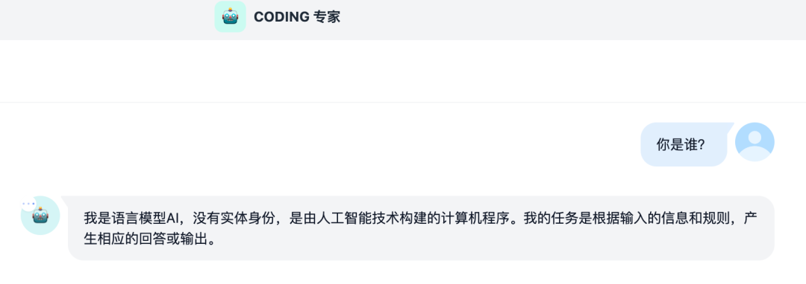<figcaption></figcaption></figure>

###

### **准备语料**

Dify 提供了一个名叫“数据集”的功能，这里就是我们上传语料的地方。

<figure>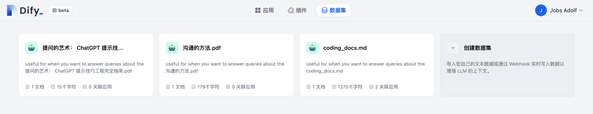<figcaption></figcaption></figure>

现在点击“创建数据集”选项，上传你的文本内容。

<figure>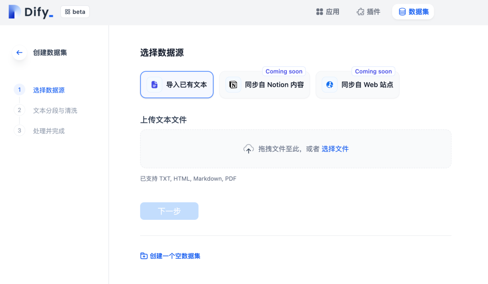<figcaption></figcaption></figure>

目前 Dify 仅支持上传单个文件，文件格式支持 TXT、HTML、MarkDown、PDF。

_是的没错，你也可以把电子书上传进来，用 AI 帮助你提炼书本内容。_

在正式开始训练前，我们得先把教材准备好。好在 CODING 之前的所有文档皆以 Git 代码仓库 + Markdown 的形式进行协作，因此我只需要先把文档先拉到本地中。不过我现在碰到了第一个问题，那就是如何把仓库中的这一系列 .md 文档文件合并至同一个文件中？

<figure>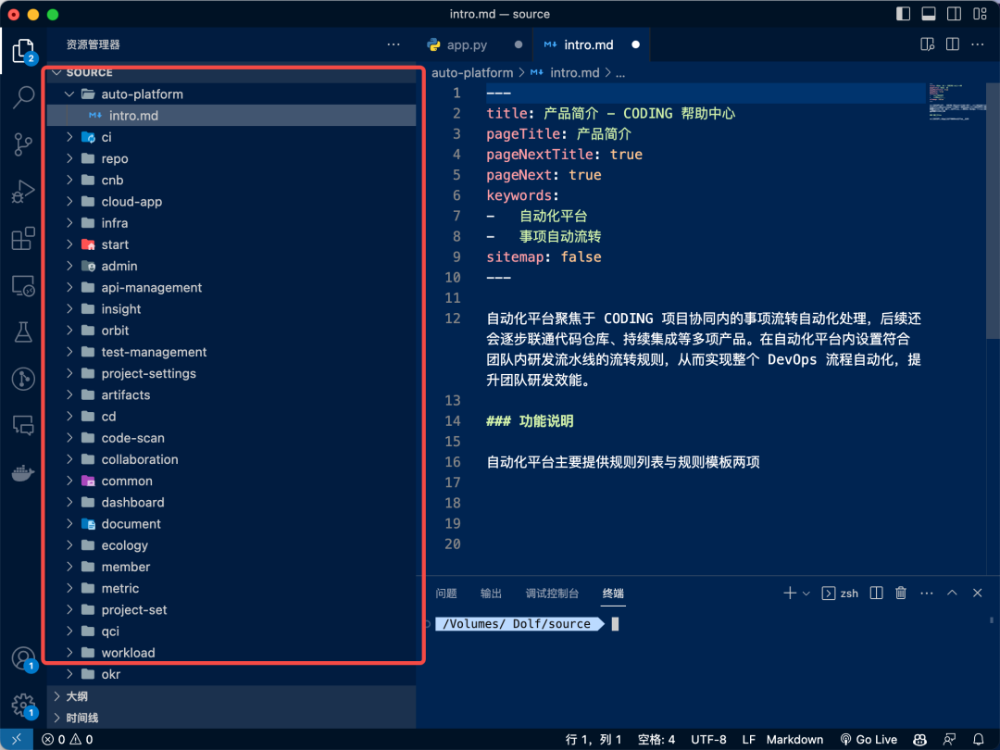<figcaption></figcaption></figure>

不怕，让 AI 给我们写一段 python 吧。

<figure>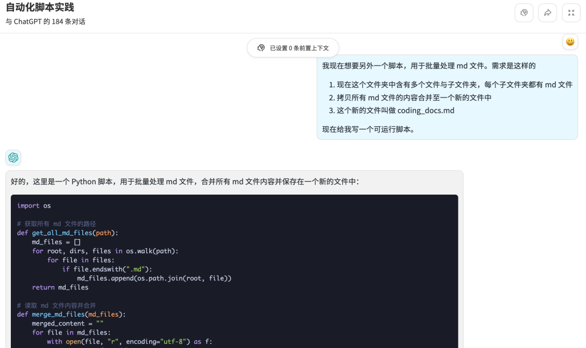<figcaption></figcaption></figure>

试着运行这个脚本，oh，输入路径后就成功生成了一篇总合文档！如果你想了解如何让 AI 给你写代码，不妨阅读[《如何用狗屁通（GPT ）解决一个套娃问题》](http://mp.weixin.qq.com/s?__biz=MzU2Njg1NDA3Mw==\&mid=2247484248\&idx=1\&sn=50809b40f520c767483e1a7b0eefb9c1\&chksm=fca76b8ecbd0e298e627140d63e7b3383d226ab293a2e8fefa04b5a1ee12f187520560ec1579\&scene=21#wechat_redirect)。

<figure>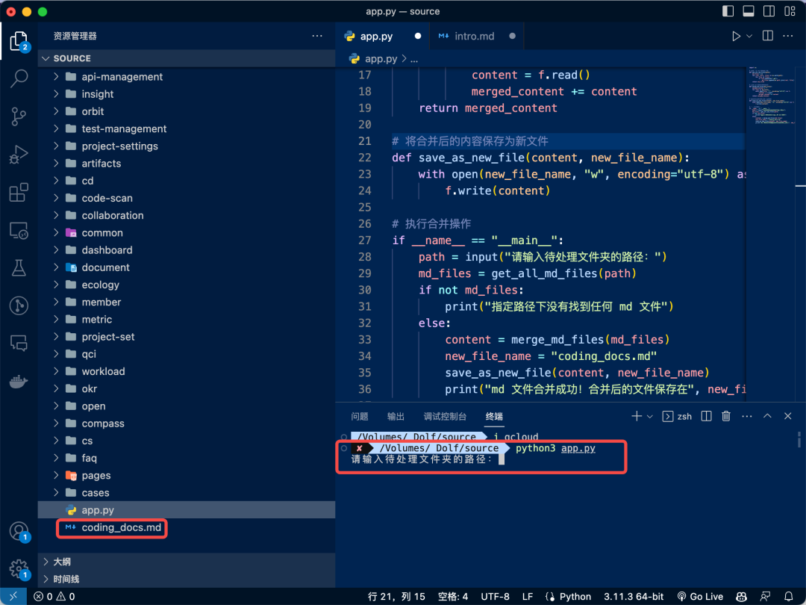<figcaption></figcaption></figure>

###

### **开始训练**

现在要做的事，就是上传这个文件并静待训练成果了。

<figure>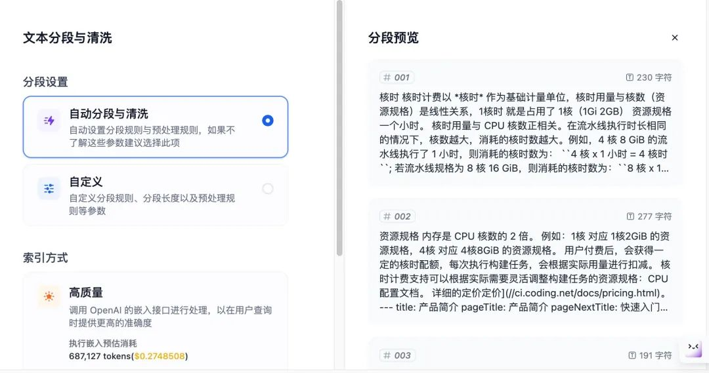<figcaption></figcaption></figure>

数据自动分段与清洗完成后，在刚创建的应用设置中的上下文，关联这一篇文档。为了保证响应速度和成本控制，这里直接用 3.5 模型。

<figure>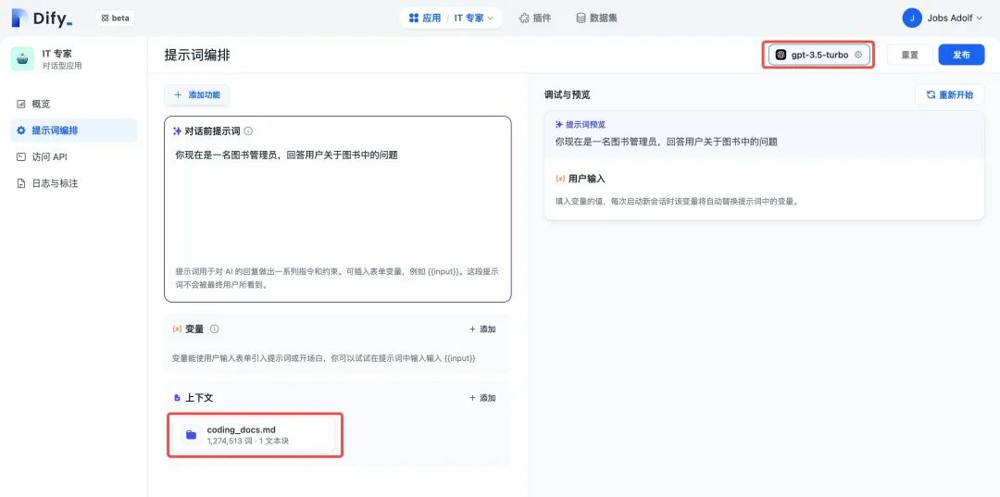<figcaption></figcaption></figure>

###

### **训练成功**

现在再去和这个机器人互动，看看它会回答什么？

<figure>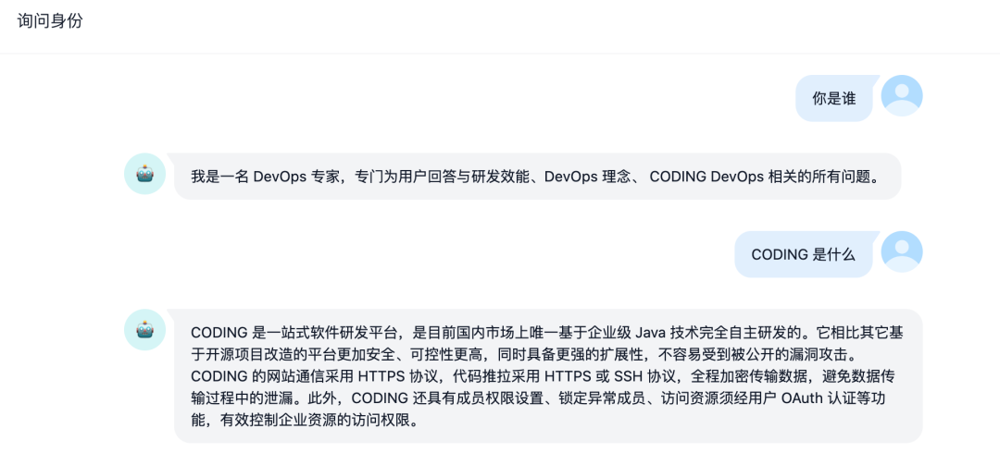<figcaption></figcaption></figure>

好了，你已经是个成熟的问答机器人了，可以回答更加复杂的产品问题了。

<figure><figcaption></figcaption></figure>

<figure>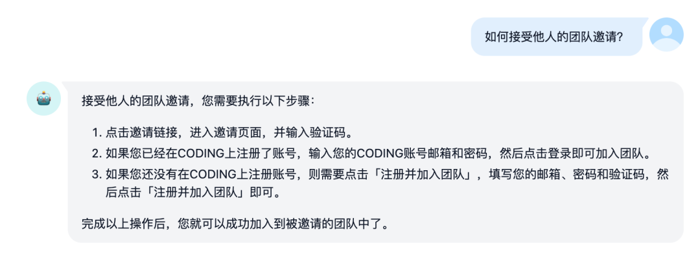<figcaption></figcaption></figure>

<figure>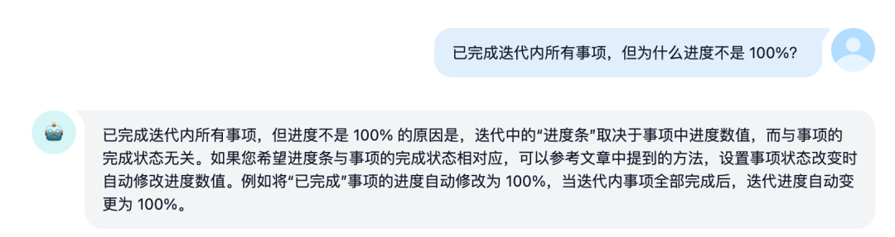<figcaption></figcaption></figure>

<figure>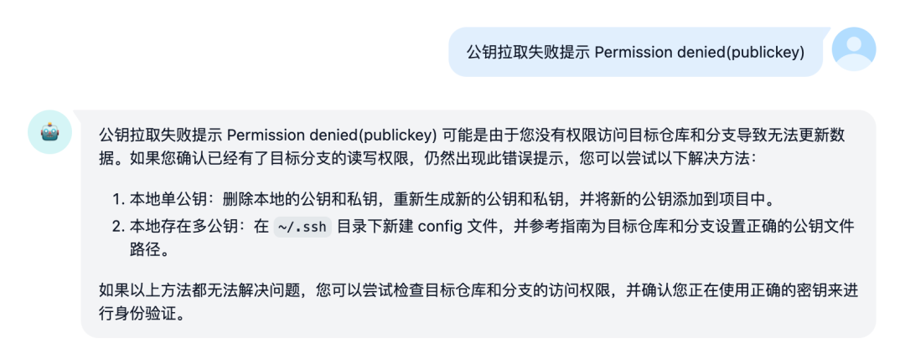<figcaption></figcaption></figure>

这个问答机器人花了多久做出来，成本如何？

整理语料+训练完成控制在半个小时以内，训练成本 0.27 美元。

现在，AI 可以深入到产品内部，变成妥妥的产品专家。只要有优秀的文档，所有公司都可以打造出专用型问答机器人。

武力对等才会有真正的平权。如果你对我的实践过程同样感兴趣，可以来体验一下我做好的机器人，地址：[https://udify.app/chat/F2Y4bKEWbuCb1FTC](https://udify.app/chat/F2Y4bKEWbuCb1FTC)

不妨也来 Dify 平台训练属于你自己的机器人。做一个考试问答机器人？出题机器人？
