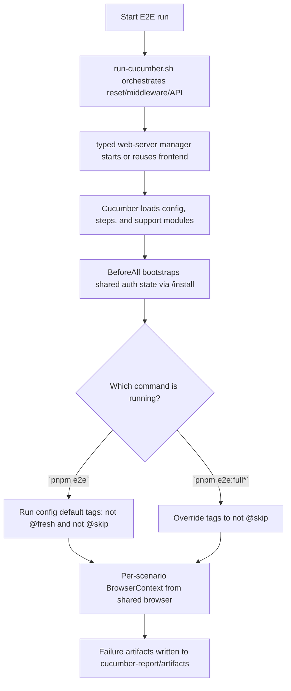

# E2E

This package contains the repository-level end-to-end tests for Dify.

The suite uses Cucumber for scenario definitions and Playwright as the browser execution layer.

It tests:

- backend API started from source
- frontend served from the production artifact
- middleware services started from Docker

## Prerequisites

- Node.js `^22.22.1`
- `pnpm`
- `uv`
- Docker

Install Playwright browsers once:

```bash
cd e2e
pnpm install
pnpm e2e:install
pnpm check
```

Use `pnpm check` as the default local verification step after editing E2E TypeScript, Cucumber support code, or feature glue. It runs formatting, linting, and type checks for this package.

Frontend artifact behavior:

- if `web/.next/BUILD_ID` exists, E2E reuses the existing build by default
- if you set `E2E_FORCE_WEB_BUILD=1`, E2E rebuilds the frontend before starting it

## Lifecycle



Ownership is split like this:

- shell scripts orchestrate reset, middleware, and backend startup
- `support/web-server.ts` manages frontend reuse, startup, readiness, and shutdown
- `features/support/hooks.ts` manages auth bootstrap, scenario lifecycle, and diagnostics
- `features/support/world.ts` owns per-scenario typed context
- `features/step-definitions/` holds domain-oriented glue so the official VS Code Cucumber plugin works with default conventions when `e2e/` is opened as the workspace root

Behavior depends on instance state:

- uninitialized instance: completes install and stores authenticated state
- initialized instance: signs in and reuses authenticated state

Because of that, the `@fresh` install scenario only runs in the `pnpm e2e:full*` flows. The default `pnpm e2e*` flows exclude `@fresh` via Cucumber config tags so they can be re-run against an already initialized instance.

Reset all persisted E2E state:

```bash
pnpm e2e:reset
```

This removes:

- `docker/volumes/db/data`
- `docker/volumes/redis/data`
- `docker/volumes/weaviate`
- `docker/volumes/plugin_daemon`
- `e2e/.auth`
- `e2e/.logs`
- `e2e/cucumber-report`

Start the full middleware stack:

```bash
pnpm e2e:middleware:up
```

Stop the full middleware stack:

```bash
pnpm e2e:middleware:down
```

The middleware stack includes:

- PostgreSQL
- Redis
- Weaviate
- Sandbox
- SSRF proxy
- Plugin daemon

Fresh install verification:

```bash
pnpm e2e:full
```

Repeat authenticated regression without clearing data:

```bash
pnpm e2e:middleware:up
pnpm e2e
pnpm e2e:middleware:down
```

Run the Cucumber suite against an already running middleware stack:

```bash
pnpm e2e:middleware:up
pnpm e2e
pnpm e2e:middleware:down
```

Interactive local debugging:

```bash
pnpm e2e:full:ui
```

Artifacts and diagnostics:

- `cucumber-report/report.html`: HTML report
- `cucumber-report/report.json`: JSON report
- `cucumber-report/artifacts/`: failure screenshots and HTML captures
- `.logs/cucumber-api.log`: backend startup log
- `.logs/cucumber-web.log`: frontend startup log
- `.logs/web-server-manager.log`: typed web-server manager log

`pnpm e2e:ui` and `pnpm e2e:full:ui` currently run the suite in headed mode. Cucumber does not provide a Playwright-style UI mode.
