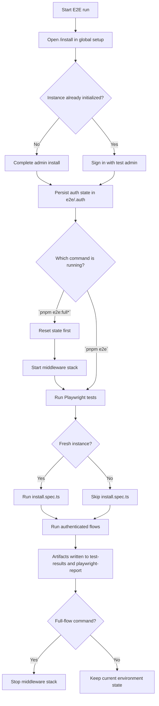

# E2E

This package contains the repository-level Playwright end-to-end tests for Dify.

It tests:

- backend API started from source
- frontend served from the production artifact
- middleware services started from Docker

## Prerequisites

- Node.js `^22.22.1`
- `pnpm`
- `uv`
- Docker

Install Playwright browsers once:

```bash
cd e2e
pnpm install
pnpm e2e:install
```

Frontend artifact behavior:

- if `web/.next/BUILD_ID` exists, E2E reuses the existing build by default
- if you set `E2E_FORCE_WEB_BUILD=1`, E2E rebuilds the frontend before starting it

## Lifecycle



`global.setup.ts` always opens `/install` first.

Behavior depends on instance state:

- uninitialized instance: completes install and stores authenticated state
- initialized instance: signs in and reuses authenticated state

Because of that, `smoke/install.spec.ts` only runs on a fresh instance. After the first successful install, later runs will skip that test unless you reset state first.

Reset all persisted E2E state:

```bash
pnpm e2e:reset
```

This removes:

- `docker/volumes/db/data`
- `docker/volumes/redis/data`
- `docker/volumes/weaviate`
- `docker/volumes/plugin_daemon`
- `e2e/.auth`
- `e2e/playwright-report`
- `e2e/test-results`

Start the full middleware stack:

```bash
pnpm e2e:middleware:up
```

Stop the full middleware stack:

```bash
pnpm e2e:middleware:down
```

The middleware stack includes:

- PostgreSQL
- Redis
- Weaviate
- Sandbox
- SSRF proxy
- Plugin daemon

Fresh install verification:

```bash
pnpm e2e:full
```

Repeat authenticated regression without clearing data:

```bash
pnpm e2e:middleware:up
pnpm e2e
pnpm e2e:middleware:down
```

Interactive local debugging:

```bash
pnpm e2e:full:ui
```
