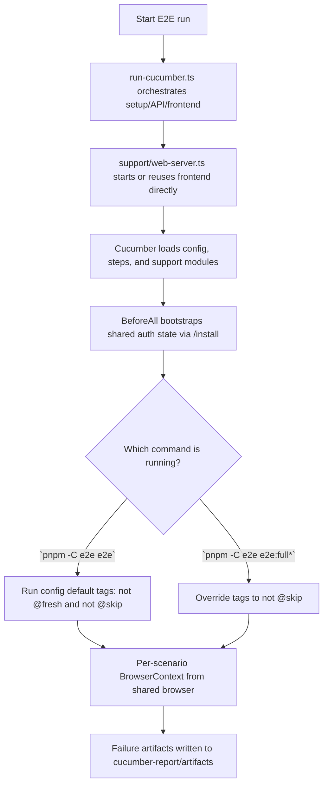

# E2E

This package contains the repository-level end-to-end tests for Dify.

This file is the canonical package guide for `e2e/`. Keep detailed workflow, architecture, debugging, and reporting documentation here. Keep `README.md` as a minimal pointer to this file so the two documents do not drift.

The suite uses Cucumber for scenario definitions and Playwright as the browser execution layer.

It tests:

- backend API started from source
- frontend served from the production artifact
- middleware services started from Docker

## Prerequisites

- Node.js `^22.22.1`
- `pnpm`
- `uv`
- Docker

Run the following commands from the repository root.

Install Playwright browsers once:

```bash
pnpm install
pnpm -C e2e e2e:install
pnpm -C e2e check
```

`pnpm install` is resolved through the repository workspace and uses the shared root lockfile plus `pnpm-workspace.yaml`.

Use `pnpm -C e2e check` as the default local verification step after editing E2E TypeScript, Cucumber support code, or feature glue. It runs ESLint autofix, linting, and type checks for this package.

Common commands:

```bash
# authenticated-only regression (default excludes @fresh)
# expects backend API, frontend artifact, and middleware stack to already be running
pnpm -C e2e e2e

# full reset + fresh install + authenticated scenarios
# starts required middleware/dependencies for you
pnpm -C e2e e2e:full

# run a tagged subset
pnpm -C e2e e2e -- --tags @smoke

# headed browser
pnpm -C e2e e2e:headed -- --tags @smoke

# slow down browser actions for local debugging
E2E_SLOW_MO=500 pnpm -C e2e e2e:headed -- --tags @smoke
```

Frontend artifact behavior:

- if `web/.next/BUILD_ID` exists, E2E reuses the existing build by default
- if you set `E2E_FORCE_WEB_BUILD=1`, E2E rebuilds the frontend before starting it

## Lifecycle



Ownership is split like this:

- `scripts/setup.ts` is the single environment entrypoint for reset, middleware, backend, and frontend startup
- `run-cucumber.ts` orchestrates the E2E run and Cucumber invocation
- `support/web-server.ts` manages frontend reuse, startup, readiness, and shutdown
- `features/support/hooks.ts` manages auth bootstrap, scenario lifecycle, and diagnostics
- `features/support/world.ts` owns per-scenario typed context
- `features/step-definitions/` holds domain-oriented glue so the official VS Code Cucumber plugin works with default conventions when `e2e/` is opened as the workspace root

Package layout:

- `features/`: Gherkin scenarios grouped by capability
- `features/step-definitions/`: domain-oriented step definitions
- `features/support/hooks.ts`: suite lifecycle, auth-state bootstrap, diagnostics
- `features/support/world.ts`: shared scenario context
- `support/web-server.ts`: typed frontend startup/reuse logic
- `scripts/setup.ts`: reset and service lifecycle commands
- `scripts/run-cucumber.ts`: Cucumber orchestration entrypoint

Behavior depends on instance state:

- uninitialized instance: completes install and stores authenticated state
- initialized instance: signs in and reuses authenticated state

Because of that, the `@fresh` install scenario only runs in the `pnpm -C e2e e2e:full*` flows. The default `pnpm -C e2e e2e*` flows exclude `@fresh` via Cucumber config tags so they can be re-run against an already initialized instance.

Reset all persisted E2E state:

```bash
pnpm -C e2e e2e:reset
```

This removes:

- `docker/volumes/db/data`
- `docker/volumes/redis/data`
- `docker/volumes/weaviate`
- `docker/volumes/plugin_daemon`
- `e2e/.auth`
- `e2e/.logs`
- `e2e/cucumber-report`

Start the full middleware stack:

```bash
pnpm -C e2e e2e:middleware:up
```

Stop the full middleware stack:

```bash
pnpm -C e2e e2e:middleware:down
```

The middleware stack includes:

- PostgreSQL
- Redis
- Weaviate
- Sandbox
- SSRF proxy
- Plugin daemon

Fresh install verification:

```bash
pnpm -C e2e e2e:full
```

Run the Cucumber suite against an already running middleware stack:

```bash
pnpm -C e2e e2e:middleware:up
pnpm -C e2e e2e
pnpm -C e2e e2e:middleware:down
```

Artifacts and diagnostics:

- `cucumber-report/report.html`: HTML report
- `cucumber-report/report.json`: JSON report
- `cucumber-report/artifacts/`: failure screenshots and HTML captures
- `.logs/cucumber-api.log`: backend startup log
- `.logs/cucumber-web.log`: frontend startup log

Open the HTML report locally with:

```bash
open cucumber-report/report.html
```

## Writing new scenarios

### Workflow

1. Create a `.feature` file under `features/<capability>/`
1. Add step definitions under `features/step-definitions/<capability>/`
1. Reuse existing steps from `common/` and other definition files before writing new ones
1. Run with `pnpm -C e2e e2e -- --tags @your-tag` to verify
1. Run `pnpm -C e2e check` before committing

### Feature file conventions

Tag every feature or scenario with a capability tag. Add auth tags only when they clarify intent or change the browser session behavior:

```gherkin
@datasets @authenticated
Feature: Create dataset
  Scenario: Create a new empty dataset
    Given I am signed in as the default E2E admin
    When I open the datasets page
    ...
```

- Capability tags (`@apps`, `@auth`, `@datasets`, …) group related scenarios for selective runs
- Auth/session tags:
  - default behavior — scenarios run with the shared authenticated storageState unless marked otherwise
  - `@unauthenticated` — uses a clean BrowserContext with no cookies or storage
  - `@authenticated` — optional intent tag for readability or selective runs; it does not currently change hook behavior on its own
- `@fresh` — only runs in `e2e:full` mode (requires uninitialized instance)
- `@skip` — excluded from all runs

Keep scenarios short and declarative. Each step should describe **what** the user does, not **how** the UI works.

### Step definition conventions

```typescript
import type { DifyWorld } from '../../support/world'
import { Then, When } from '@cucumber/cucumber'
import { expect } from '@playwright/test'

When('I open the datasets page', async function (this: DifyWorld) {
  await this.getPage().goto('/datasets')
})
```

Rules:

- Always type `this` as `DifyWorld` for proper context access
- Use `async function` (not arrow functions — Cucumber binds `this`)
- One step = one user-visible action or one assertion
- Keep steps stateless across scenarios; use `DifyWorld` properties for in-scenario state

### Locator priority

Follow the Playwright recommended locator strategy, in order of preference:

| Priority | Locator            | Example                                   | When to use                               |
| -------- | ------------------ | ----------------------------------------- | ----------------------------------------- |
| 1        | `getByRole`        | `getByRole('button', { name: 'Create' })` | Default choice — accessible and resilient |
| 2        | `getByLabel`       | `getByLabel('App name')`                  | Form inputs with visible labels           |
| 3        | `getByPlaceholder` | `getByPlaceholder('Enter name')`          | Inputs without visible labels             |
| 4        | `getByText`        | `getByText('Welcome')`                    | Static text content                       |
| 5        | `getByTestId`      | `getByTestId('workflow-canvas')`          | Only when no semantic locator works       |

Avoid raw CSS/XPath selectors. They break when the DOM structure changes.

### Assertions

Use `@playwright/test` `expect` — it auto-waits and retries until the condition is met or the timeout expires:

```typescript
// URL assertion
await expect(page).toHaveURL(/\/datasets\/[a-f0-9-]+\/documents/)

// Element visibility
await expect(page.getByRole('button', { name: 'Save' })).toBeVisible()

// Element state
await expect(page.getByRole('button', { name: 'Submit' })).toBeEnabled()

// Negation
await expect(page.getByText('Loading')).not.toBeVisible()
```

Do not use manual `waitForTimeout` or polling loops. If you need a longer wait for a specific assertion, pass `{ timeout: 30_000 }` to the assertion.

### Cucumber expressions

Use Cucumber expression parameter types to extract values from Gherkin steps:

| Type       | Pattern       | Example step                       |
| ---------- | ------------- | ---------------------------------- |
| `{string}` | Quoted string | `I select the "Workflow" app type` |
| `{int}`    | Integer       | `I should see {int} items`         |
| `{float}`  | Decimal       | `the progress is {float} percent`  |
| `{word}`   | Single word   | `I click the {word} tab`           |

Prefer `{string}` for UI labels, names, and text content — it maps naturally to Gherkin's quoted values.

### Scoping locators

When the page has multiple similar elements, scope locators to a container:

```typescript
When('I fill in the app name in the dialog', async function (this: DifyWorld) {
  const dialog = this.getPage().getByRole('dialog')
  await dialog.getByPlaceholder('Give your app a name').fill('My App')
})
```

### Failure diagnostics

The `After` hook automatically captures on failure:

- Full-page screenshot (PNG)
- Page HTML dump
- Console errors and page errors

Artifacts are saved to `cucumber-report/artifacts/` and attached to the HTML report. No extra code needed in step definitions.

### Seed resources and preflight checks

Use `support/naming.ts` for generated test resource names. New app, Agent, dataset, file, or credential seeds should start with `E2E` so local and shared environments can identify disposable resources.

Use `fixtures/test-materials/` for checked-in files that scenarios upload, preview, index, or retrieve. Keep these fixtures small and deterministic, and use `support/test-materials.ts` to resolve their absolute paths.

Use `support/preflight.ts` for scenarios that require optional external resources such as a stable model provider, plugin/tool credential, or knowledge base seed. Prefer an explicit `Given` step that returns a skipped result with a clear blocked-precondition reason over hidden setup in hooks.

Use `the Agent Builder stable chat model is available` before scenarios that must run an Agent with a real model. The step requires `E2E_STABLE_MODEL_PROVIDER` and `E2E_STABLE_MODEL_NAME`, defaults `E2E_STABLE_MODEL_TYPE` to `llm`, and verifies the model is present and `active` through `/console/api/workspaces/current/models/model-types/{type}` before storing it on `DifyWorld.agentBuilderStableChatModel`. Any Agent Builder scenario that needs a usable model should explicitly apply this stored model during its own setup instead of hard-coding provider or model names in feature files or hooks.

Use `the Agent Builder broken chat model is available` before model-recovery scenarios that intentionally start from an invalid model. The step requires `E2E_BROKEN_MODEL_PROVIDER`, defaults `E2E_BROKEN_MODEL_NAME` to `e2e-broken-model`, defaults `E2E_BROKEN_MODEL_TYPE` to `llm`, and only verifies that the model entry exists. The scenario must still assert the user-visible failure and recovery behavior.

Use `the Agent Builder preseeded Agent "{name}" is available`, `the Agent Builder preseeded workflow "{name}" is available`, `the Agent Builder preseeded dataset "{name}" is available`, and `the Agent Builder preseeded tool "{provider} / {tool}" is available` when a scenario depends on a fixed environment resource. These steps verify the resource through Console APIs, store the result in `DifyWorld.agentBuilderPreseededResources`, and return `skipped` with a blocked-precondition attachment when the resource is missing. The tool step checks built-in tool availability only; credential-validity scenarios still need explicit credential-state setup or assertions.

Use `the Agent Builder preseeded dataset "{name}" is indexed and ready` for knowledge retrieval scenarios that require a completed knowledge base. It verifies that the dataset exists, has documents, all listed documents are available, and every document indexing status is `completed`. Use `the Agent Builder preseeded dataset "{name}" is indexing` for failure-recovery scenarios that require an indexing or queued knowledge base; it verifies at least one document is in `waiting`, `parsing`, `cleaning`, `splitting`, or `indexing`. Fixed-content assertions such as `AGENT_KNOWLEDGE_PASS` belong in the dependent runtime scenario, where the user-visible Agent reply can prove retrieval actually hit the expected content.

Use `the Agent Builder preseeded Agent "{agent}" includes drive skill "{skill}"` to verify that a fixed Agent has a drive-backed Skill attached. Use `the Agent Builder preseeded Agent "{agent}" has Backend service API access with an API key` to verify that a fixed Agent has Backend service API enabled and at least one key. The API key step does not validate a human-readable key name because the Console API key response does not expose one.

Run `pnpm -C e2e e2e -- --tags @agent-v2-preflight` against a seeded environment to verify Agent Builder preseeded resource readiness before running dependent scenarios. Keep each resource as a separate preflight scenario so a missing resource marks only its dependent precondition as blocked instead of hiding the rest of the readiness report.

Use `DifyWorld.createdDatasetIds` for datasets created by a scenario, `DifyWorld.createdAgentDriveFiles` for Agent drive files committed during a scenario, and `DifyWorld.createdBuiltinToolCredentials` for built-in tool credentials created during a scenario. The shared `After` hook deletes Agent drive files first so file cleanup also works for scenarios that upload into a preseeded Agent, then deletes created Agents and Apps before deleting dependent datasets and tool credentials. Use `DifyWorld.registerCleanup(...)` when a scenario creates any other resource type that is not covered by the typed cleanup fields. Cleanup callbacks run after the typed cleanup queues, even when the scenario fails.

## Reusing existing steps

Before writing a new step definition, inspect the existing step definition files first. Reuse a matching step when the wording and behavior already fit, and only add a new step when the scenario needs a genuinely new user action or assertion. Steps in `common/` are designed for broad reuse across all features.

Or browse the step definition files directly:

- `features/step-definitions/common/` — auth guards and navigation assertions shared by all features
- `features/step-definitions/<capability>/` — domain-specific steps scoped to a single feature area

## Agent v2 scenarios

Agent v2 scenarios live under `features/agent-v2/` and use the `@agent-v2` capability tag.

The E2E web environment enables Agent v2 through `NEXT_PUBLIC_ENABLE_AGENT_V2=true` in `scripts/common.ts`, because `/roster` routes are guarded by that feature flag.

Use `support/agent.ts` for Agent v2 API fixtures. It owns roster-shaped Agent IDs, configure/access route helpers, composer draft sync, build-draft helpers, publish, API access toggles, Agent drive file cleanup, and Agent cleanup. Store created roster Agent IDs in `DifyWorld.createdAgentIds`; the shared `After` hook deletes them after each scenario.

Keep Agent v2 step definitions under `features/step-definitions/agent-v2/`. Prefer API setup for prerequisite state, then use Playwright only for user-observable navigation, editing, and assertions.

Use `a basic configured Agent v2 test agent has been created via API` when a scenario only needs a created Agent with a composer draft. Do not use that basic shell for runtime, model, tool, skill, knowledge, environment variable, moderation, or output-variable coverage until those resources have explicit seed helpers and readiness checks.

Use `a runnable Agent v2 test agent has been created via API` after `the Agent Builder stable chat model is available` when a scenario needs a real model-backed Agent. The step writes the preflight model into the Agent Soul model config through `support/agent.ts` with deterministic E2E model settings; do not duplicate provider/model payload construction in individual steps.

Use `the Agent v2 configuration should be saved automatically` after UI edits that rely on Configure autosave. It waits for the user-visible publish bar saved state; do not replace it with network-idle waits or internal store checks.
