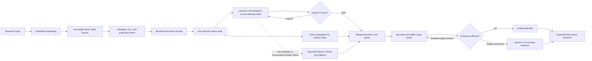

# PageIndex Research Retrieval V2

Status: compatibility-only since Research Evidence Retrieval V3 (2026-08-18).

Fresh online Research requests no longer enter this per-document LLM tree traversal. The code and
checkpoint contract remain available only to replay retained V2 durable checkpoints and to support
offline PageIndex/findability evaluation. See `research-evidence-retrieval-v3.md` for the active
online architecture.

## Scope

Research retrieval now selects documents before navigating their outlines, descends the
title-and-summary tree one visible level at a time, merges each LLM decision with semantic Value
Search priors, and opens only a bounded set of immutable published ranges. This is intentionally a
book-like path: inspect the table of contents, choose a chapter, inspect its direct children, and
continue until the relevant section can be opened.

This change does **not** generate Golden Questions. The findability evaluator can consume existing
human-maintained Golden Questions; missing or insufficient labels produce `not-evaluated` and do
not alter routing or publication.

Fast and Deep retrieval are unchanged. Research still uses the published embedding and reasoning
models through Dify's managed model runtime, and final answer synthesis remains a separate stage
after retrieval.

## Execution path



### 1. Document selection

Dense hits are normalized within the query, deduplicated by document and node, and capped per
document. The scheduling score is:

```text
DocScore = sum(top-M normalized hit scores) / sqrt(M + 1)
```

The diminishing-return denominator prevents a long document from winning only because it contains
more chunks. `DocScore` is an internal scheduling value; it is not exposed as the user's final
evidence relevance score. Explicit document filters, tenant scope, publication fingerprint, and
permission scope are applied before an outline can enter the shortlist.

### 2. Layered navigation first

The first request contains only root nodes. Every request after that contains the direct children of
the chapters selected with `expand`; unrelated descendants remain hidden. Candidates contain stable
node ids, titles, summaries, section paths, child counts, bounded locations, and Value priors. Body
text is excluded. The response must satisfy a strict `expand`/`open` schema and the configured model
identity. `open` records a bounded immutable range; `expand` advances the frontier by one level.

Interactive queries may descend at most six levels. Durable Research Tasks may descend at most
twelve and persist the frontier after every successful level. Frontier size, prompt tokens,
selected nodes, model calls, attempts, response size, concurrency, and wall time are all bounded.
Low-findability generations and recoverable failures use hybrid/Value fallback. The compact
whole-tree selector remains only as a lower-level compatibility path and is not the production
default.

### 3. Value propagation and node queue

Dense hits are attached to the deepest covering outline node. Local evidence breadth uses a
bounded sum with a square-root divisor. Ancestor `peakValue` uses `max`, so a large subtree cannot
inflate its priority by accumulating many weak chunks. The LLM-selected and Value-selected nodes
are then merged by publication, outline, generation, and node identity.

When both lanes select the same node, the LLM relevance score is authoritative and Value remains
a scheduling contribution. Evidence ranges are opened concurrently through the published
PageIndex repository, deduplicated, score-thresholded, and capped before assembly.

## Execution policies

| Limit | Interactive `/queries` | Durable Research Task |
|---|---:|---:|
| Documents | 5 | 10 |
| Dense hits per document | 5 | 8 |
| Node queue | 10 | 30 |
| Final evidence items | 20 | 40 |
| Rounds | 1 | 3 |
| Tree depth | 6 | 12 |
| Continuation searches | at most 1 by policy; current single round does not consume it | 2 |
| Model calls | 10 | 40 |
| Opened resources | 20 | 60 |
| Retrieval steps | 4 | 20 |
| Wall clock | 30 s | 300 s |
| Checkpoints | none | replay-safe boundaries |

`supplementalSearches` currently measures bounded continuation over the existing node frontier; it
does not mean an unbounded LLM query-rewrite loop.

Interactive Research performs one bounded retrieval round to protect time-to-first-result. Durable
tasks divide the queue across up to three rounds, evaluate deterministic evidence sufficiency after
each round, and stop as soon as the target is met or a hard budget is exhausted.

## Checkpoint and retry semantics

Durable retrieval persists the layered frontier after every successful level and converts each safe
evidence-round boundary into a scoped `EvidenceBundle` partial result. The worker revalidates
authorization, deletion fences, job/query/trace scope, and persists both forms idempotently. A
retrieval retry continues from the stored sibling frontier; if final synthesis later times out, the
retry loads the latest evidence checkpoint and synthesizes from already-opened immutable evidence.
Completed chapter decisions and range reads are not repeated.

Checkpoint recovery is deliberately conservative: a persisted partial is used as the bounded
retrieval result. It never reopens mutable projections or silently changes publication snapshots.

## Failure and evidence-state semantics

Recoverable failures include a provider timeout, unavailable tree-selection lane, or malformed
selection output. They receive one bounded retry and then degrade to the remaining safe lane.
Metrics include a structured degradation flag.

The following remain terminal and fail closed:

- tenant, membership, permission, or deletion-fence mismatch;
- publication id, fingerprint, or projection-snapshot mismatch;
- frozen reasoning-model identity mismatch;
- malformed persisted checkpoint scope.

Execution health and evidence sufficiency are independent. A degraded execution can still be
`answerable` when its evidence is strong. Exhausted budget with useful but insufficient evidence is
`partial`; no useful evidence is `not-enough-evidence`.

## Dry-run planning and observability

`POST /research-tasks/plan` reports policy-derived `workBounds` for model calls, opened resources,
and retrieval steps. Each bound contains `min`, `estimated`, and `max`; admission continues to use
the configured hard limits.

Research retrieval metrics include:

- selected documents and layered/compatibility/fallback document counts;
- layered steps, serialized prompt-token estimate, visited/scanned nodes, matched nodes, and opened
  ranges;
- execution kind, rounds, continuation searches, model calls, opened resources, and retrieval
  steps;
- sufficiency reached, budget exhaustion reasons, candidate truncation, and degradation flags.

Use these metrics to distinguish an empty dense shortlist, missing outline, tree-budget fallback,
provider degradation, threshold filtering, and hard-budget termination.

## Human-maintained findability evaluation

After publication, the backend evaluator maps existing expected evidence ranges to the deepest
covering node of that exact outline generation, runs the same title-and-summary-only layered
navigation, and durably records Recall@K, mean reciprocal rank, path Recall@K, abstention rate,
sample count, model, evaluator version, and prompt version.

- Enough labels and passing metrics recommend `layered`.
- Enough labels and failing metrics recommend `hybrid` and may enqueue a bounded summary repair.
- Missing or insufficient labels return `not-evaluated`, recommend `unchanged`, and enqueue nothing.

Only one summary repair is queued per document version. The leased repair dispatcher is bounded,
retry-safe, and cannot roll back an already committed publication when evaluation itself fails.

There is no question writer or automatic Golden Question creation dependency in this path.

## Operational checks

1. Confirm the query uses a query-ready immutable publication and the expected reasoning model.
2. Inspect `query.retrieve.metrics.degradationFlags` and `researchBudgetExhaustedReasons`.
3. Compare `pageIndexSelectedDocuments` with `pageIndexLayeredDocuments`,
   `pageIndexLayeredSteps`, and `pageIndexFallbackDocuments`.
4. Investigate summary quality when layered traversal completes but human-labelled findability
   fails.
5. Treat model-identity or scope failures as configuration/integrity incidents; do not convert them
   into degraded success.
