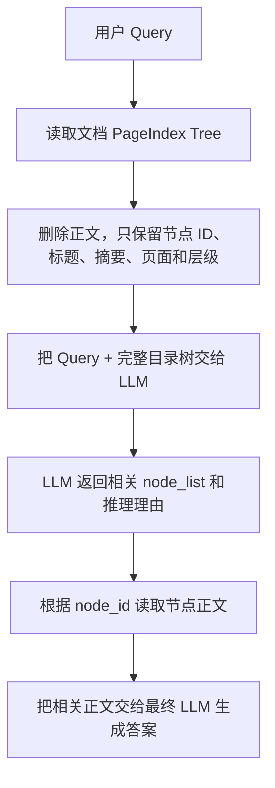
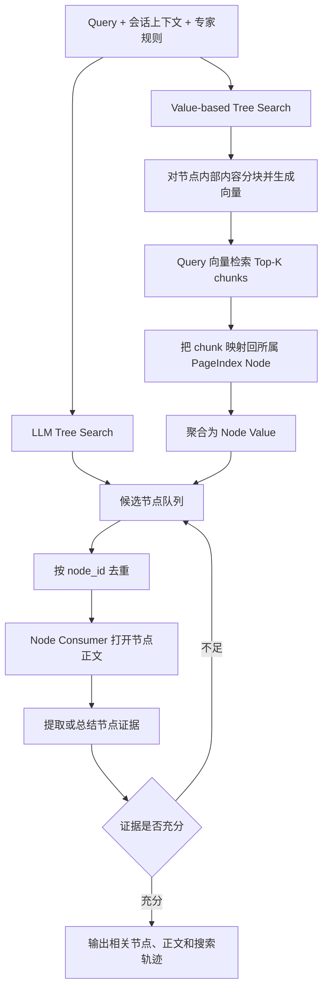
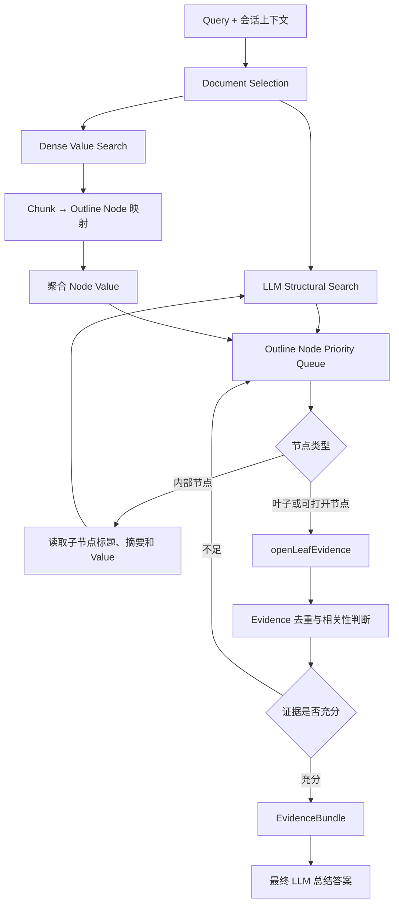

# PageIndex 检索路径与 KnowledgeFS 优化建议

先给结论：

> PageIndex 的关键不是“用树形方式展示向量检索结果”，而是“把章节节点作为检索状态，让 LLM/Value Function 决定要不要进入某个子树，最后再打开被选中节点对应的正文”。

当前 KnowledgeFS 已经具备很好的 PageIndex 数据基础，但查询阶段把顺序做反了：

```text
当前：
全局向量召回 chunk
→ 根据 chunk 的 sectionPath 临时拼树
→ LLM 给 chunk 打分
→ 返回 chunk

PageIndex：
选择文档
→ 在完整 Outline 上选择章节节点
→ 沿相关分支搜索
→ 打开选中节点对应的正文
→ 判断证据是否充分
→ 继续搜索或结束
```

## 一、先明确官方开源范围

我核对了 PageIndex 官方仓库和最新文档。一个容易误解的事实是：

> PageIndex 开源仓库没有公开其云端完整的 MCTS 检索引擎。

开源代码主要包含：

- 文档树生成。
- `get_document()`。
- `get_document_structure()`。
- `get_page_content()`。
- Agentic Retrieval 示例。
- 简化版 LLM Tree Search 示例。

官方明确说云端 Dashboard/API 使用“LLM Tree Search + Value Function MCTS”，但具体 MCTS selection、exploration、back-propagation 参数尚未公开。[官方 LLM Tree Search 文档](https://docs.pageindex.ai/tutorials/tree-search/llm)

所以我们能够准确还原公开流程和官方架构，但不能声称知道其云端 MCTS 的完整内部实现。

## 二、PageIndex 最简单的开源检索顺序

官方 Vectorless RAG 示例走的是一次性整树推理：



也就是说，公开的最小实现并不是后端多轮调用：

```text
root → child → grandchild
```

而是一次把完整无正文目录树交给 LLM，让 LLM 在上下文中完成树形推理并返回相关节点。官方示例见 [Vectorless RAG Cookbook](https://docs.pageindex.ai/cookbook/vectorless-rag-pageindex)。

输入给检索 LLM 的节点主要包括：

```json
{
  "node_id": "0007",
  "title": "Monitoring Financial Vulnerabilities",
  "summary": "...",
  "page_index": 22,
  "nodes": []
}
```

LLM 返回：

```json
{
  "thinking": "相关信息应该位于……",
  "node_list": ["0007", "0012"]
}
```

然后系统才读取 `0007`、`0012` 对应的正文。

这里有两个关键点：

- 检索阶段使用的是节点标题、摘要和上下级关系。
- 正文只在节点被选中后才读取。

## 三、Agentic PageIndex 的执行顺序

PageIndex 当前更推荐 Agentic 方式，Agent 可以调用三个工具：

```text
get_document
get_document_structure
get_page_content
```

官方开源示例的工具顺序是：

1. 调用 `get_document()`，确认文档名称、页数和状态。
2. 调用 `get_document_structure()`，读取无正文目录树。
3. Agent 根据 Query、标题、摘要和页面范围选择相关章节。
4. 调用 `get_page_content("45-50")`，只读取紧凑页面范围。
5. 检查内容是否足够。
6. 不足时继续读取其他章节或页面。
7. 证据足够后生成答案。

官方示例要求 Agent 不要读取整篇文档，而是先通过目录树确定紧凑页面范围。[Agentic Vectorless RAG 示例](https://docs.pageindex.ai/cookbook/agentic-vectorless-rag-pageindex)

这种实现已经比“一次性 node_list”更接近逐层搜索，因为 Agent 可以在看到第一次正文后改变下一步检索策略。

## 四、官方生产 Hybrid Tree Search 的顺序

PageIndex 最新官方文档披露了生产 Retrieval API 的总体结构：



官方将它描述为四个部分：

1. LLM Tree Search 和 Value Search 并行运行。
2. 两条路径发现的节点加入去重队列。
3. Consumer 打开节点内容并提取证据。
4. Agent 持续判断信息是否充分，可以提前结束。

这是当前官方 Retrieval API 的默认方式。[官方 Hybrid Tree Search 文档](https://docs.pageindex.ai/tutorials/tree-search/hybrid)

## 五、Value Search 中向量到底用来做什么

这点和当前 KnowledgeFS 实现的差异最大。

PageIndex 官方 Hybrid Search 也可以使用 Embedding 和向量检索，但它不是直接返回命中的 chunk。

它的顺序是：

```text
向量命中 chunk
→ 找到 chunk 所属的 PageIndex Node
→ 聚合同一个 Node 下 chunk 的相关性
→ 得到 NodeScore
→ 把 Node 加入树搜索队列
→ 后续打开整个节点范围
```

官方给出的 NodeScore 公式是：

```text
NodeScore =
    Σ ChunkScore
    ─────────────
     √(N + 1)
```

这正是当前代码采用的类似公式。

但区别是：

| PageIndex 官方 | 当前 KnowledgeFS |
|---|---|
| 公式计算的是实际 Outline Node 的 Value | 计算的是 `sectionPath` 临时分组分数 |
| 返回的是 Node 候选 | 返回的是 chunk 候选 |
| Value 用于引导树搜索 | Value 用于筛选最终 chunk |
| 命中节点后再打开正文 | chunk 本身直接成为证据 |
| LLM Tree Search 独立并行 | LLM 只能看到向量已召回的 chunk |

官方明确说明：向量命中只用于找到和评估节点，不直接返回 chunk。[Hybrid Tree Search 节点评分说明](https://docs.pageindex.ai/tutorials/tree-search/hybrid)

## 六、为什么需要独立的 LLM Tree Search

如果只有向量 Value Search：

```text
正确章节没有任何 chunk 进入向量 Top-K
→ 对应 Node 没有 Value
→ 整条分支永远不会出现
```

PageIndex 让 LLM Tree Search 独立并行，是为了发现：

- 语义相关但措辞不相似的章节。
- 需要结合问题上下文才能判断的章节。
- 标题或摘要提示相关，但正文局部向量不够相似的章节。
- 专家规则指定的特殊章节。
- 多跳问题中的第二、第三条证据路径。

因此两个检索源是互补的：

```text
Value Search：快，适合提供高概率 Seed
LLM Tree Search：慢，但可以发现向量漏掉的分支
```

当前实现只有第一条路径，然后让 LLM 对第一条路径产生的结果打分。这不能修复向量召回遗漏。

## 七、多文档场景的顺序

PageIndex 最初主要针对单文档检索。多文档时，官方推荐先选择文档，再进入文档内部树。

### 方法一：Metadata

```text
Query
→ Query-to-SQL
→ 选出公司、年份、文档类型匹配的文档
→ 对每个文档执行 PageIndex Tree Search
```

### 方法二：Document Description

```text
每个文档根据 Tree + Summary 生成 Description
→ LLM 根据 Query 选择相关文档
→ 对选中的文档执行 Tree Search
```

### 方法三：Semantic Document Selection

```text
全局 chunk 向量检索
→ 按 documentId 聚合 ChunkScore
→ 得到 DocScore
→ 选择相关文档
→ 在每个文档内部执行 PageIndex Tree Search
```

注意：即使语义选择阶段使用 chunk embedding，最终仍然先选择文档，再进入文档树，而不是直接把这些 chunk 当最终证据。[官方多文档语义检索说明](https://docs.pageindex.ai/tutorials/doc-search/semantics)

对于更大规模的语料库，PageIndex 新版本进一步增加了 File System Tree，并会根据节点标签质量选择：

- `Layer-wise`：标签清晰时逐层下钻。
- `Dynamic flattening`：中间层标签没有意义时，跳过这些层级，直接展开更深节点。

这对之前那个 PDF 出现“买”“方”“信”之类错误标题尤其重要：错误目录不应该被强制逐层搜索。[PageIndex File System 官方说明](https://pageindex.ai/blog/pageindex-filesystem)

## 八、当前项目已经具备哪些基础

KnowledgeFS 不是从零开始。现有能力已经覆盖了 PageIndex 的大部分数据层。

### 已经具备完整 Outline Tree

文档编译阶段保存了：

- 父子关系。
- `level`。
- `sectionPath`。
- `startPage/endPage`。
- `startOffset/endOffset`。
- `title`。
- `summary`。
- `visitedNodeIds`。

见 [`page-index-build-repository.ts`](../packages/api/src/page-index-build-repository.ts#L400)。

### Summary 是从叶子向父节点生成的

当前 Summary Enhancer 会：

1. 先生成子节点摘要。
2. 再把当前节点正文和 `childSummaries` 一起交给模型。
3. 生成父节点摘要。

这非常适合树搜索，因为父节点摘要能够代表整个子树。见 [`document-outline-summary-enhancer.ts`](../packages/api/src/document-outline-summary-enhancer.ts#L109)。

### 已经具备打开叶子节点正文的能力

`PublishedPageIndexRepository` 已经提供：

```text
listOutlines()
searchSections()
openLeafEvidence()
```

见 [`published-page-index-repository.ts`](../packages/api/src/published-page-index-repository.ts#L146)。

所以主要问题不在数据结构，而在 Query Orchestration。

## 九、当前实现的核心问题

当前 Research 路径是：

```text
Query Embedding
→ 全局 Dense Search，最多 topK × 10
→ 按 documentId + sectionPath 分组
→ 章节分数聚合
→ Round Robin 选 chunk
→ 每 5 个 chunk 临时构造一棵小树
→ LLM 给所有 chunk 打 0～1 分
→ 最终 TopK
→ EvidenceBundle
→ LLM Answer
```

主要问题有六个。

### 1. 真正的 PageIndex Repository 没有参与查询

当前装配只传入：

```ts
valueSearch: repository
```

没有把 `PublishedPageIndexRepository` 传给 Research Retriever。见 [`retriever-options.ts`](../apps/api/src/retriever-options.ts#L183)。

所以查询不会真正调用：

```text
listOutlines
searchSections
openLeafEvidence
```

### 2. LLM 看到的是向量命中的局部树

临时树只包含向量召回成功的分段路径。

如果“财务 → 例外付款条款”整个分支没有进入前 100 个向量候选，LLM 根本看不到该章节。

### 3. Value Search 返回错了对象层级

当前返回的是 chunk，并将 chunk 直接作为证据。

正确方向应该是：

```text
chunk hit
→ actual outlineNodeId
→ NodeScore
→ 节点队列
→ openLeafEvidence
```

### 4. 每 5 个候选独立构造树

当前配置为：

```text
batchSize = 5
maxConcurrentBatches = 4
```

因此 100 个候选可能拆成 20 棵相互不可见的小树。LLM 无法在整棵文档目录中比较分支。

### 5. 没有证据充分性循环

当前一次性取 TopK，然后直接生成答案。

真正的 Research 应该能够判断：

```text
已经找到定义，但缺少例外条件
→ 继续搜索例外/限制章节
```

### 6. 重试会重复模型调用

Research Task 虽然可以重试，但没有把以下状态作为可恢复检查点持久化：

- Frontier。
- 已访问节点。
- 已消费节点。
- LLM 分支选择。
- 已打开 Evidence。

模型 timeout 后可能重新执行 Embedding、Tree Scoring 和 Answer Generation。

## 十、推荐的 KnowledgeFS 目标架构

不建议立刻实现完整 MCTS。官方没有公开细节，而且 MCTS 的状态、reward、exploration 参数很容易做复杂却没有质量收益。

更适合当前项目的是：

> 双通道候选发现 + 有界 Best-First/Beam Tree Search + Evidence Sufficiency Loop



## 十一、建议的具体改造

### P0：修正查询对象层级

新增或扩展 Repository 方法：

```ts
listRootNodes(...)
listChildren(outlineNodeId, ...)
getNodes(nodeIds, ...)
openNodeEvidence(outlineNodeId, ...)
```

节点描述至少包括：

```ts
{
  outlineNodeId,
  parentOutlineNodeId,
  title,
  summary,
  sectionPath,
  level,
  startPage,
  endPage,
  childCount
}
```

对于小文档，可以一次读取完整 Tree；大文档再使用逐层加载。

### P0：建立 Projection 到 Outline Node 的稳定映射

建议增加类似关系：

```text
page_index_node_projections
- publication_id
- outline_id
- outline_node_id
- projection_id
- document_asset_id
- generation_id
```

文档发布时，根据 sectionPath 或 offset range，把每个 projection 绑定到最深匹配的 Outline Node。

这样 Query Dense Search 后可以直接：

```text
projectionId
→ outlineNodeId
→ 聚合 NodeScore
```

不需要运行时根据字符串 `sectionPath` 猜测节点。

如果需要高效向祖先传播 Value，可以增加 closure 表：

```text
page_index_node_closure
- ancestor_node_id
- descendant_node_id
- depth
```

这比依赖 JSON `visitedNodeIds` 更适合 PostgreSQL/TiDB 通用查询。

### P0：增加独立 LLM Tree Search 通道

LLM 通道不能依赖向量结果。

每轮把下面内容交给 LLM：

```json
{
  "query": "...",
  "currentPath": ["财务"],
  "children": [
    {
      "nodeId": "n1",
      "title": "发票",
      "summary": "...",
      "valueScore": 0.82
    },
    {
      "nodeId": "n2",
      "title": "付款例外",
      "summary": "...",
      "valueScore": 0.14
    }
  ]
}
```

要求结构化返回：

```json
{
  "selected": [
    {
      "nodeId": "n2",
      "action": "expand",
      "reason": "问题要求例外条件"
    }
  ],
  "skipped": ["n1"]
}
```

`valueScore` 只能作为弱先验，LLM 可以选择低 Value 但推理上相关的节点。

### P1：合并为 Node Queue

两条路径产生的节点进入统一队列：

```text
LLM Selected Nodes
Value Search Seed Nodes
```

以：

```text
(publicationId, outlineId, outlineNodeId)
```

去重。

内部调度分数不要直接展示给用户。它只用于决定先打开哪个节点。

### P1：实现 Node Consumer

对于内部节点：

- 读取子节点。
- 判断是否逐层展开。
- 如果标题质量低，动态 flatten 一到两层。

对于叶子节点：

- 调用现有 `openLeafEvidence()`。
- 大章节可以在章节范围内再执行一次局部 Dense/FTS。
- 按 projectionId 去重，避免父节点和子节点重复返回同一段证据。

### P1：实现 Sufficiency Loop

每消费一批证据，调用一个有界检查：

```json
{
  "sufficient": false,
  "missingAspects": [
    "合同解除条件",
    "2025 年之后的例外"
  ],
  "suggestedBranches": [
    "Termination",
    "Exceptions"
  ]
}
```

满足任一条件时结束：

- `sufficient=true`。
- 最大访问节点数。
- 最大叶子数。
- 最大模型调用数。
- 最大 Evidence 字符数。
- 超时或预算耗尽。

Research 的停止条件应以“证据是否充分”为主，最终 `limit/topK` 只负责限制返回数量。

### P1：树质量门控

之前那份发票出现了“买”“方”“信”这种单字节点，这类 Outline 不适合逐层搜索。

建议发布时记录：

- 单字符标题比例。
- `tocSource=fallback` 比例。
- Summary 覆盖率。
- 重复标题比例。
- 最大深度和最大 fanout。
- 有效 page/offset range 比例。
- 标题定位置信度。
- 噪声字符比例。

查询时根据质量选择：

```text
高质量 Outline → Layer-wise Tree Search
一般质量 → Dynamic Flattening
低质量 Outline → Deep Hybrid Retrieval fallback
```

### P2：持久化 Search Checkpoint

Research Task 中增加：

```text
selectedDocumentIds
frontierNodes
visitedNodeIds
openedNodeIds
consumedProjectionIds
missingAspects
treeDecisions
evidenceBundleDraft
```

模型 timeout 后从上一个 checkpoint 恢复，而不是从 Query Embedding 开始重跑。

### P2：输出真实搜索轨迹

返回和持久化：

```text
文档 A
→ 财务
→ 发票
→ 付款例外
→ 第 12～14 页
```

每一步记录：

- 节点来源：LLM 或 Value Search。
- 选择理由。
- Node Value。
- 是否展开、跳过或打开。
- 打开的正文范围。
- 最终证据 ID。

这才是 PageIndex 相比普通向量 RAG 最有价值的可解释性。

## 十二、最终 Score 应该怎么处理

建议区分两类分数。

### 内部 Node Value

用于搜索调度，不展示：

```text
Dense NodeScore
LLM branch confidence
depth/coverage priority
```

这些分数的含义不同，不应该直接混成用户看到的 Score。

### 最终 Evidence Score

在节点正文打开后，对最终 Evidence 做一次统一相关性判断：

```text
query + 完整 evidence + section path + surrounding context
→ final relevance score 0～1
```

用户最终只看到这个分数，并按它排序。

这样符合“只展示一个统一分数”的产品要求，同时不会拿内部树搜索优先级冒充最终相关度。

## 十三、推荐实施顺序

建议按下面顺序推进：

1. 将 Dense chunk 映射到真实 Outline Node，Value Search 返回 Node，而不是最终 chunk。
2. 把 `PublishedPageIndexRepository` 真正接入 Research Retriever。
3. 增加独立 LLM Tree Search，不能依赖 Dense 命中。
4. 合并 Node Queue，并通过 `openLeafEvidence()` 消费节点。
5. 增加 Evidence Sufficiency Loop 和提前终止。
6. 增加 Tree Quality Gate 和 Dynamic Flattening。
7. 持久化 Frontier/Visited/Evidence，解决 timeout 后重复执行。
8. 最后根据评测结果决定是否需要完整 MCTS。

不建议第一步就实现 MCTS。一个可恢复、可评测的 Best-First/Beam Tree Search，通常已经能获得 PageIndex 的核心收益，而且比未经验证的 MCTS 更容易保证成本、延迟和正确性。
