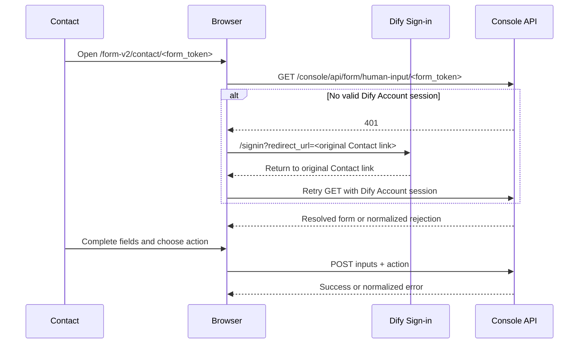

## Context

The current Human Input v2 standalone page at `/form-v2/<form_token>` is intentionally a public Email-proof surface. It loads through `/api/form/human-input/...`, requests an Email OTP, and submits `otp_code + challenge_token`. It must remain unchanged for External contacts, one-time Email recipients, and EmailAddress-backed Dynamic Email grants.

Workspace and Platform contacts are Contact-backed approvers. Their persisted delivery uses `auth_type=console`, and approval must be proven by the current Dify Account session through a separate `/console/api/form/human-input/...` surface. The browser receives only an opaque token and must not inspect Contact data, email, `auth_type`, or login state to choose a flow.

The frontend already has version-neutral form presentation, public v2 form domain values, terminal status cards, a route classifier, and a console request layer that preserves the current same-origin URL in `redirect_url` after a 401. The generated contracts currently expose the public hyphenated v2 operations and the legacy console underscore operations, but not the required hyphenated v2 console operations. `web/AGENTS.md` prohibits handwritten REST helpers, DTO mirrors, generated-contract edits, and mock-backed application state, so generated v2 console client availability is an external prerequisite for transport integration.

The intended authenticated sequence is:

## Goals / Non-Goals

**Goals:**

- Add a canonical direct-link route for Contact-authenticated Human Input v2 approval.
- Preserve that route through Dify sign-in and return without losing or rewriting the opaque token.
- Consume only the authenticated hyphenated console GET, upload-token, and submit operations through generated clients.
- Reuse version-neutral form presentation while keeping Account-session orchestration separate from Email OTP orchestration.
- Handle loading, success, terminal, forbidden/wrong-account, recoverable, stale-response, and file-upload states.
- Keep public v2 and legacy routes behaviorally unchanged.

**Non-Goals:**

- Implementing or modifying console controllers, delivery persistence, recipient resolution, authorization, or workflow runtime.
- Generating or editing API contracts and generated client files.
- Generating Email or IM message links on the server, choosing `auth_type`, or changing message templates.
- Adding OTP, Challenge Token, `access-request`, or client-side Contact/email matching to the authenticated page.
- Redirecting between authenticated Contact and public Email surfaces after token rejection.
- Changing the full console navigation or embedding the approval page inside workspace settings.

## Decisions

### 1. Use a distinct canonical route: `/form-v2/contact/<form_token>`

The authenticated page lives at `web/app/(humanInputLayout)/form-v2/contact/[token]/`. The static `contact` segment makes the authorization surface explicit before any request and avoids overloading `/form-v2/[token]`. The route keeps the focused standalone form layout rather than the main console navigation, while its API calls still use console credentials.

A small route utility owns construction and classification of the path. It encodes the token as one path segment and classifies legacy `/form/<token>`, public Email `/form-v2/<token>`, authenticated Contact `/form-v2/contact/<token>`, and non-form paths independently. Message-link producers outside `web/` must eventually target this documented path when a delivery has `auth_type=console`, but their implementation is outside this change.

Alternatives rejected:

- Reusing `/form-v2/<token>` and branching after load would make browser state responsible for selecting authentication.
- Putting the page under a workspace URL would require exposing or inferring tenant identity in the link and would make current-workspace navigation part of authorization.
- Reusing `/form/<token>` would mix v1 and v2 token owners and endpoint conventions.

### 2. Let the console request be the authentication boundary

The page does not preflight browser login state or read account/email data to decide whether it is a Contact page. It always requests the generated v2 console definition operation. A 401 follows the existing console request behavior and sends the browser to `/signin` with the complete same-origin Contact route as `redirect_url`; successful sign-in returns to that exact route and starts a fresh definition request.

A 403, not-found response, or server-normalized wrong-account/wrong-surface response renders localized feedback. It must not trigger logout, public Email navigation, public `access-request`, or a retry through `/api/form/human-input/...`. This keeps the server authoritative for Account-to-Contact and grant validation.

### 3. Gate transport integration on generated v2 console operations

The frontend repository/adapter consumes generated `consoleQuery` / `consoleClient` operations for:

| Operation    | Method and path                                                | Frontend use                                                                 |
| ------------ | -------------------------------------------------------------- | ---------------------------------------------------------------------------- |
| Get form     | `GET /console/api/form/human-input/<form_token>`               | Resolve the form and authorize viewing with the current Dify Account session |
| Upload token | `POST /console/api/form/human-input/<form_token>/upload-token` | Authorize Contact-page file upload                                           |
| Submit       | `POST /console/api/form/human-input/<form_token>`              | Send processed `inputs` and selected `action`                                |

The implementation must not call the legacy underscore console route, the public v2 client, or a handwritten fetch helper. It must not add local transport DTO copies. If these generated operations are absent, the corresponding task remains blocked until the backend contract is generated by its owning change. Tests mock the generated client boundary while exercising real feature state and UI; no runtime mock selector or scenario-token behavior is added.

### 4. Share form domain and presentation, not proof state

The authenticated feature maps the generated definition into the existing version-neutral `HumanInputFormDefinition` and renders `LoadedFormContent`, field validation, action styling, branding, expiration, and `FormStatusCard`. Any refactor moves only OTP-independent domain/presentation/error utilities into a shared Human Input v2 boundary.

The Contact page owns a small lifecycle: loading, ready, submitting, recoverable error, terminal, and success. It has no Challenge session, resend timer, OTP input, or access-request effect. One action activation creates one `{ inputs, action }` payload, and a shared pending lock prevents concurrent submissions.

### 5. Keep failures and stale work scoped to the current token

Changing `[token]` resets route-owned form values, errors, success, and pending work. Definition, upload-token, or submit results from an earlier token are aborted or ignored. Error normalization covers not found, forbidden/wrong account, expired, already submitted, rate limited, upload failure, network/unavailable, and unknown responses without exposing raw server details or the token.

The token remains only in the route and request path. The feature does not copy it into analytics, logs, browser storage, persisted query data, error copy, or identity lookup. Existing sign-in handling may carry the same-origin route in `redirect_url`; it must continue rejecting unsafe external post-login targets.

### 6. Make file upload surface-aware

The route classifier adds an authenticated Contact v2 kind. On that route, shared file and file-list controls use an authenticated Contact upload strategy backed by the generated console upload-token operation. The public v2 page continues using its public transport, the legacy page keeps its underscore upload path, and unrelated routes keep normal application upload behavior.

The upload context is narrowed to the upload capability rather than forcing the Contact feature to implement public Email OTP methods. This prevents an accidental public default transport from receiving a Contact token.

### 7. Keep copy and tests at the frontend boundary

New authenticated-page, sign-in-return, forbidden/wrong-account, and unavailable copy is added only to `web/i18n/en-US/share.json` and `web/i18n/zh-Hans/share.json` per the project-specific locale constraint. Focused unit/RTL tests mock only generated client and navigation boundaries and assert observable route, request, form, upload, submit, and error behavior. Full running authentication/backend journeys remain outside this frontend-only change.

## Risks / Trade-offs

- [Generated v2 console operations are not available] → Keep client integration tasks pending; do not add a handwritten or legacy fallback.
- [Backend message links continue targeting the public page] → Publish and test the canonical Contact route, then hand the exact path contract to the backend delivery change; frontend cannot repair a wrongly generated link.
- [A user opens the link while signed out] → Reuse the existing same-origin `redirect_url` flow and add regression coverage for token preservation after sign-in.
- [The wrong Dify account is signed in] → Render neutral forbidden/wrong-account guidance and allow user-initiated account switching; never reinterpret the delivery as Email proof.
- [A public Email token is opened on the Contact route] → Let the console API reject it and stop without public API fallback.
- [Shared extraction regresses the public page] → Keep proof orchestration separate and run the existing public v2 and legacy form suites after every shared refactor.
- [File upload sends a Contact token to the public transport] → Use an explicit route kind plus a surface-specific upload context and exact transport-call tests.

## Migration Plan

1. Add failing route, classifier, sign-in-return, and cross-surface isolation tests.
2. Add the canonical Contact route contract and surface-aware upload classification without changing existing route behavior.
3. After generated v2 console operations are available, add the authenticated feature repository, state owner, page, submit, upload, and localized states.
4. Run focused legacy/public/authenticated form suites and frontend static checks.
5. Hand `/form-v2/contact/<form_token>` to the backend delivery owner for `auth_type=console` message-link generation and perform end-to-end verification in that owning change.

Rollback removes the Contact route and its feature code. The public v2 and legacy routes, backend delivery records, and already-issued tokens remain untouched.

## Open Questions

The generated v2 console operation names, exact response DTO, and stable error codes remain external contract dependencies. They must be supplied by the backend-owning change before client integration; this frontend change will not invent or generate them. Server-side rollout of `auth_type=console` message links is also a separate handoff and is required before real recipients can enter the new route from delivered messages.
