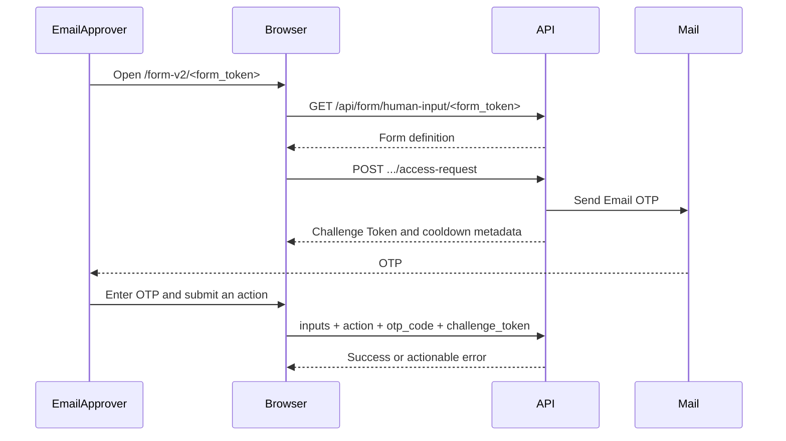

## Context

The current standalone Human Input page lives under `web/app/(humanInputLayout)/form/[token]/`. Its route-local `FormData` type is imported by `web/service/use-share.ts`, it reads and submits through the legacy underscore path `/form/human_input/<token>`, and its submit payload contains only `inputs` and `action`. File upload detection also recognizes only `/form/<token>`.

The final runtime contract separates two v2 Web approval surfaces. External contacts, one-time Email recipients, and Dynamic Email grants that remain EmailAddress-backed use the public Email-proof surface. Workspace and Platform contacts use a separate authenticated Contact page and console API with Dify Account session proof. Email is only a delivery channel: receiving an Email message does not turn a workspace or Platform contact into an Email-OTP approver.

Human Input v2 needs an isolated page at `/form-v2/<form_token>` with the sequence supplied by the user:


```mermaid
sequenceDiagram
    participant EmailApprover
    participant Browser
    participant API
    participant Mail

    EmailApprover->>Browser: Open /form-v2/<form_token>
    Browser->>API: GET /api/form/human-input/<form_token>
    API-->>Browser: Form definition
    Browser->>API: POST .../access-request
    API->>Mail: Send Email OTP
    API-->>Browser: Challenge Token and cooldown metadata
    Mail-->>EmailApprover: OTP
    EmailApprover->>Browser: Enter OTP and submit an action
    Browser->>API: inputs + action + otp_code + challenge_token
    API-->>Browser: Success or actionable error
```

Generated public contract shapes and frontend client mappings now cover definition, access request, upload-token, and submit, including `challenge_token` and `otp_code`. The public controllers still return `501`, and the authenticated Contact frontend/API surface is not implemented. This change therefore keeps a deterministic mock transport for frontend tests while the normal runtime uses the real public adapter and reports unavailable responses without fallback.

## Goals / Non-Goals

**Goals:**

- Add an independently routed and independently orchestrated Human Input v2 public Email-proof form page.
- Keep `/form-v2` limited to External contacts, one-time Email recipients, and Dynamic Email grants that the backend accepts on the public Email surface.
- Prevent browser session state, email matching, query parameters, or public transport failure from switching the page to authenticated Contact approval.
- Automatically issue one Email OTP access request after a valid form definition loads.
- Keep OTP and Challenge Token state secure, ephemeral, and synchronized with server cooldown/expiry metadata.
- Submit form values, action, OTP, and Challenge Token together with strong duplicate and stale-response protection.
- Reuse version-neutral form rendering and upload behavior without coupling v2 to the legacy transport model.
- Make all blocked API states implementable and testable through an explicit development/test mock adapter.
- Preserve the legacy page and add only English and Simplified Chinese copy.

**Non-Goals:**

- Implementing or modifying backend routes, generated contracts, mail delivery, OTP validation, or surface-aware v2 mail-link generation.
- Implementing the authenticated workspace/Platform Contact approval page or `/console/api/form/human-input/<form_token>` client flow.
- Redirecting or upgrading `/form/<form_token>` to v2.
- Changing Human Input node/editor DSL, recipients, message templates, or workflow runtime behavior.
- Defining a new visual redesign beyond the OTP controls and states required by the sequence; existing public form primitives remain the presentation baseline.
- Persisting an OTP session across a full page reload or sharing proof across tabs.

## Decisions

### 1. Give the public Email surface a route-owned feature boundary while sharing presentation only

Create `web/app/(humanInputLayout)/form-v2/[token]/` with a thin public Email-proof page, an orchestration hook/controller, and route tests. Extract only version-neutral presentation from the legacy route where reuse is valuable: loaded form content, input/action rendering, expiration, branding, and status-card primitives. Contract types and request hooks MUST move out of route-local component files so neither service layer imports a Next.js route module.

The legacy route keeps its existing underscore endpoints, payload, status mapping, and behavior. The `/form-v2` route uses only the canonical public hyphenated contract through its feature transport. It never calls the authenticated console API or interprets a Dify login session as proof. Sharing the old submit hook was rejected because it cannot represent OTP/Challenge Token state and would make a later backend swap risk the v1 path.

### 2. Keep recipient, delivery target, and authentication surface separate

Recipient resolution and message-link generation happen before the browser opens a page. The delivery plan selects the URL and stores an opaque token whose server-side delivery record owns `token_hash`, `recipient_id`, `auth_type`, and `target_snapshot`. The persisted `auth_type` determines the link and API surface before delivery; the browser MUST NOT decode identity from the token or choose authentication from the current session.

| Approver origin                                                        | Message-link page                                              | API surface                                  | Submission proof                                       | In this change |
| ---------------------------------------------------------------------- | -------------------------------------------------------------- | -------------------------------------------- | ------------------------------------------------------ | -------------- |
| Workspace or Platform contact                                          | Separate authenticated approval page, URL owned by a follow-up | `/console/api/form/human-input/<form_token>` | Dify Account session plus current Contact-backed grant | No             |
| External contact, one-time Email, or EmailAddress-backed Dynamic Email | `/form-v2/<form_token>`                                        | `/api/form/human-input/<form_token>`         | Email OTP plus current Challenge Token                 | Yes            |

A public token rejected at definition load is a wrong, missing, expired, or otherwise unavailable public delivery. The page presents the normalized terminal/recoverable state and MUST NOT redirect to an authenticated page, retry through the console namespace, or suppress OTP because a Dify session exists. Likewise, the authenticated surface must reject public Email tokens, but that behavior is owned by its separate change.

### 3. Normalize public transport DTOs into a v2 form domain model

The page consumes a feature-owned domain model containing the resolved form content, inputs, default values, actions, expiration, and optional site/branding data. The real adapter is responsible for mapping the finalized generated/public API DTO into this model; the mock adapter returns the same domain values. Optional branding lets the page remain functional if the final v2 definition contract does not expose the legacy `site` envelope.

The expected public Email transport contract is:

| Operation      | Method and path                                          | Required result/body                                            |
| -------------- | -------------------------------------------------------- | --------------------------------------------------------------- |
| Get form       | `GET /api/form/human-input/<form_token>`                 | Resolved form definition                                        |
| Request access | `POST /api/form/human-input/<form_token>/access-request` | `challenge_token`, `resend_after_seconds`, `expires_in_seconds` |
| Upload token   | `POST /api/form/human-input/<form_token>/upload-token`   | Upload token and expiry                                         |
| Submit         | `POST /api/form/human-input/<form_token>`                | `inputs`, `action`, `otp_code`, `challenge_token`               |

No generated file is edited manually. The real adapter selects the generated public hyphenated operations explicitly and maps them into the feature domain model. Deterministic mocks use the same interface only through explicit test/development injection; controller `501` or other real failures never select mock behavior.

### 4. Express the page lifecycle as one local session state machine

The v2 route owns one session, so a feature hook with a reducer is preferable to global state. It separates form query state from proof/submission state while enforcing these transitions:

```text
loading-form
  -> terminal-form-error
  -> requesting-otp
      -> access-error
      -> awaiting-otp
          -> challenge-expired
          -> submitting
              -> otp-error / challenge-error
              -> terminal-submit-error
              -> success
```

After the public API accepts the token and returns a successful form definition, the controller starts access-request exactly once for the current token. A token-keyed attempt guard plus disabled query refetch/retry behavior prevents React Strict Mode, rerenders, reconnects, and focus events from sending extra email. Rejection during definition load never starts access-request and never attempts authenticated Contact fallback. Manual retry is available after access failure; manual resend is available only after the server-provided cooldown.

Changing the route token aborts/ignores stale async work and resets form values, OTP, Challenge Token, deadlines, errors, and submission success. Cancelled or late responses from the previous token MUST NOT mutate the new session.

### 5. Treat cooldown and challenge expiry as absolute server-derived deadlines

On access success the controller stores the Challenge Token in component memory and derives `resendAt` and `expiresAt` from the response seconds and one captured client timestamp. A lightweight clock tick derives display text; the timer is not the source of truth. Focus/background pauses therefore do not extend a challenge.

Resend replaces the Challenge Token, clears the OTP input and OTP-specific errors, and resets both deadlines. Challenge expiry clears the usable proof and requires a new access request before submit. The page does not automatically resend on expiry because that could send unexpected repeated email.

### 6. Keep OTP-guarded submission atomic at the UI boundary

The page reuses existing form initialization, required-field validation, value processing, and action styling. An action is enabled only when fields are valid, a non-expired Challenge Token exists, OTP satisfies the finalized client-side shape, and no access/submit operation is pending.

One click creates one payload containing processed `inputs`, the chosen `action`, `otp_code`, and the current `challenge_token`. A pending lock prevents action-button races. The page always requires this Email proof even when the browser also has a Dify session. Success clears proof data and shows the existing completion treatment. Invalid OTP keeps form values and the current unexpired challenge so the user can retry; expired/stale challenge clears proof and returns to the access step; task submitted/expired becomes terminal.

### 7. Provide an explicitly selected, deterministic mock transport

Define a narrow `HumanInputV2FormTransport` interface for get-form, access-request, submit, and upload-token operations. Components and session logic receive the interface from a feature provider/factory and never branch on mock mode.

The mock transport is selected explicitly in development and tests through one feature-owned configuration/injection point. It is instance-scoped, accepts an injectable clock, and simulates:

- valid form definition and defaults;
- one fixed development/test OTP without displaying it in production UI;
- unique Challenge Token issuance, replacement, cooldown, and expiry;
- invalid OTP, stale/expired challenge, access failure, rate limit, expired/submitted/not-found forms, and concurrent completion;
- successful submit and v2 upload-token/file flows.

Production defaults to the real adapter and MUST NOT catch a real transport failure and substitute mock success. Token/query-string switches were rejected because they make mock activation externally controllable and risk exposing test behavior in production.

### 8. Make file upload routing version-aware

Replace the current single regex check with a small route classifier that yields legacy form, v2 form, or non-form. Legacy forms keep `/form/human_input/<token>/upload-token`; v2 forms use the transport's canonical `/form/human-input/<token>/upload-token` or its mock equivalent. Shared uploader UI receives the resolved upload strategy rather than reconstructing endpoint paths.

### 9. Keep errors, security, localization, and tests explicit

Normalize transport errors into page categories: not found, form expired, already submitted, form/access rate limited, access delivery failed, invalid OTP, expired/stale challenge, network/unavailable, and unknown. A token rejected because it does not belong to the public Email surface uses the backend's normalized invalid/not-found treatment; it never causes client-side auth-surface fallback. Recoverable proof errors retain entered form values; terminal form/task errors replace the form with a status card.

OTP and Challenge Token MUST NOT enter URLs, analytics, logs, error messages, local/session storage, or persisted query caches. OTP input uses an accessible label and `autocomplete="one-time-code"`; final length/character constraints come from the finalized contract. All new strings are read from the share namespace and added only to `en-US` and `zh-Hans` per the user's locale constraint.

Tests use the injected mock transport and fake clock to cover observable flows, not implementation details. Regression tests prove v1 endpoints, payloads, file upload, and terminal states are unchanged.

## Risks / Trade-offs

- [Mock behavior diverges from the final API] → Keep the interface narrow, isolate DTO mapping, model every field shown in the agreed sequence, and add contract-parity tests when generated types land.
- [Automatic access request sends duplicate email] → Guard by route token, disable implicit retry/refetch, abort stale work, and test Strict Mode, rerender, reconnect, and focus cases.
- [Challenge/OTP leaks through generic client caches or diagnostics] → Store proof only in local reducer state and redact normalized errors; never use persisted query state for proof.
- [Client and server clocks differ] → Treat server durations as authoritative from receipt time; the server remains the final validator and client expiry only prevents obviously stale submits.
- [A mock accidentally reaches production] → Require an explicit development/test selection, default production to real transport, and add a build/config test proving no silent fallback.
- [A Contact-authenticated token is opened on `/form-v2`] → Let the public API reject the token, prevent access-request after failed definition load, and never switch namespaces or proof methods in the browser.
- [Message-link generation targets the wrong surface] → Require delivery planning to select the link from persisted authentication type; keep link generation outside this frontend change and verify it in the runtime follow-up.
- [Shared component extraction regresses v1] → Characterize the current legacy route first and keep all version-specific orchestration outside shared presentation.
- [File upload selects the wrong endpoint] → Centralize route classification and test legacy, v2, unrelated, and malformed paths.

## Migration Plan

1. Characterize the legacy public form and upload flows with regression tests before extracting shared presentation.
2. Add v2 domain types, transport interface, error model, deterministic mock adapter, scenario fixtures, and contract tests.
3. Add the public Email-only `/form-v2/[token]` route and session state machine against the mock adapter.
4. Add OTP/resend/expiry controls, atomic submit handling, terminal/recoverable states, and English/Simplified Chinese copy.
5. Make file upload routing version-aware and verify both route generations.
6. Run focused tests and frontend checks; keep mock mode explicit until the backend contract is available.
7. Map the generated public client in the real adapter, add mock/real contract-parity fixtures, and perform end-to-end mail/OTP testing after the public controllers are implemented. A separate follow-up owns the authenticated Contact page, console API client, and surface-aware message links. Rollback of this frontend change removes only `/form-v2`; v1 data and routes are unaffected.

## Open Questions

No question blocks the public Email frontend implementation. Backend/runtime owners must still finalize the authenticated Contact page URL, generate workspace/Platform links for that page and Email-proof links for `/form-v2`, implement the public controllers, and confirm final OTP error/branding/upload behavior. These concerns MUST NOT be resolved by adding identity detection or Dify-session fallback to `/form-v2`.
