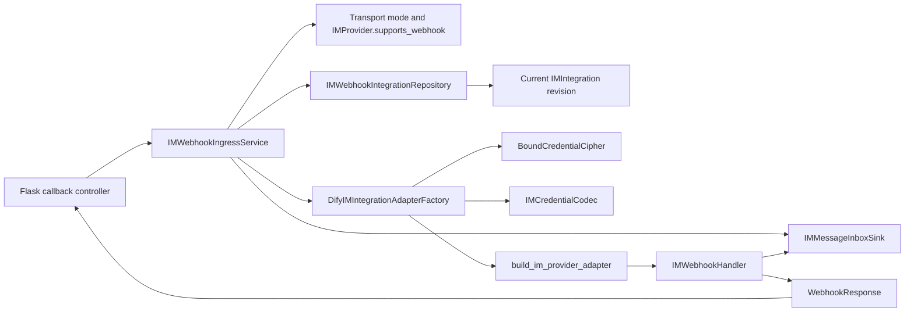

## Context

Canonical Channel Management 已经由 Console controller 直接组合 Email Management owner 与 IM Integration owner。`IMIntegrationView.webhook_url` 是 IM owner 提供的 credential-free field，现有 Console mapper只把它映射到 `ChannelSummary.webhook_url`。Create、update 和 replacement 也直接返回该 canonical summary。

IM Integration 已经把完整 Provider credentials 保存为一个 versioned opaque `EncryptedCredentials` envelope，并将安全的 `app_identifier` 单独持久化。`IMCredentialCodec` 负责通过已绑定 owner 的 `BoundCredentialCipher` 解封 envelope、验证 resolved credential union，并拒绝 Provider discriminator mismatch。`build_im_provider_adapter()` 已经是唯一的 Provider adapter constructor dispatch。Contact Sync composition 仍私有持有 `DifyIMIntegrationAdapterFactory`，但该 factory 只组合 cipher resolver、`IMCredentialCodec` 和现有 adapter builder，不再知道 provider-specific persisted fields。

Provider adapters 已经把 Webhook authentication、challenge、payload decoding 和 Provider ACK 封装在 `IMWebhookHandler.handle(WebhookRequest) -> WebhookResponse` 中。`IMMessageInboxSink` 已经把认证后的 `AuthenticatedIMEvent` 原子写入 `im_message_inbox`，并在 commit 后发送只包含 inbox record ID 的 Celery wakeup。当前仍缺少公开 callback route、由公开标识解析 current Integration 的 application service，以及为单个 callback request 组合 Integration adapter、Provider handler 和 durable sink 的 runtime composition。

该 ingress 运行在 Flask。Controller 使用 `tuple(request.headers.items())` 填充 framework-neutral `WebhookRequest.headers`。

## Goals / Non-Goals

**Goals:**

- 为 deployment-selected Webhook transport 提供稳定、公开、无 Console authentication 的 callback endpoint。
- 从 authoritative current Integration 读取 Provider、provider tenant、complete revision、opaque credential envelope 和 owner scope，并为每个 admitted callback 恢复 credentials和构造 handler。
- 复用 Provider handler 的 challenge/authentication/ACK 语义，并把业务事件交给 durable inbox。
- 让 credential rotation 保留 callback URL，让 replacement、delete/recreate 使旧 URL 永久失效。
- 让 canonical Channel read 使用 `IMProvider.supports_webhook()`，不执行 credential recovery 或 Provider I/O。
- 让 Contact Sync、Webhook ingress 和后续 STREAM composition 共享同一个 Integration-to-adapter factory，同时继续复用现有 credential codec 和 adapter builder。
- 对 body size、cipher unavailable、invalid envelope、内部失败、日志、指标和并发 revision 切换给出可测试的安全语义。

**Non-Goals:**

- 不修改 Provider signature、challenge、payload decryption 或 card-event decoding algorithm。
- 不修改 opaque credential envelope format、resolved credential union 或 `build_im_provider_adapter()` dispatch。
- 不实现 deployment credential cipher provisioning、storage 或 rotation；tenant-less Integration 只接受显式注入的 deployment-bounded cipher。
- 不实现 STREAM supervisor、business inbox consumer、submission authorization 或 inbox retention。
- 不将 `event_transport_mode` 变成 tenant request field 或 Integration column。
- 不提供 per-provider public route、provider query parameter、Console session fallback 或 system-wide shared Provider credential。
- 不在 callback requests之间复用 adapter 或 handler；跨请求与跨进程 deduplication 继续由 durable inbox 的 real Provider event ID contract 负责。

## Decisions

### 1. Integration 持有 credential envelope 之外的公开 route identity

新增 `WebhookId` value object 和 `HumanInputIMIntegration.webhook_id`：

| Field | Contract |
|---|---|
| `webhook_id` | 32-character URL-safe value generated from 192 bits of randomness |
| Database type | `VARCHAR(32) NOT NULL` with a global unique constraint |
| Credential envelope | Stored separately and never sealed into `EncryptedCredentials` |
| Authentication | None; Provider authentication remains mandatory |
| Rotation | Preserved when `integration_id` is preserved |
| Replacement | A replacement Integration receives a new value |
| Delete/recreate | A recreated Integration receives a new value |

`webhook_id` 是 server-generated routing metadata，不是 Provider configuration、credential 或 bearer credential。日志、metrics 和 exceptions 不记录完整值。`IMIntegration.create()` 接收新值；credential rotation 不接收 replacement value；explicit replacement 接收另一个由 application service 生成的新值。该接口形状让 rotation 无法意外修改 route identity。

删除 `callback_url` aggregate/ORM column和 `ConfirmedIMConfiguration.callback_url`。`generate_im_provider_webhook_url(webhook_id)` 使用 `TRIGGER_URL` 生成 `/callbacks/human-input/v2/im/<webhook_id>`。Deployment origin 变化只影响后续 projection，不更新 Integration row。

直接使用 `integration_id` 会把 aggregate identity固化为公共协议，也更容易针对已知 Integration ID 制造 credential-recovery load。独立 route table 会复制一对一 Integration replacement/delete transaction knowledge。把 route identity 放在 Integration 上保持 lookup 简单，并保留 replacement ABA safety。

### 2. Deployment mode 和 Provider capability 只控制 Webhook surface

新增只读 `IMEventTransportModeResolver`，只返回 `WEBHOOK` 或 `STREAM`。Production adapter 必须从 deployment configuration 解析出其中一个值；缺失值或非法值属于 deployment configuration error，MUST NOT被转换为第三种 mode。Console request 和 Integration persistence 均不能设置该值。

`IMProvider` 新增 `supports_webhook() -> bool`。当前 Slack、Feishu、Lark 和 Microsoft Teams 返回 `True`；DingTalk 和 WeCom 返回 `False`。该方法表示当前 Dify adapter implementation 是否具有静态 Webhook capability，不读取 credentials，也不构造 adapter。`IMIntegrationView.webhook_url` projection 和 Webhook ingress admission 使用该方法作为唯一的 Provider-level capability source。

Management read uses `IMProvider.supports_webhook()` and credential-runtime availability only；it never calls `IMCredentialCodec.load()`、`build_im_provider_adapter()` or `create_webhook_handler()`。After credential recovery，Ingress treats `adapter.create_webhook_handler()` as the credential-bound authority。A `None` return means the current adapter configuration does not permit Webhook and maps to the same `404` surface as an unsupported Provider；it is not an internal drift。

The shared `IMProviderAdapter` protocol does not enumerate Provider-specific credential requirements。Concrete adapters own the current Dify implementation policy。Feishu/Lark may return `None` when neither `verification_token` nor `encrypt_key` is configured；Slack requires `signing_secret` through its resolved credential schema。`DifyIMProviderConfigurationService` must not duplicate these field checks；when it validates Webhook compatibility，it uses the concrete adapter result。

### 3. Canonical IM owner生成 derived Webhook URL

`HumanInputIMIntegrationManagementService` uses the mode resolver、`IMProvider.supports_webhook()`、credential-runtime availability and URL generator when constructing `IMIntegrationView`。It returns `webhook_url` only when all of the following are true:

- effective mode is `WEBHOOK`;
- the persisted Provider has Webhook potential;
- production composition can resolve a `BoundCredentialCipher` for that Integration owner.

This check does not decrypt the envelope。Workspace-owned Integration uses the existing tenant key provider and is runtime-ready。Deployment-owned Integration is runtime-ready only when a deployment-bounded cipher is explicitly wired。The Console controller continues to copy `IMIntegrationView.webhook_url` into the existing `ChannelSummary`; it does not import runtime factory、cipher、Provider SDK or persistence code。

### 4. 使用独立 callback blueprint

新增 `controllers.im_provider_webhook` blueprint，prefix 为 `/callbacks/human-input/v2/im`，只注册 `POST /<webhook_id>`。它不安装 CORS，不执行 session、CSRF、workspace 或 account decorator；Provider signature/token 才是 request authentication。

Controller 按以下顺序工作：

1. 在 body read、database query 和 Provider work 前捕获 trusted UTC receive time。
2. 验证 `webhook_id` 的长度和字符集；无效值返回与 unknown route相同的 `404`。
3. 通过 bounded reader 读取 exact body bytes；超过 `HUMAN_INPUT_IM_WEBHOOK_MAX_BODY_BYTES` 返回 `413`。
4. 将 uppercase method、`tuple(request.headers.items())`、body bytes 和 receive time 组装为 adapters package 中的 `WebhookRequest`。
5. 调用 `IMWebhookIngressService.handle()`，再用 status、headers 和 body 构造 Flask `Response`。

Controller 不解析 JSON/form、不读取 Provider 字段、不查 tenant、不捕获 Provider-specific exception，也不修改 handler response body。Flask 可以重算 `Content-Length`；其他 response header 按 `WebhookResponse` 顺序写入。

### 5. Service 隐藏 routing、credential recovery 和失败映射

公开接口保持为：

`IMWebhookIngressService.handle(webhook_id, request) -> WebhookResponse`

Service rejects `STREAM` mode with `404`。For `WEBHOOK` mode, `IMWebhookIntegrationRepository.load_by_webhook_id()` loads current domain `IMIntegration` without recovering credentials。Database not-found and query failure remain distinct。Immediately after a successful lookup，the Service emits one structured `im_webhook_integration_resolved` log containing `provider` and `integration_id`。It records this event before calling `IMProvider.supports_webhook()`、resolving the cipher or recovering credentials。

For every callback whose Provider returns `True` from `supports_webhook()`，the shared Integration adapter factory resolves a bound cipher、loads and validates the opaque envelope、and constructs the adapter。The Service calls `create_webhook_handler()` with the Integration's `IMMessageInboxSink`。A returned handler processes the request；`None` returns `404` without invoking a Provider handler。The Service closes the root adapter and does not retain the adapter or handler after the request completes。

Malformed/unknown route、`STREAM` mode、`IMProvider.supports_webhook() == False` and `create_webhook_handler() is None` return the same `404`。Query failure、bound cipher unavailable、unknown envelope version、decrypt/JSON/Pydantic failure、Provider discriminator mismatch、adapter construction and unclassified internal failure return payload-free `503`。Provider handler responses are not reclassified。

### 6. 共享现有 Integration-to-adapter factory

Move `DifyIMIntegrationAdapterFactory` from `services.human_input_v2.im_contact_sync.composition` into a shared Human Input v2 runtime module。Its interface remains one deep call:

`DifyIMIntegrationAdapterFactory(integration) -> IMProviderAdapter`

The factory accepts a `cipher_resolver` and existing `build_im_provider_adapter()` injection。It calls `IMCredentialCodec.load(provider, envelope)` exactly once and never interprets credential fields itself。The default Workspace resolver constructs `TenantBoundCredentialCipher` from the persisted `tenant_id`。A tenant-less Integration requires an explicitly injected deployment-bounded cipher；the factory never derives one from `DifySetup.instance_id`、`SECRET_KEY` or a synthetic tenant。

Webhook ingress uses `create_webhook_handler()`。`DifyIMProviderConfigurationService` continues to use `build_im_provider_adapter()` directly for submitted complete candidates and does not pass an unpersisted candidate through the Integration factory。

### 7. Handler 生命周期限制在单个 callback request

Every admitted callback constructs one Provider adapter and one `IMWebhookHandler` from the Integration revision returned by that request's route lookup。The Service does not reuse handlers across HTTP requests and does not retain resolved credentials after request-scoped objects become unreachable。

Each callback uses the Integration revision returned by its authoritative route lookup。The Service does not keep an Integration row lock or database transaction open during credential recovery、Provider authentication or inbox persistence。A request whose lookup completed before a configuration commit may finish with the old revision。A lookup started after credential rotation commits must return the new revision；after replacement or deletion，lookup by the old `webhook_id` must return not found。

Per-request construction means handler-local replay state is not preserved across callbacks。Provider authentication remains mandatory，and durable inbox deduplication by real Provider event ID remains the cross-request deduplication boundary。

### 8. Durable acceptance 仍由现有 sink 定义

The handler consumer is an `IMMessageInboxSink` bound to `integration_id`、Provider and `provider_tenant_id`。Challenge responses do not call the sink。A business event receives a success ACK only after the sink commits a new record or resolves a real-ID duplicate。Broker publish failure does not revoke an already durable ACK；inbox persistence failure remains retry-compatible。

Ingress does not start the business consumer、decode card actions、persist HTTP response state or extend `AuthenticatedIMEvent`。

### 9. Controller 直接映射 Flask request headers

Controller sets `WebhookRequest.headers` to `tuple(request.headers.items())` without additional parsing or transformation。

### 10. Observability 不接触敏感内容

Ingress records low-cardinality request count、route miss、oversize、handler response class、internal unavailable and duration metrics。Dimensions are limited to Provider after successful route lookup、safe outcome and status class。Every successful Integration lookup emits one structured `im_webhook_integration_resolved` log with `provider` and `integration_id` before capability or credential work。Other logs may contain Integration ID、Provider and safe error code。

Logs、metrics、traces and exceptions must not contain request body、headers、Provider response body、credential plaintext、credential ciphertext、complete `webhook_id` or raw cipher/validation exception details。

## Risks / Trade-offs

- [Every request performs credential recovery and SDK construction] → Accept the bounded per-request cost in the first implementation，measure callback latency and construction failures，and add reuse only after operational evidence。
- [`IMProvider.supports_webhook()` only describes static capability] → Treat `create_webhook_handler()` as the credential-bound authority and test current concrete adapter security policy without adding field checks to callers。
- [Per-request handler construction resets handler-local replay state] → Keep Provider authentication mandatory and use durable inbox deduplication when the Provider supplies a real event ID。
- [Deployment cipher may be unavailable] → Do not project a usable URL without runtime readiness; return safe `503` if a tenant-less route is nevertheless invoked。
- [In-flight request can cross configuration commit] → Define snapshot admission semantics and keep Provider work outside the write transaction。
- [Public random route can be mistaken for authentication] → Require Provider verification on every request and document route entropy only as enumeration/load defense。
- [Directly editing an unshipped migration invalidates local development databases] → Require developers to recreate only the unreleased schema in development; do not add production dual-read complexity for data that has not shipped。

## Migration Plan

1. Amend the unreleased IM control-plane migration to create non-null unique `webhook_id` and omit `callback_url`。Update aggregate、ORM、mapper、guarded UoW and tests in the same schema change。
2. Deploy the shared Integration adapter factory、`IMProvider.supports_webhook()`、management projection、Webhook service and callback blueprint while the deployment remains in `STREAM` mode。No callback URL is exposed and ingress returns `404`。
3. Verify canonical Channel list/detail/mutation responses、Workspace tenant-bound credential recovery、Provider challenge/authentication and durable inbox acceptance。
4. Select `WEBHOOK` only after `TRIGGER_URL` and the required cipher runtime are ready。Deployment-owned callbacks MUST NOT be enabled until a deployment-bounded cipher is explicitly injected。

Before the unreleased schema ships, rollback restores the previous migration and application code together。No field-level credential reader、callback URL backfill or reverse data conversion is required。

## Open Questions

无。
