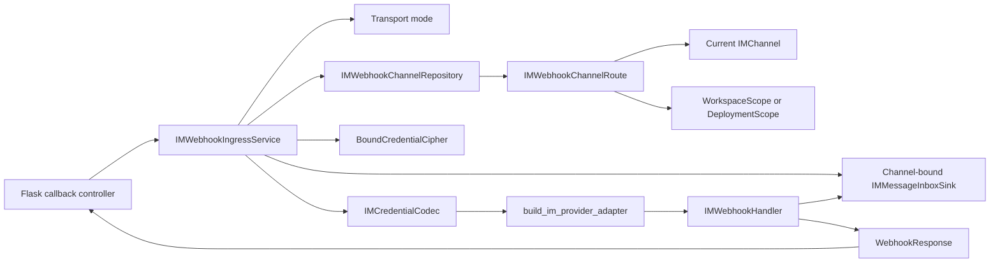

## Context

Canonical Channel Management owns `IMChannel`、stable `webhook_id` lifecycle、deployment transport mode、`IMProvider.supports_webhook()`、Human Input callback URL generation and credential-free `IMChannelView.webhook_url` projection。This change treats those contracts as prerequisites and does not modify Console management projection。

`IMChannel` persists complete Provider credentials as canonical `IMEncryptedCredentials` plus safe Provider、Provider tenant and app-identifier facts。`IMCredentialCodec` opens that envelope through an owner-bound `BoundCredentialCipher` and verifies the resolved credential discriminator。`build_im_provider_adapter()` is the existing Provider adapter constructor dispatch。

Provider adapters encapsulate Webhook authentication、challenge handling、payload decoding and Provider ACK in `IMWebhookHandler.handle(WebhookRequest) -> WebhookResponse`。`IMMessageInboxSink` durably accepts authenticated events before best-effort wakeup，but its current local routing field still uses the removed Integration identity。Webhook ingress therefore needs a Channel reverse lookup、owner-safe cipher selection、Channel-to-adapter composition and Channel-bound inbox routing。

The ingress runs in Flask。Controller uses `tuple(request.headers.items())` to populate framework-neutral `WebhookRequest.headers`。

## Goals / Non-Goals

**Goals:**

- Expose the Channel Management callback URL as a stable public endpoint when deployment transport is `WEBHOOK`。
- Resolve one authoritative current `IMChannel` and its credential owner from globally unique `webhook_id` without exposing raw `owner_key`。
- Recover `IMEncryptedCredentials` with the owner-bound cipher and construct one request-scoped Provider handler per admitted callback。
- Reuse Provider handler challenge、authentication and ACK semantics，then hand business events to the durable inbox。
- Bind inbox records and consumer deliveries to `IMChannelId` while preserving event deduplication and processing semantics。
- Define bounded body handling、safe failure mapping、low-cardinality observability and configuration-race behavior。

**Non-Goals:**

- Do not modify Provider signature、challenge、payload decryption or card-event decoding algorithms。
- Do not modify `IMEncryptedCredentials` format、resolved credential union or `build_im_provider_adapter()` dispatch。
- Do not implement deployment credential cipher provisioning、storage or rotation；deployment-owned callbacks require an explicitly injected deployment-bound cipher。
- Do not implement STREAM supervisor、business inbox consumer、submission authorization or inbox retention。
- Do not persist `event_transport_mode` in Channel rows or credential envelopes，and do not accept it from callback or Console payloads。
- Do not add per-provider public routes、Provider query parameters、Console session fallback or system-wide shared Provider credentials。
- Do not reuse adapters or handlers across callback requests。

## Decisions

### 1. Channel Management routing facts are prerequisites

This change reuses these Channel Management contracts without redefining them：

- each current Channel persists one globally unique `WebhookId` outside encrypted credentials；
- ordinary update preserves it，while replacement and delete/recreate use a new value；
- `generate_im_provider_webhook_url()` owns `/callbacks/human-input/v2/im/<webhook_id>` projection from current `TRIGGER_URL`；
- transport mode is deployment configuration rather than request or persistence state；
- `IMProvider.supports_webhook()` is the static Provider capability source。

### 2. Reverse lookup returns a Channel and controlled credential scope

`IMWebhookChannelRepository.load_by_webhook_id(webhook_id)` is the only runtime reverse lookup。It queries the current `HumanInputIMChannel` row by globally unique `webhook_id` and returns an immutable `IMWebhookChannelRoute` containing：

- owner-free `IMChannel`；
- `WorkspaceScope` for `workspace:<tenant_id>` rows，or `DeploymentScope` for the deployment row。

The repository parses and validates persisted `owner_key` internally。It never returns raw `owner_key`、ORM records、configuring actor or a generic owner string。It performs no cipher resolution、credential recovery、Provider I/O or inbox work。Not found and query/mapping failure remain distinct outcomes。

The reverse lookup is intentionally separate from owner-bound `IMChannelReader`。A public callback knows only `webhook_id`，so it cannot safely construct a Workspace or Deployment Reader before resolving persistence-owned routing context。

### 3. Mode and Provider capability reject work before credential recovery

Ingress reads typed `dify_config.HUMAN_INPUT_IM_EVENT_TRANSPORT_MODE` before route lookup。`STREAM` returns the unknown-route `404` surface without querying Channel persistence。For `WEBHOOK` mode，Ingress checks `route.channel.provider.supports_webhook()` after authoritative lookup but before cipher or adapter work。After credentials are recovered，`adapter.create_webhook_handler()` remains the credential-bound authority；a `None` result maps to the same `404` surface。

The shared Provider adapter protocol does not expose credential-field policy to callers。Concrete adapters decide whether one resolved credential set can construct a handler。

### 4. Management URL projection remains unchanged

Channel Management already produces canonical `IMChannelView.webhook_url` and maps it to `ChannelSummary`。Ingress does not call or modify that projection。Its responsibility begins when a Provider invokes the published callback route。

### 5. A dedicated callback blueprint owns bounded HTTP adaptation

Add `controllers.im_provider_webhook` with prefix `/callbacks/human-input/v2/im` and only `POST /<webhook_id>`。It installs no application CORS、Console session、CSRF、Workspace or Account decorator；Provider verification performed by the handler authenticates the request。

Controller order is：

1. capture trusted UTC receive time before body read、database query or Provider work；
2. validate `webhook_id` length and URL-safe character set，mapping malformed values to the unknown-route `404`；
3. read exact body bytes through a bounded reader，returning `413` above `HUMAN_INPUT_IM_WEBHOOK_MAX_BODY_BYTES`；
4. construct `WebhookRequest` from uppercase method、`tuple(request.headers.items())`、body bytes and receive time；
5. call `IMWebhookIngressService.handle()` and map returned status、headers and body to Flask `Response`。

Controller does not parse JSON/form、read Provider fields、select owner、recover credentials、catch Provider-specific exceptions or modify handler response body。Flask may recalculate `Content-Length`；other response headers preserve `WebhookResponse` order。

### 6. IMWebhookIngressService owns routing and request-scoped composition

The public application interface is：

`IMWebhookIngressService.handle(webhook_id, request) -> WebhookResponse`

For `WEBHOOK` mode，Service loads one `IMWebhookChannelRoute`。It uses `WorkspaceScope.id` to construct `TenantBoundCredentialCipher` with the configured Key Provider。For `DeploymentScope`，it uses only the explicitly injected deployment-bound cipher；absence returns safe `503`。

Service calls `IMCredentialCodec.load(channel.provider, channel.encrypted_credentials)` exactly once，then calls `build_im_provider_adapter(credentials)` exactly once。It creates `IMMessageInboxSink` bound to `channel.id`、Provider and Provider tenant，passes the sink to `adapter.create_webhook_handler()`，invokes the handler when present and closes the root adapter in every post-construction path。It retains no adapter、handler or recovered credentials after the request。

No shared Integration-to-adapter factory is introduced or migrated from Contact Sync。That code still depends on the removed Integration model and belongs to its own Channel migration。

Malformed/unknown route、`STREAM` mode、unsupported Provider and unavailable credential-bound handler return the same `404`。Repository query/mapping failure、cipher unavailable、credential envelope failure、adapter construction failure and unclassified internal failure return payload-free `503`。Provider handler responses pass through unchanged。

### 7. Configuration commits define snapshot boundaries

Every admitted callback uses the Channel snapshot returned by its reverse lookup。Database work ends before cipher、Provider or inbox work，and ingress holds no Channel transaction or row lock across those operations。

A request whose lookup completed before credential rotation commits may finish using the old envelope。A lookup started after rotation commit observes the new `config_version` and envelope。Replacement and delete remove the old `webhook_id` route；lookups started after commit return not found。Downstream authorization continues to consult current Channel and Binding state rather than treating the ingress snapshot as permanent authority。

### 8. Inbox routing migrates from Integration ID to Channel ID

`IMMessageInboxSink` binds `IMChannelId`、expected Provider and Provider tenant。The inbox ORM column、repository arguments、mappers、`IMInboxDelivery` and logs use `channel_id`。The migration directly renames/replaces the unpublished `integration_id` field under the existing no-historical-data precondition；it adds no compatibility alias、dual read/write or backfill。

Provider event deduplication remains `(provider, provider_tenant_id, provider_event_id)` and does not include Channel ID or ingress kind。Challenge responses do not call the sink。A business event receives a success ACK only after a new record commits or a real-ID duplicate resolves。Broker wakeup failure does not revoke durable acceptance，and inbox persistence failure remains retry-compatible。

### 9. Controller maps Flask headers directly

Controller sets `WebhookRequest.headers` to `tuple(request.headers.items())` without additional parsing or transformation。

### 10. Observability excludes request and credential content

Ingress records low-cardinality request count、route miss、oversize、handler response class、internal unavailable and duration metrics。Dimensions are limited to Provider after successful lookup、safe outcome and status class。

Every successful Channel lookup emits one `im_webhook_channel_resolved` structured log containing `provider` and `channel_id` before capability、cipher or adapter work。Logs、metrics、traces and exceptions do not contain tenant ID、request body、headers、Provider response body、credential plaintext、credential ciphertext、complete `webhook_id` or raw cipher/validation exception details。

## Risks / Trade-offs

- [Every request performs credential recovery and SDK construction] → Accept bounded per-request cost first，measure callback latency and construction failures，and add reuse only after operational evidence。
- [`IMProvider.supports_webhook()` is static] → Keep `create_webhook_handler()` as credential-bound authority。
- [Per-request handlers lose local replay memory] → Require Provider authentication and retain durable inbox deduplication for real Provider event IDs。
- [Reverse lookup must recover credential owner] → Return only validated `WorkspaceScope | DeploymentScope`，never raw `owner_key`。
- [Deployment cipher may be unavailable] → Return safe `503` for a deployment-owned route until an explicit bound cipher is injected。
- [In-flight requests can cross configuration commits] → Define snapshot semantics and keep Provider work outside Channel transactions。
- [Public random route may be mistaken for authentication] → Require Provider verification on every request；route entropy is enumeration and load defense only。

## Migration Plan

1. Require completed Channel Management routing、projection and `IMEncryptedCredentials` contracts。
2. Migrate inbox local routing from Integration ID to Channel ID and run existing persistence/worker suites。
3. Deploy Channel reverse lookup、Ingress Service and callback blueprint while transport remains `STREAM`；Ingress returns unknown-route `404` without lookup。
4. Verify Workspace credential recovery、Provider challenge/authentication and durable inbox acceptance。
5. Select `WEBHOOK` only after callback routing and required cipher runtime are ready。

Rollback before rollout removes the callback blueprint、Ingress Service and reverse lookup，and reverts the unpublished inbox routing rename。Channel Management routing metadata and URL projection remain unchanged。

## Open Questions

无。
