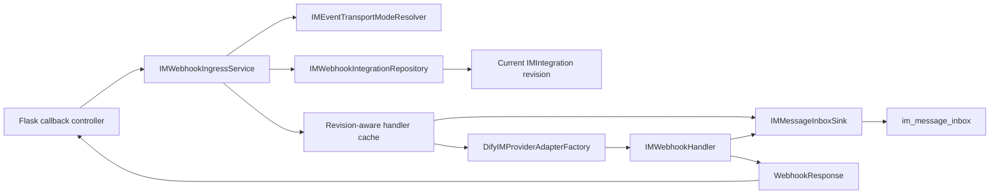

## Context

Provider adapter 已经把 Webhook authentication、challenge、payload decoding 和 Provider ACK 封装在 `IMWebhookHandler.handle(WebhookRequest) -> WebhookResponse` 中。`IMMessageInboxSink` 已经把认证后的 `AuthenticatedIMEvent` 原子写入 `im_message_inbox`，并在 commit 后发送仅包含 inbox record ID 的 Celery wakeup。

当前缺少三段连接代码：公开 callback route、由公开标识解析当前 Integration 的 application service，以及把 Integration credential、Provider adapter、durable sink 组合为长生命周期 handler 的 composition。现有 `HumanInputIMIntegration.callback_url` 复制了 deployment origin，却没有提供可用于反向查找 Integration 的稳定 route identity。Contact Sync composition 还私有持有完整 credential 解密和 Provider adapter construction，直接复制这段逻辑会让 Provider credential schema 泄漏到多个 use case。

该 ingress 运行在 Flask/WSGI。WSGI 通常会合并同名 request header，因此 application 无法诚实恢复原始 header 顺序或重复边界。设计必须保留框架实际暴露的 field-value，并确保认证字段遇到合并或歧义时 fail closed。

## Goals / Non-Goals

**Goals:**

- 为 deployment-owned Webhook transport 提供一个稳定、公开、无 Console authentication 的 callback endpoint。
- 在 Provider handler 运行前，从 authoritative current Integration 解析 Provider、provider tenant、configuration revision 和 protected credentials。
- 复用 Provider handler 的 challenge/authentication/ACK 语义，并把业务事件交给 durable inbox。
- 让 credential rotation 保留 callback URL，让 replacement、delete/recreate 使旧 URL 永久失效。
- 对 body size、内部失败、日志、指标和并发 revision 切换给出可测试的安全语义。
- 让 Contact Sync、Webhook ingress 和后续 STREAM composition 共享同一个 Provider adapter factory。

**Non-Goals:**

- 不修改任何 Provider signature、challenge、decryption 或 card-event decoding algorithm。
- 不实现 STREAM supervisor、business inbox consumer、submission authorization 或 inbox retention。
- 不将 `event_transport_mode` 变成 tenant request field 或 Integration column。
- 不提供 per-provider public route、provider query parameter、Console session fallback 或 system-wide shared Provider credential。
- 不保证跨进程的 handler object reuse；跨进程 deduplication 继续由 durable inbox 的 real Provider event ID contract 负责。

## Decisions

### 1. Integration 持有公开 route identity，而不持有 callback URL

新增 `WebhookId` value object 和 `HumanInputIMIntegration.webhook_id`：

| Field | Contract |
|---|---|
| `webhook_id` | 32-character URL-safe value generated from 192 bits of randomness |
| Database type | `VARCHAR(32) NOT NULL` with a global unique constraint |
| Authentication | None; Provider authentication remains mandatory |
| Rotation | Preserved when `integration_id` is preserved |
| Replacement | A replacement Integration receives a new value |
| Delete/recreate | A recreated Integration receives a new value |

`webhook_id` 是不可枚举的 routing identifier，不是 bearer credential。日志、metrics 和 exceptions 不记录完整值，避免把 defense-in-depth route entropy 变成普通 diagnostic data。

删除 `callback_url` aggregate/ORM column。`generate_im_provider_webhook_url(webhook_id)` 在 response projection 时使用 `TRIGGER_URL` 生成 `/callbacks/human-input/im/<webhook_id>`；deployment origin 变化不再要求改写所有 Integration rows。只有 effective mode 为 `WEBHOOK` 且 Provider factory 返回 Webhook handler 时，Channel summary 才返回该 URL。

考虑过两个替代方案：

- 直接在 path 使用 `integration_id`：不需要 schema change，但会把内部 aggregate identity 固化为公共协议，并允许更容易地针对已知 Integration ID 制造 credential-resolution load。
- 新建 `human_input_im_webhook_routes` 表：能独立管理 route，但一对一 current route 没有独立 lifecycle，额外表会复制 Integration replacement/delete transaction knowledge。

把 `webhook_id` 放在 Integration 上使常见 lookup 简单，同时保持 replacement ABA safety。

### 2. Deployment mode 由只读 port 提供

新增 `IMEventTransportModeResolver`，返回 `DISABLED`、`WEBHOOK` 或 `STREAM`。Production adapter 读取 deployment configuration；Console request 和 Integration persistence 均不能设置该值。默认值为 `DISABLED`，避免 migration 后意外暴露 callback surface。

Ingress service 只在 mode 为 `WEBHOOK` 时解析和调用 handler。Channel Management 使用同一 resolver 判断 provider availability 和是否返回 `webhook_url`，避免管理面与实际 ingress capability 产生两个判断来源。

### 3. 使用独立 callback blueprint，不复用 Console、Web 或 Workflow Trigger route

新增 `controllers.im_provider_webhook` blueprint，prefix 为 `/callbacks/human-input/im`，只注册 `POST /<webhook_id>`。它不安装 CORS，不执行 session、CSRF、workspace 或 account decorator；Provider signature/token 才是请求认证。

Controller 按以下顺序工作：

1. 在 body read、database query 和 Provider work 之前捕获 trusted UTC receive time。
2. 验证 `webhook_id` 的长度和字符集；无效值返回与未知值相同的 `404`。
3. 通过 bounded reader 读取 exact body bytes；超过 `HUMAN_INPUT_IM_WEBHOOK_MAX_BODY_BYTES` 返回 `413`。
4. 将 uppercase method、框架暴露的 header field-values、body bytes 和 receive time 组装成现有 `WebhookRequest`。
5. 调用 `IMWebhookIngressService.handle()`，再用 status、headers 和 body 构造 Flask `Response`。

Controller 不解析 JSON/form、不读取 Provider 字段、不查 tenant、不捕获 Provider-specific exception，也不修改 handler response body。Flask 可以自行重算 `Content-Length`；其他 response header 按 `WebhookResponse` 顺序写入。

### 4. Service 是 routing、composition 与安全失败语义的唯一 owner

公开接口保持为一个深方法：

`IMWebhookIngressService.handle(webhook_id, request) -> WebhookResponse`

Service 内部流程如下：

`IMWebhookIntegrationRepository.load_by_webhook_id()` 是 credential-bearing query port，只返回 domain `IMIntegration`，不返回 ORM record。它按全局唯一 route identity 查询，因此 request path 不包含或推导 tenant。数据库故障与 not-found 必须可区分；not-found 映射为 `404`，query failure 映射为 `503`。

Service 对未知 route、inactive mode 和不支持 Webhook 的 Provider 返回同形 `404`。Credential reveal、adapter construction、cache construction 或其他内部暂时失败返回 payload-free `503`。Provider handler 已经产生的 `200/400/401/403/405/415/503` response 不会被 Service 重新分类。

### 5. 共享 Provider adapter factory 集中隐藏 credential schema

把现有 Contact Sync 私有的 `DifyIMProviderAdapterFactory` 移到 `services.human_input_v2.im_provider.composition`，并让它返回完整 `IMProviderAdapter` protocol。Factory 继续根据 `integration.tenant_id` 或 deployment owner key 解密 protected credentials，校验 persisted Pydantic credential variant 与 Provider discriminator，并构造 concrete adapter。

Contact Sync 只读取返回 adapter 的 `directory` capability；Webhook ingress 只调用 `create_webhook_handler()`；后续 STREAM owner 可调用 `create_stream_handler()`。调用方不再知道 encrypted field name、owner key selection 或 Provider constructor signature。

### 6. Handler cache 以完整 revision 为 key，route lookup 每次仍读取 authoritative state

Provider handler 可以安全并发并允许 outlive root adapter；Feishu/Lark handler 还持有进程内 replay claims。Application extension 因此持有一个 bounded handler cache，key 为 `(integration_id, config_version)`。Cache value 是绑定当前 Provider/provider tenant 的 `IMWebhookHandler`，其 consumer 是该 Integration 的 `IMMessageInboxSink`。

每个 HTTP request 仍先按 `webhook_id` 读取当前 Integration，再访问 cache：

- credential rotation 增加 `config_version`，后续 request 构建新 handler；
- provider replacement 使用新 Integration 和新 `webhook_id`；
- delete 后旧 route lookup 返回 not-found，即使进程 cache 仍暂时保留旧 handler；
- bounded LRU/TTL eviction 防止 tenant 数量造成无界内存增长。

Cache miss 使用 per-key single-flight construction，避免并发首个 callback 重复 reveal credentials 和创建 SDK clients。Factory 创建 handler 后立即关闭 root adapter；现有 `IMWebhookHandler` contract 保证 root close 不会 invalidate handler。

Ingress 不在 Provider authentication 或 inbox commit 期间持有 Integration row lock。一个在 rotation/replacement commit 前已经解析旧 revision 的 in-flight request 可以按该 snapshot 完成；commit 后开始 route lookup 的 request 必须使用新 revision 或得到 `404`。这是避免长数据库 transaction 包围 cryptography、SDK authentication 和 inbox I/O 的明确一致性选择。下游 business consumer 仍必须按当前 Integration/Binding 执行 authorization。

### 7. Durable acceptance 仍由现有 sink 定义

Service 为 handler 构造 `IMMessageInboxSink`，绑定 `integration_id`、Provider 和 `provider_tenant_id`。Challenge response 不调用 sink。业务事件只有在 sink commit 新 record 或解析 real-ID duplicate 后才能得到 Provider handler 的成功 ACK；broker publish failure 不撤销 ACK，inbox persistence failure 保持 retry-compatible response。

Ingress Service 不启动 business consumer、不解码 card action、不把 HTTP response state写入 inbox，也不扩展 `AuthenticatedIMEvent`。

### 8. WSGI header 只承诺可观察事实，并对歧义 fail closed

Controller 使用 Werkzeug 暴露的 header sequence 构造 `WebhookRequest.headers`。若 server 分别暴露重复 field，controller 保持它们的顺序和值；若 WSGI 已把重复 field 合并为一个值，controller 不按逗号拆分、不声称恢复原始边界。

Slack、Feishu/Lark 和 Microsoft Teams 的 authentication header 都按 singleton 处理。多个独立值或一个无法通过 Provider verifier 的合并值必须认证失败，不能选择其中一个值继续。这比应用层猜测 HTTP list grammar 更安全，也符合当前 adapters 的 fail-closed 行为。

### 9. Observability 不接触 body、header、credential 或完整 route identity

新增低基数 ingress metrics：request count、route miss、oversize、handler response class、internal unavailable、duration。维度只允许 Provider（成功解析后）、outcome 和 status class。日志只允许 Integration ID、Provider 和安全错误 code；不得包含 request body、headers、Provider response body、plaintext/protected credentials 或完整 `webhook_id`。

## Risks / Trade-offs

- [WSGI 无法恢复 wire-level duplicate header] → 修改 contract 只承诺框架可观察 header；Provider singleton authentication 遇到合并或歧义时 fail closed，并增加真实 Flask request tests。
- [每次 route lookup 增加一次 database read] → 保留该 read 作为 delete/rotation 的 authority；缓存昂贵的 credential reveal 和 handler construction，而不缓存 route existence。
- [进程内 cache 不能提供跨进程 replay protection] → 不把 cache 当作 deduplication authority；real Provider event ID 继续由 database inbox 全局去重，business consumer 保持 at-least-once idempotency。
- [in-flight request 可以跨越 configuration commit] → 明确 snapshot admission semantics；不让 database transaction 包围 Provider work，commit 后的新 request 必须读取新 revision。
- [公开 random route 被误当成 authentication] → 文档、类型和 tests 明确 Provider verification 必须始终执行；route entropy 只降低枚举和无效 lookup load。
- [删除 `callback_url` 影响旧 application nodes] → 使用 expand/contract migration，并在 drop 前迁移所有 readers 到 derived URL generator。
- [Provider SDK construction 失败导致持续 `503`] → 返回 retry-compatible safe response并记录低基数 unavailable metric；Channel connection status 由 management diagnostics 暴露给管理员。

## Migration Plan

1. Expand migration 增加 nullable `webhook_id`，为现有 Integration 使用 cryptographically secure generator 回填，建立 unique constraint 后改为 non-null；暂时保留 `callback_url`。
2. 部署 aggregate、mapper、repository query、shared adapter factory、Service、callback blueprint 和 tests。Deployment mode 默认 `DISABLED`，此时 route 统一返回 `404` 且 Channel summary 不暴露 URL。
3. 将 Channel summary 和其他 readers 切换到 derived URL generator，确认没有代码读取或写入 persisted `callback_url`。
4. Contract migration 删除 `callback_url`，然后显式把 deployment mode 切换为 `WEBHOOK`。
5. Rollback 在步骤 4 前只需回退 application。步骤 4 后 downgrade 重新添加 nullable `callback_url`；旧 application 可以把空值解释为未配置 callback，现有 `webhook_id` 可保留到后续 cleanup。

## Open Questions

- 是否需要在首个 release 就让 `HUMAN_INPUT_IM_WEBHOOK_MAX_BODY_BYTES` 可配置，还是先采用一个覆盖三类 Provider payload 的固定上限并等到有实际 operational evidence 再暴露配置？本方案的任务默认实现配置项，以便 self-hosted deployment 处理 Provider attachment metadata 差异。

