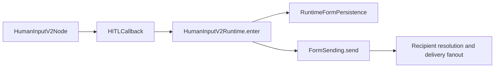

## Context

当前 graph registry 已支持同一 node type 注册多个版本，但 Human Input 只有 Graphon v1 node class。`DifyNodeFactory` 在完成通用 node-data validation 后，又无条件用 legacy `DifyHumanInputNodeData` 构造 `DifyHITLCallback`，因此 v2 payload 仍泄漏进 v1 validation 和 delivery semantics。

Human Input v2 已有 `HumanInputNodeData`、`ResolvedForm`、`RecipientResolver`、`HumanInputForm`、grant/endpoint domain 和 form creation service，但尚无 workflow-owned v2 node/callback composition。现有 v2 form 又要求 `workflow_pause_id`；Graphon callback 执行时 pause row 尚未创建，并且一个 workflow pause 可以包含多个并行 HITL reason，因此 pause 不是 form 的正确 owner。

## Goals / Non-Goals

### Goals

- 严格、稳定地按 persisted raw version 分派 Human Input v1/v2 runtime。
- 注册真正独立的 Human Input v2 node class。
- 让 v2 Node 只依赖 version-neutral HITL callback，让 callback 只依赖 v2 runtime application。
- 让一个深的 `FormSending` 接口隐藏 recipient resolution、sender selection、fanout、Email/IM delivery policy 和 provider outcome handling。
- 以 `workflow_run_id + workflow_node_execution_id` 标识 v2 runtime form owner。
- 保证 callback 普通重入及并发 create 只产生一个 form graph，并且只有 create-once winner 执行 `FormSending` 内部 sender fanout。
- 通过 persisted workflow owner 与 workflow pause reason 建立 submission/resume correlation，不让 form 反向持有 pause ID。
- 固定 frozen waiting、submitted 和 node-timeout state 的 callback entry contract；node timeout 进入 `__timeout`，global expiry 不恢复 workflow，callback re-entry 必须作为 invalid resume 拒绝。

### Non-Goals

- 不实现或修改 public Web、Console、Service API、OpenAPI 或 IM controller。
- 不修改 OTP proof、submission authorization、submission persistence、commit-before-enqueue ordering 或 resume task payload；只替换内部可信 workflow correlation。
- 不实现 `all_workspace_contacts` runtime expansion、workspace-contact snapshot port 或 production database adapter；该 marker 继续沿用既有 `UnsupportedRecipientSpecificationError` fail-closed path。
- 不实现 timeout scanner、global-expiry scheduler 或 workflow resume task wiring。
- 不修改 notification producer、Email/IM provider adapter 或 delivery worker。
- 不增加 delivery outbox、form-level sending status 或 form commit 后的 delivery crash-recovery contract。
- 不修改 v2 aggregate/read projection 的既有 `display_in_ui` 字段、业务语义或对外 SSE/pause payload shape。

## Decisions

### 1. Human Input version 在通用 Pydantic coercion 前解析

Human Input version resolver 直接读取 raw node mapping：

- missing `version` 或 exact string `"1"` -> legacy v1 binding
- exact string `"2"` -> v2 binding
- 其他 string、`null`、number、boolean、collection -> stable Human Input configuration error

resolver 不调用 `str(raw_version)`，Human Input 也不允许通过 registry 的 `latest` fallback 接受未知版本。其他 node type 的既有 version resolution 不在本 change 中改变。

非法版本统一抛出 `HumanInputNodeVersionError`，其稳定错误 code 为 `invalid_human_input_node_version`。不同 raw value 可以作为内部诊断信息，但不得通过类型 coercion 改变 dispatch 结果；该异常继续进入现有 workflow configuration-error surface，不新增对外 API shape。

### 2. 注册独立 Human Input v2 node class

新增的 v2 node class：

- `node_type` 仍为 `human-input`
- `version()` 精确返回 `"2"`
- concrete node data 为 strict v2 `HumanInputNodeData`
- 只依赖 Graphon 的 version-neutral HITL callback protocol

v1 继续使用现有 Graphon `HumanInputNode`。`NodeFactory` 先解析 Human Input binding，再使用 binding 的 node class、node-data validation 和 callback builder；v2 callback builder 不解析或合成 legacy `delivery_methods`。

### 3. Callback 只调用 runtime application，delivery 只暴露 `FormSending`

依赖方向固定为：

Node 只调用注入的 callback，并把 callback 返回的 `PauseRequested`、`Completed` 或 `Expired` 转成 Graphon node event。v2 callback 使用 strict v2 node data 和 callback runtime context 构造 `ResolvedForm` 及 runtime entry request，然后只调用注入的 `HumanInputV2Runtime` protocol。callback 不直接 import 或构造 repository、SQLAlchemy session、ORM model、controller、Celery task、global database handle 或 service locator。

`HumanInputV2Runtime.enter` 只拥有 callback-entry orchestration：按 runtime owner reload、调用 `FormSending` 创建新 form、读取 frozen lifecycle/submission state，并返回 transport-neutral runtime outcome。它不接收 Contact directory、initiator、delivery capability snapshots 或 sender list。

`FormSending.send` 是唯一 delivery-facing application interface。它接收一个包含 runtime owner、`ResolvedForm`、recipient specifications、resolved dynamic values、message template 和 runtime display facts 的 immutable request，并在内部：

- 读取 request-scoped Contact directory、initiator 和 effective delivery capabilities；
- 调用既有 `RecipientResolver` 得到 `ResolvedApprovalPlan`；
- 构造 form、grant 和 endpoint graph；
- 通过 runtime owner create-once persistence 建立完整 graph；
- 优先在一个 transaction 中提交完整 graph；若 adapter 使用多次提交，则幂等补全或拒绝 partial graph；
- 仅在 create-once 返回 `CREATED` 时解析内部 sender composition 并执行 fanout；
- 在 create-once 返回 `EXISTING` 时返回 winner 的 form，不解析或调用 sender；
- 隐藏 Email sender、IM card/text selection、fallback 和 provider-specific outcome handling。

`FormSending` 不返回 sender list、raw recipient snapshots、provider adapters 或 credentials。Provider delivery failure 保留为 delivery fact，不改变 Form lifecycle，也不阻止 callback 对已提交 waiting form 返回 `PauseRequested`。composition root 负责注入 runtime application、runtime form persistence 与 `FormSending`，并允许 `FormSending` 复用既有 form creation、notification producer 和 publisher capability；本 change 不修改 producer、publisher 或 worker 的 provider behavior。

### 4. Runtime form owner 使用 workflow run 与 workflow node execution

v2 `HumanInputForm` 删除 `workflow_pause_id`。domain 通过一个 immutable `RuntimeFormOwner` 表达 runtime ownership；它同时包含：

- `workflow_run_id`
- `workflow_node_execution_id`，其语义为 `workflow_node_executions.id`，不是同表的 runtime `node_execution_id` 字段

持久化约束为：

- `workflow_node_execution_id` unique，保证一个 node execution 最多一个 runtime form
- `workflow_run_id` 非 unique 并建立查询索引，允许一个 run/一个最终 pause 包含多个并行 forms
- runtime form 必须有一个完整 `RuntimeFormOwner`
- delivery-test form 必须没有 `RuntimeFormOwner`
- ORM 继续使用两个 nullable columns 表达该 union，并通过 check constraint 保证 runtime 两列都非空、delivery-test 两列都为空

### 5. Runtime application 隐藏 create/reload 分支

callback 每次执行都使用 `(tenant_id, workflow_run_id, workflow_node_execution_id)` 调用 `HumanInputV2Runtime.enter`。callback 不接收 `CREATED` / `EXISTING` persistence result，也不决定是否发送：

- owner 已有 form：runtime application 直接加载 frozen runtime entry，不调用 `FormSending`；
- owner 尚无 form：runtime application 调用一次 `FormSending.send`；
- `FormSending` 内部 create-once winner 建立完整 form、grant 和 endpoint graph，然后执行一次内部 sender fanout；
- 并发 loser 从 create-once operation 得到 `EXISTING` 并返回 winner form，不执行 sender fanout；
- partial graph 不得作为 ready winner 返回；多次提交的 adapter 必须幂等补全缺失 children 或 fail closed；
- provider 或 sender failure 不回滚已提交 form graph，不改变 waiting lifecycle，也不阻止 callback 请求 pause。

create-once 只保证普通 callback re-entry 与并发竞争不会重复调用 sender。该保证不新增 form commit 后、sender invocation 完成前的进程退出恢复协议；本 change 不为此增加 Form status 或 outbox。未来若需要恢复，必须使用独立 delivery attempt state，而不能扩展 Form lifecycle state。

Graphon `session_id` 继续携带 form ID，workflow pause repository 在 callback 返回后照常保存多个 reason；form 不反向关联 pause ID。

### 6. Submission/resume correlation 不由 form 持有

`HumanInputForm` 删除 `workflow_pause_id` 后，submission handler 和 resume adapter 不再用 caller-supplied pause ID 与 form 字段做相等性校验。可信 correlation 从持久化关系重建：

- form 提供 `tenant_id + form_id + workflow_run_id + workflow_node_execution_id`
- owning `workflow_node_executions` row 必须属于同一个 workflow run
- active `WorkflowPause` 必须属于同一个 workflow run
- 该 pause 必须存在 `form_id` 匹配当前 form 的 `WorkflowPauseReason`

submission handler 必须在同一个 `SubmissionTransaction` 内完成 authorization context load、完整 persisted correlation validation 和 authorized submission commit。transaction 在 successful commit 前产生 immutable resume identity；handler 只在 transaction context 成功退出后将该 identity 交给 resume port。HTTP/controller DTO、authorization proof 和 commit-before-enqueue ordering 不因该调整改变。

### 7. Frozen lifecycle state 决定 callback 重入结果

callback 读取 runtime port 返回的 frozen state：

- waiting -> 返回同一 form ID 的 `PauseRequested`
- node timeout -> 进入 `Expired(selected_handle="__timeout")`
- global expiry -> 拒绝 callback re-entry，不产生 branch selection
- submitted -> 仅使用 persisted `selected_action_id`、`input_snapshot`、`canonical_values` 和 frozen form definition 返回 `Completed`

callback reload 不重新解释 authoring recipients、form blocks、actions 或 interaction surfaces。node-timeout scheduler 负责把 form 转成 timeout state 并触发 workflow resume；global-expiry orchestration 负责终止 workflow，而不是恢复 node。本 change 为 submitted、node-timeout 和 invalid global-expiry re-entry 添加 injected callback entry tests，但不实现 controller、scheduler 或 resume task wiring。

## Risks / Trade-offs

- runtime owner 约束必须由 domain、ORM model、mapper 和 repository 一致表达；风险通过 mapper round-trip 和多 form owner tests 控制。
- create-once persistence 必须保证一个 runtime owner 只产生一个 form，并且只在 form、grant 和 endpoint graph 完整后返回 ready result。单事务提交完整 graph 是推荐实现；多次提交必须幂等补全或拒绝 partial graph。delivery attempts 与 provider outcomes 仍是独立 operational facts，失败不得修改 Form lifecycle。
- form commit 后、`FormSending` 完成前发生进程退出时，本 change 不保证自动补发；这是为了避免引入 Form sending status、outbox 或新的 recovery workflow 而接受的 best-effort trade-off。
- pause correlation 跨越 form owner、workflow node execution、active pause 和 pause reason；同一个 `SubmissionTransaction` 必须验证完整 owner chain，不能信任 caller-supplied pause identity。
- submitted callback decision 必须来自 persisted submission facts 与 frozen form definition，不能在 reload 时重新读取 authoring node data。
- `all_workspace_contacts` 与 `display_in_ui` 保持既有行为，避免把独立 recipient/projection policy 混入本 change。

## Validation

- strict raw version matrix，包括 raw number、boolean、`null`、mapping 和 list。
- registry 证明 v1/v2 分别解析到不同 node class，unknown version 不走 `latest`。
- runtime application tests 证明 waiting reload 不调用 `FormSending`，首次创建调用一次，并发 create-once 只有 winner 执行 sender fanout。
- `FormSending` contract tests 证明 callback/runtime caller 看不到 sender list、raw recipient snapshots 或 provider-specific outcome，并证明 provider failure 不改变 waiting Form lifecycle。
- 一个 workflow run 中两个并行 v2 Human Input node executions 创建两个 forms，并可进入同一个 workflow pause。
- submission/resume correlation 在 form 不持有 pause ID 时仍能通过 persisted owner chain 找到 matching active pause，并拒绝跨 run/form mismatch。
- frozen submitted state 从 persisted `selected_action_id`、`input_snapshot`、`canonical_values` 与 form definition 返回 `Completed`，不重新解释 authoring configuration。
- frozen node timeout 从 callback test entry 走 `__timeout`；global expiry callback re-entry 被拒绝且不产生 branch selection。
- architecture tests 证明 v2 node/callback 不 import infrastructure 或 transport modules，并证明 sender implementations 与 provider capability resolution 只存在于 `FormSending` composition 后面。
- scope regression 证明 `all_workspace_contacts` 继续 fail closed，既有 `display_in_ui` aggregate/projection round-trip 不变。
- v1 published/debug/pause behavior regression 保持不变。

## Deferred Wiring

- `all_workspace_contacts` runtime expansion 与 production `FormSending` recipient-resolution adapter
- node-timeout reload trigger、workflow resume task 与 global-expiry workflow-stop orchestration
- submitted outcome 的 controller/resume-task trigger
- endpoint-derived `display_in_ui` aggregate cleanup 与 SSE/pause consumer
- public/console/service/IM read and submit controllers
