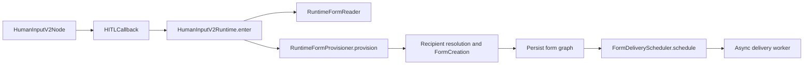

## Context

当前 graph registry 已支持同一 node type 注册多个版本，但 Human Input 只有 Graphon v1 node class。`DifyNodeFactory` 在完成通用 node-data validation 后，又无条件用 legacy `DifyHumanInputNodeData` 构造 `DifyHITLCallback`，因此 v2 payload 仍泄漏进 v1 validation 和 delivery semantics。

Human Input v2 已有 `HumanInputNodeData`、`ResolvedForm`、`RecipientResolver`、`HumanInputForm`、grant/endpoint domain 和 form creation service，但尚无 workflow-owned v2 node/callback composition。现有 v2 form 又要求 `workflow_pause_id`；Graphon callback 执行时 pause row 尚未创建，并且一个 workflow pause 可以包含多个并行 HITL reason，因此 pause 不是 form 的正确 owner。

## Goals / Non-Goals

### Goals

- 严格、稳定地按 persisted raw version 分派 Human Input v1/v2 runtime。
- 注册真正独立的 Human Input v2 node class。
- 让 v2 Node 只依赖 version-neutral HITL callback，让 callback 只依赖 v2 runtime application。
- 让一个深的 `RuntimeFormProvisioner` 隐藏 recipient resolution、`FormCreation` 构造、missing-form persistence 和 post-commit delivery scheduling。
- 以 `workflow_run_id + workflow_node_execution_id` 标识 v2 runtime form owner。
- 依赖上层 Graph runtime 对同一个 workflow node execution 的串行执行保证，在每次 entry 开头确定 existing/provision 分支。
- 通过 persisted workflow owner 与 workflow pause reason 建立 submission/resume correlation，不让 form 反向持有 pause ID。
- 固定 frozen waiting、submitted 和 node-timeout state 的 callback entry contract；node timeout 进入 `__timeout`，global expiry 不恢复 workflow，callback re-entry 必须作为 invalid resume 拒绝。

### Non-Goals

- 不修改任何 Human Input v1 implementation。v1 node data、node class、callback composition、delivery、submission、controller、task 和 public contract 全部保持现状。
- 不实现或修改 public Web、Console、Service API、OpenAPI 或 IM controller。
- 不修改 OTP proof、submission authorization、submission persistence、commit-before-enqueue ordering 或 resume task payload；只替换内部可信 workflow correlation。
- 不实现 `all_workspace_contacts` runtime expansion、workspace-contact snapshot port 或 production database adapter；该 marker 继续沿用既有 `UnsupportedRecipientSpecificationError` fail-closed path。
- 不实现 timeout scanner、global-expiry scheduler 或 workflow resume task wiring。
- 不修改 notification producer、Email/IM provider adapter 或 delivery worker。
- 不增加 delivery outbox、form-level sending status 或 form commit 后的 delivery crash-recovery contract。
- 不修改 v2 aggregate/read projection 的既有 `display_in_ui` 字段、业务语义或对外 SSE/pause payload shape。

## Decisions

### 1. Human Input version 在通用 Pydantic coercion 前解析

Human Input version resolver 直接读取 raw node mapping：

- missing `version` 或 exact string `"1"` -> legacy v1 binding
- exact string `"2"` -> v2 binding
- 其他 string、`null`、number、boolean、collection -> stable Human Input configuration error

resolver 不调用 `str(raw_version)`，Human Input 也不允许通过 registry 的 `latest` fallback 接受未知版本。其他 node type 的既有 version resolution 不在本 change 中改变。

非法版本统一抛出 `HumanInputNodeVersionError`，其稳定错误 code 为 `invalid_human_input_node_version`。不同 raw value 可以作为内部诊断信息，但不得通过类型 coercion 改变 dispatch 结果；该异常继续进入现有 workflow configuration-error surface，不新增对外 API shape。

### 2. 注册独立 Human Input v2 node class

新增的 v2 node class：

- `node_type` 仍为 `human-input`
- `version()` 精确返回 `"2"`
- concrete node data 为 strict v2 `HumanInputNodeData`
- 只依赖 Graphon 的 version-neutral HITL callback protocol

v1 继续使用现有 Graphon `HumanInputNode`、`DifyHumanInputNodeData` validation 和 `DifyHITLCallback` construction。共享 `NodeFactory` 只在 exact v2 时选择新的 v2 binding、strict v2 validation 和 v2 callback builder；missing version 和 exact v1 直接进入未修改的 legacy construction path。实现不得为了统一 dispatch 而将 v1 包装进新的 binding、adapter 或 runtime application。

### 3. Callback 只调用 runtime application，新 form 只通过 `RuntimeFormProvisioner` 建立

依赖方向固定为：

Node 只调用注入的 callback，并把 callback 返回的 `PauseRequested`、`Completed` 或 `Expired` 转成 Graphon node event。v2 callback 使用 strict v2 node data 和 callback runtime context 构造 `ResolvedForm` 及 runtime entry request，然后只调用注入的 `HumanInputV2Runtime` protocol。callback 不直接 import 或构造 repository、SQLAlchemy session、ORM model、controller、Celery task、global database handle 或 service locator。

上层 Graph runtime MUST NOT concurrently execute the callback for the same `workflow_node_execution_id`. `HumanInputV2Runtime.enter` 依赖该串行执行 invariant，并在每次 entry 开头通过 `RuntimeFormReader` 按 runtime owner 读取 state。existing form 直接进入 frozen lifecycle/submission decision；absent form 才调用 `RuntimeFormProvisioner`。runtime application 不接收 persistence result、Contact directory、initiator、delivery capability snapshots、`FormCreation` 或 delivery attempts。

`RuntimeFormProvisioner.provision` 是唯一 new-form application interface。它接收一个包含 runtime owner、`ResolvedForm`、recipient specifications、resolved dynamic values、message template 和 runtime display facts 的 immutable `RuntimeFormProvisionRequest`，并在内部：

- 读取 request-scoped Contact directory、initiator 和 effective delivery capabilities；
- 调用既有 `RecipientResolver` 得到 `ResolvedApprovalPlan`；
- 调用 `HumanInputForm.create_from_plan` 构造不含 runtime delivery attempts 的既有 `FormCreation` domain value；
- 在 runtime 已确认 owner 不存在 form 后，用一个 transaction 持久化 form、grants 和 endpoints；
- transaction commit 后调用 `FormDeliveryScheduler.schedule(form_ref)`；
- 对 caller 只返回新建的 `HumanInputForm`，不返回 persistence result、`FormCreation`、scheduler、delivery command 或 Worker state；
- unexpected owner uniqueness conflict 作为 serialized-entry invariant violation 抛出，不得转换为 existing-form success。

`FormCreation` 继续表示持久化前的 immutable form/grant/endpoint snapshot；runtime provisioning 不向其中加入 `DeliveryAttempt`。它不是 persisted state，也不表示 persistence outcome。本 change 不增加第二个 creation snapshot、persistence result union 或新的 Form lifecycle state。composition root 负责注入 runtime application、runtime form reader、`RuntimeFormProvisioner` 与 `FormDeliveryScheduler`；scheduler/worker 负责异步 fanout、attempt lifecycle、Provider I/O 和 outcome persistence。

`FormDeliveryScheduler.schedule(form_ref)` 是 fire-and-forget application boundary。它不返回 per-endpoint result，callback 不等待 Worker，delivery scheduling、attempt 或 Provider failure 都不改变当前 node entry outcome 或 Form lifecycle。Current Initiator 不作为本 change 的同步 success signal；“全部发送失败且没有 Current Initiator 时让 node 失败”的聚合策略显式 defer。

### 4. Runtime form owner 使用 workflow run 与 workflow node execution

v2 `HumanInputForm` 删除 `workflow_pause_id`。domain 通过一个 immutable `RuntimeFormOwner` 表达 runtime ownership；它同时包含：

- `workflow_run_id`
- `workflow_node_execution_id`，其语义为 `workflow_node_executions.id`，不是同表的 runtime `node_execution_id` 字段

持久化约束为：

- `workflow_node_execution_id` unique，保证一个 node execution 最多一个 runtime form
- `workflow_run_id` 非 unique 并建立查询索引，允许一个 run/一个最终 pause 包含多个并行 forms
- runtime form 必须有一个完整 `RuntimeFormOwner`
- delivery-test form 必须没有 `RuntimeFormOwner`
- ORM 继续使用两个 nullable columns 表达该 union，并通过 check constraint 保证 runtime 两列都非空、delivery-test 两列都为空

### 5. Runtime application 隐藏 create/reload 分支

callback 每次执行都使用 `(tenant_id, workflow_run_id, workflow_node_execution_id)` 调用 `HumanInputV2Runtime.enter`。同一个 workflow node execution 的 callback entry 由上层串行化。runtime application 在 entry 开头决定唯一分支：

- owner 已有 form：runtime application 直接加载 frozen runtime entry，不调用 `RuntimeFormProvisioner`；
- owner 尚无 form：runtime application 调用一次 `RuntimeFormProvisioner.provision`；
- provisioner 建立完整 form、grant 和 endpoint graph，commit 后 schedule 异步 delivery；
- unexpected unique conflict 表示上层串行执行 invariant 被破坏，operation 必须失败；
- scheduling、attempt 或 Provider worker failure 不回滚已提交 form graph，不改变 waiting lifecycle，也不阻止 callback 请求 pause。

普通 callback re-entry 通过 entry 开头的 owner read 命中既有 form，因此不会再次调用 provisioner。该保证不新增 form graph commit 后、delivery scheduling 前的进程退出恢复协议；本 change 不为此增加 Form status 或 outbox。未来若需要恢复，必须使用独立 delivery state，而不能扩展 Form lifecycle state。

Graphon `session_id` 继续携带 form ID，workflow pause repository 在 callback 返回后照常保存多个 reason；form 不反向关联 pause ID。

### 6. Submission/resume correlation 不由 form 持有

`HumanInputForm` 删除 `workflow_pause_id` 后，submission handler 和 resume adapter 不再用 caller-supplied pause ID 与 form 字段做相等性校验。可信 correlation 从持久化关系重建：

- form 提供 `tenant_id + form_id + workflow_run_id + workflow_node_execution_id`
- owning `workflow_node_executions` row 必须属于同一个 workflow run
- active `WorkflowPause` 必须属于同一个 workflow run
- 该 pause 必须存在 `form_id` 匹配当前 form 的 `WorkflowPauseReason`

submission handler 必须在同一个 `SubmissionTransaction` 内完成 authorization context load、完整 persisted correlation validation 和 authorized submission commit。transaction 在 successful commit 前产生 immutable resume identity；handler 只在 transaction context 成功退出后将该 identity 交给 resume port。HTTP/controller DTO、authorization proof 和 commit-before-enqueue ordering 不因该调整改变。

### 7. Frozen lifecycle state 决定 callback 重入结果

callback 读取 runtime port 返回的 frozen state：

- waiting -> 返回同一 form ID 的 `PauseRequested`
- node timeout -> 进入 `Expired(selected_handle="__timeout")`
- global expiry -> 拒绝 callback re-entry，不产生 branch selection
- submitted -> 仅使用 persisted `selected_action_id`、`input_snapshot`、`canonical_values` 和 frozen form definition 返回 `Completed`

callback reload 不重新解释 authoring recipients、form blocks、actions 或 interaction surfaces。node-timeout scheduler 负责把 form 转成 timeout state 并触发 workflow resume；global-expiry orchestration 负责终止 workflow，而不是恢复 node。本 change 为 submitted、node-timeout 和 invalid global-expiry re-entry 添加 injected callback entry tests，但不实现 controller、scheduler 或 resume task wiring。

## Risks / Trade-offs

- runtime owner 约束必须由 domain、ORM model、mapper 和 repository 一致表达；风险通过 mapper round-trip 和多 form owner tests 控制。
- 上层串行执行 invariant 必须覆盖同一个 `workflow_node_execution_id` 的 callback entry；`workflow_node_execution_id` unique constraint 只作为完整性防线，冲突不得解释为正常 re-entry。
- persistence 只在 runtime entry 已确认 form absent 后创建 graph，并在一个 transaction 中提交 form、grants 和 endpoints。Worker 独立创建/更新 delivery attempts 并持久化 Provider outcomes；这些事实不得修改 Form lifecycle。
- form graph commit 后、delivery scheduling 前发生进程退出时，本 change 不保证自动补发；这是为了避免引入 Form sending status、outbox 或新的 recovery workflow 而接受的 best-effort trade-off。
- pause correlation 跨越 form owner、workflow node execution、active pause 和 pause reason；同一个 `SubmissionTransaction` 必须验证完整 owner chain，不能信任 caller-supplied pause identity。
- submitted callback decision 必须来自 persisted submission facts 与 frozen form definition，不能在 reload 时重新读取 authoring node data。
- `all_workspace_contacts` 与 `display_in_ui` 保持既有行为，避免把独立 recipient/projection policy 混入本 change。

## Validation

- strict raw version matrix，包括 raw number、boolean、`null`、mapping 和 list。
- registry 证明 v1/v2 分别解析到不同 node class，unknown version 不走 `latest`。
- runtime application tests 证明 entry 开头的 owner read 唯一决定 existing/provision 分支，waiting reload 不调用 `RuntimeFormProvisioner`，absent form 调用一次。
- `RuntimeFormProvisioner` contract tests 证明 callback/runtime caller 看不到 persistence result、`FormCreation`、delivery commands 或 Worker state，并证明 provisioner 只返回新建 `HumanInputForm`。
- async-delivery tests 证明 scheduler 在 form transaction commit 后调用，callback 不等待 delivery result，Worker 自己持久化 attempt lifecycle 与 Provider outcome，并且 delivery failure 不改变 node entry outcome。
- 一个 workflow run 中两个并行 v2 Human Input node executions 创建两个 forms，并可进入同一个 workflow pause。
- submission/resume correlation 在 form 不持有 pause ID 时仍能通过 persisted owner chain 找到 matching active pause，并拒绝跨 run/form mismatch。
- frozen submitted state 从 persisted `selected_action_id`、`input_snapshot`、`canonical_values` 与 form definition 返回 `Completed`，不重新解释 authoring configuration。
- frozen node timeout 从 callback test entry 走 `__timeout`；global expiry callback re-entry 被拒绝且不产生 branch selection。
- architecture tests 证明 v2 node/callback 不 import infrastructure 或 transport modules；form provisioning 位于 `RuntimeFormProvisioner` 后面，delivery fanout、attempt persistence 与 Provider I/O 位于 scheduler/worker 后面。
- scope regression 证明 `all_workspace_contacts` 继续 fail closed，既有 `display_in_ui` aggregate/projection round-trip 不变。
- v1 published/debug/pause behavior regression 保持不变。

## Deferred Wiring

- `all_workspace_contacts` runtime expansion 与 production `RuntimeFormProvisioner` recipient-resolution adapter
- node-timeout reload trigger、workflow resume task 与 global-expiry workflow-stop orchestration
- submitted outcome 的 controller/resume-task trigger
- endpoint-derived `display_in_ui` aggregate cleanup 与 SSE/pause consumer
- public/console/service/IM read and submit controllers
