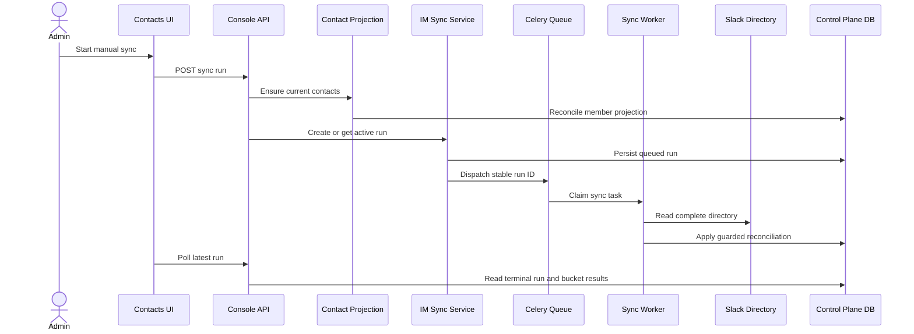

## Context

当前实现已经具备三块独立能力：IM Control Plane 与 reconciliation worker、Workspace Console latest-only sync API、Contacts Channels/Sync UI。它们尚未形成生产闭环：前端 account-settings composition 固定注入内存 mock；前端 view model 仍使用 arbitrary run ID、cursor 和六类 mock result；Slack save 虽会验证候选凭据，但持久化后的 Integration 仍为 `configured`，无法满足 UI 的 connected gate；默认 worker queue 不包含 `human_input_contact_sync`；Contact migration 只建表，没有在 manual sync 前保证 Account/member projection 已就绪。

已有边界必须继续成立：provider I/O 在数据库 transaction 外；reconciliation planner 不理解 Workspace、deployment、Celery、React 或 transport DTO；Contact lifecycle 由 Contact Directory owner 管理；生成式 API client 是新前端请求的唯一入口；Enterprise 使用独立 administration boundary。Cloud Slack OAuth 由 `implement-saas-slack-oauth` 负责，本设计不能复制其 installation、callback 或 token lifecycle。

首个 release slice 是 Community/self-managed Slack。Production sync adapter 本身保持 provider-neutral；Cloud 只有在 OAuth change 提供 server-declared auth mode、availability 和 lifecycle 后才开放新连接，Enterprise 不挂载本 Workspace surface。

## Goals / Non-Goals

**Goals:**

- 让管理员从 production Contacts Channels 页面完成真实 channel 管理、manual sync、terminal polling 和 latest result diagnosis。
- 统一前后端 taxonomy、pagination、timestamp、error 和 latest-only semantics，不新增兼容 mock 的第二套 HTTP contract。
- 在 provider read 前保证当前 Contact projection 可用于 email matching，同时保留 Contact 与 IM domain ownership。
- 让默认 worker 实际消费 durable sync task，并保持现有 retry/idempotency contract。
- 提供 Community/self-managed Slack 的完整 release gate，同时形成 Cloud OAuth 可以复用的 production repository 基座。

**Non-Goals:**

- 不实现新的 reconciliation algorithm、IM identity schema、historical run API、scheduled sync 或 automatic periodic sync。
- 不在 sync flow 内创建 External Contact、处理 unmatched 手工映射或修改 Contact lifecycle rules。
- 不实现 Cloud Slack OAuth、public callback、token rotation、Enterprise admin UI 或 EE internal facade。
- 不让 mock scenario、browser flags 或 provider-name checks 成为生产 authorization、availability 或 capability boundary。
- 不把 `human_input_contact_sync` 合并进 unrelated workflow or notification queues。

## Decisions

### 1. Split production Channels and Sync repositories behind one composition root

将当前过宽的 `ContactImPlatformRepository` 拆成两个前端 port：

- `ContactChannelsRepository`：list/read/test/save/delete channel，并承载 configuration CAS 与 safe channel failures；
- `ContactImSyncRepository`：create-or-get sync、read latest run、page latest results。

production implementation 分别命名为 `ConsoleContactChannelsRepository` 和 `ConsoleContactImSyncRepository`，只调用 `@/service/client` 的 generated `consoleClient` / `consoleQuery`。`ContactsImPlatformProductionProvider` 在 account-settings composition root 中组合两者。现有 mock 可实现同样 ports，但只能由 tests、Stories 或显式 development fixture 注入。

拆分避免 OAuth lifecycle methods 污染 provider-neutral sync boundary，也允许 `implement-saas-slack-oauth` 扩展 Channels port 而不是复制整个 production repository。备选方案是在组件内直接调用 generated client；该方案会让 DTO mapping、query keys 和 error translation 分散到多个 surface，因此拒绝。继续维持一个包含 mock history semantics 的大 interface 也会迫使后端实现不存在的 run-by-ID contract，因此拒绝。

Channels page 同时包含 Resend，因此 production Channels adapter 必须映射现有 Email operations，不能只替换 Slack 读取后把 Email 留在另一套 mock state。Feishu/DingTalk 的 server failure 或 unavailable view 映射为不可操作 provider，不发起 provider request。

### 2. Server channel view owns directory-sync capability

在 `ChannelCapability` 与对应 OpenAPI schema 增加 `directory_sync`。它表示当前 deployment 对该 provider 已具备完整 management、directory adapter 和 worker path，不表示当前凭据健康。UI 启用 manual sync 必须同时满足：

1. authenticated user has management access;
2. persisted channel status is `connected`;
3. server capabilities contain `directory_sync`;
4. no local mutation or authoritative active run prevents another trigger.

首个实现仅由完整 Slack handler 返回 `directory_sync`。Email 永不返回；Feishu/DingTalk 在 management path 未完成前不得返回。Backend sync command 同样校验 current Integration status 与 server provider registry，绕过 UI gate 时返回稳定 `im_sync_not_allowed`，且不创建 run 或执行 provider I/O。

备选方案是 frontend 根据 `provider === 'slack'` 推断能力。该方案会使 Cloud readiness、provider rollout 和 backend availability 分叉，因此拒绝。

### 3. Successful Slack save atomically records verified connectivity

Slack save 已执行 credential test 和 required-scope validation，因此 accepted configuration 应携带 trusted `checked_at` 与 connected diagnostic。Application port 返回的 confirmed configuration 增加 credential-free validation metadata；manager 在 create 或 reconfigure aggregate 上应用 `record_diagnostics(CONNECTED, ...)`，并与 configuration transition 一次持久化。该 diagnostic 不额外推进 `config_version`。

Standalone candidate test 继续返回非持久 `ChannelTestResult`，不得改变 current state。Save validation failure 不写 credential、diagnostic 或 revision。这样 save response 可以立即成为 manual sync 的 authoritative eligible view，无需一次含义模糊的“test then separately mark connected”调用。

备选方案是 frontend 在 save 成功后乐观显示 connected。它会让 browser state 超前于持久化事实，并在刷新后退回 configured，因此拒绝。另一个备选是让 test endpoint 更新 current Integration；这会混淆 candidate test 和 persisted-state mutation，并破坏现有 channel contract，因此拒绝。

### 4. A manual-sync application facade performs bounded Contact ensure before run creation

新增 transport-neutral `ManualIMSyncApplicationService`，组合既有 `OrganizationContactProjectionService` 和 `IMSyncService`：

1. derive trusted `DirectoryScope` and actor from the controller;
2. run bounded, idempotent `ensure_current(scope)` through the Contact lifecycle owner;
3. only after ensure succeeds, call `create_or_get_active_run(scope, actor)`;
4. return the persisted run or a stable retryable failure.

Projection writes must use the reconciliation-protected Organization write boundary required by the existing Contact/IM contracts. Projection transaction commits before run creation and provider I/O；reconciliation later loads its own coherent Contact snapshot under the existing guarded unit of work. If an active run already exists, ensure remains bounded/idempotent, and any queued recovery dispatch reuses the same run ID.

This change consumes the projection service owned by `human-input-v2-api-contracts`. If that service is not landed, implementation of this decision is blocked; this change MUST NOT add a second ad-hoc member backfill inside the IM repository or controller.

备选方案是在 reconciliation input loader 中临时创建 missing Contacts。该方案把 Contact lifecycle、Account availability 和 uniqueness decisions 泄漏进 IM transaction，且会把 provider read 结果与 Contact admission 混合，因此拒绝。只在 migration 中一次性 backfill 也不能覆盖新 member、disable 或 remove，因此拒绝。

### 5. The frontend state machine mirrors latest-only backend state

Sync query ownership改为：

- `latestRun(repositoryKey)`：configured Integration 下没有 run 时将 stable `404` 映射为 `null`；
- `latestResults(repositoryKey, result, page, limit)`：result 必选，使用 page metadata；
- `startSync()`：POST 后直接写入 latest-run cache，再 invalidates authoritative queries。

只有 `queued` 和 `running` 启用 bounded polling；`succeeded` 或 `failed` 立即停止。页面初始化只读取 latest run，若它 active 则恢复进度。不存在独立 `getActiveSync` 或 `getSyncRun(runId)` network contract。

保留 `sync_run_id` 只作为 dialog URL identity：它必须与最新 run ID 相等。若 latest ID 已变化，UI 显示 latest-only stale explanation，清理或替换 query param，不得把最新数据冒充旧 run。详情不提供 `All` network filter；summary 展示所有 counts，table 必须选一个 canonical bucket。Bucket 切换重置到 page one，后续页失败保留已加载 rows。

备选方案是为现有 mock UI 新增 run-by-ID/history endpoints。产品 contract 已明确 latest-only，新增 API 会扩大 persistence/query surface 且没有当前消费价值，因此拒绝。

### 6. View models map canonical transport semantics without DTO leakage

Frontend adapter 把 generated DTO 映射到 Contacts-owned presentation model，但 canonical values 不再重命名：

- lifecycle: `queued / running / succeeded / failed`;
- results: `added / not_matched / failed / removed / skipped`;
- pagination: `page / limit / total`;
- actor: omitted because backend intentionally does not expose `started_by`;
- duration: derived only when both trusted timestamps are present;
- diagnostics: only allowlisted safe codes/messages are shown.

`partial success` 不是 persisted status。UI 仅在 a `succeeded` run has non-zero `not_matched` or item-level `failed` count 时派生 attention presentation。`removed` 是成功对账事实，`skipped` 是有意不变；两者单独出现不得把 run 标成 partial failure。

Result variant mapping follows server payloads：`added` requires Contact plus entry；`removed` uses Contact plus last-known identity and removal reason；`not_matched` and `failed` may have no entry；`skipped` may omit entry。UI 不从其他 cache 猜测缺失 Contact/identity，也不显示 raw provider payload。

### 7. Channel forms use canonical provider values and complete Slack credentials

Production model uses generated `ChannelProvider` values, including `ding_talk`, rather than mock-only aliases. Self-managed Slack form maps all canonical candidate fields：`client_id`、`client_secret`、`signing_secret`、`bot_token`、`app_token`，and uses generated preserve-secret directives only where the server advertises secret retention。Masked display values never enter mutation payloads。

Community is the first enabled configuration surface. Cloud may read/sync an already authoritative server connection, but new Cloud connect remains gated until `implement-saas-slack-oauth` supplies deployment-aware `auth_mode` and availability。The OAuth change extends `ContactChannelsRepository`; it does not replace `ContactImSyncRepository` or create a parallel channel cache。

### 8. The dedicated queue is part of deployment correctness

Keep task routing on `human_input_contact_sync` and add that queue to both Cloud and self-hosted default worker lists. Update `docker/.env.example` comments so any custom `CELERY_QUEUES` or `CELERY_WORKER_QUEUES` example includes both `human_input_delivery` and `human_input_contact_sync` when Human Input v2 is enabled。Repository-owned regression tests read entrypoint and env examples to prevent drift。

Custom operator overrides remain authoritative; the application cannot silently make a worker consume a queue omitted by the operator. The safe failure mode is observable queued state plus deployment diagnostics, not routing sync through the generic workflow queue。

Existing worker idempotency remains the recovery mechanism：a redelivered stable run ID short-circuits terminal state, and a queued recovery dispatch MUST NOT create a second logical run。

### 9. Error handling distinguishes empty, stale, unavailable and ambiguous states

The adapter maps stable outcomes rather than HTTP text：

- latest `404`: no-run empty state;
- channel/sync `401/403`: permission state and no mutation retry;
- `im_sync_not_allowed`: refetch channel capability/status;
- revision/CAS `409`: invalidate channel/latest state before another user action;
- Contact projection, lock or dispatch `503`: retryable safe error while preserving last completed summary;
- ambiguous POST transport failure: read latest first, then require explicit user retry if no active run exists;
- result-page failure: preserve previously loaded pages and retry that page only.

Frontend MUST NOT render raw exception text、queue names、lock keys、credential fields or provider bodies. Backend run diagnostics consumed by UI are limited to existing static safe messages or future allowlisted codes。

### 10. Verification uses layered contracts and one real release smoke

Frontend tests cover generated DTO mapping、query keys、poll stop、ambiguous POST recovery、latest-only URL validation、bucket paging、canonical variants、channel CAS and secret absence。Backend tests cover persisted connected diagnostics、directory-sync capability projection、server eligibility rejection、projection-before-dispatch ordering、stable errors and queue defaults。

Release coverage is calculated from executable line coverage aggregated across production modules added or changed by this change。Unit suites MUST cover at least 85% of that denominator。For integration，the denominator is the executable lines in backend production modules added or changed by this change；the CI-owned PostgreSQL/Redis container suite MUST measure and enforce at least 80% integration-test line coverage。

Container integration uses PostgreSQL and Redis with an injected complete-directory adapter to verify authenticated HTTP trigger → durable run → task worker → terminal persistence → latest/results queries without live provider credentials。An opt-in staging Slack smoke validates required scopes and real pagination, but it is not the only correctness gate and must skip safely when credentials are absent。

The release gate includes a browser-level flow against a controlled backend environment so frontend and generated contracts are exercised together。Backend integration suites remain CI-owned according to repository policy。

## Risks / Trade-offs

- [The Contact projection dependency is incomplete] → Land or extract the owned `OrganizationContactProjectionService` slice first; block apply rather than seed Contacts in the sync adapter。
- [This change and SaaS Slack OAuth both touch the Channels repository] → This change owns the provider-neutral base ports and sync adapter; the OAuth change must rebase its UI task to extend the shared Channels port only。
- [Persisting connected on save changes current Slack view semantics] → Treat successful save validation as the trusted diagnostic source, keep standalone test non-persistent, and add aggregate/repository/controller regression coverage。
- [Latest-only UI removes mock history behavior] → Preserve run ID only for stale-context detection and communicate that only latest details are available; do not add unsupported history APIs。
- [A custom worker queue override can still omit sync] → Document the requirement, add repository configuration tests, expose queued/worker diagnostics, and avoid silently using an unrelated queue。
- [Cloud could expose self-managed credentials before OAuth readiness] → Keep Cloud new-connect rollout disabled until server auth-mode capability from `implement-saas-slack-oauth` is deployed; validate Community first。
- [Bounded ensure adds latency to manual trigger] → Keep it idempotent and bounded, operate only on current scope deltas, record duration/count metrics, and fail before provider I/O when unavailable。
- [Derived partial success may diverge from backend lifecycle] → Keep lifecycle label and derived attention presentation separate; derive only from canonical counts and test the mapping table。

## Migration Plan

1. Land the bounded Contact projection service slice owned by `human-input-v2-api-contracts`, including its guarded write and idempotent ensure tests。
2. Add server directory-sync capability、persisted Slack connected diagnostic、sync eligibility rejection and manual-sync application facade。Regenerate OpenAPI contracts and generated Console clients。
3. Add `human_input_contact_sync` to default worker queues and custom-queue examples before exposing the production trigger。
4. Implement the split production repositories and canonical DTO mappings behind the existing feature-preview/rollout gate; keep mock composition test-only。
5. Run frontend tests、backend unit suites、CI container integration and browser contract flow。Then execute an opt-in staging self-managed Slack smoke with a dedicated test workspace。
6. Enable the Community slice first。Cloud new-connect remains disabled until the OAuth change extends the shared Channels repository; Enterprise remains on its separate boundary。
7. Observe sync trigger errors、queue age、run duration、directory size、result counts and stale-revision rates before widening rollout。

Rollback disables the production Contacts entry or server capability gate; it MUST NOT switch production users back to mutable mock state。Backend additions are additive and may remain deployed。Queued runs and persisted results remain readable，and worker queue consumption can stay enabled safely。

## Open Questions

- The apply order is blocked until the existing Contact projection owner provides `ensure_current(scope)` with the shared reconciliation-protected write semantics。No alternative owner is proposed here。
- `implement-saas-slack-oauth` task 6.2 currently describes creating the production repository; before parallel implementation it must be revised to extend the base repository from this change and own only OAuth-specific operations/state。
- The final Cloud rollout flag owner and staging Slack workspace are deployment decisions; they do not change the Community release contract。
