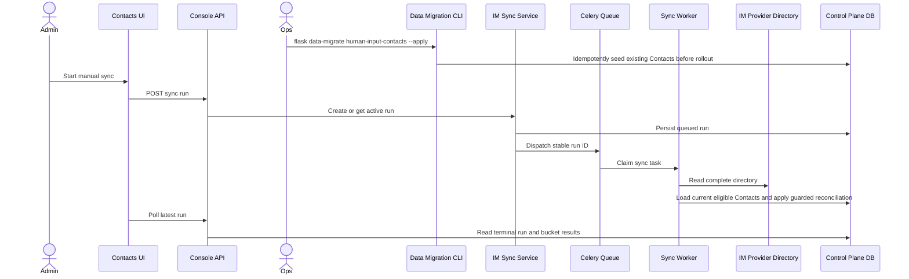

## Context

当前实现已经具备三块独立能力：IM Control Plane 与 reconciliation worker、Workspace Console latest-only sync API、Contacts Channels/Sync UI。它们尚未形成生产闭环：前端 account-settings composition 固定注入内存 mock；前端 view model 仍使用 arbitrary run ID、cursor 和六类 mock result；canonical Channels API 只有 Slack 完整 handler，Feishu/DingTalk 仍为 unavailable handler，Lark、Microsoft Teams 与 WeCom 尚未进入 Channel management provider/candidate union；默认 worker queue 不包含 `human_input_contact_sync`；Contact migration 只建表，已有 eligible Account/member 尚未执行一次性 Contact initialization import。

已有边界必须继续成立：provider I/O 在数据库 transaction 外；reconciliation planner 不理解 Workspace、deployment、Celery、React 或 transport DTO；Contact lifecycle 由 Contact Directory owner 管理；生成式 API client 是新前端请求的唯一入口；Enterprise 使用独立 administration boundary。Cloud Slack OAuth 由 `implement-saas-slack-oauth` 负责，本设计不能复制其 installation、callback 或 token lifecycle。

本 change 的 Community / CE release slice 覆盖当前全部五类 IM provider：Slack、Feishu/Lark、DingTalk、Microsoft Teams 与 WeCom。`feishu` 和 `lark` 保持两个 canonical provider values，但共享同一 provider family implementation。Cloud Slack 只有在 OAuth change 提供 server-owned auth mode、availability 和 lifecycle 后才开放新连接，Enterprise 不挂载本 Workspace surface。

## Goals / Non-Goals

**Goals:**

- 让管理员从 production Contacts Channels 页面完成真实 channel 管理、manual sync、terminal polling 和 latest result diagnosis。
- 统一前后端 taxonomy、pagination、timestamp、error 和 latest-only semantics，不新增兼容 mock 的第二套 HTTP contract。
- 在版本升级中通过 `flask data-migrate human-input-contacts` 执行显式、幂等的一次性 Contact initialization；manual IM sync 只消费 current Contact projection。
- 将 channel configuration、current Contact query、manual sync 与 binding/override 编排固化为 transport-neutral Dify application services，使 Workspace Console 与未来 Dify EE inner API adapter 在同一业务边界收敛。
- 让默认 worker 实际消费 durable sync task，并保持现有 retry/idempotency contract。
- 让 Slack、Feishu/Lark、DingTalk、Microsoft Teams 与 WeCom 全部通过相同的 Channel API、worker、reconciliation、latest query 与 frontend rendering 生产路径，同时形成 Cloud Slack OAuth 可以复用的 production repository 基座。
- 保持现有 provider-specific `IMProviderAdapter` 为 IM directory read 的唯一 owner；management 与 sync orchestration 只负责构造和调用现有 adapter，不复制 provider directory integration。

**Non-Goals:**

- 不实现新的 reconciliation algorithm、IM identity schema、historical run API、scheduled sync 或 automatic periodic sync。
- 不实现 authoritative Account/member Contact write-through 或 periodic Contact reconciliation；它们由 `implement-contact-projection-lifecycle-maintenance` 独立拥有。
- 不把 Contact initialization 或 repair 绑定到 manual IM sync。
- 不在 sync flow 内创建 External Contact、处理 unmatched 手工映射或修改 Contact lifecycle rules。
- 不实现 Cloud Slack OAuth、public callback、token rotation、Enterprise admin UI 或 EE internal facade。
- 不在 Workspace Console 或未来 EE inner API controller 中实现 provider、credential、projection、sync、reconciliation、binding、override 或 persistence 逻辑。
- 不新增第二套 IM directory adapter、provider directory HTTP client、分页、响应标准化或错误翻译实现，也不因接通 management surface 而默认重塑现有 credential structures。
- 不让 mock scenario、browser flags 或 provider-name checks 成为生产 authorization 或 availability boundary。
- 不把 `human_input_contact_sync` 合并进 unrelated workflow or notification queues。

## Decisions

### 1. Split production Channels and Sync repositories behind one composition root

将当前过宽的 `ContactImPlatformRepository` 拆成两个前端 port：

- `ContactChannelsRepository`：list/read/test/save/delete channel，并承载 configuration CAS 与 safe channel failures；
- `ContactImSyncRepository`：create-or-get sync、read latest run、page latest results。

production implementation 分别命名为 `ConsoleContactChannelsRepository` 和 `ConsoleContactImSyncRepository`，只调用 `@/service/client` 的 generated `consoleClient` / `consoleQuery`。`ContactsImPlatformProductionProvider` 在 account-settings composition root 中组合两者。现有 mock 可实现同样 ports，但只能由 tests、Stories 或显式 development fixture 注入。

拆分避免 OAuth lifecycle methods 污染 provider-neutral sync boundary，也允许 `implement-saas-slack-oauth` 扩展 Channels port 而不是复制整个 production repository。备选方案是在组件内直接调用 generated client；该方案会让 DTO mapping、query keys 和 error translation 分散到多个 surface，因此拒绝。继续维持一个包含 mock history semantics 的大 interface 也会迫使后端实现不存在的 run-by-ID contract，因此拒绝。

Channels page 同时包含 Resend，因此 production Channels adapter 必须映射现有 Email operations，不能把 Email 留在另一套 mock state。Channel management provider/candidate unions、handler registry、request mapping 与 safe view mapping 必须覆盖 `slack`、`feishu`、`lark`、`ding_talk`、`ms_teams` 和 `we_com`；当前 IM provider 不得继续以 unavailable placeholder 暴露。

### 2. Directory sync is inherent to connected IM channels

当前支持的每个 IM provider 都必须具备完整 management、directory adapter、worker、reconciliation 与 query/rendering path；UI 启用 manual sync 只需同时满足：

1. authenticated user has management access;
2. channel kind is `IM`;
3. persisted channel status is `connected`;
4. no local mutation or authoritative active run prevents another trigger.

Backend sync command 使用相同的 trusted scope、channel kind 与 persisted Integration status 校验；非 IM、未配置或未 connected 时返回稳定 `im_sync_not_allowed`，且不创建 run、dispatch task 或执行 provider I/O。Email 按 channel kind 排除，不需要 provider-name branch。

Provider directory I/O 必须继续由现有 `DifyIMProviderAdapterFactory` 构造 provider-specific `IMProviderAdapter`，并由既有 worker 调用 `adapter.directory.read_directory()`。Channel management handler、manual-sync application service、controller 与 frontend repository 不得直接读取 provider directory，也不得新增另一套 adapter、HTTP client、pagination、response normalization 或 directory error translation。现有 provider adapters 已经覆盖当前完整 provider set，本 change 只接通 configuration、credential persistence、composition、dispatch 与 presentation。

现有 plaintext/encrypted credential models 是 adapter construction 的默认 canonical structure。只要当前结构可以构造并运行对应 `IMProviderAdapter`，实现就不得为本 change 改名、复制或替换这些结构。只有 red test 证明某个既有 adapter 无法由当前 persisted/candidate credential mapping 正确构造或执行时，才允许在原 owner 中做最小兼容调整；该调整不得改变 directory ownership，并必须覆盖 encryption round-trip、adapter construction 与其他 provider regression。

备选方案是让 frontend 根据 provider 名称推断同步能力。该方案会把 IM 的固有行为错误建模成 provider rollout state，并允许 Channel API 暴露不能完成同步闭环的当前 provider，因此拒绝。

### 3. Successful IM save atomically records verified connectivity

每个当前 IM provider 的 save path 都必须执行其 credential test、required-scope validation 与 provider tenant identity resolution，因此 accepted configuration 应携带 trusted `checked_at` 与 connected diagnostic。Application port 返回的 confirmed configuration 增加 credential-free validation metadata；manager 在 create 或 reconfigure aggregate 上应用 `record_diagnostics(CONNECTED, ...)`，并与 configuration transition 一次持久化。该 diagnostic 不额外推进 `config_version`。

Standalone candidate test 继续返回非持久 `ChannelTestResult`，不得改变 current state。Save validation failure 不写 credential、diagnostic 或 revision。这样 save response 可以立即成为 manual sync 的 authoritative eligible view，无需一次含义模糊的“test then separately mark connected”调用。

备选方案是 frontend 在 save 成功后乐观显示 connected。它会让 browser state 超前于持久化事实，并在刷新后退回 configured，因此拒绝。另一个备选是让 test endpoint 更新 current Integration；这会混淆 candidate test 和 persisted-state mutation，并破坏现有 channel contract，因此拒绝。

### 4. Initialize Contacts before rollout; manual sync is read-only

在现有 `flask data-migrate` namespace 下注册 `human-input-contacts` 运维命令。它是版本升级步骤，不是 runtime application service、HTTP endpoint、scheduled task 或 manual-sync prerequisite hook。命令默认 dry-run；只有显式 `--apply` 才提交变更。

迁移按稳定 `(created_at, id)` keyset cursor 读取小而有界的页面，不使用 offset pagination，也不跨页持有数据库 transaction。每页先从 source facts 生成 immutable Plan；Apply 只能消费该 Plan 中的 action、target IDs 与 expected values 执行写入，不得重新扫描 source facts、重新分类或重新决定 action。dry-run 与 apply 运行同一 page Plan/Apply path，唯一模式分支是页面事务最终 rollback 还是 commit：dry-run rollback 并输出该页 Plan，apply commit 后输出实际变更记录。Plan/Apply orchestration按迁移对象保持显式；除了 JSONL writer、cursor iteration 等低风险机制，不为了消除可读的少量重复而建立通用 migration framework。

Apply 对一页的全部 planned writes 只使用一个 page transaction，不使用 nested transaction、savepoint 或 per-record commit。任一 record write、flush 或 commit 失败都 rollback 整页，记录已知失败 record及完整 page Plan/cursor 上下文，然后跳过该页、以新 transaction/session 继续下一页；该页任何 attempted write 都不得视为实际变更。cursor 只来自已经成功读取的 immutable Plan，不因写入失败重新规划。只有 source/page read 失败才立即中止扫描，因为此时无法证明 cursor 可以安全前进。

命令的所有日志输出只包含 JSONL event，每行是一个完整 JSON object。每个 page/record event 带有 mode、phase、page cursor、action/outcome，以及当前事实可用的 `tenant_id`、`account_id`、`member_id`、`contact_id` 等关键对象 ID；同时记录复核与恢复所需的非 PII 关键数据。dry-run 输出 planned records，apply 只把成功提交的实际变更记录为 changed；failed/skipped write 必须与 committed change 区分，不得把 attempted write 记录成已变更。

source-backed uniqueness 使整条命令可从头安全重跑：已完成页面再次扫描时复用已有 Contact，不需要把迁移 checkpoint 引入 runtime schema。命令完成扫描后汇总所有 skipped write；只要存在 read failure 或未收敛的 write failure，最终必须返回 non-zero exit status，使版本升级保持 production rollout gate 关闭。write failure 不得提前中止扫描；修复后重新执行 `--apply` 即可继续收敛。命令不读取 provider directory、不创建 IM identity/binding，也不由 Contact read 或管理员点击 `Sync now` 隐式触发。

`ManualIMSyncApplicationService` 只负责 trusted scope/actor construction 后的 eligibility、single-active run 与 dispatch 编排，不依赖或调用 Contact initialization/lifecycle mutation。worker 先在数据库 transaction 外读取 provider directory，再在既有 guarded unit of work 中查询当前 scope 的 eligible Contact、membership、identity 与 binding，并立即生成和应用 plan。这个读取只是 IM reconciliation 的 current input，不创建或修复 Contact。

Authoritative Account/member write-through、Account availability、deployment-specific membership transitions 与 independent periodic repair 由 `implement-contact-projection-lifecycle-maintenance` change 拥有，不在本 change 实现。Production rollout 必须同时以本 change 的 initialization import 和该 lifecycle change 完成为前置条件；条件未满足时保持 rollout gate 关闭。

备选方案是在 manual sync trigger 或 reconciliation input loader 中临时创建 missing Contacts。该方案让 optional provider operation 承担 Contact correctness，增加同步延迟和失败分支，并把 Contact lifecycle 与 uniqueness decisions 泄漏进 IM boundary，因此拒绝。

### 5. Dify application services是Workspace与未来EE inner API的唯一业务编排边界

下列能力必须由Dify-owned、transport-neutral application service或既有worker orchestration拥有：

- `HumanInputChannelManagementService`及其provider handlers拥有credential validation/protection、Integration lifecycle、CAS、replacement与safe channel views；
- `flask data-migrate human-input-contacts` 作为独立运维 composition root 复用 Contact Directory domain/repository primitives，但不暴露 transport/application command；`OrganizationContactProjectionService` 的 ongoing lifecycle transitions、availability 与 periodic repair 由 `implement-contact-projection-lifecycle-maintenance` 拥有；
- `ManualIMSyncApplicationService`拥有eligibility、single-active run与dispatch编排，既有worker/reconciler拥有provider fetch、current Contact input read与自动binding apply；
- `ContactIMBindingService`拥有Organization binding与workspace override的guarded mutation和effective binding projection。

这些service的public boundary只接受trusted context、`DirectoryScope`、typed command/query与transport-neutral result/error，不得依赖Flask request、controller Pydantic DTO、SQLAlchemy model/session、Celery task object或EE principal type。Repository、provider adapter、credential protector与task dispatch只能在service composition之下出现。

Workspace Console controller负责workspace authentication/authorization、Dify Account actor facts、request/response mapping和该入口需要的audit/correlation metadata。未来Dify EE inner API adapter负责trusted-service authentication、deployment scope resolution、operation/correlation metadata、必要的service-call audit和DTO/error mapping；EE human-actor audit继续由EE-owned入口负责。两种transport必须调用同一application service，不得controller-to-controller转发，也不得在inner API中重新实现CAS、provider test、projection、sync、reconciliation或binding规则。

本change不实现EE inner API surface，但必须冻结可复用service contracts并增加architecture tests，使`implement-ee-human-input-admin-api`后续只需增加thin transport adapter。备选方案是先在Workspace controller内完成逻辑，等EE接入时再抽取；该方案会形成第二套编排和不可验证的语义漂移，因此拒绝。

### 6. The frontend state machine mirrors latest-only backend state

Sync query ownership改为：

- `latestRun(repositoryKey)`：configured Integration 下没有 run 时将 stable `404` 映射为 `null`；
- `latestResults(repositoryKey, result, page, limit)`：result 必选，使用 page metadata；
- `startSync()`：POST 后直接写入 latest-run cache，再 invalidates authoritative queries。

只有 `queued` 和 `running` 启用 bounded polling；`succeeded` 或 `failed` 立即停止。页面初始化只读取 latest run，若它 active 则恢复进度。不存在独立 `getActiveSync` 或 `getSyncRun(runId)` network contract。

保留 `sync_run_id` 只作为 dialog URL identity：它必须与最新 run ID 相等。若 latest ID 已变化，UI 显示 latest-only stale explanation，清理或替换 query param，不得把最新数据冒充旧 run。详情不提供 `All` network filter；summary 展示所有 counts，table 必须选一个 canonical bucket。Bucket 切换重置到 page one，后续页失败保留已加载 rows。

备选方案是为现有 mock UI 新增 run-by-ID/history endpoints。产品 contract 已明确 latest-only，新增 API 会扩大 persistence/query surface 且没有当前消费价值，因此拒绝。

### 7. View models map canonical transport semantics without DTO leakage

Frontend adapter 把 generated DTO 映射到 Contacts-owned presentation model，但 canonical values 不再重命名：

- lifecycle: `queued / running / succeeded / failed`;
- results: `added / not_matched / failed / removed / skipped`;
- pagination: `page / limit / total`;
- actor: omitted because backend intentionally does not expose `started_by`;
- duration: derived only when both trusted timestamps are present;
- diagnostics: only allowlisted safe codes/messages are shown.

`partial success` 不是 persisted status。UI 仅在 a `succeeded` run has non-zero `not_matched` or item-level `failed` count 时派生 attention presentation。`removed` 是成功对账事实，`skipped` 是有意不变；两者单独出现不得把 run 标成 partial failure。

Result variant mapping follows server payloads：`added` requires Contact plus entry；`removed` uses Contact plus last-known identity and removal reason；`not_matched` and `failed` may have no entry；`skipped` may omit entry。UI 不从其他 cache 猜测缺失 Contact/identity，也不显示 raw provider payload。

### 8. Channel forms cover every current IM provider with canonical values

Production model uses generated `ChannelProvider` values `slack`、`feishu`、`lark`、`ding_talk`、`ms_teams` and `we_com` rather than mock-only aliases. Each form maps its canonical provider-specific candidate contract completely；Slack uses generated preserve-secret directives where the server supports retention，while providers without protected existing-secret resolution require explicit replacement secrets。Masked display values never enter mutation payloads。

Community is the first enabled configuration surface. Cloud may read/sync an already authoritative server connection, but new Cloud connect remains gated until `implement-saas-slack-oauth` supplies deployment-aware `auth_mode` and availability。The OAuth change extends `ContactChannelsRepository`; it does not replace `ContactImSyncRepository` or create a parallel channel cache。

### 9. The dedicated queue is part of deployment correctness

Keep task routing on `human_input_contact_sync` and add that queue to both Cloud and self-hosted default worker lists. Update `docker/.env.example` comments so any custom `CELERY_QUEUES` or `CELERY_WORKER_QUEUES` example includes both `human_input_delivery` and `human_input_contact_sync` when Human Input v2 is enabled。Repository-owned regression tests read entrypoint and env examples to prevent drift。

Custom operator overrides remain authoritative; the application cannot silently make a worker consume a queue omitted by the operator. The safe failure mode is observable queued state plus deployment diagnostics, not routing sync through the generic workflow queue。

Existing worker idempotency remains the recovery mechanism：a redelivered stable run ID short-circuits terminal state, and a queued recovery dispatch MUST NOT create a second logical run。

### 10. Error handling distinguishes empty, stale, unavailable and ambiguous states

The adapter maps stable outcomes rather than HTTP text：

- latest `404`: no-run empty state;
- channel/sync `401/403`: permission state and no mutation retry;
- `im_sync_not_allowed`: refetch channel kind/status;
- revision/CAS `409`: invalidate channel/latest state before another user action;
- lock or dispatch `503`: retryable safe error while preserving last completed summary;
- ambiguous POST transport failure: read latest first, then require explicit user retry if no active run exists;
- result-page failure: preserve previously loaded pages and retry that page only.

Frontend MUST NOT render raw exception text、queue names、lock keys、credential fields or provider bodies. Backend run diagnostics consumed by UI are limited to existing static safe messages or future allowlisted codes。

### 11. Verification uses layered contracts and one real release smoke

Frontend tests cover every current IM provider's generated DTO mapping and configuration form、query keys、poll stop、ambiguous POST recovery、latest-only URL validation、bucket paging、canonical variants、channel CAS and secret absence。Backend tests cover `flask data-migrate human-input-contacts` JSONL schema、page-local Plan/Apply handoff、dry-run rollback/apply commit equivalence、actual-change logging、bounded cursor pagination、whole-page write rollback/continuation、absence of nested transactions、read-failure fail-fast、idempotency/final exit semantics、absence of sync-time Contact writes、complete current-provider handler registration、persisted connected diagnostics、channel-kind/status eligibility rejection、stable errors and queue defaults。Ongoing lifecycle、availability、member removal/rejoin and periodic repair coverage belong to `implement-contact-projection-lifecycle-maintenance`。

Release coverage is calculated from executable line coverage aggregated across production modules added or changed by this change。Unit suites MUST cover at least 85% of that denominator。For integration，the denominator is the executable lines in backend production modules added or changed by this change；the CI-owned PostgreSQL/Redis container suite MUST measure and enforce at least 80% integration-test line coverage。

Container integration uses PostgreSQL and Redis with each current provider's injected complete-directory adapter to verify authenticated HTTP trigger → durable run → task worker → reconciliation → terminal persistence → latest/results queries without live provider credentials。Optional staging smokes validate provider-specific scopes and real pagination when credentials are available，but they are not the only correctness gate and must skip safely when credentials are absent。

The release gate includes a browser-level flow against a controlled backend environment so frontend and generated contracts are exercised together。Backend integration suites remain CI-owned according to repository policy。

## Risks / Trade-offs

- [Contact projection prerequisites are incomplete] → Complete this change's initialization import and `implement-contact-projection-lifecycle-maintenance` before enabling production sync；manual sync must never seed or repair Contacts。
- [Workspace-first实现会把业务逻辑固化在controller] → 先冻结transport-neutral application service contracts，再让Workspace与未来EE inner API分别实现thin adapter；用import/call-graph tests禁止controller直接依赖repository、provider或task。
- [This change and SaaS Slack OAuth both touch the Channels repository] → This change owns the provider-neutral base ports and sync adapter; the OAuth change must rebase its UI task to extend the shared Channels port only。
- [Persisting connected on save changes current IM view semantics] → Treat each provider's successful save validation as the trusted diagnostic source, keep standalone test non-persistent, and add table-driven aggregate/repository/controller regression coverage。
- [Channels management currently covers fewer providers than the IM runtime] → Expand canonical provider values、candidate unions、handlers and generated contracts together，and add completeness tests across Slack、Feishu/Lark、DingTalk、Microsoft Teams and WeCom。
- [Management expansion could duplicate existing provider directory code] → Make the existing `IMProviderAdapter` construction and `adapter.directory.read_directory()` call path an architecture invariant；reject new management-owned or parallel directory clients and require proof before changing credential structures。
- [Latest-only UI removes mock history behavior] → Preserve run ID only for stale-context detection and communicate that only latest details are available; do not add unsupported history APIs。
- [A custom worker queue override can still omit sync] → Document the requirement, add repository configuration tests, expose queued/worker diagnostics, and avoid silently using an unrelated queue。
- [Cloud could expose self-managed credentials before OAuth readiness] → Keep Cloud new-connect rollout disabled until server-owned auth mode and availability from `implement-saas-slack-oauth` are deployed; validate Community first。
- [Derived partial success may diverge from backend lifecycle] → Keep lifecycle label and derived attention presentation separate; derive only from canonical counts and test the mapping table。

## Migration Plan

1. After schema migration, run `flask data-migrate human-input-contacts` and review its JSONL Plan, then run `flask data-migrate human-input-contacts --apply` as part of the version upgrade and review its committed-change JSONL；keep the production gate closed until the command succeeds and `implement-contact-projection-lifecycle-maintenance` separately completes authoritative write-through and periodic repair。
2. 冻结并实现可被Workspace与未来EE inner API共用的channel、manual sync和binding/override application service boundaries；扩展当前全部 IM provider 的 Channel API handlers/candidates，持久化 verified connected diagnostic，并按 channel kind/status 实施 sync eligibility rejection。
3. Add `human_input_contact_sync` to default worker queues and custom-queue examples before exposing the production trigger。
4. Implement the split production repositories and canonical DTO mappings behind the existing feature-preview/rollout gate; keep mock composition test-only。
5. Run frontend tests、backend unit suites、CI container integration and browser contract flow across every current IM provider。Then execute opt-in provider smokes where dedicated credentials are available。
6. Enable the Community / CE slice for the complete current IM provider set。Cloud Slack new-connect remains disabled until the OAuth change extends the shared Channels repository; Enterprise remains on its separate boundary。
7. Observe sync trigger errors、queue age、run duration、directory size、result counts and stale-revision rates before widening rollout。

Rollback disables the production Contacts entry or rollout gate; it MUST NOT switch production users back to mutable mock state。The initialization migration is additive and is not reversed by deleting imported Contacts; a downgraded release ignores them, and a later upgrade safely reruns the idempotent command。Queued runs and persisted results remain readable，and worker queue consumption can stay enabled safely。

## Open Questions

- The production rollout is blocked until this change's Contact initialization import and `implement-contact-projection-lifecycle-maintenance` are complete。Manual sync has no fallback Contact projection path。
- `implement-saas-slack-oauth` task 6.2 currently describes creating the production repository; before parallel implementation it must be revised to extend the base repository from this change and own only OAuth-specific operations/state。
- The final Cloud rollout flag owner and staging Slack workspace are deployment decisions; they do not change the Community release contract。
