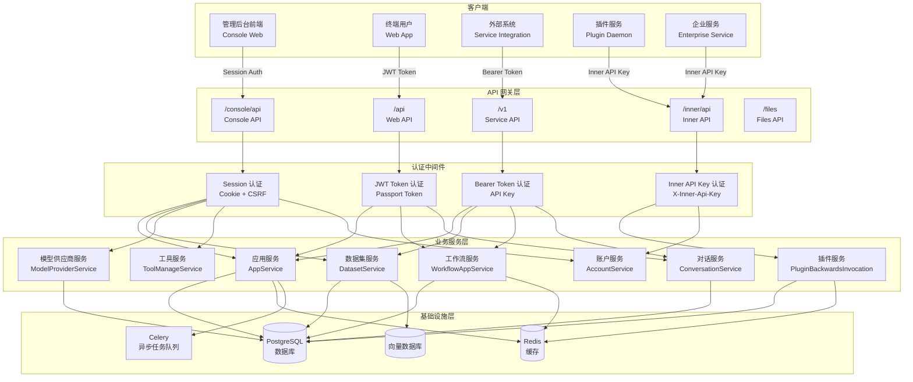
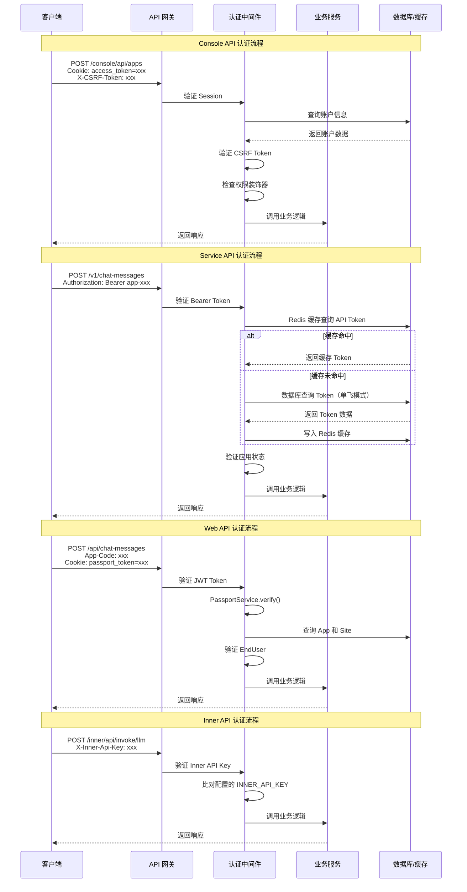
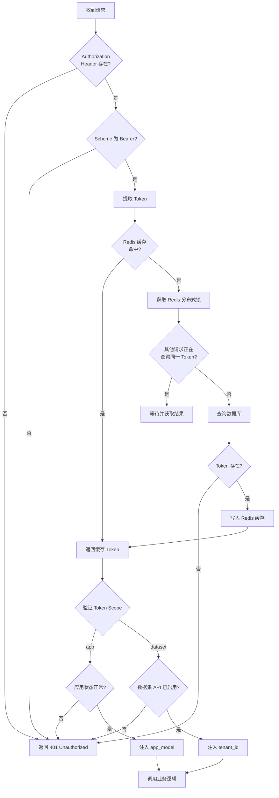

# Dify API 接口概览

## 1. API 分类说明

Dify 的 API 体系按照使用场景和调用方分为四种类型，各自拥有独立的 URL 前缀、认证机制和访问控制策略。

| API 类型 | URL 前缀 | 面向对象 | 主要用途 |
|---------|----------|---------|---------|
| Console API | `/console/api` | 平台管理员 | 应用配置、数据集管理、工作空间管理、模型管理等管理端操作 |
| Service API | `/v1` | 外部系统集成 | 对话消息、补全消息、工作流执行、数据集操作等面向开发者的服务端接口 |
| Web API | `/api` | 终端用户 | Web 应用端交互，包括对话、消息、文件上传等面向终端用户的操作 |
| Inner API | `/inner/api` | 服务间调用 | 插件通信、企业级功能、计费对接等内部服务间通信 |

### 1.1 Console API

Console API 是 Dify 管理端的核心接口，面向平台管理员和开发者。通过该 API 可以完成应用的创建与配置、数据集的导入与管理、模型供应商的接入、工作空间的成员管理等所有管理侧操作。所有 Console API 均需要通过 Session 认证（Cookie + CSRF Token）进行访问。

### 1.2 Service API

Service API 是面向外部系统集成的服务端接口，允许开发者通过 API Key 将 Dify 的能力嵌入到自己的产品中。该 API 支持对话消息发送、文本补全、工作流执行、数据集操作等核心功能，是构建 AI 应用的主要编程接口。

### 1.3 Web API

Web API 面向终端用户，服务于 Dify 的 Web 应用前端。终端用户通过该 API 与应用进行交互，包括发送消息、管理会话、上传文件等操作。Web API 通过 JWT Token（存储在 Cookie 中）进行认证。

### 1.4 Inner API

Inner API 是 Dify 内部服务间通信的专用接口，不对外暴露。主要用于插件系统（Plugin Daemon）与主服务之间的通信、企业级管理功能的内部调用、以及计费系统的对接。该 API 通过专用的 Inner API Key 进行认证。

---

## 2. Console API 端点列表

Console API 的 URL 前缀为 `/console/api`，以下按功能模块列出主要端点。

### 2.1 应用管理

| 端点路径 | 方法 | 说明 |
|---------|------|------|
| `/apps` | GET | 获取应用列表（分页、筛选） |
| `/apps` | POST | 创建应用 |
| `/apps/<app_id>` | GET | 获取应用详情 |
| `/apps/<app_id>` | PUT | 更新应用信息 |
| `/apps/<app_id>` | DELETE | 删除应用 |
| `/apps/<app_id>/copy` | POST | 复制应用 |
| `/apps/<app_id>/export` | GET | 导出应用 DSL 配置 |
| `/apps/<app_id>/name` | POST | 更新应用名称 |
| `/apps/<app_id>/icon` | POST | 更新应用图标 |
| `/apps/<app_id>/site-enable` | POST | 启用/禁用 Web 应用 |
| `/apps/<app_id>/api-enable` | POST | 启用/禁用 API 服务 |
| `/apps/<app_id>/trace` | GET/POST | 获取/更新应用追踪配置 |
| `/apps/<app_id>/model-config` | POST | 更新应用模型配置 |
| `/apps/<app_id>/completion-messages` | GET | 获取补全消息列表 |
| `/apps/<app_id>/conversation-variables` | GET/POST | 获取/更新对话变量 |
| `/apps/<app_id>/statistics` | GET | 获取应用统计数据 |
| `/apps/<app_id>/workflow` | GET/POST | 获取/更新工作流 |
| `/apps/<app_id>/workflow/run` | POST | 执行工作流 |
| `/apps/<app_id>/workflow/draft-variables` | GET | 获取工作流草稿变量 |
| `/apps/<app_id>/workflow/statistics` | GET | 获取工作流统计 |
| `/apps/<app_id>/workflow/app-log` | GET | 获取工作流应用日志 |
| `/apps/<app_id>/workflow/comment` | GET/POST | 获取/创建工作流评论 |
| `/apps/<app_id>/annotation` | GET/POST | 获取/管理应用标注 |
| `/apps/<app_id>/audio` | POST | 语音转文字 |
| `/apps/<app_id>/site` | GET/POST | 获取/更新应用站点配置 |
| `/apps/<app_id>/ops-trace` | GET | 获取运维追踪信息 |
| `/apps/<app_id>/mcp-server` | GET | 获取 MCP 服务器配置 |
| `/apps/<app_id>/agent` | GET | 获取 Agent 配置 |

### 2.2 数据集管理

| 端点路径 | 方法 | 说明 |
|---------|------|------|
| `/datasets` | GET | 获取数据集列表 |
| `/datasets` | POST | 创建数据集 |
| `/datasets/<dataset_id>` | GET | 获取数据集详情 |
| `/datasets/<dataset_id>` | PATCH | 更新数据集 |
| `/datasets/<dataset_id>` | DELETE | 删除数据集 |
| `/datasets/<dataset_id>/use-check` | GET | 检查数据集是否在使用中 |
| `/datasets/<dataset_id>/queries` | GET | 获取数据集查询历史 |
| `/datasets/<dataset_id>/indexing-status` | GET | 获取索引状态 |
| `/datasets/<dataset_id>/related-apps` | GET | 获取关联应用列表 |
| `/datasets/<dataset_id>/error-docs` | GET | 获取错误文档列表 |
| `/datasets/<dataset_id>/permission-part-users` | GET | 获取数据集权限用户列表 |
| `/datasets/<dataset_id>/auto-disable-logs` | GET | 获取自动禁用日志 |
| `/datasets/<dataset_id>/documents` | GET/POST | 获取/创建文档 |
| `/datasets/<dataset_id>/documents/<document_id>` | DELETE | 删除文档 |
| `/datasets/<dataset_id>/documents/<document_id>/indexing-status` | GET | 获取文档索引状态 |
| `/datasets/<dataset_id>/segments` | GET/POST | 获取/创建分段 |
| `/datasets/<dataset_id>/segments/<segment_id>` | POST/DELETE | 更新/删除分段 |
| `/datasets/indexing-estimate` | POST | 估算索引成本 |
| `/datasets/api-keys` | GET/POST | 获取/创建数据集 API 密钥 |
| `/datasets/api-keys/<api_key_id>` | DELETE | 删除数据集 API 密钥 |
| `/datasets/<dataset_id>/api-keys/<status>` | POST | 启用/禁用数据集 API |
| `/datasets/api-base-info` | GET | 获取 API 基础信息 |
| `/datasets/retrieval-setting` | GET | 获取检索设置 |
| `/datasets/retrieval-setting/<vector_type>` | GET | 获取指定向量库的检索设置 |
| `/datasets/external` | POST | 创建外部数据集 |
| `/datasets/data-source` | POST | 数据源操作 |
| `/datasets/website` | POST | 网站爬取配置 |
| `/datasets/metadata` | GET/POST | 获取/更新元数据 |
| `/datasets/hit-testing` | POST | 命中测试 |
| `/datasets/rag-pipeline/*` | — | RAG Pipeline 相关端点 |

### 2.3 工作空间管理

| 端点路径 | 方法 | 说明 |
|---------|------|------|
| `/workspaces` | GET | 获取工作空间列表 |
| `/all-workspaces` | GET | 获取所有工作空间（管理员） |
| `/workspaces/current` | POST | 获取当前工作空间信息 |
| `/workspaces/switch` | POST | 切换工作空间 |
| `/workspaces/custom-config` | POST | 更新工作空间自定义配置 |
| `/workspaces/custom-config/webapp-logo/upload` | POST | 上传 Web 应用 Logo |
| `/workspaces/info` | POST | 更新工作空间名称 |
| `/workspaces/current/permission` | GET | 获取工作空间权限设置 |
| `/workspaces/current/model-providers/<provider>/models` | GET/POST/DELETE | 模型供应商模型管理 |
| `/workspaces/current/model-providers/<provider>/models/credentials` | GET/POST/PUT/DELETE | 模型凭证管理 |
| `/workspaces/current/model-providers/<provider>/models/credentials/validate` | POST | 验证模型凭证 |
| `/workspaces/current/model-providers/<provider>/models/credentials/switch` | POST | 切换模型凭证 |
| `/workspaces/current/model-providers/<provider>/models/parameter-rules` | GET | 获取模型参数规则 |
| `/workspaces/current/model-providers/<provider>/models/enable` | PATCH | 启用模型 |
| `/workspaces/current/model-providers/<provider>/models/disable` | PATCH | 禁用模型 |
| `/workspaces/current/default-model` | GET/POST | 获取/设置默认模型 |
| `/workspaces/current/models/model-types/<model_type>` | GET | 获取指定类型的可用模型 |
| `/workspaces/current/tool-providers` | GET | 获取工具供应商列表 |
| `/workspaces/current/tool-provider/builtin/<provider>/*` | — | 内置工具管理 |
| `/workspaces/current/tool-provider/api/*` | — | API 工具管理 |
| `/workspaces/current/tool-provider/workflow/*` | — | 工作流工具管理 |
| `/workspaces/current/tool-provider/mcp/*` | — | MCP 工具管理 |
| `/workspaces/current/tools/builtin` | GET | 获取内置工具列表 |
| `/workspaces/current/tools/api` | GET | 获取 API 工具列表 |
| `/workspaces/current/tools/workflow` | GET | 获取工作流工具列表 |
| `/workspaces/current/tools/mcp` | GET | 获取 MCP 工具列表 |
| `/workspaces/current/tool-labels` | GET | 获取工具标签列表 |
| `/workspaces/current/load-balancing-config` | — | 模型负载均衡配置 |
| `/workspaces/current/agent-providers` | — | Agent 供应商管理 |
| `/workspaces/current/trigger-providers` | — | 触发器供应商管理 |
| `/workspaces/current/endpoint` | — | 端点管理 |
| `/workspaces/current/plugin` | — | 插件管理 |
| `/workspaces/members` | GET/POST/DELETE | 成员管理 |

### 2.4 模型管理

| 端点路径 | 方法 | 说明 |
|---------|------|------|
| `/workspaces/current/model-providers` | GET | 获取模型供应商列表 |
| `/workspaces/current/model-providers/<provider>/models` | GET/POST/DELETE | 供应商模型 CRUD |
| `/workspaces/current/model-providers/<provider>/models/credentials` | GET/POST/PUT/DELETE | 模型凭证 CRUD |
| `/workspaces/current/model-providers/<provider>/models/credentials/validate` | POST | 验证模型凭证有效性 |
| `/workspaces/current/model-providers/<provider>/models/credentials/switch` | POST | 切换活跃凭证 |
| `/workspaces/current/model-providers/<provider>/models/parameter-rules` | GET | 获取模型参数规则 |
| `/workspaces/current/model-providers/<provider>/models/enable` | PATCH | 启用模型 |
| `/workspaces/current/model-providers/<provider>/models/disable` | PATCH | 禁用模型 |
| `/workspaces/current/default-model` | GET/POST | 获取/设置默认模型 |
| `/workspaces/current/models/model-types/<model_type>` | GET | 按类型获取可用模型 |

### 2.5 工具管理

| 端点路径 | 方法 | 说明 |
|---------|------|------|
| `/workspaces/current/tool-providers` | GET | 获取工具供应商列表 |
| `/workspaces/current/tool-provider/builtin/<provider>/tools` | GET | 获取内置工具列表 |
| `/workspaces/current/tool-provider/builtin/<provider>/info` | GET | 获取内置工具信息 |
| `/workspaces/current/tool-provider/builtin/<provider>/add` | POST | 添加内置工具凭证 |
| `/workspaces/current/tool-provider/builtin/<provider>/update` | POST | 更新内置工具凭证 |
| `/workspaces/current/tool-provider/builtin/<provider>/delete` | POST | 删除内置工具凭证 |
| `/workspaces/current/tool-provider/builtin/<provider>/credentials` | GET | 获取内置工具凭证 |
| `/workspaces/current/tool-provider/api/add` | POST | 创建 API 工具 |
| `/workspaces/current/tool-provider/api/update` | POST | 更新 API 工具 |
| `/workspaces/current/tool-provider/api/delete` | POST | 删除 API 工具 |
| `/workspaces/current/tool-provider/api/get` | GET | 获取 API 工具详情 |
| `/workspaces/current/tool-provider/api/remote` | GET | 获取远程 API Schema |
| `/workspaces/current/tool-provider/api/schema` | POST | 解析 API Schema |
| `/workspaces/current/tool-provider/api/test/pre` | POST | 测试 API 工具 |
| `/workspaces/current/tool-provider/workflow/create` | POST | 创建工作流工具 |
| `/workspaces/current/tool-provider/workflow/update` | POST | 更新工作流工具 |
| `/workspaces/current/tool-provider/workflow/delete` | POST | 删除工作流工具 |
| `/workspaces/current/tool-provider/workflow/get` | GET | 获取工作流工具 |
| `/workspaces/current/tool-provider/mcp` | POST/PUT/DELETE | MCP 工具供应商 CRUD |
| `/workspaces/current/tool-provider/mcp/auth` | POST | MCP 工具授权 |
| `/workspaces/current/tool-provider/mcp/tools/<provider_id>` | GET | 获取 MCP 工具详情 |
| `/workspaces/current/tools/mcp` | GET | 获取所有 MCP 工具 |
| `/workspaces/current/tool-labels` | GET | 获取工具标签 |

### 2.6 认证

| 端点路径 | 方法 | 说明 |
|---------|------|------|
| `/login` | POST | 邮箱密码登录 |
| `/logout` | POST | 登出 |
| `/email-code-login` | POST | 发送邮箱验证码 |
| `/email-code-login/validity` | POST | 验证码登录 |
| `/reset-password` | POST | 发送重置密码邮件 |
| `/refresh-token` | POST | 刷新访问令牌 |
| `/auth/activate` | POST | 激活账户 |
| `/auth/oauth` | GET | OAuth 登录 |
| `/auth/oauth-server` | — | OAuth 服务器配置 |
| `/auth/data-source-oauth` | — | 数据源 OAuth 认证 |
| `/auth/data-source-bearer-auth` | — | 数据源 Bearer 认证 |
| `/auth/forgot-password` | POST | 忘记密码 |
| `/auth/email-register` | POST | 邮箱注册 |

### 2.7 文件管理

| 端点路径 | 方法 | 说明 |
|---------|------|------|
| `/files/upload` | POST | 上传文件 |
| `/files/<file_id>` | GET | 获取文件信息 |
| `/remote-files/upload` | POST | 上传远程文件 |

### 2.8 标签管理

| 端点路径 | 方法 | 说明 |
|---------|------|------|
| `/tags` | GET | 获取标签列表 |
| `/tags` | POST | 创建标签 |
| `/tags/<tag_id>` | PATCH | 更新标签 |
| `/tags/<tag_id>` | DELETE | 删除标签 |
| `/tags/binding` | POST | 绑定标签 |
| `/tags/unbinding` | POST | 解绑标签 |

### 2.9 计费

| 端点路径 | 方法 | 说明 |
|---------|------|------|
| `/billing/subscription` | GET | 获取订阅信息 |
| `/billing/invoices` | GET | 获取发票列表 |
| `/billing/partners/<partner_key>/tenants` | PUT | 同步合作伙伴租户绑定 |
| `/billing/compliance` | GET | 获取合规信息 |

### 2.10 功能开关

| 端点路径 | 方法 | 说明 |
|---------|------|------|
| `/features` | GET | 获取当前租户功能配置 |
| `/system-features` | GET | 获取系统级功能配置（无需认证） |

### 2.11 其他

| 端点路径 | 方法 | 说明 |
|---------|------|------|
| `/setup` | POST | 系统初始化设置 |
| `/init-validate` | POST | 初始化密码验证 |
| `/ping` | GET | 健康检查 |
| `/version` | GET | 获取系统版本 |
| `/notification` | GET | 获取通知 |
| `/spec` | GET | 获取 API 规范 |
| `/apikey` | GET/POST/DELETE | API 密钥管理 |
| `/extension` | — | 扩展管理 |
| `/explore/*` | — | 探索模块（推荐应用、已安装应用等） |

---

## 3. Service API 端点列表

Service API 的 URL 前缀为 `/v1`，以下按功能模块列出主要端点。

### 3.1 对话消息

| 端点路径 | 方法 | 说明 |
|---------|------|------|
| `/chat-messages` | POST | 发送对话消息（支持阻塞/流式） |
| `/chat-messages/<task_id>/stop` | POST | 停止对话消息响应 |
| `/messages` | GET | 获取消息列表 |
| `/messages/<message_id>` | GET | 获取消息详情 |
| `/messages/<message_id>/feedbacks` | POST | 提交消息反馈 |
| `/messages/<message_id>/suggested` | GET | 获取推荐问题 |
| `/messages/<message_id>/message-annotations` | GET | 获取消息标注 |
| `/conversations` | GET | 获取会话列表 |
| `/conversations/<conversation_id>` | DELETE | 删除会话 |
| `/conversations/<conversation_id>/name` | POST | 重命名会话 |
| `/conversations/<conversation_id>/variables` | GET | 获取会话变量 |
| `/conversations/<conversation_id>/audio` | POST | 语音转文字 |
| `/conversations/<conversation_id>/human-input-form` | GET | 获取人工输入表单 |

### 3.2 补全消息

| 端点路径 | 方法 | 说明 |
|---------|------|------|
| `/completion-messages` | POST | 发送补全消息（支持阻塞/流式） |
| `/completion-messages/<task_id>/stop` | POST | 停止补全消息响应 |

### 3.3 工作流执行

| 端点路径 | 方法 | 说明 |
|---------|------|------|
| `/workflows/run` | POST | 执行工作流 |
| `/workflows/run/<task_id>/stop` | POST | 停止工作流执行 |
| `/workflows/tasks/<task_id>` | GET | 获取工作流任务详情 |
| `/workflows/run/<workflow_run_id>` | GET | 获取工作流运行详情 |
| `/workflows/run/journal` | GET | 获取工作流日志 |
| `/workflows/streaming` | GET | 工作流事件流（SSE） |

### 3.4 数据集操作

| 端点路径 | 方法 | 说明 |
|---------|------|------|
| `/datasets` | POST | 创建数据集 |
| `/datasets` | GET | 获取数据集列表 |
| `/datasets/<dataset_id>` | DELETE | 删除数据集 |
| `/datasets/<dataset_id>/update` | POST | 更新数据集 |
| `/datasets/<dataset_id>/documents` | POST | 创建文档 |
| `/datasets/<dataset_id>/documents/<document_id>` | DELETE | 删除文档 |
| `/datasets/<dataset_id>/documents/<document_id>/update` | POST | 更新文档 |
| `/datasets/<dataset_id>/documents/<document_id>/indexing-status` | GET | 获取文档索引状态 |
| `/datasets/<dataset_id>/segments` | POST | 创建分段 |
| `/datasets/<dataset_id>/segments/<segment_id>` | POST/DELETE | 更新/删除分段 |
| `/datasets/<dataset_id>/hit-testing` | POST | 命中测试 |
| `/datasets/<dataset_id>/metadata` | POST | 更新元数据 |
| `/datasets/rag-pipeline/workflow` | POST | 执行 RAG Pipeline 工作流 |

### 3.5 文件操作

| 端点路径 | 方法 | 说明 |
|---------|------|------|
| `/files/upload` | POST | 上传文件 |
| `/files/<file_id>` | GET | 获取文件信息 |

### 3.6 应用信息

| 端点路径 | 方法 | 说明 |
|---------|------|------|
| `/parameters` | GET | 获取应用参数配置 |
| `/meta` | GET | 获取应用元数据 |
| `/info` | GET | 获取应用基本信息 |
| `/site` | GET | 获取站点配置 |
| `/audio` | POST | 语音转文字 |
| `/text-to-audio` | POST | 文字转语音 |

### 3.7 终端用户

| 端点路径 | 方法 | 说明 |
|---------|------|------|
| `/end-users` | GET | 获取终端用户列表 |

### 3.8 工作空间模型

| 端点路径 | 方法 | 说明 |
|---------|------|------|
| `/workspaces/models/model-type/<model_type>` | GET | 获取指定类型的模型列表 |

---

## 4. Web API 端点列表

Web API 的 URL 前缀为 `/api`，面向终端用户，通过 JWT Token 认证。

| 端点路径 | 方法 | 说明 |
|---------|------|------|
| `/parameters` | GET | 获取应用参数配置 |
| `/meta` | GET | 获取应用元数据 |
| `/webapp/access-mode` | GET | 获取 Web 应用访问模式 |
| `/webapp/permission` | GET | 检查 Web 应用访问权限 |
| `/conversations` | GET | 获取会话列表 |
| `/conversations/<conversation_id>` | DELETE | 删除会话 |
| `/conversations/<conversation_id>/name` | POST | 重命名会话 |
| `/conversations/<conversation_id>/pinned` | POST | 置顶/取消置顶会话 |
| `/conversations/<conversation_id>/variables` | GET | 获取会话变量 |
| `/chat-messages` | POST | 发送对话消息 |
| `/chat-messages/<task_id>/stop` | POST | 停止对话响应 |
| `/completion-messages` | POST | 发送补全消息 |
| `/completion-messages/<task_id>/stop` | POST | 停止补全响应 |
| `/messages` | GET | 获取消息列表 |
| `/messages/<message_id>` | GET | 获取消息详情 |
| `/messages/<message_id>/feedbacks` | POST | 提交消息反馈 |
| `/messages/<message_id>/suggested` | GET | 获取推荐问题 |
| `/messages/<message_id>/audio` | GET | 获取消息音频 |
| `/workflow/run` | POST | 执行工作流 |
| `/workflow/run/<task_id>/stop` | POST | 停止工作流 |
| `/workflow/tasks/<task_id>` | GET | 获取工作流任务 |
| `/workflow/streaming` | GET | 工作流事件流（SSE） |
| `/files/upload` | POST | 上传文件 |
| `/remote-files/upload` | POST | 上传远程文件 |
| `/audio` | POST | 语音转文字 |
| `/text-to-audio` | POST | 文字转语音 |
| `/site` | GET | 获取站点配置 |
| `/saved-message/list` | GET | 获取保存的消息列表 |
| `/saved-message/create` | POST | 创建保存的消息 |
| `/saved-message/delete` | DELETE | 删除保存的消息 |
| `/feature` | GET | 获取功能配置 |
| `/login` | POST | 登录 |
| `/forgot-password` | POST | 忘记密码 |
| `/passport` | POST | 获取 Passport Token |
| `/human-input-form` | GET | 获取人工输入表单 |

---

## 5. Inner API 端点列表

Inner API 的 URL 前缀为 `/inner/api`，仅供内部服务间调用。

### 5.1 插件通信

| 端点路径 | 方法 | 说明 |
|---------|------|------|
| `/invoke/llm` | POST | 调用 LLM 模型 |
| `/invoke/text-embedding` | POST | 调用文本嵌入模型 |
| `/invoke/rerank` | POST | 调用重排序模型 |
| `/invoke/tts` | POST | 调用 TTS 语音合成 |
| `/invoke/speech2text` | POST | 调用语音转文字 |
| `/invoke/moderation` | POST | 调用内容审核 |
| `/invoke/tool` | POST | 调用工具 |
| `/invoke/app` | POST | 调用应用 |
| `/invoke/encrypt` | POST | 加密操作 |
| `/invoke/summary` | POST | 调用摘要 |
| `/invoke/parameter-extractor-node` | POST | 调用参数提取节点 |
| `/invoke/question-classifier-node` | POST | 调用问题分类节点 |
| `/invoke/llm-with-structured-output` | POST | 调用结构化输出 LLM |
| `/request-upload-file` | POST | 请求上传文件 |

### 5.2 企业管理

| 端点路径 | 方法 | 说明 |
|---------|------|------|
| `/enterprise/workspace` | POST | 创建企业工作空间 |
| `/enterprise/workspaces/<workspace_id>/dsl/import` | POST | 导入应用 DSL |

### 5.3 邮件服务

| 端点路径 | 方法 | 说明 |
|---------|------|------|
| `/mail` | POST | 发送邮件 |

---

## 6. 认证方式

Dify 的四种 API 类型采用不同的认证机制，确保各层级的访问安全。

### 6.1 Console API — Session 认证

Console API 使用基于 Cookie 的 Session 认证机制：

- **登录方式**：邮箱密码登录、邮箱验证码登录、OAuth 登录
- **认证凭证**：登录成功后，服务器通过 `Set-C` ookie 响应头设置以下 Cookie：
  - `access_token` — 访问令牌（HTTP-only）
  - `refresh_token` — 刷新令牌（HTTP-only）
  - `csrf_token` — CSRF 防护令牌
- **请求认证**：每次请求自动携带 Cookie，同时需要在请求头中携带 CSRF Token
- **令牌刷新**：通过 `/console/api/refresh-token` 端点使用 refresh_token 获取新的访问令牌
- **权限装饰器**：
  - `@login_required` — 要求用户已登录
  - `@account_initialization_required` — 要求账户已初始化
  - `@setup_required` — 要求系统已完成初始化设置
  - `@enterprise_license_required` — 要求企业许可证有效
  - `@edit_permission_required` — 要求编辑权限
  - `@is_admin_or_owner_required` — 要求管理员或所有者角色

### 6.2 Service API — Bearer Token 认证

Service API 使用 API Key 通过 Bearer Token 方式认证：

- **认证方式**：在请求头中携带 `Authorization: Bearer <api_key>`
- **API Key 类型**：
  - App 类型 — 以 `app-` 为前缀，用于应用级操作
  - Dataset 类型 — 以 `dataset-` 为前缀，用于数据集级操作
- **令牌验证流程**：
  1. 从 `Authorization` 请求头提取 Bearer Token
  2. 优先从 Redis 缓存查询令牌信息
  3. 缓存未命中时查询数据库，使用单飞模式（Single Flight）防止缓存击穿
  4. 验证令牌关联的应用/数据集状态
- **终端用户标识**：通过 `user` 参数（Query/JSON/Form）标识终端用户
- **权限装饰器**：
  - `@validate_app_token` — 验证应用 API Token
  - `@validate_dataset_token` — 验证数据集 API Token（DatasetApiResource 基类自动应用）

### 6.3 Web API — JWT Token 认证

Web API 使用 JWT Token 进行认证，Token 存储在 Cookie 中：

- **认证方式**：通过 `App-Code` 请求头和 Cookie 中的 JWT Token 进行双重验证
- **Token 生成**：用户通过 Passport 服务获取 JWT Token，包含 `app_code`、`app_id`、`end_user_id` 等信息
- **Token 验证流程**：
  1. 从请求头获取 `App-Code`
  2. 从 Cookie 中提取 WebApp Passport Token
  3. 使用 PassportService 验证 JWT 签名
  4. 验证关联的应用和站点状态
  5. 验证终端用户信息
- **企业级 WebApp 认证**：支持 SSO 单点登录，包括内部 SSO 和外部 SSO
- **权限装饰器**：
  - `@validate_jwt_token` — 验证 JWT Token（WebApiResource 基类自动应用）

### 6.4 Inner API — Inner API Key 认证

Inner API 使用专用的 API Key 进行认证：

- **认证方式**：在请求头中携带 `X-Inner-Api-Key`
- **Key 类型**：
  - `INNER_API_KEY` — 用于计费和企业级内部 API
  - `INNER_API_KEY_FOR_PLUGIN` — 用于插件系统通信
- **安全机制**：
  - 仅在 `INNER_API` 配置启用时可用
  - 插件通信还支持 HMAC 签名验证
- **权限装饰器**：
  - `@billing_inner_api_only` — 计费内部 API 专用
  - `@enterprise_inner_api_only` — 企业级内部 API 专用
  - `@plugin_inner_api_only` — 插件内部 API 专用

### 6.5 认证方式对比

| API 类型 | 认证方式 | 凭证位置 | 凭证格式 | 典型场景 |
|---------|---------|---------|---------|---------|
| Console API | Session (Cookie) | Cookie + CSRF Header | access_token / refresh_token | 管理后台操作 |
| Service API | Bearer Token | Authorization Header | `Bearer app-xxxxxxxx` | 外部系统集成 |
| Web API | JWT Token | Cookie + App-Code Header | JWT (Passport Token) | 终端用户交互 |
| Inner API | API Key | X-Inner-Api-Key Header | 预共享密钥 | 服务间通信 |

---

## 7. API 架构图

以下 Mermaid 图表展示了 Dify API 请求的完整流转路径。

### 7.1 整体架构

### 7.2 请求认证流程

### 7.3 Service API Token 验证流程

