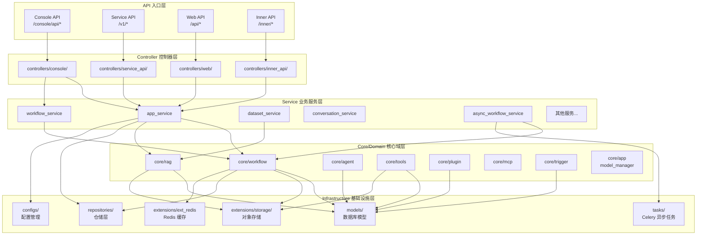
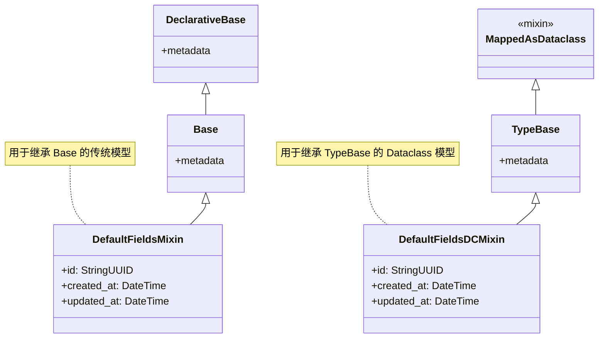
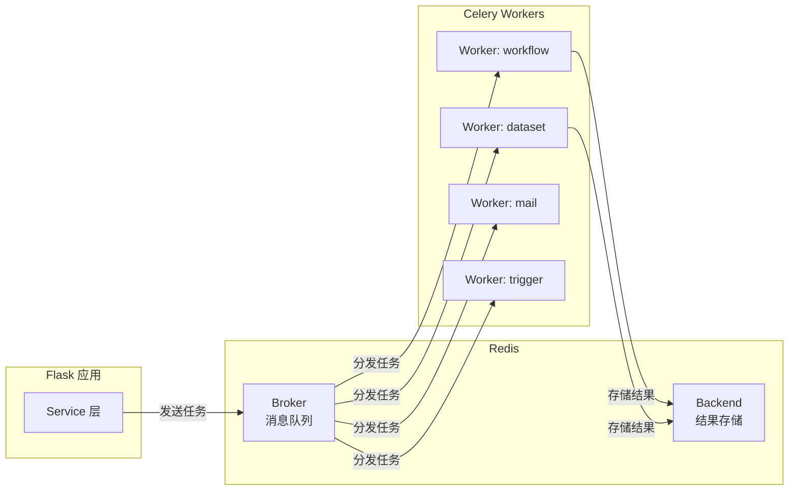
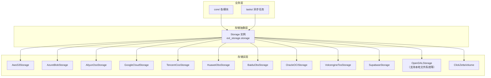

# Dify 后端 API 架构文档

## 1. 概述

Dify 后端 API 是一个基于 **Python Flask** 框架构建的应用程序，采用 **领域驱动设计（DDD）** 与 **整洁架构（Clean Architecture）** 原则组织代码。项目通过 `app_factory.py` 工厂模式创建 Flask 应用，使用 Celery + Redis 处理异步任务，SQLAlchemy 作为 ORM 层与数据库交互，并通过统一的存储抽象层支持多种对象存储后端。

核心架构遵循 **Controller → Service → Core/Domain** 的分层调用链路，确保职责分离与依赖方向的正确性。

---

## 2. DDD 分层架构图

---

## 3. 核心模块列表

| 目录 | 职责说明 |
|------|----------|
| `controllers/` | API 控制器层，负责请求解析、参数校验、调用服务层、返回序列化响应。不含业务逻辑 |
| `services/` | 业务服务层，协调仓储、提供者、后台任务，编排核心域逻辑。副作用显式化 |
| `core/` | 核心域层，封装工作流引擎、RAG 管道、Agent 策略、工具系统、插件机制、MCP 协议、触发器等核心业务逻辑 |
| `models/` | 数据库模型层，基于 SQLAlchemy MappedAsDataclass 定义 ORM 映射，所有模型继承 `TypeBase` 或 `Base` |
| `repositories/` | 仓储层，为高频访问的大表（如 workflow 执行记录）提供查询抽象，支持替代存储策略 |
| `configs/` | 配置管理，通过 `dify_config` 统一提供配置项，禁止直接读取环境变量 |
| `extensions/` | Flask 扩展初始化，包括数据库、存储、Redis、Celery、邮件、日志、OTel 等 |
| `tasks/` | Celery 异步任务定义，涵盖文档索引、工作流执行、邮件发送、触发器处理等后台任务 |
| `libs/` | 通用工具库，提供加密、认证、分页、时间处理、URL 工具等无业务依赖的基础设施代码 |

---

## 4. 控制器层详解

控制器层严格遵循 **"解析输入 → 调用服务 → 返回响应"** 模式，不包含任何业务逻辑。请求参数通过 Pydantic 模型校验，响应通过 DTO 序列化返回。

### 4.1 四种 API 类型

| API 类型 | URL 前缀 | 目录 | 目标用户 | 说明 |
|----------|----------|------|----------|------|
| **Console API** | `/console/api/*` | `controllers/console/` | 管理端用户 | 控制台操作，包括应用管理、数据集配置、工作区管理、模型提供商配置、计费等 |
| **Service API** | `/v1/*` | `controllers/service_api/` | 外部服务/开发者 | 外部服务调用，提供应用执行、数据集操作、工作区管理等 RESTful API，供第三方系统集成 |
| **Web API** | `/api/*` | `controllers/web/` | 终端用户 | 终端用户访问，包括对话、文件上传、工作流交互、认证登录等面向 C 端用户的接口 |
| **Inner API** | `/inner/*` | `controllers/inner_api/` | 内部服务 | 服务间内部调用，包括邮件发送、插件管理、工作区操作等微服务间通信接口 |

### 4.2 Console API 子模块

| 子模块 | 职责 |
|--------|------|
| `console/app/` | 应用创建、配置、发布管理 |
| `console/auth/` | 控制台认证与授权 |
| `console/datasets/` | 数据集与文档管理 |
| `console/workspace/` | 工作区与成员管理 |
| `console/billing/` | 计费与订阅管理 |
| `console/explore/` | 应用探索与市场 |
| `console/files/` | 文件上传与管理 |
| `console/extension.py` | API 扩展管理 |
| `console/setup.py` | 系统初始化设置 |

### 4.3 Service API 子模块

| 子模块 | 职责 |
|--------|------|
| `service_api/app/` | 应用执行 API（对话、补全、工作流） |
| `service_api/dataset/` | 数据集 API（知识库 CRUD、文档管理） |
| `service_api/workspace/` | 工作区 API |

### 4.4 Web API 子模块

| 子模块 | 职责 |
|--------|------|
| `web/completion.py` | 补全对话接口 |
| `web/conversation.py` | 会话管理 |
| `web/message.py` | 消息交互 |
| `web/workflow.py` | 工作流执行 |
| `web/audio.py` | 语音交互 |
| `web/files.py` | 文件上传 |
| `web/site.py` | 站点配置 |

---

## 5. 核心域层（core/）详解

`core/` 目录是 Dify 的核心业务域，封装了所有领域逻辑与算法实现。

| 子模块 | 职责说明 |
|--------|----------|
| `core/workflow/` | 工作流引擎核心，包括节点工厂、节点运行时、变量池初始化、人工输入适配、模板渲染、工作流入口等 |
| `core/rag/` | RAG（检索增强生成）管道，包括文档清洗、数据源处理、嵌入、索引处理、提取器、检索、重排序、分块等 |
| `core/agent/` | Agent 执行引擎，支持 CoT（Chain of Thought）和 Function Call 策略，含多种 Agent Runner 实现 |
| `core/tools/` | 工具系统，支持内置工具、自定义工具、MCP 工具、插件工具、工作流即工具等多种工具类型 |
| `core/plugin/` | 插件系统，包括插件发现、加载、端点注册、向后兼容调用等 |
| `core/mcp/` | MCP（Model Context Protocol）协议实现，包括客户端、服务端、认证、会话管理等 |
| `core/trigger/` | 触发器系统，支持 API 触发、Webhook 触发、定时触发等，含触发器管理器与调试功能 |
| `core/app/` | 应用核心，包括应用实体定义、文件访问控制、LLM 配额层、可观测性层等 |
| `core/helper/` | 核心辅助工具，包括 SSRF 代理、加密、HTTP 客户端池、模型提供商缓存等 |
| `core/model_manager.py` | 模型管理器，统一管理 LLM 模型实例的创建与调度 |
| `core/provider_manager.py` | 提供商管理器，管理模型提供商的配置与凭据 |
| `core/indexing_runner.py` | 索引运行器，驱动文档索引流程 |
| `core/prompt/` | 提示词模板与处理 |
| `core/moderation/` | 内容审核 |
| `core/memory/` | 记忆管理 |
| `core/ops/` | 运维可观测性 |
| `core/extension/` | 核心扩展点 |
| `core/external_data_tool/` | 外部数据工具 |

---

## 6. 数据库模型概览

所有模型继承自 `TypeBase`（基于 `MappedAsDataclass`）或 `Base`（传统声明式基类），通过 `DefaultFieldsMixin` / `DefaultFieldsDCMixin` 自动提供 `id`、`created_at`、`updated_at` 字段。主键默认使用 UUIDv7 生成。

| 模型文件 | 主要模型 | 职责说明 |
|----------|----------|----------|
| `models/account.py` | `Account`, `Tenant`, `TenantAccountJoin` 等 | 账户体系：用户账号、租户（工作区）、成员关系与角色（Owner/Admin/Editor/Normal/DatasetOperator） |
| `models/model.py` | `App`, `AppModelConfig`, `EndUser`, `Conversation`, `Message`, `UploadFile`, `ApiToken` 等 | 应用模型：应用定义与配置、终端用户、对话、消息、文件上传、API 令牌等 |
| `models/provider.py` | `Provider`, `ProviderModel`, `TenantDefaultModel` 等 | 模型提供商：LLM 提供商配置、模型凭据、租户默认模型设置 |
| `models/dataset.py` | `Dataset`, `Document`, `DocumentSegment` 等 | 数据集：知识库、文档、文档分段、处理规则、元数据等 |
| `models/workflow.py` | `Workflow`, `WorkflowRun`, `WorkflowNodeExecution`, `ConversationVariable` 等 | 工作流：工作流定义与版本、运行记录、节点执行记录、会话变量等 |
| `models/task.py` | `CeleryTask` | 异步任务：Celery 任务元数据与状态追踪 |
| `models/source.py` | `DataSourceOauthBinding` | 数据源：OAuth 绑定与数据源认证 |
| `models/tools.py` | `ToolOAuthSystemClient`, `ToolProvider`, `BuiltinToolProvider`, `ApiToolProvider` 等 | 工具：工具 OAuth 配置、各类工具提供商（内置/API/工作流/MCP） |
| `models/trigger.py` | `WorkflowTriggerLog`, `AppTrigger` 等 | 触发器：工作流触发日志、应用触发器配置与状态 |
| `models/comment.py` | `WorkflowComment` | 评论：工作流画布评论功能，支持坐标定位与解决状态 |
| `models/oauth.py` | `DatasourceOauthParamConfig`, `DatasourceProvider` 等 | OAuth：数据源 OAuth 参数配置、数据源提供商 |

### 模型基类继承关系

---

## 7. Celery 异步任务机制

Dify 使用 **Celery** 作为分布式任务队列框架，**Redis** 作为消息代理（Broker）与结果后端（Backend），实现异步工作流执行与后台任务处理。

### 7.1 架构概览

### 7.2 任务队列与路由

通过 `AsyncWorkflowService` 统一入口，根据订阅层级将任务路由到不同队列：

| 队列 | 用途 | 订阅层级 |
|------|------|----------|
| `sandbox` | 沙箱环境工作流执行 | 免费计划 |
| `professional` | 专业版工作流执行 | 专业版 |
| `team` | 团队版工作流执行 | 团队版 |

### 7.3 主要异步任务分类

| 任务类别 | 代表性任务 | 说明 |
|----------|------------|------|
| **工作流执行** | `async_workflow_tasks`, `workflow_execution_tasks`, `workflow_node_execution_tasks` | 异步工作流运行、节点执行 |
| **文档索引** | `document_indexing_task`, `add_document_to_index_task`, `create_segment_to_index_task` | 文档索引创建、分段索引 |
| **数据集清理** | `clean_dataset_task`, `clean_document_task`, `batch_clean_document_task` | 数据集与文档清理 |
| **邮件发送** | `mail_register_task`, `mail_invite_member_task`, `mail_reset_password_task` | 注册、邀请、重置密码等邮件 |
| **触发器处理** | `trigger_processing_tasks`, `trigger_subscription_refresh_tasks` | 异步触发器处理与订阅刷新 |
| **摘要索引** | `generate_summary_index_task`, `regenerate_summary_index_task` | 摘要索引生成与重新生成 |
| **人工输入** | `human_input_timeout_tasks` | 人工输入表单超时检查与恢复 |
| **工作流调度** | `workflow_schedule_tasks`, `workflow_draft_var_tasks` | 定时工作流调度与草稿变量处理 |

### 7.4 定时任务（Beat Schedule）

Celery Beat 调度器支持以下定时任务（通过配置开关控制）：

| 定时任务 | 默认周期 | 说明 |
|----------|----------|------|
| `clean_embedding_cache_task` | 每 N 天 02:00 | 清理嵌入缓存 |
| `clean_unused_datasets_task` | 每 N 天 03:00 | 清理未使用数据集 |
| `clean_messages` | 每 N 天 04:00 | 清理过期消息 |
| `mail_clean_document_notify_task` | 每周一 10:00 | 文档清理邮件通知 |
| `queue_monitor_task` | 每 30 分钟 | 数据集队列监控 |
| `human_input_form_timeout` | 可配置间隔 | 人工输入超时检查 |
| `check_upgradable_plugin_task` | 每 15 分钟 | 插件自动升级检查 |
| `clean_workflow_runlogs_precise` | 每天 02:00 | 工作流运行日志清理 |
| `workflow_schedule_task` | 可配置间隔 | 工作流定时调度轮询 |
| `trigger_provider_refresh` | 可配置间隔 | 触发器提供商刷新 |
| `batch_update_api_token_last_used` | 可配置间隔 | API Token 最后使用时间批量更新 |

### 7.5 Sentinel 支持

Celery 支持 Redis Sentinel 高可用部署，通过 `CELERY_USE_SENTINEL` 配置启用，并提供 SSL 连接选项（`BROKER_USE_SSL`）保障传输安全。

---

## 8. 存储架构

### 8.1 对象存储抽象层

Dify 通过 `extensions/ext_storage.py` 中的 `Storage` 类实现统一的存储抽象层，根据 `STORAGE_TYPE` 配置动态选择存储后端实现。所有存储操作通过 `extensions.ext_storage.storage` 全局实例访问。

### 8.2 支持的存储后端

| 存储类型 | 实现类 | 说明 |
|----------|--------|------|
| `s3` | `AwsS3Storage` | Amazon S3 及兼容存储 |
| `azure-blob` | `AzureBlobStorage` | Azure Blob Storage |
| `aliyun-oss` | `AliyunOssStorage` | 阿里云 OSS |
| `google-storage` | `GoogleCloudStorage` | Google Cloud Storage |
| `tencent-cos` | `TencentCosStorage` | 腾讯云 COS |
| `huawei-obs` | `HuaweiObsStorage` | 华为云 OBS |
| `baidu-obs` | `BaiduObsStorage` | 百度云 OBS |
| `oci-storage` | `OracleOCIStorage` | Oracle OCI Storage |
| `volcengine-tos` | `VolcengineTosStorage` | 火山引擎 TOS |
| `supabase` | `SupabaseStorage` | Supabase Storage |
| `opendal` | `OpenDALStorage` | Apache OpenDAL（支持多种后端） |
| `local` | `OpenDALStorage(scheme="fs")` | 本地文件系统（通过 OpenDAL 适配） |

### 8.3 SSRF 代理

所有出站 HTTP 请求通过 `core/helper/ssrf_proxy.py` 统一代理，防止服务端请求伪造（SSRF）攻击：

- **连接池管理**：基于 `httpx` 实现连接池，区分 SSL 验证/非验证两种池
- **重试机制**：可配置最大重试次数（`SSRF_DEFAULT_MAX_RETRIES`），指数退避策略
- **状态码重试**：对 429、500、502、503、504 状态码自动重试
- **连接限制**：通过 `SSRF_POOL_MAX_CONNECTIONS`、`SSRF_POOL_MAX_KEEPALIVE_CONNECTIONS` 控制连接池大小

---

## 9. 配置管理

配置通过 `configs/dify_config` 统一管理，**禁止直接读取环境变量**。核心配置模块包括：

| 模块 | 职责 |
|------|------|
| `configs/app_config.py` | 主配置文件，定义所有配置项及其默认值 |
| `configs/feature/` | 功能特性开关 |
| `configs/middleware/` | 中间件配置 |
| `configs/observability/` | 可观测性配置（日志、追踪、指标） |
| `configs/packaging/` | 打包与部署配置 |
| `configs/enterprise/` | 企业版特有配置 |
| `configs/deploy/` | 部署环境配置 |
| `configs/secret_key.py` | 密钥管理 |

---

## 10. 扩展初始化（extensions/）

Flask 扩展通过 `extensions/` 目录统一初始化，在应用工厂 `app_factory.py` 中按序加载：

| 扩展模块 | 职责 |
|----------|------|
| `ext_database.py` | SQLAlchemy 数据库初始化 |
| `ext_storage.py` | 对象存储抽象层初始化 |
| `ext_redis.py` | Redis 连接初始化 |
| `ext_celery.py` | Celery 任务队列初始化 |
| `ext_mail.py` | 邮件服务初始化 |
| `ext_logging.py` | 日志配置初始化 |
| `ext_sentry.py` | Sentry 错误监控 |
| `ext_otel.py` | OpenTelemetry 可观测性 |
| `ext_socketio.py` | Socket.IO 实时通信 |
| `ext_migrate.py` | 数据库迁移（Alembic） |
| `ext_blueprints.py` | Flask Blueprint 注册 |
| `ext_compress.py` | 响应压缩 |
| `ext_session_factory.py` | 会话工厂 |
| `ext_orjson.py` | ORJSON 序列化 |
| `ext_login.py` | Flask-Login 认证 |
| `ext_hosting_provider.py` | 托管提供商配置 |
| `ext_app_metrics.py` | 应用指标采集 |
| `ext_enterprise_telemetry.py` | 企业版遥测 |

---

## 11. 仓储层（repositories/）

仓储层为高频访问的大表提供查询抽象，仅在对性能有特殊要求或需要替代存储策略时引入：

| 仓储 | 职责 |
|------|------|
| `api_workflow_node_execution_repository.py` | 工作流节点执行记录查询接口 |
| `api_workflow_run_repository.py` | 工作流运行记录查询接口 |
| `execution_extra_content_repository.py` | 执行额外内容查询接口 |
| `workflow_trigger_log_repository.py` | 工作流触发日志查询接口 |
| `workflow_collaboration_repository.py` | 工作流协作查询接口 |
| `factory.py` | 仓储工厂，统一创建仓储实例 |

仓储接口与 SQLAlchemy 实现分离，支持未来替换为其他存储后端。

---

## 12. 通用工具库（libs/）

`libs/` 提供无业务依赖的基础设施代码，可被任意层引用：

| 工具模块 | 职责 |
|----------|------|
| `encryption.py` | 加密与解密工具 |
| `login.py` | 登录认证工具 |
| `password.py` | 密码哈希与验证 |
| `oauth.py` | OAuth 认证工具 |
| `token.py` | Token 生成与验证 |
| `rsa.py` | RSA 加密工具 |
| `helper.py` | 通用辅助函数 |
| `datetime_utils.py` | 日期时间工具 |
| `uuid_utils.py` | UUID 生成工具（UUIDv7） |
| `url_utils.py` | URL 处理工具 |
| `file_utils.py` | 文件操作工具 |
| `validators.py` | 通用校验器 |
| `infinite_scroll_pagination.py` | 无限滚动分页 |
| `archive_storage.py` | 归档存储工具 |
| `broadcast_channel/` | 广播频道 |
| `smtp.py` / `sendgrid.py` | 邮件发送 |
| `email_i18n.py` | 邮件国际化 |
| `exception.py` | 通用异常定义 |

---

## 13. 关键架构约束

1. **分层调用方向**：Controller → Service → Core/Domain，禁止反向依赖
2. **租户隔离**：`tenant_id` 必须贯穿所有层，所有共享资源的查询必须包含租户范围限定
3. **配置统一**：通过 `configs.dify_config` 访问配置，禁止直接读取环境变量
4. **存储访问**：通过 `extensions.ext_storage.storage` 访问对象存储，禁止直接操作存储后端
5. **出站请求**：通过 `core.helper.ssrf_proxy` 发起 HTTP 请求，防止 SSRF 攻击
6. **异步任务**：通过 `services/async_workflow_service` 提交异步工作流，任务实现放在 `tasks/` 目录
7. **异常处理**：在 Service/Core 层抛出领域异常，在 Controller 层转换为 HTTP 响应
8. **日志规范**：使用 `logging.getLogger(__name__)` 创建模块级 logger，禁止使用 `print`
9. **模型继承**：新模型继承 `TypeBase`（MappedAsDataclass），使用 `DefaultFieldsDCMixin` 获取标准字段
10. **文件大小**：单个文件不超过 ~800 行，超出时拆分
