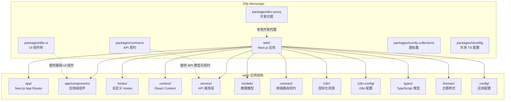
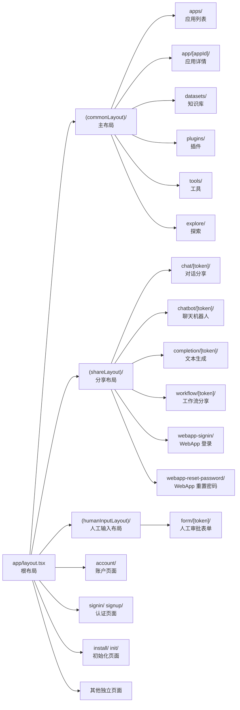
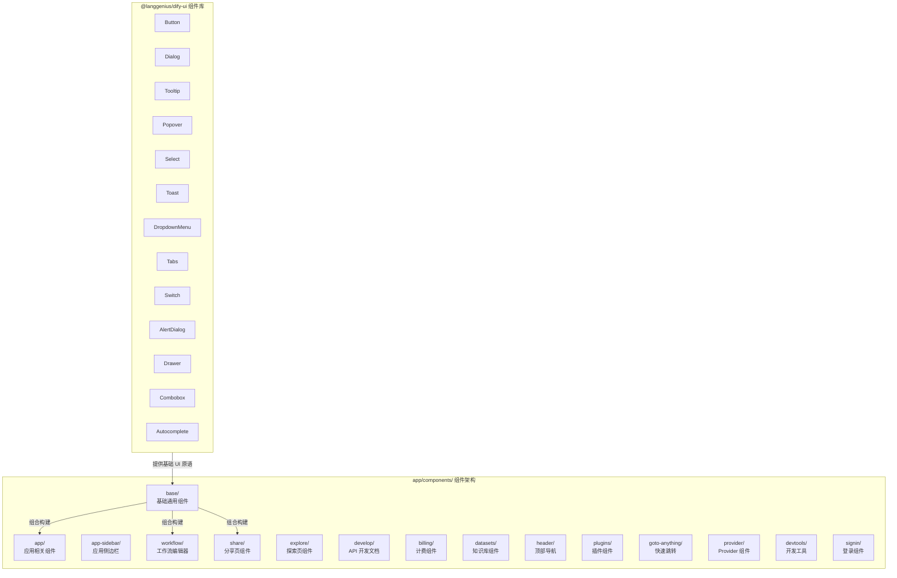
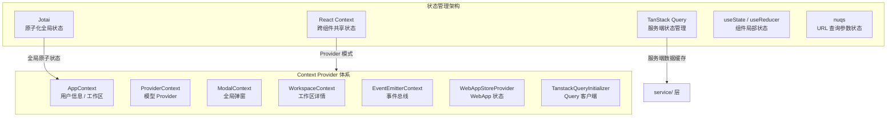
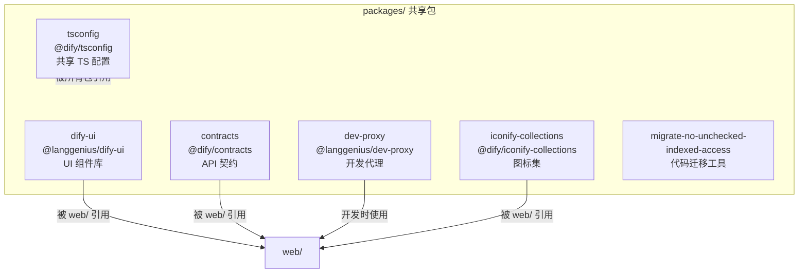

# Dify 前端 Web 架构文档

## 1. 应用结构图

Dify 前端基于 **Next.js App Router** 构建，采用 TypeScript + React 技术栈，整体架构如下所示：



### 技术栈概览

| 类别 | 技术选型 |
|------|---------|
| 框架 | Next.js (App Router) |
| 语言 | TypeScript (strict mode) |
| UI 原语 | @base-ui/react + @langgenius/dify-ui |
| 样式 | Tailwind CSS v4 + CSS Modules |
| 状态管理 | Jotai + React Context + TanStack Query (SWR 模式) |
| 国际化 | i18next + next-intl (服务端) |
| 路由 | Next.js App Router (文件系统路由) |
| 构建工具 | Next.js 内置 + Vite (packages) |
| 包管理 | pnpm (workspace monorepo) |
| 测试 | Vitest + React Testing Library |

---

## 2. 路由体系

Dify 使用 Next.js App Router 的文件系统路由，通过路由组 (Route Groups) 组织不同布局的页面。路由组使用括号命名约定 `(groupName)`，不影响 URL 路径。



### 2.1 `(commonLayout)` — 主布局

主布局用于已登录用户的控制台界面，提供统一的 Header 导航、侧边栏和权限守卫。

**布局层次结构：**

```
(commonLayout)/
├── layout.tsx              # 主布局：Header + AppContext + EventEmitter + Modal + Provider
├── role-route-guard.tsx    # 角色路由守卫
├── apps/
│   └── page.tsx            # 应用列表页
├── app/
│   └── (appDetailLayout)/
│       ├── layout.tsx      # 应用详情布局
│       └── [appId]/
│           ├── overview/   # 应用概览
│           ├── develop/    # API 访问
│           ├── workflow/   # 工作流编排
│           └── configuration/ # 应用配置
├── datasets/
│   ├── page.tsx            # 知识库列表
│   ├── create/             # 创建知识库
│   ├── connect/            # 连接数据源
│   └── (datasetDetailLayout)/[datasetId]/
│       ├── documents/      # 文档管理
│       ├── hitTesting/     # 命中测试
│       ├── settings/       # 知识库设置
│       └── pipeline/       # Pipeline
├── plugins/
│   └── page.tsx            # 插件市场
├── tools/
│   └── page.tsx            # 工具管理
└── explore/
    └── apps/
        └── page.tsx        # 探索应用
```

**Provider 嵌套链（自外向内）：**

| 层级 | Provider | 职责 |
|------|----------|------|
| 1 | `AppInitializer` | 应用初始化（系统特性、用户信息） |
| 2 | `AppContextProvider` | 全局应用上下文（用户、工作区） |
| 3 | `EventEmitterContextProvider` | 全局事件总线 |
| 4 | `ProviderContextProvider` | 模型 Provider 上下文 |
| 5 | `ModalContextProvider` | 全局弹窗管理 |
| 6 | `HeaderWrapper` + `Header` | 顶部导航栏 |
| 7 | `RoleRouteGuard` | 角色权限路由守卫 |

### 2.2 `(shareLayout)` — 分享布局

分享布局用于无需登录即可访问的 WebApp 分享页面，布局简洁，仅包含 `WebAppStoreProvider` 和 `Splash` 加载效果。

```
(shareLayout)/
├── layout.tsx                # WebAppStoreProvider + Splash
├── chat/[token]/            # 对话型应用分享
├── chatbot/[token]/         # 聊天机器人分享
├── completion/[token]/      # 文本生成应用分享
├── workflow/[token]/        # 工作流应用分享
├── webapp-signin/           # WebApp 端登录
└── webapp-reset-password/   # WebApp 端密码重置
```

### 2.3 `account` — 账户页面

```
account/
└── (commonLayout)/
    ├── layout.tsx           # 账户布局
    ├── page.tsx             # 账户设置主页
    ├── avatar.tsx           # 头像管理
    ├── header.tsx           # 页面头部
    └── delete-account/      # 注销账户流程
        ├── index.tsx
        ├── state.tsx
        └── components/      # 邮箱验证、反馈等子组件
```

### 2.4 `signin` / `signup` — 认证页面

```
signin/
├── layout.tsx               # 认证布局
├── page.tsx                 # 登录主页
├── normal-form.tsx          # 账号密码表单
├── _header.tsx              # 页面头部
├── _locale-menu.tsx         # 语言切换菜单
├── one-more-step.tsx        # 额外验证步骤
├── split.tsx                # 分屏布局
├── components/
│   ├── social-auth.tsx      # 社交登录（GitHub/Google）
│   ├── mail-and-code-auth.tsx   # 邮箱验证码登录
│   ├── mail-and-password-auth.tsx # 邮箱密码登录
│   └── sso-auth.tsx         # SSO 登录
├── check-code/              # 验证码校验
└── invite-settings/         # 邀请设置

signup/
├── layout.tsx
├── page.tsx                 # 注册主页
├── components/
│   └── input-mail.tsx       # 邮箱输入
├── check-code/              # 验证码校验
└── set-password/            # 设置密码
```

### 2.5 `install` / `init` — 初始化页面

```
install/
├── page.tsx                 # 安装初始化页面
└── installForm.tsx          # 初始化表单

init/
├── page.tsx                 # 系统初始化页面
└── InitPasswordPopup.tsx    # 初始密码弹窗
```

---

## 3. 组件架构



### 3.1 `app/components/` — 应用级组件

应用级组件按功能域组织，每个子目录对应一个业务领域：

| 目录 | 职责 | 关键组件 |
|------|------|---------|
| `base/` | 基础通用组件 | Markdown、Form、ImageUploader、EmojiPicker、Pagination 等 |
| `app/` | 应用管理 | CreateAppModal、CreateAppDialogShell |
| `app-sidebar/` | 应用侧边栏 | Basic、AppInfo、DatasetInfo、NavLink |
| `workflow/` | 工作流编辑器 | Header、Panel、Nodes、Run、Operator、BlockSelector、HelpLine、Collaboration |
| `share/` | 分享页组件 | TextGeneration、RunBatch |
| `explore/` | 探索页 | Banner、AppList、InstalledApp、TryApp、CreateAppModal |
| `develop/` | API 开发文档 | Doc、SecretKey、ApiServer、Code |
| `billing/` | 计费相关 | HeaderBillingBtn、VectorSpaceFull、TriggerEventsLimitModal、PartnerStack |
| `datasets/` | 知识库组件 | RenameModal |
| `header/` | 顶部导航栏 | 全局导航组件 |
| `plugins/` | 插件管理 | ReadmePanel |
| `goto-anything/` | 快速跳转 | CommandSelector、SearchInput、ResultList |
| `provider/` | Provider 组件 | I18nServerProvider |
| `devtools/` | 开发工具 | TanstackLoader、AgentationLoader、ReactScanLoader |
| `signin/` | 登录组件 | Countdown |

### 3.2 `app/components/base/` — 基础组件详解

`base/` 目录包含大量可复用的基础组件，是整个前端组件体系的基石：

| 组件 | 说明 |
|------|------|
| `markdown/` | Markdown 渲染器 |
| `markdown-blocks/` | Markdown 块级元素（代码块、图片、音频、视频、思考块等） |
| `form/` | 动态表单（文本、数字、选择、复选、变量选择器等） |
| `image-uploader/` | 图片上传（聊天、文本生成、图片预览） |
| `audio-gallery/` | 音频播放器 |
| `video-gallery/` | 视频播放器 |
| `image-gallery/` | 图片画廊 |
| `emoji-picker/` | Emoji 选择器 |
| `date-and-time-picker/` | 日期时间选择器 |
| `tag-input/` | 标签输入 |
| `pagination/` | 分页 |
| `search-input/` | 搜索输入框 |
| `prompt-editor/` | Prompt 编辑器 |
| `auto-height-textarea/` | 自适应高度文本域 |
| `action-button/` | 操作按钮 |
| `badge/` | 徽章 |
| `chip/` | 芯片标签 |
| `spinner/` | 加载动画 |
| `tab-slider/` | 滑动标签页 |
| `radio-card/` | 单选卡片 |
| `mermaid/` | Mermaid 图表渲染 |
| `notion-page-selector/` | Notion 页面选择器 |
| `qrcode/` | 二维码 |
| `app-icon/` | 应用图标 |
| `copy-icon/` / `copy-feedback/` | 复制功能 |
| `loading/` | 加载状态 |
| `list-empty/` | 空列表 |
| `error-boundary/` | 错误边界 |
| `upgrade-modal/` | 升级弹窗 |
| `message-log-modal/` | 消息日志弹窗 |
| `agent-log-modal/` | Agent 日志弹窗 |

### 3.3 `service/` — API 服务层

API 服务层位于 `web/service/`，负责与后端 API 的通信，采用 TanStack Query (React Query) 进行数据获取和缓存管理：

| 文件 | 职责 |
|------|------|
| `base.ts` | 基础请求配置 |
| `fetch.ts` | 请求封装（ky） |
| `client.ts` | API 客户端 |
| `apps.ts` / `use-apps.ts` | 应用 API |
| `datasets.ts` | 知识库 API |
| `workflow.ts` / `use-workflow.ts` | 工作流 API |
| `share.ts` / `use-share.ts` | 分享 API |
| `explore.ts` / `use-explore.ts` | 探索 API |
| `plugins.ts` / `use-plugins.ts` | 插件 API |
| `tools.ts` / `use-tools.ts` | 工具 API |
| `billing.ts` / `use-billing.ts` | 计费 API |
| `annotation.ts` | 标注 API |
| `log.ts` | 日志 API |
| `sso.ts` | SSO API |
| `oauth.ts` / `use-oauth.ts` | OAuth API |
| `models.ts` / `use-models.ts` | 模型 API |
| `refresh-token.ts` | Token 刷新 |
| `webapp-auth.ts` | WebApp 认证 |
| `system-features.ts` | 系统特性 |
| `knowledge/` | 知识库子模块（dataset, document, segment, metadata, hit-testing, import） |

**命名约定：**
- 非 Hook 文件（如 `apps.ts`）：导出普通 API 调用函数
- Hook 文件（如 `use-apps.ts`）：导出基于 TanStack Query 的自定义 Hook

### 3.4 `models/` — 数据模型

数据模型定义了前端与后端交互的 TypeScript 类型：

| 文件 | 职责 |
|------|------|
| `common.ts` | 通用类型（用户、工作区、版本信息等） |
| `app.ts` | 应用相关类型 |
| `datasets.ts` | 知识库类型 |
| `share.ts` | 分享相关类型 |
| `explore.ts` | 探索相关类型 |
| `debug.ts` | 调试相关类型 |
| `log.ts` | 日志类型 |
| `pipeline.ts` | Pipeline 类型 |
| `try-app.ts` | 试用应用类型 |
| `access-control.ts` | 访问控制类型 |

### 3.5 `contract/` — 前端路由契约

`contract/` 目录定义了前端页面与 API 之间的路由契约，使用 `@orpc/contract` + `zod` 进行类型安全的 API 契约定义：

| 文件 | 职责 |
|------|------|
| `router.ts` | 路由注册 |
| `base.ts` | 基础契约 |
| `console/apps.ts` | 应用管理契约 |
| `console/workflow.ts` | 工作流契约 |
| `console/billing.ts` | 计费契约 |
| `console/plugins.ts` | 插件契约 |
| `console/account.ts` | 账户契约 |
| `console/model-providers.ts` | 模型提供商契约 |
| `console/explore.ts` | 探索契约 |
| `console/notification.ts` | 通知契约 |
| `console/system.ts` | 系统契约 |
| `console/trigger.ts` | 触发器契约 |
| `console/try-app.ts` | 试用应用契约 |
| `console/workflow-comment.ts` | 工作流评论契约 |
| `console/tags.ts` | 标签契约 |
| `marketplace.ts` | 市场契约 |

---

## 4. 状态管理方案

Dify 前端采用多层状态管理策略，根据状态的性质和作用域选择最合适的方案：



### 4.1 Jotai — 原子化全局状态

Jotai 作为根级 Provider 嵌套在 `app/layout.tsx` 中，用于管理需要跨页面共享的原子状态。其优势在于：
- 细粒度订阅，避免不必要的重渲染
- 原子化组合，状态可派生和组合
- 与 React Suspense 兼容

### 4.2 React Context — 跨组件共享状态

| Context | 文件 | 职责 |
|---------|------|------|
| `AppContext` | `context/app-context.ts` | 用户档案、工作区信息、版本信息、角色权限 |
| `ProviderContext` | `context/provider-context.ts` | 模型 Provider 列表 |
| `ModalContext` | `context/modal-context.ts` | 全局弹窗管理 |
| `WorkspaceContext` | `context/workspace-context.ts` | 当前工作区详情 |
| `EventEmitterContext` | `context/event-emitter.ts` | 全局事件总线 |
| `WebAppStoreProvider` | `context/web-app-context.tsx` | WebApp 分享页状态 |
| `MittContext` | `context/mitt-context.ts` | 事件发射器 |
| `DatasetDetailContext` | `context/dataset-detail.ts` | 知识库详情上下文 |
| `DebugConfigurationContext` | `context/debug-configuration.ts` | 调试配置上下文 |
| `AccessControlStore` | `context/access-control-store.ts` | 访问控制状态 |
| `AppListContext` | `context/app-list-context.ts` | 应用列表上下文 |

**AppContext 使用模式：** 采用 `use-context-selector` 库实现选择式消费，避免 Context 值变化导致所有消费者重渲染：

```typescript
// 选择式消费 — 仅当 userProfile 变化时重渲染
const userProfile = useSelector(state => state.userProfile)

// 全量消费 — 任何值变化都重渲染
const { userProfile, currentWorkspace } = useAppContext()
```

### 4.3 TanStack Query — 服务端状态管理

TanStack Query（React Query）用于管理所有来自后端 API 的服务端状态，提供：
- 自动缓存和失效
- 后台数据刷新
- 乐观更新
- 分页和无限滚动
- 请求去重

在 `service/` 目录中，以 `use-` 前缀命名的文件均为 TanStack Query Hook。

### 4.4 nuqs — URL 查询参数状态

使用 `nuqs` 库将 URL 查询参数与 React 状态同步，支持：
- 状态持久化到 URL
- 浏览器前进/后退
- 分享链接保持状态
- SSR 兼容

### 4.5 根布局 Provider 嵌套顺序

在 `app/layout.tsx` 中，Provider 按以下顺序嵌套：

```
<html>
  └── <div className="isolate">          ← z-index 隔离层
       └── JotaiProvider                  ← 原子状态
           └── ThemeProvider              ← 主题（next-themes）
               └── NuqsAdapter            ← URL 参数适配器
                   └── TanstackQueryInitializer ← 服务端状态
                       └── I18nServerProvider   ← 国际化
                           └── ToastHost        ← 全局提示
                               └── TooltipProvider ← 全局 Tooltip
                                   └── {children}
```

---

## 5. i18n 国际化方案

Dify 前端支持 22 种语言，采用 i18next 作为国际化核心框架，结合 Next.js App Router 实现服务端和客户端的国际化。

### 5.1 支持的语言

| 语言代码 | 语言名称 |
|---------|---------|
| `en-US` | English (United States) |
| `zh-Hans` | 简体中文 |
| `zh-Hant` | 繁體中文 |
| `pt-BR` | Português (Brasil) |
| `es-ES` | Español (España) |
| `fr-FR` | Français (France) |
| `de-DE` | Deutsch (Deutschland) |
| `ja-JP` | 日本語 (日本) |
| `ko-KR` | 한국어 (대한민국) |
| `ru-RU` | Русский (Россия) |
| `it-IT` | Italiano (Italia) |
| `th-TH` | ไทย (ประเทศไทย) |
| `uk-UA` | Українська (Україна) |
| `vi-VN` | Tiếng Việt (Việt Nam) |
| `ro-RO` | Română (România) |
| `pl-PL` | Polski (Polish) |
| `hi-IN` | Hindi (India) |
| `tr-TR` | Türkçe |
| `fa-IR` | Farsi (Iran) |
| `sl-SI` | Slovensko (Slovenija) |
| `id-ID` | Bahasa Indonesia |
| `nl-NL` | Nederlands (Nederland) |
| `ar-TN` | العربية (تونس) |

### 5.2 目录结构

```mermaid
graph LR
    subgraph I18nConfig["i18n-config/ 配置层"]
        Index["index.ts<br/>i18n 实例与工具函数"]
        Languages["languages.ts<br/>语言列表定义"]
        Language["language.ts<br/>语言类型"]
        Settings["settings.ts<br/>i18n 设置"]
        Resources["resources.ts<br/>资源加载"]
        Server["server.ts<br/>服务端语言检测"]
        Client["client.ts<br/>客户端语言切换"]
        LibServer["lib.server.ts<br/>服务端入口"]
        LibClient["lib.client.ts<br/>客户端入口"]
    end

    subgraph I18nResources["i18n/ 资源层"]
        EnUS["en-US/<br/>英语（源语言）"]
        ZhHans["zh-Hans/<br/>简体中文"]
        ZhHant["zh-Hant/<br/>繁體中文"]
        JaJP["ja-JP/<br/>日语"]
        KoKR["ko-KR/<br/>韩语"]
        OtherLangs["其他语言..."]
    end

    I18nConfig --> I18nResources
```



### 5.3 命名空间划分

每种语言下的翻译文件按业务域划分为独立的 JSON 文件（命名空间）：

| 命名空间 | 文件 | 职责 |
|---------|------|------|
| `common` | `common.json` | 通用文本 |
| `layout` | `layout.json` | 布局相关 |
| `app` | `app.json` | 应用管理 |
| `app-overview` | `app-overview.json` | 应用概览 |
| `app-debug` | `app-debug.json` | 应用调试 |
| `app-log` | `app-log.json` | 应用日志 |
| `app-api` | `app-api.json` | API 访问 |
| `app-annotation` | `app-annotation.json` | 应用标注 |
| `workflow` | `workflow.json` | 工作流 |
| `dataset` | `dataset.json` | 知识库 |
| `dataset-documents` | `dataset-documents.json` | 知识库文档 |
| `dataset-settings` | `dataset-settings.json` | 知识库设置 |
| `dataset-creation` | `dataset-creation.json` | 知识库创建 |
| `dataset-hit-testing` | `dataset-hit-testing.json` | 命中测试 |
| `dataset-pipeline` | `dataset-pipeline.json` | 知识库 Pipeline |
| `explore` | `explore.json` | 探索 |
| `plugin` | `plugin.json` | 插件 |
| `plugin-tags` | `plugin-tags.json` | 插件标签 |
| `plugin-trigger` | `plugin-trigger.json` | 插件触发器 |
| `tools` | `tools.json` | 工具 |
| `share` | `share.json` | 分享 |
| `billing` | `billing.json` | 计费 |
| `login` | `login.json` | 登录 |
| `register` | `register.json` | 注册 |
| `run-log` | `run-log.json` | 运行日志 |
| `custom` | `custom.json` | 自定义 |
| `time` | `time.json` | 时间相关 |
| `oauth` | `oauth.json` | OAuth |
| `pipeline` | `pipeline.json` | Pipeline |
| `education` | `education.json` | 教育版 |

### 5.4 国际化工作流

1. **源语言**：`en-US` 为源语言，所有新增文本必须先在 `web/i18n/en-US/` 中添加
2. **使用方式**：组件中通过 `useTranslation` Hook 获取翻译函数
3. **服务端渲染**：通过 `I18nServerProvider` 在服务端提供语言上下文
4. **语言检测**：服务端通过 `getLocaleOnServer()` 从 Cookie 或 Accept-Language 头检测语言
5. **语言切换**：客户端通过 `setLocaleOnClient()` 切换语言，写入 Cookie 并刷新页面
6. **多语言对象**：`renderI18nObject()` 用于处理后端返回的多语言字段（如 `{en_US: "...", zh_Hans: "..."}`）

---

## 6. 共享包

Dify 采用 pnpm workspace 管理 Monorepo 中的共享包，所有包位于 `packages/` 目录下：



### 6.1 dify-ui — UI 组件库

**包名：** `@langgenius/dify-ui`

Dify 的官方 UI 组件库，基于 `@base-ui/react` 无头组件 + `cva` (class-variance-authority) + `cn()` (clsx + tailwind-merge) 构建，提供设计系统的基础原语。

**核心原则：**
- 不依赖 `next`、`i18next`、`ky`、`jotai`、`zustand` 等应用层库
- 组件内部跨组件引用使用相对路径，外部消费使用子路径导出
- 每个组件一个文件夹：`src/<name>/index.tsx`，可选 `index.stories.tsx` 和 `__tests__/index.spec.tsx`
- 使用 CSS-first Tailwind 样式，不使用 CSS-in-JS

**组件清单：**

| 组件 | 导出路径 | 说明 |
|------|---------|------|
| AlertDialog | `@langgenius/dify-ui/alert-dialog` | 警告弹窗 |
| Autocomplete | `@langgenius/dify-ui/autocomplete` | 自动补全 |
| Avatar | `@langgenius/dify-ui/avatar` | 头像 |
| Button | `@langgenius/dify-ui/button` | 按钮 |
| Checkbox | `@langgenius/dify-ui/checkbox` | 复选框 |
| CheckboxGroup | `@langgenius/dify-ui/checkbox-group` | 复选框组 |
| Combobox | `@langgenius/dify-ui/combobox` | 组合选择器 |
| ContextMenu | `@langgenius/dify-ui/context-menu` | 右键菜单 |
| Dialog | `@langgenius/dify-ui/dialog` | 对话框 |
| Drawer | `@langgenius/dify-ui/drawer` | 抽屉 |
| DropdownMenu | `@langgenius/dify-ui/dropdown-menu` | 下拉菜单 |
| Meter | `@langgenius/dify-ui/meter` | 进度条 |
| NumberField | `@langgenius/dify-ui/number-field` | 数字输入 |
| Popover | `@langgenius/dify-ui/popover` | 弹出层 |
| PreviewCard | `@langgenius/dify-ui/preview-card` | 预览卡片 |
| ScrollArea | `@langgenius/dify-ui/scroll-area` | 滚动区域 |
| Select | `@langgenius/dify-ui/select` | 选择器 |
| Slider | `@langgenius/dify-ui/slider` | 滑块 |
| Switch | `@langgenius/dify-ui/switch` | 开关 |
| Tabs | `@langgenius/dify-ui/tabs` | 标签页 |
| ToggleGroup | `@langgenius/dify-ui/toggle-group` | 切换组 |
| Toast | `@langgenius/dify-ui/toast` | 全局提示 |
| Tooltip | `@langgenius/dify-ui/tooltip` | 提示框 |

**Overlay 层级规范：**

| 层级 | z-index | 用途 |
|------|---------|------|
| 基础弹出层 | `z-50` | Popover、DropdownMenu、Dialog、Tooltip 等 |
| Toast 层 | `z-60` | 全局提示，始终在最上层 |
| 根隔离层 | `isolation: isolate` | 根 `<div>` 上的 CSS 隔离，防止 z-index 泄漏 |

**Overlay 原语选择规则：**

| 原语 | 触发方式 | 触发目的 | 内容 | 无障碍 |
|------|---------|---------|------|--------|
| `Tooltip` | hover/focus | 触发元素有自身操作 | 短文本标签 | ❌ 仅标签 |
| `PreviewCard` | hover/focus | 触发元素有主要点击目标 | 补充预览 | ❌ 通过点击目标 |
| `Popover` | click/tap (+hover) | **打开弹窗本身** | 任意内容 | ✅ |

### 6.2 contracts — API 契约

**包名：** `@dify/contracts`

基于 OpenAPI 规范自动生成的类型安全 API 契约包，确保前后端接口类型一致。

**生成流程：**

```
后端 Swagger 规范 → @hey-api/openapi-ts → generated/api/ 类型文件
```

**目录结构：**

```
contracts/
├── package.json
├── openapi-ts.api.config.ts        # API 契约生成配置
├── openapi-ts.enterprise.config.ts  # 企业版契约生成配置
├── generated/
│   ├── api/
│   │   ├── console/                 # 控制台 API
│   │   │   ├── apps/                # 应用管理
│   │   │   ├── account/             # 账户
│   │   │   ├── billing/             # 计费
│   │   │   ├── datasets/            # 知识库
│   │   │   ├── workflow/            # 工作流
│   │   │   ├── plugins/             # 插件
│   │   │   ├── explore/             # 探索
│   │   │   └── ...                  # 其他模块
│   │   ├── web/                     # Web API
│   │   └── service/                 # 服务 API
│   └── enterprise/                  # 企业版 API
└── scripts/
    └── generate-api-readiness-readme.mjs
```

**每个模块生成三个文件：**
- `types.gen.ts` — TypeScript 类型定义
- `zod.gen.ts` — Zod 校验 Schema
- `orpc.gen.ts` — oRPC 契约定义

**依赖：** `@orpc/contract` + `zod`

### 6.3 dev-proxy — 开发代理

**包名：** `@langgenius/dev-proxy`

本地开发代理服务器，基于 Hono + `@hono/node-server` 构建，用于将前端开发请求代理到后端 API。

**功能：**
- 代理 API 请求到后端服务
- Cookie 转发和处理
- 支持自定义配置文件 (`dev-proxy.config.ts`)
- 从 `.env.local` 读取环境变量

**使用方式：**

```bash
pnpm dev:proxy
# 等价于: dev-proxy --config ./dev-proxy.config.ts --env-file ./.env.local
```

**目录结构：**

```
dev-proxy/
├── package.json
├── bin/dev-proxy.js       # CLI 入口
└── src/
    ├── cli.ts             # CLI 命令定义
    ├── config.ts          # 配置解析
    ├── cookies.ts         # Cookie 处理
    ├── server.ts          # 代理服务器
    ├── index.ts           # 主入口
    └── types.ts           # 类型定义
```

### 6.4 其他共享包

| 包名 | 包标识 | 说明 |
|------|--------|------|
| `iconify-collections` | `@dify/iconify-collections` | 自定义 Iconify 图标集合，包含工作流节点图标、LLM 提供商图标、功能图标等 |
| `tsconfig` | `@dify/tsconfig` | 共享 TypeScript 配置，提供 `base.json`、`react.json`、`nextjs.json`、`node.json` 等预设 |
| `migrate-no-unchecked-indexed-access` | — | 代码迁移工具，自动为索引访问添加类型安全检查 |
