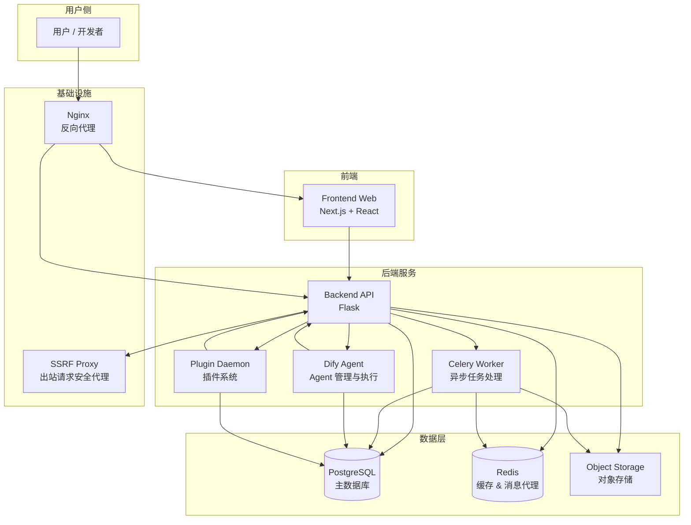
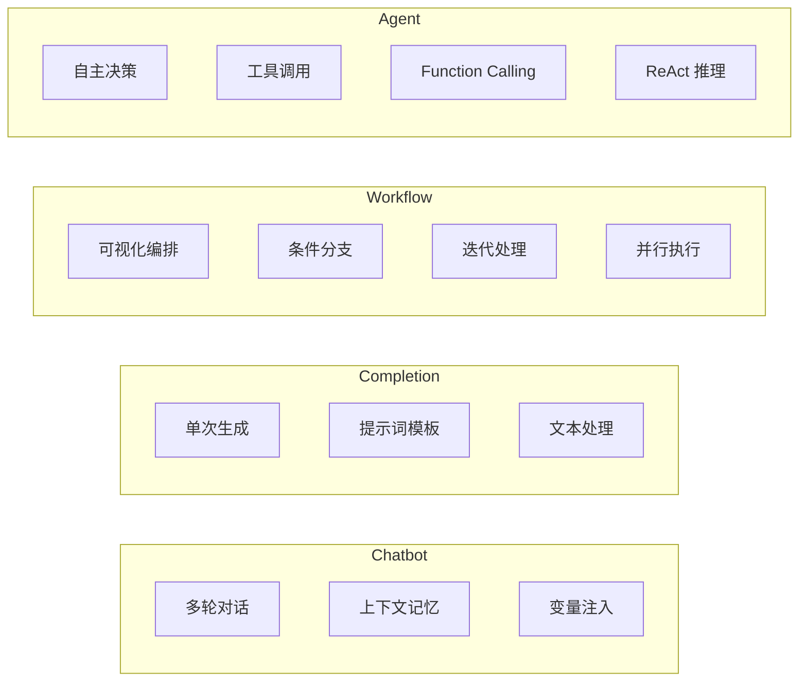

# Dify 项目总览与架构概览

## 1. 项目简介

Dify 是一个开源的 LLM（大语言模型）应用开发平台，提供直观的可视化界面，将 Agentic AI 工作流、RAG 管道、Agent 能力与模型管理整合于一体。借助 Dify，开发者可以快速完成从原型设计到生产部署的全流程，显著降低 LLM 应用的开发门槛。

核心能力包括：

- **可视化工作流**：在画布上构建和测试 AI 工作流
- **全面的模型支持**：无缝集成数百种商业/开源 LLM（GPT、Mistral、Llama3 等）
- **提示词 IDE**：直观的提示词编写与模型性能对比界面
- **RAG 管道**：从文档摄取到检索的全链路 RAG 能力，支持 PDF、PPT 等常见格式
- **Agent 能力**：基于 LLM Function Calling 或 ReAct 定义 Agent，提供 50+ 内置工具
- **LLMOps**：监控与分析应用日志与性能，持续优化提示词、数据集和模型
- **Backend-as-a-Service**：所有功能均提供 API，可轻松集成到业务逻辑中

---

## 2. 技术栈

### 2.1 后端

| 技术 | 说明 |
|------|------|
| Python | 主要编程语言 |
| Flask | Web 框架，提供 RESTful API |
| SQLAlchemy | ORM 框架，数据库访问与模型定义 |
| Celery | 分布式任务队列，处理异步工作流 |
| Redis | 消息代理（Celery Broker）与缓存 |
| PostgreSQL | 主数据库 |
| Pydantic v2 | 数据校验与 DTO 定义 |
| Gunicorn | WSGI HTTP 服务器 |
| Ruff | 代码格式化与 Lint 工具 |

### 2.2 前端

| 技术 | 说明 |
|------|------|
| Next.js | React 全栈框架 |
| TypeScript | 类型安全的 JavaScript 超集 |
| React | UI 组件库 |
| Tailwind CSS | 原子化 CSS 框架 |
| pnpm | 包管理器与 Monorepo 管理 |
| Vitest | 单元测试框架 |
| ESLint | 代码质量检查 |

### 2.3 部署与基础设施

| 技术 | 说明 |
|------|------|
| Docker | 容器化运行环境 |
| Docker Compose | 多容器编排与部署 |
| Nginx | 反向代理与负载均衡 |
| SSRF Proxy | 出站 HTTP 请求安全代理 |

### 2.4 测试与质量保障

| 技术 | 说明 |
|------|------|
| pytest | 后端单元/集成测试 |
| Vitest + RTL | 前端组件测试 |
| Cucumber + Playwright | 端到端（E2E）测试 |
| basedpyright | 后端类型检查 |
| Ruff | 后端格式化与 Lint |

---

## 3. 代码库目录结构

```
dify/
├── api/                  # 后端 Python Flask 应用（DDD 架构）
│   ├── controllers/      #   控制器层：请求解析与响应序列化
│   ├── services/         #   服务层：业务逻辑协调
│   ├── core/             #   核心领域层：领域模型与业务规则
│   ├── models/           #   数据模型层：SQLAlchemy ORM 模型
│   ├── migrations/       #   数据库迁移脚本
│   ├── configs/          #   配置管理
│   ├── extensions/       #   Flask 扩展（数据库、存储等）
│   ├── libs/             #   通用工具库
│   ├── tasks/            #   Celery 异步任务
│   └── tests/            #   后端测试
│
├── web/                  # 前端 Next.js 应用
│   ├── app/              #   Next.js App Router 页面
│   ├── features/         #   功能模块（按业务域组织）
│   ├── hooks/            #   自定义 React Hooks
│   ├── models/           #   前端数据模型
│   ├── i18n/             #   国际化资源文件
│   ├── context/          #   React Context 状态管理
│   └── __mocks__/        #   测试 Mock
│
├── dify-agent/           # Agent 后端服务
│   ├── src/              #   源代码
│   └── tests/            #   测试
│
├── docker/               # 容器化部署配置
│   ├── nginx/            #   Nginx 配置模板
│   ├── ssrf_proxy/       #   SSRF 代理配置
│   ├── envs/             #   环境变量配置模板
│   └── docker-compose.yaml  # 主编排文件
│
├── packages/             # 共享包（Monorepo）
│   ├── dify-ui/          #   通用 UI 组件库
│   ├── contracts/        #   API 契约定义
│   ├── tsconfig/         #   共享 TypeScript 配置
│   ├── dev-proxy/        #   开发代理
│   └── iconify-collections/ # 图标集合
│
├── sdks/                 # SDK
│   ├── nodejs-client/    #   Node.js 客户端 SDK
│   └── php-client/       #   PHP 客户端 SDK
│
├── e2e/                  # 端到端测试
│   └── features/         #   Cucumber Gherkin 特性文件
│
└── project-docs/         # 项目文档
```

### 目录职责说明

| 目录 | 职责 |
|------|------|
| `/api` | 后端 Python Flask 应用，采用领域驱动设计（DDD）与整洁架构，分层为 Controller → Service → Core/Domain |
| `/web` | 前端 Next.js 应用，使用 TypeScript + React，遵循严格类型检查 |
| `/dify-agent` | Agent 后端服务，负责 Agent 的管理与执行 |
| `/docker` | 容器化部署配置，包含 Docker Compose 编排、Nginx、SSRF 代理等 |
| `/packages` | Monorepo 共享包，包含 UI 组件库（dify-ui）、API 契约（contracts）等 |
| `/sdks` | 客户端 SDK，提供 Node.js 和 PHP 语言的 API 调用封装 |
| `/e2e` | 端到端测试，使用 Cucumber + Playwright 进行自动化验收测试 |

---

## 4. 核心模块关系图



### 模块交互说明

| 交互路径 | 说明 |
|----------|------|
| 用户 → Nginx → Frontend/API | 所有请求经由 Nginx 反向代理，分别路由至前端静态资源或后端 API |
| Frontend → Backend API | 前端通过 RESTful API 与后端通信 |
| Backend API → PostgreSQL | 业务数据的持久化存储与查询 |
| Backend API → Redis | 缓存、会话管理及 Celery 消息代理 |
| Backend API → Celery Worker | 耗时任务（如工作流执行、文档处理）异步分发至 Worker |
| Backend API → Plugin Daemon | 插件系统的加载、执行与管理 |
| Backend API → Dify Agent | Agent 相关的编排与执行 |
| Backend API → SSRF Proxy | 出站 HTTP 请求经安全代理，防止 SSRF 攻击 |
| Celery Worker → Storage | 异步任务处理中的文件读写 |

---

## 5. 应用类型概览

Dify 支持以下四种核心应用类型，每种类型针对不同的业务场景：

| 应用类型 | 说明 | 典型场景 |
|----------|------|----------|
| **Chatbot** | 对话型应用，支持多轮对话、上下文记忆 | 客服机器人、智能问答助手 |
| **Completion** | 文本生成型应用，单次输入单次输出 | 文案生成、内容翻译、代码补全 |
| **Workflow** | 工作流应用，可视化编排多步骤 AI 流程 | 复杂业务流程自动化、数据处理管道 |
| **Agent** | 智能体应用，基于 LLM 自主决策并调用工具 | 多工具协同任务、自主研究与执行 |

### 应用类型能力对比



---

## 6. 架构设计原则

### 6.1 后端架构（DDD + 整洁架构）

后端遵循领域驱动设计（DDD）与整洁架构原则，采用分层结构：

```
Controller（控制器层）
    ↓ 请求解析 / 响应序列化
Service（服务层）
    ↓ 业务逻辑协调 / 事务管理
Core / Domain（核心领域层）
    ↓ 领域模型 / 业务规则 / 领域异常
Model / Repository（数据访问层）
    ↓ ORM 模型 / 数据持久化
```

**关键约束：**

- Controller 不包含业务逻辑，仅负责输入解析与响应格式化
- Service 层协调 Repository、Provider 和后台任务，保持副作用显式化
- 所有查询必须按 `tenant_id` 限定范围，写操作需加防护（如 `FOR UPDATE`）
- 异步工作通过 `services/async_workflow_service` 排队，任务实现位于 `tasks/`
- 配置通过 `configs.dify_config` 访问，禁止直接读取环境变量

### 6.2 前端架构

前端采用 Next.js App Router 模式，按功能域组织代码：

- **严格类型检查**：TypeScript strict 模式，禁止 `any` 类型
- **国际化**：用户可见字符串必须通过 `web/i18n/en-US/` 管理，禁止硬编码
- **共享 UI 组件**：通过 `@langgenius/dify-ui` 包提供基础组件，覆盖层（Overlay）组件强制使用该包
- **Monorepo 管理**：使用 pnpm workspace 管理多个包

### 6.3 通用实践

- **依赖注入**：通过构造函数注入依赖，保持架构边界清晰
- **错误处理**：在正确的层级使用领域特定异常处理错误
- **强类型**：Python 优先使用 `TypedDict` 而非 `dict`/`Mapping`；TypeScript 禁止 `any`
- **TDD**：遵循红-绿-重构的测试驱动开发流程
