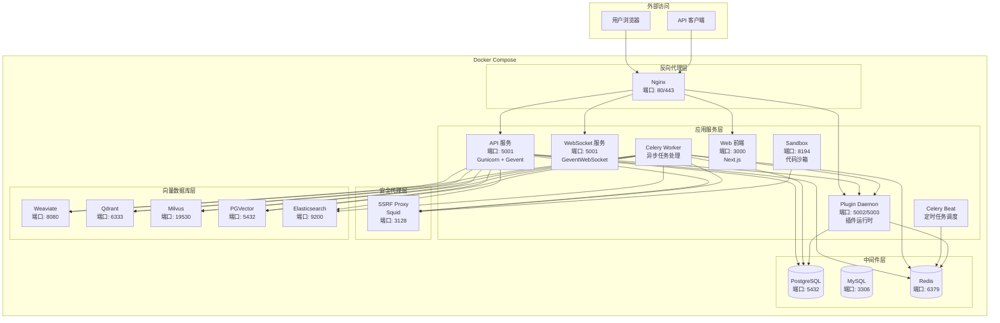
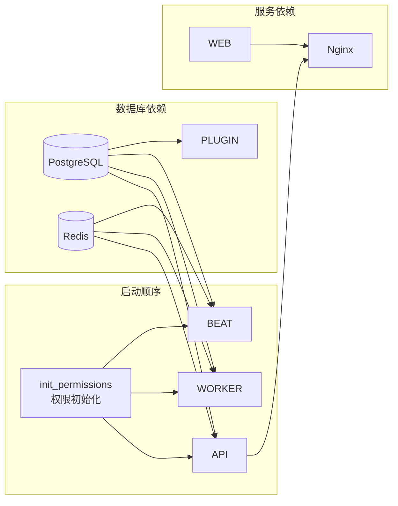
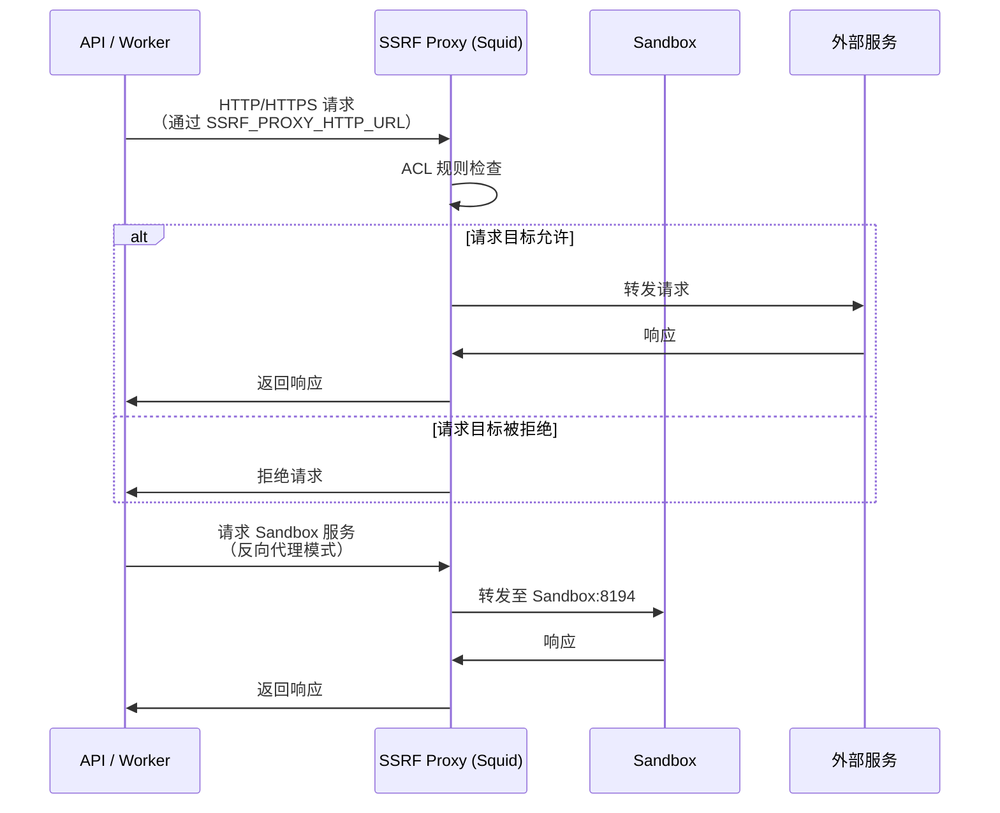
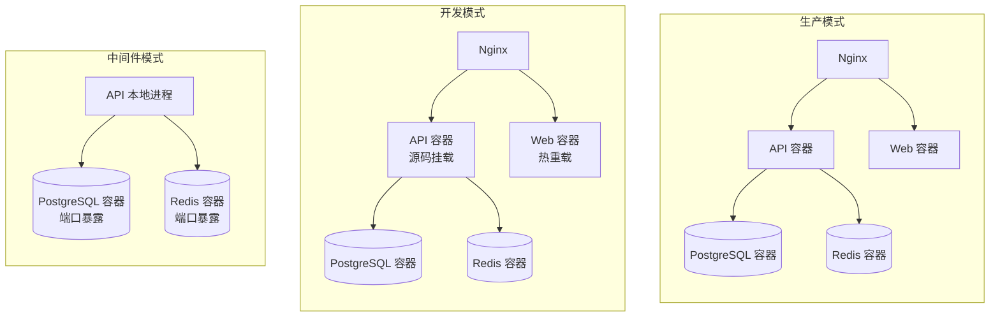

# Dify 部署架构文档

## 1. Docker Compose 架构总览

Dify 采用 Docker Compose 进行容器化部署，将应用拆分为多个独立服务，通过内部网络进行通信。核心服务包括 API 服务、Web 前端、Celery Worker、Plugin Daemon 以及各类中间件。

### 1.1 架构图



### 1.2 服务依赖关系



### 1.3 网络拓扑

```mermaid
graph TB
    subgraph default 网络
        API
        WS
        WORKER
        BEAT
        WEB
        PLUGIN
        NGINX
        SSRF
        PG
        REDIS
    end

    subgraph ssrf_proxy_network<br/>内部网络 - 不可外部访问
        API2[API]
        WS2[WebSocket]
        WORKER2[Worker]
        BEAT2[Beat]
        PLUGIN2[Plugin Daemon]
        SSRF2[SSRF Proxy]
        SANDBOX2[Sandbox]
    end

    subgraph milvus 网络
        ETCD[etcd]
        MINIO[MinIO]
        MILVUS_S[Milvus Standalone]
    end

    subgraph opensearch-net 网络
        OS[OpenSearch]
        OSD[OpenSearch Dashboards]
    end
```

Docker Compose 定义了以下网络：

| 网络名称 | 驱动 | 是否内部 | 说明 |
|---|---|---|---|
| `default` | bridge | 否 | 默认网络，所有服务均加入，用于服务间通信 |
| `ssrf_proxy_network` | bridge | 是 | 内部网络，API/Worker/Sandbox/SSRF Proxy 加入，用于受控的外部请求代理 |
| `milvus` | bridge | 否 | Milvus 专用网络，etcd/MinIO/Milvus Standalone 通信 |
| `opensearch-net` | bridge | 是 | OpenSearch 专用网络，OpenSearch 与 Dashboards 通信 |

## 2. 中间件列表

### 2.1 核心中间件

| 中间件 | 镜像 | 默认端口 | 用途 | Profile |
|---|---|---|---|---|
| PostgreSQL | `postgres:15-alpine` | 5432 | 主关系数据库，存储业务数据、用户信息、工作流定义等 | `postgresql` |
| MySQL | `mysql:8.0` | 3306 | 可选关系数据库（替代 PostgreSQL） | `mysql` |
| Redis | `redis:6-alpine` | 6379 | 缓存、Celery 消息队列、会话存储、事件总线 | 默认启动 |
| Nginx | `nginx:latest` | 80/443 | 反向代理，路由分发、SSL 终结、负载均衡 | 默认启动 |
| SSRF Proxy | `ubuntu/squid:latest` | 3128 | SSRF 防护代理，限制外部请求目标 | 默认启动 |
| Sandbox | `langgenius/dify-sandbox:0.2.15` | 8194 | 代码执行沙箱，隔离运行用户代码 | 默认启动 |
| Plugin Daemon | `langgenius/dify-plugin-daemon:0.6.1-local` | 5002/5003 | 插件运行时管理，插件安装、执行与调试 | 默认启动 |

### 2.2 向量数据库选项

| 向量数据库 | 镜像 | 默认端口 | 用途 | Profile |
|---|---|---|---|---|
| Weaviate | `semitechnologies/weaviate:1.27.0` | 8080/50051 | 默认向量数据库，支持 gRPC | `weaviate` |
| Qdrant | `langgenius/qdrant:v1.8.3` | 6333 | 高性能向量搜索引擎 | `qdrant` |
| Milvus | `milvusdb/milvus:v2.6.3` | 19530/9091 | 云原生向量数据库，依赖 etcd + MinIO | `milvus` |
| PGVector | `pgvector/pgvector:pg16` | 5432 | PostgreSQL 向量扩展 | `pgvector` |
| PGVecto-rs | `tensorchord/pgvecto-rs:pg16-v0.3.0` | 5432 | Rust 实现的 PostgreSQL 向量扩展 | `pgvecto-rs` |
| Chroma | `ghcr.io/chroma-core/chroma:0.5.20` | 8000 | 轻量级嵌入式向量数据库 | `chroma` |
| OceanBase | `oceanbase/oceanbase-ce:4.3.5-lts` | 2881 | OceanBase 向量数据库 | `oceanbase` |
| SeekDB | `oceanbase/seekdb:latest` | 2881 | 基于 OceanBase 的向量数据库 | `seekdb` |
| OpenSearch | `opensearchproject/opensearch:latest` | 9200 | 搜索与向量引擎 | `opensearch` |
| Elasticsearch | `docker.elastic.co/elasticsearch/elasticsearch:8.14.3` | 9200 | 全文搜索与向量引擎 | `elasticsearch` |
| Couchbase | 自定义构建 | 8091 | Couchbase 向量搜索 | `couchbase` |
| Oracle | `container-registry.oracle.com/database/free:latest` | 1521 | Oracle 向量数据库 | `oracle` |
| IRIS | `containers.intersystems.com/intersystems/iris-community:2025.3` | 52773 | InterSystems IRIS 向量数据库 | `iris` |
| OpenGauss | `opengauss/opengauss:7.0.0-RC1` | 6600 | 华为 OpenGauss 向量数据库 | `opengauss` |
| MyScale | `myscale/myscaledb:1.6.4` | 8123 | 基于 ClickHouse 的向量数据库 | `myscale` |
| MatrixOne | `matrixorigin/matrixone:2.1.1` | 6001 | MatrixOne 向量数据库 | `matrixone` |
| Vastbase | `vastdata/vastbase-vector` | 5432 | 海量数据 Vastbase 向量数据库 | `vastbase` |

### 2.3 Milvus 依赖组件

| 组件 | 镜像 | 默认端口 | 用途 |
|---|---|---|---|
| etcd | `quay.io/coreos/etcd:v3.5.5` | 2379 | Milvus 元数据存储 |
| MinIO | `minio/minio:RELEASE.2023-03-20T20-16-18Z` | 9000/9001 | Milvus 对象存储 |

### 2.4 辅助服务

| 服务 | 镜像 | 默认端口 | 用途 | Profile |
|---|---|---|---|---|
| Certbot | `certbot/certbot` | - | SSL 证书自动签发与续期 | `certbot` |
| Kibana | `docker.elastic.co/kibana/kibana:8.14.3` | 5601 | Elasticsearch 可视化面板 | `elasticsearch` |
| OpenSearch Dashboards | `opensearchproject/opensearch-dashboards:latest` | 5601 | OpenSearch 可视化面板 | `opensearch` |
| Unstructured | `downloads.unstructured.io/unstructured-io/unstructured-api:latest` | - | 文档解析服务 | `unstructured` |

## 3. Nginx 配置说明

### 3.1 配置文件结构

Nginx 配置采用模板化设计，通过 `docker-entrypoint.sh` 在启动时使用 `envsubst` 将环境变量注入模板生成最终配置：

```
nginx/
├── nginx.conf.template          # 主配置模板
├── proxy.conf.template          # 代理通用配置模板
├── https.conf.template          # HTTPS/SSL 配置模板
├── conf.d/
│   └── default.conf.template    # 虚拟主机与路由配置模板
├── docker-entrypoint.sh         # 启动脚本（环境变量替换）
└── ssl/                         # SSL 证书目录
```

### 3.2 主配置（nginx.conf.template）

| 配置项 | 环境变量 | 默认值 | 说明 |
|---|---|---|---|
| `worker_processes` | `NGINX_WORKER_PROCESSES` | `auto` | Worker 进程数 |
| `keepalive_timeout` | `NGINX_KEEPALIVE_TIMEOUT` | `65` | 长连接超时时间 |
| `client_max_body_size` | `NGINX_CLIENT_MAX_BODY_SIZE` | `100M` | 请求体最大大小 |

### 3.3 路由规则（default.conf.template）

Nginx 作为统一入口，将不同路径的请求分发到对应的后端服务：

| 路径 | 后端服务 | 说明 |
|---|---|---|
| `/console/api` | `http://api:5001` | 控制台 API 请求 |
| `/api` | `http://api:5001` | 应用 API 请求 |
| `/v1` | `http://api:5001` | 兼容 OpenAI 格式的 API 请求 |
| `/files` | `http://api:5001` | 文件访问请求 |
| `/mcp` | `http://api:5001` | MCP 协议请求 |
| `/triggers` | `http://api:5001` | 工作流触发器请求 |
| `/socket.io/` | `http://api_websocket:5001` | WebSocket 连接（协作模式） |
| `/e/` | `http://plugin_daemon:5002` | 插件端点（Endpoint）请求 |
| `/explore` | `http://web:3000` | 探索页面 |
| `/` | `http://web:3000` | 其他所有请求（前端页面） |

### 3.4 代理通用配置（proxy.conf.template）

所有代理请求统一设置以下 Header 和超时：

```
proxy_set_header Host $host;
proxy_set_header X-Forwarded-For $proxy_add_x_forwarded_for;
proxy_set_header X-Forwarded-Proto $scheme;
proxy_set_header X-Forwarded-Port $server_port;
proxy_http_version 1.1;
proxy_set_header Connection "";
proxy_buffering off;
proxy_read_timeout ${NGINX_PROXY_READ_TIMEOUT};    # 默认 3600s
proxy_send_timeout ${NGINX_PROXY_SEND_TIMEOUT};     # 默认 3600s
```

### 3.5 WebSocket 特殊配置

`/socket.io/` 路径额外配置了 WebSocket 升级支持：

```
proxy_set_header Upgrade $http_upgrade;
proxy_set_header Connection "upgrade";
proxy_cache_bypass $http_upgrade;
```

上游地址通过 `NGINX_SOCKET_IO_UPSTREAM` 环境变量配置，默认为 `api_websocket:5001`。

### 3.6 HTTPS 配置

当 `NGINX_HTTPS_ENABLED=true` 时，Nginx 启用 SSL：

| 配置项 | 环境变量 | 默认值 | 说明 |
|---|---|---|---|
| SSL 端口 | `NGINX_SSL_PORT` | `443` | HTTPS 监听端口 |
| 证书文件 | `NGINX_SSL_CERT_FILENAME` | `dify.crt` | SSL 证书文件名 |
| 私钥文件 | `NGINX_SSL_CERT_KEY_FILENAME` | `dify.key` | SSL 私钥文件名 |
| SSL 协议 | `NGINX_SSL_PROTOCOLS` | `TLSv1.2 TLSv1.3` | 支持的 SSL 协议版本 |

证书查找优先级：
1. Certbot 签发证书：`/etc/letsencrypt/live/${CERTBOT_DOMAIN}/`
2. 手动放置证书：`/etc/ssl/`

### 3.7 启动流程

```mermaid
sequenceDiagram
    participant Entrypoint as docker-entrypoint.sh
    participant Template as 配置模板
    participant Config as 最终配置
    participant Nginx as Nginx 进程

    Entrypoint->>Entrypoint: 检查 NGINX_HTTPS_ENABLED
    alt HTTPS 启用
        Entrypoint->>Entrypoint: 查找 SSL 证书路径
        Entrypoint->>Template: envsubst https.conf.template
        Entrypoint->>Config: 生成 HTTPS 配置块
    end
    Entrypoint->>Entrypoint: 检查 NGINX_ENABLE_CERTBOT_CHALLENGE
    Entrypoint->>Template: envsubst nginx.conf.template
    Entrypoint->>Config: 生成 nginx.conf
    Entrypoint->>Template: envsubst proxy.conf.template
    Entrypoint->>Config: 生成 proxy.conf
    Entrypoint->>Template: envsubst default.conf.template
    Entrypoint->>Config: 生成 default.conf
    Entrypoint->>Nginx: 启动 nginx -g 'daemon off;'
```

## 4. SSRF 代理机制

### 4.1 工作原理

SSRF（Server-Side Request Forgery）代理是 Dify 安全架构的核心组件，用于防止恶意用户通过应用发起对内部网络的请求。Dify 使用 Squid 作为 SSRF 防护代理，所有外部 HTTP/HTTPS 请求均通过该代理转发。



### 4.2 Squid 访问控制规则

SSRF Proxy 的安全防护通过 Squid ACL 规则实现，配置文件为 `ssrf_proxy/squid.conf.template`：

| 规则 | 说明 |
|---|---|
| `acl localnet src ...` | 定义本地网络地址范围（RFC 1918 等） |
| `acl SSL_ports port 443` | 仅允许 443 端口的 CONNECT 请求 |
| `acl Safe_ports port ...` | 限制允许访问的安全端口列表 |
| `acl allowed_domains dstdomain .marketplace.dify.ai` | 允许访问的特定域名 |
| `http_access allow allowed_domains` | 允许访问白名单域名 |
| `http_access deny !Safe_ports` | 拒绝非安全端口请求 |
| `http_access deny CONNECT !SSL_ports` | 拒绝非 SSL 端口的 CONNECT 请求 |
| `http_access allow localhost` | 允许本地请求 |
| `http_access deny all` | 拒绝所有其他请求 |

### 4.3 反向代理模式

SSRF Proxy 同时以反向代理模式运行，将请求转发至 Sandbox 服务：

```
http_port ${REVERSE_PROXY_PORT} accel vhost
cache_peer ${SANDBOX_HOST} parent ${SANDBOX_PORT} 0 no-query originserver
```

此配置使 SSRF Proxy 在 8194 端口以加速模式运行，将请求转发至 Sandbox 容器。

### 4.4 网络隔离

SSRF Proxy 位于两个网络之间：

- **`ssrf_proxy_network`**（内部网络）：与 API、Worker、Sandbox、Plugin Daemon 通信
- **`default` 网络**：与其他服务通信

`ssrf_proxy_network` 设置为 `internal: true`，确保该网络内的容器无法直接访问外部网络，所有出站请求必须经过 SSRF Proxy。

### 4.5 性能配置

| 配置项 | 值 | 说明 |
|---|---|---|
| `max_filedescriptors` | 65536 | 文件描述符上限 |
| `connect_timeout` | 30s | 连接超时 |
| `request_timeout` | 2min | 请求超时 |
| `read_timeout` | 2min | 读取超时 |
| `client_lifetime` | 5min | 客户端连接生命周期 |
| `cache_mem` | 256MB | 内存缓存大小 |
| `client_request_buffer_max_size` | 100MB | 请求缓冲区最大大小 |

## 5. 环境变量分类

Dify 的环境变量采用分层管理：根目录 `.env` 文件包含核心启动参数，`envs/` 目录下的文件按主题分组管理高级配置。

### 5.1 环境变量文件结构

```
docker/
├── .env                              # 核心启动配置（从 .env.example 复制）
├── envs/
│   ├── core-services/                # 核心服务配置
│   │   ├── shared.env                # API/Worker 共享配置
│   │   ├── api.env                   # API 服务专用配置
│   │   ├── worker.env                # Worker 服务专用配置
│   │   ├── worker-beat.env           # Beat 服务专用配置
│   │   ├── web.env                   # Web 前端配置
│   │   ├── sandbox.env               # Sandbox 配置
│   │   └── plugin-daemon.env         # Plugin Daemon 配置
│   ├── databases/                    # 数据库配置
│   │   ├── db-postgres.env           # PostgreSQL 配置
│   │   ├── db-mysql.env              # MySQL 配置
│   │   └── redis.env                 # Redis 配置
│   ├── vectorstores/                 # 向量数据库配置
│   │   ├── weaviate.env              # Weaviate 配置
│   │   ├── qdrant.env                # Qdrant 配置
│   │   ├── milvus.env                # Milvus 配置
│   │   ├── pgvector.env              # PGVector 配置
│   │   ├── elasticsearch.env         # Elasticsearch 配置
│   │   └── ...                       # 其他向量数据库
│   ├── infrastructure/               # 基础设施配置
│   │   ├── nginx.env                 # Nginx 配置
│   │   ├── ssrf-proxy.env            # SSRF Proxy 配置
│   │   ├── certbot.env               # Certbot 配置
│   │   ├── etcd.env                  # etcd 配置
│   │   └── minio.env                 # MinIO 配置
│   ├── security.env                  # 安全配置
│   └── middleware.env                # 中间件模式配置
```

### 5.2 基础配置

| 变量名 | 默认值 | 说明 |
|---|---|---|
| `DEPLOY_ENV` | `PRODUCTION` | 部署环境标识 |
| `SECRET_KEY` | （自动生成） | 会话签名与 JWT 密钥，留空则自动生成 |
| `INIT_PASSWORD` | - | 初始管理员密码 |
| `CONSOLE_API_URL` | - | 控制台 API 地址 |
| `CONSOLE_WEB_URL` | - | 控制台 Web 地址 |
| `SERVICE_API_URL` | - | 服务 API 地址 |
| `APP_API_URL` | - | 应用 API 地址 |
| `APP_WEB_URL` | - | 应用 Web 地址 |
| `FILES_URL` | - | 文件访问公共 URL |
| `INTERNAL_FILES_URL` | - | 文件访问内部 URL |
| `ENDPOINT_URL_TEMPLATE` | `http://localhost/e/{hook_id}` | 插件端点 URL 模板 |
| `LOG_LEVEL` | `INFO` | 日志级别 |
| `DEBUG` | `false` | 调试模式 |
| `CHECK_UPDATE_URL` | `https://updates.dify.ai` | 版本更新检查地址 |
| `MIGRATION_ENABLED` | `true` | 启动时自动执行数据库迁移 |

### 5.3 数据库配置

| 变量名 | 默认值 | 说明 |
|---|---|---|
| `DB_TYPE` | `postgresql` | 数据库类型（`postgresql` / `mysql`） |
| `DB_USERNAME` | `postgres` | 数据库用户名 |
| `DB_PASSWORD` | `difyai123456` | 数据库密码 |
| `DB_HOST` | `db_postgres` | 数据库主机地址 |
| `DB_PORT` | `5432` | 数据库端口 |
| `DB_DATABASE` | `dify` | 数据库名称 |
| `DB_PLUGIN_DATABASE` | `dify_plugin` | 插件数据库名称 |
| `SQLALCHEMY_POOL_SIZE` | `30` | 连接池大小 |
| `SQLALCHEMY_MAX_OVERFLOW` | `10` | 连接池最大溢出 |
| `SQLALCHEMY_POOL_RECYCLE` | `3600` | 连接回收时间（秒） |
| `POSTGRES_MAX_CONNECTIONS` | `200` | PostgreSQL 最大连接数 |
| `POSTGRES_SHARED_BUFFERS` | `128MB` | PostgreSQL 共享缓冲区 |
| `PGDATA` | `/var/lib/postgresql/data/pgdata` | PostgreSQL 数据目录 |

### 5.4 Redis 配置

| 变量名 | 默认值 | 说明 |
|---|---|---|
| `REDIS_HOST` | `redis` | Redis 主机地址 |
| `REDIS_PORT` | `6379` | Redis 端口 |
| `REDIS_PASSWORD` | `difyai123456` | Redis 密码 |
| `REDIS_DB` | `0` | Redis 数据库编号 |
| `REDIS_KEY_PREFIX` | - | Redis 键前缀（命名空间） |
| `REDIS_USE_SSL` | `false` | 是否启用 SSL |
| `REDIS_USE_SENTINEL` | `false` | 是否使用 Sentinel 模式 |
| `REDIS_USE_CLUSTERS` | `false` | 是否使用集群模式 |
| `CELERY_BROKER_URL` | `redis://:difyai123456@redis:6379/1` | Celery Broker 地址 |
| `CELERY_BACKEND` | `redis` | Celery 结果后端 |
| `EVENT_BUS_REDIS_URL` | - | 事件总线 Redis URL |

### 5.5 存储配置

| 变量名 | 默认值 | 说明 |
|---|---|---|
| `STORAGE_TYPE` | `opendal` | 存储类型 |
| `OPENDAL_SCHEME` | `fs` | OpenDAL 存储方案 |
| `OPENDAL_FS_ROOT` | `storage` | 本地文件存储根目录 |
| `S3_ENDPOINT` | - | S3 兼容存储端点 |
| `S3_BUCKET_NAME` | `difyai` | S3 存储桶名称 |
| `S3_REGION` | `us-east-1` | S3 区域 |
| `AZURE_BLOB_ACCOUNT_NAME` | `difyai` | Azure Blob 存储账户 |
| `ALIYUN_OSS_BUCKET_NAME` | - | 阿里云 OSS 存储桶 |
| `TENCENT_COS_BUCKET_NAME` | - | 腾讯云 COS 存储桶 |

### 5.6 向量数据库配置

| 变量名 | 默认值 | 说明 |
|---|---|---|
| `VECTOR_STORE` | `weaviate` | 向量数据库类型 |
| `WEAVIATE_ENDPOINT` | `http://weaviate:8080` | Weaviate 端点 |
| `WEAVIATE_API_KEY` | `WVF5YThaHlkY...` | Weaviate API Key |
| `WEAVIATE_GRPC_ENDPOINT` | `grpc://weaviate:50051` | Weaviate gRPC 端点 |
| `QDRANT_URL` | `http://qdrant:6333` | Qdrant 端点 |
| `MILVUS_URI` | `http://host.docker.internal:19530` | Milvus 端点 |
| `PGVECTOR_HOST` | `pgvector` | PGVector 主机 |
| `ELASTICSEARCH_HOST` | - | Elasticsearch 主机 |

### 5.7 安全配置

| 变量名 | 默认值 | 说明 |
|---|---|---|
| `SECRET_KEY` | （自动生成） | 核心加密密钥 |
| `INIT_PASSWORD` | - | 初始管理员密码 |
| `FORCE_VERIFYING_SIGNATURE` | `true` | 强制验证插件签名 |
| `WEB_API_CORS_ALLOW_ORIGINS` | `*` | API CORS 允许来源 |
| `CONSOLE_CORS_ALLOW_ORIGINS` | `*` | 控制台 CORS 允许来源 |
| `CODE_EXECUTION_API_KEY` | `dify-sandbox` | Sandbox 访问密钥 |
| `PLUGIN_DAEMON_KEY` | `lYkiYYT6owG+71...` | Plugin Daemon 服务密钥 |
| `PLUGIN_DIFY_INNER_API_KEY` | `QaHbTe77CtuXms...` | 插件内部 API 密钥 |
| `RESET_PASSWORD_TOKEN_EXPIRY_MINUTES` | `5` | 密码重置令牌过期时间 |
| `HTTP_REQUEST_NODE_SSL_VERIFY` | `True` | HTTP 请求节点 SSL 验证 |

### 5.8 模型供应商配置

| 变量名 | 默认值 | 说明 |
|---|---|---|
| `OPENAI_API_BASE` | `https://api.openai.com/v1` | OpenAI API 基础地址 |

> 大部分模型供应商的 API Key 通过 Dify 控制台界面配置，而非环境变量。

## 6. 部署模式

### 6.1 生产模式

使用 `docker-compose.yaml` 部署完整的 Dify 平台，所有服务运行在 Docker 容器中。

**启动命令：**

```bash
cd docker
cp .env.example .env
# 编辑 .env 配置
docker compose up -d
```

**核心服务（默认启动）：**

| 服务 | 说明 |
|---|---|
| `api` | API 服务 |
| `worker` | Celery Worker |
| `worker_beat` | Celery Beat 定时调度 |
| `web` | 前端 Web 应用 |
| `redis` | 缓存与消息队列 |
| `nginx` | 反向代理 |
| `ssrf_proxy` | SSRF 防护代理 |
| `sandbox` | 代码执行沙箱 |
| `plugin_daemon` | 插件运行时 |

**Profile 服务（按需启动）：**

| Profile | 启动的服务 | 说明 |
|---|---|---|
| `postgresql` | `db_postgres` | PostgreSQL 数据库 |
| `mysql` | `db_mysql` | MySQL 数据库 |
| `weaviate` | `weaviate` | Weaviate 向量数据库 |
| `qdrant` | `qdrant` | Qdrant 向量数据库 |
| `milvus` | `milvus-standalone`, `etcd`, `minio` | Milvus 向量数据库 |
| `pgvector` | `pgvector` | PGVector 向量数据库 |
| `elasticsearch` | `elasticsearch`, `kibana` | Elasticsearch 搜索引擎 |
| `opensearch` | `opensearch`, `opensearch-dashboards` | OpenSearch 搜索引擎 |
| `chroma` | `chroma` | Chroma 向量数据库 |
| `collaboration` | `api_websocket` | WebSocket 协作服务 |
| `certbot` | `certbot` | SSL 证书管理 |
| `unstructured` | `unstructured` | 文档解析服务 |

默认 Profile 组合通过 `COMPOSE_PROFILES` 控制：

```
COMPOSE_PROFILES=${VECTOR_STORE:-weaviate},${DB_TYPE:-postgresql},collaboration
```

**切换向量数据库示例：**

```bash
# 使用 Milvus
VECTOR_STORE=milvus docker compose up -d

# 使用 Qdrant
VECTOR_STORE=qdrant docker compose up -d
```

### 6.2 开发模式

使用 `docker-compose.dev.yaml` 覆盖生产配置，将本地源代码以只读方式挂载到容器中，支持代码修改后自动重载。

**启动命令：**

```bash
cd docker
docker compose -f docker-compose.yaml -f docker-compose.dev.yaml up -d
```

**开发模式特点：**

| 特性 | 说明 |
|---|---|
| 源码挂载 | API/Worker 的 `app/`、`models/`、`services/` 等目录以只读方式挂载 |
| 保留虚拟环境 | 不覆盖容器内的 `.venv` 目录 |
| Web 热重载 | Web 服务启用 `NODE_ENV=development` 和 `FAST_REFRESH=true` |
| 存储持久化 | 保留 `./volumes/app/storage` 挂载 |

**API/Worker 挂载目录：**

```
../api/app         → /app/api/app:ro
../api/models      → /app/api/models:ro
../api/services    → /app/api/services:ro
../api/controllers → /app/api/controllers:ro
../api/libs        → /app/api/libs:ro
../api/core        → /app/api/core:ro
../api/tasks       → /app/api/tasks:ro
../api/configs     → /app/api/configs:ro
../api/migrations  → /app/api/migrations:ro
../api/extensions  → /app/api/extensions:ro
../api/providers   → /app/api/providers:ro
```

### 6.3 中间件模式

使用 `docker-compose.middleware.yaml` 仅启动中间件服务（数据库、缓存、向量数据库等），适用于本地开发 Dify 应用代码的场景。应用服务（API、Worker、Web）在宿主机直接运行。

**启动命令：**

```bash
cd docker
cp envs/middleware.env.example middleware.env
# 编辑 middleware.env 配置
docker compose --env-file middleware.env -f docker-compose.middleware.yaml -p dify up -d
```

**中间件模式启动的服务：**

| 服务 | 说明 | 端口暴露 |
|---|---|---|
| `db_postgres` | PostgreSQL 数据库 | 5432 |
| `db_mysql` | MySQL 数据库 | 3306 |
| `redis` | Redis 缓存 | 6379 |
| `sandbox` | 代码沙箱 | 8194（通过 SSRF Proxy） |
| `plugin_daemon` | 插件运行时 | 5002/5003 |
| `ssrf_proxy` | SSRF 防护代理 | 3128/8194 |
| `weaviate` | Weaviate 向量数据库 | 8080/50051 |

**中间件模式与生产模式的差异：**

| 差异点 | 生产模式 | 中间件模式 |
|---|---|---|
| 应用服务 | 容器内运行 | 宿主机运行 |
| 数据库端口 | 不暴露 | 暴露至宿主机 |
| Plugin Daemon 内部 API | `http://api:5001` | `http://host.docker.internal:5001` |
| 环境配置文件 | `.env` + `envs/*.env` | `middleware.env` |
| Profile 控制 | `COMPOSE_PROFILES` 变量 | `middleware.env` 中的 `COMPOSE_PROFILES` |

### 6.4 三种模式对比



| 对比维度 | 生产模式 | 开发模式 | 中间件模式 |
|---|---|---|---|
| Compose 文件 | `docker-compose.yaml` | `docker-compose.yaml` + `docker-compose.dev.yaml` | `docker-compose.middleware.yaml` |
| 应用运行方式 | 容器 | 容器（源码挂载） | 宿主机进程 |
| 适用场景 | 生产部署 | 代码开发调试 | 本地开发后端 |
| 端口暴露 | 仅 Nginx | 仅 Nginx | 所有中间件端口 |
| 配置文件 | `.env` | `.env` | `middleware.env` |
| 代码热重载 | 不支持 | 支持 | N/A |
