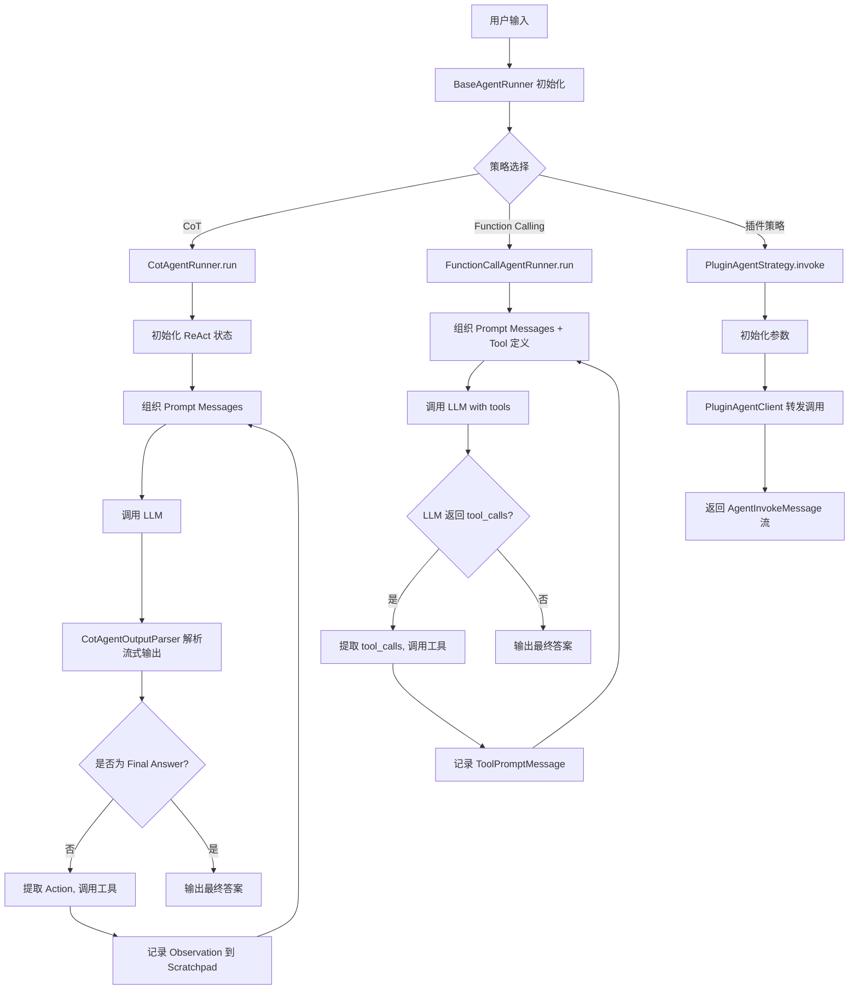
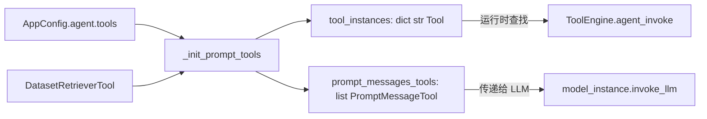
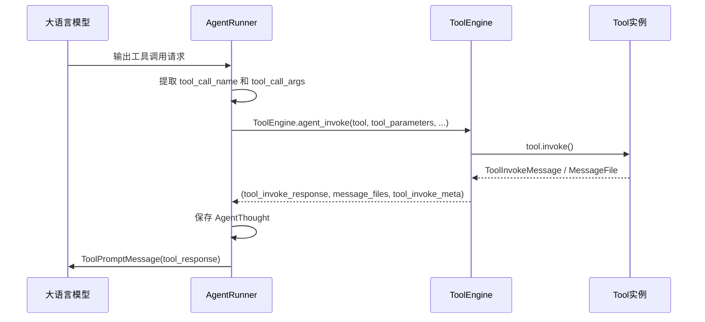
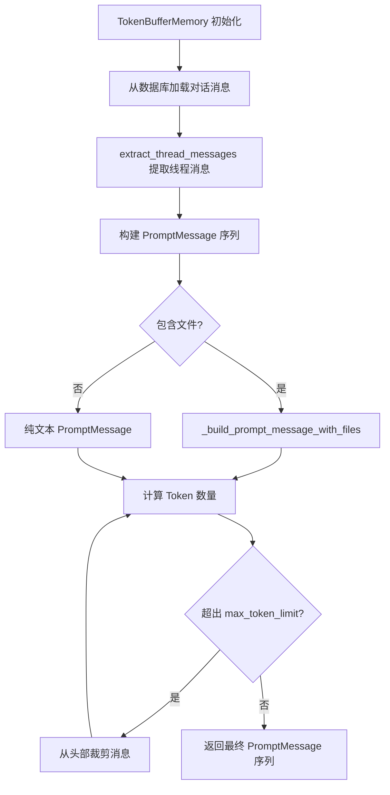
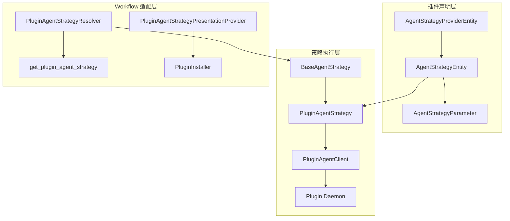
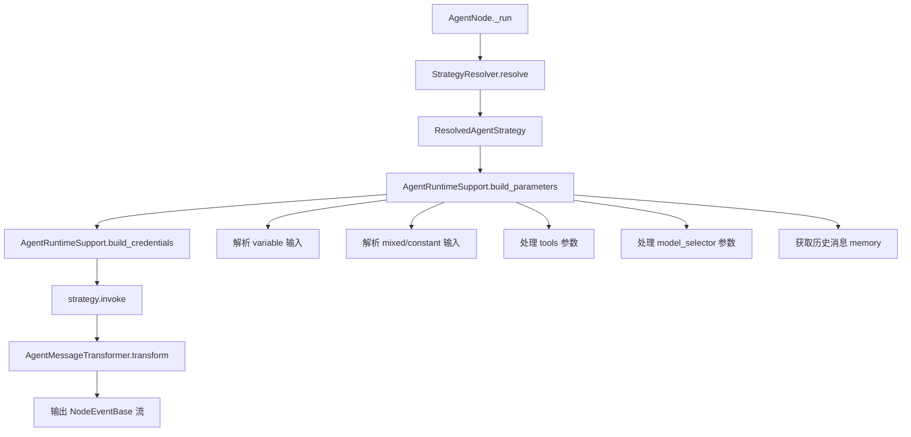
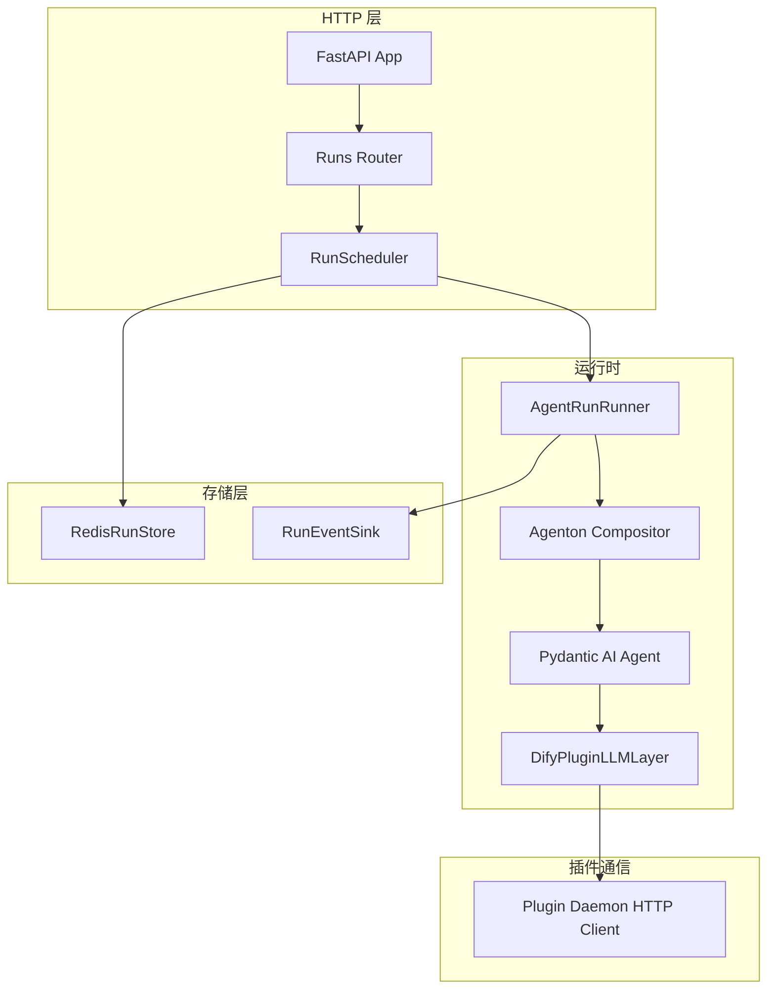

# Dify Agent 智能体系统功能文档

## 1. Agent 概述

Agent（智能体）是 Dify 中的核心执行模式之一。与传统的 Chat 模式不同，Agent 模式赋予大语言模型**自主推理**和**工具调用**的能力，使其能够在多轮迭代中自主决定何时调用工具、如何组合工具输出，并最终生成完整回答。

Agent 系统的核心设计理念：

- **策略驱动**：通过可插拔的策略模式（CoT / Function Calling）适配不同 LLM 的推理能力
- **迭代执行**：Agent 在循环中不断推理 → 调用工具 → 观察结果，直到得出最终答案或达到最大迭代次数
- **工具集成**：支持内置工具、API 工具、数据集检索工具及插件工具的统一调度
- **记忆管理**：通过 Token Buffer Memory 机制在上下文窗口内管理对话历史

### 核心源码位置

| 模块              | 路径                                                  | 职责                           |
| --------------- | --------------------------------------------------- | ---------------------------- |
| Agent 实体定义      | `api/core/agent/entities.py`                        | Agent 配置、工具、Scratchpad 等数据模型 |
| Agent Runner 基类 | `api/core/agent/base_agent_runner.py`               | 工具初始化、历史消息组织、Thought 持久化     |
| CoT Runner      | `api/core/agent/cot_agent_runner.py`                | 思维链策略的迭代执行逻辑                 |
| FC Runner       | `api/core/agent/fc_agent_runner.py`                 | 函数调用策略的迭代执行逻辑                |
| 策略框架            | `api/core/agent/strategy/`                          | 插件化策略的抽象基类与插件实现              |
| 输出解析            | `api/core/agent/output_parser/cot_output_parser.py` | CoT 流式输出解析器                  |
| Prompt 模板       | `api/core/agent/prompt/template.py`                 | ReAct Prompt 模板定义            |

***

## 2. 策略模式

Dify Agent 支持两种核心策略，每种策略根据 LLM 的交互模式又分为 Chat 和 Completion 两种变体。

### 2.1 策略总览

| 策略                         | 标识                 | 描述                                                                        | 适用模型                                        |
| -------------------------- | ------------------ | ------------------------------------------------------------------------- | ------------------------------------------- |
| **CoT (Chain of Thought)** | `chain-of-thought` | 通过 ReAct 格式的 Prompt 引导模型进行思维链推理，模型以 `Thought → Action → Observation` 循环推进 | 不支持 Function Calling 的模型                    |
| **Function Calling**       | `function-calling` | 利用模型原生的 Function Calling 能力，模型直接输出结构化的工具调用请求                              | 支持 Function Calling 的模型（如 GPT-4、Claude 3 等） |

### 2.2 策略变体

| 变体                   | 实现类                        | 交互模式                | Prompt 组织方式                              |
| -------------------- | -------------------------- | ------------------- | ---------------------------------------- |
| **CoT Chat**         | `CotChatAgentRunner`       | Chat 模式（多轮消息）       | System Prompt + 历史消息 + 用户查询 + Scratchpad |
| **CoT Completion**   | `CotCompletionAgentRunner` | Completion 模式（单轮文本） | 将所有上下文拼接为单一 UserPromptMessage            |
| **Function Calling** | `FunctionCallAgentRunner`  | Chat 模式             | System Prompt + 历史消息 + 用户查询 + Tool 定义    |

### 2.3 策略继承关系

```
BaseAgentRunner (base_agent_runner.py)
├── CotAgentRunner (cot_agent_runner.py)          [抽象类, 定义 ReAct 循环]
│   ├── CotChatAgentRunner (cot_chat_agent_runner.py)      [Chat 模式 Prompt 组织]
│   └── CotCompletionAgentRunner (cot_completion_agent_runner.py) [Completion 模式 Prompt 组织]
└── FunctionCallAgentRunner (fc_agent_runner.py)  [FC 模式完整实现]
```

### 2.4 策略选择逻辑

- 当 LLM **支持 Function Calling** 时，优先使用 `FunctionCallAgentRunner`，模型原生输出结构化工具调用
- 当 LLM **不支持 Function Calling** 时，使用 `CotChatAgentRunner` 或 `CotCompletionAgentRunner`，通过 ReAct Prompt 模板引导模型输出 `Action: {...}` 格式的工具调用

### 2.5 插件策略

除内置策略外，Dify 还支持通过插件扩展 Agent 策略：

| 组件                    | 路径                                  | 职责                                       |
| --------------------- | ----------------------------------- | ---------------------------------------- |
| `BaseAgentStrategy`   | `api/core/agent/strategy/base.py`   | 策略抽象基类，定义 `invoke` 和 `get_parameters` 接口 |
| `PluginAgentStrategy` | `api/core/agent/strategy/plugin.py` | 插件策略实现，通过 `PluginAgentClient` 调用远端插件     |

`PluginAgentStrategy` 接收 `AgentStrategyEntity` 声明，初始化参数后通过 `PluginAgentClient` 将调用转发至 Plugin Daemon 执行。

***

## 3. Agent 执行架构

### 3.1 整体执行流程



### 3.2 BaseAgentRunner 核心职责

`BaseAgentRunner` 是所有 Agent Runner 的基类，负责：

1. **工具初始化**：将 `AgentToolEntity` 和 `DatasetRetrieverTool` 转换为 LLM 可识别的 `PromptMessageTool` 格式
2. **历史消息组织**：从数据库加载对话历史，重建包含 Tool Calls 的多轮消息序列
3. **Thought 持久化**：创建和更新 `MessageAgentThought` 记录，保存每轮迭代的推理过程、工具调用和观察结果
4. **模型特性检测**：检测模型是否支持 `STREAM_TOOL_CALL` 和 `VISION` 特性

### 3.3 迭代执行机制

两种策略共享相同的迭代控制逻辑：

```
iteration_step = 1
max_iteration_steps = min(agent.max_iteration, 99) + 1

while function_call_state and iteration_step <= max_iteration_steps:
    if iteration_step == max_iteration_steps:
        移除所有工具（强制模型输出最终答案）

    调用 LLM
    解析输出
    if 存在工具调用:
        执行工具
        记录结果
        function_call_state = True
    else:
        function_call_state = False

    iteration_step += 1
```

当达到最大迭代次数且模型仍试图调用工具时，抛出 `AgentMaxIterationError`。

***

## 4. 工具调用流程

### 4.1 工具发现与注册



工具发现流程：

1. **配置加载**：从 `AppConfig.agent.tools` 读取用户配置的工具列表（`AgentToolEntity`）
2. **工具实例化**：通过 `ToolManager.get_agent_tool_runtime()` 获取工具运行时实例
3. **参数转换**：将工具的 `ToolParameter` 转换为 `PromptMessageTool.parameters` 中 LLM 可理解的 JSON Schema 格式
4. **数据集工具**：额外加载 `DatasetRetrieverTool`，支持知识库检索
5. **工具注册**：将 `PromptMessageTool` 传递给 LLM，将 `Tool` 实例保存在 `tool_instances` 字典中供运行时查找

### 4.2 工具调用执行



工具调用的关键步骤：

- **CoT 策略**：从 `AgentScratchpadUnit.Action` 中提取 `action_name` 和 `action_input`，通过 `ToolEngine.agent_invoke()` 执行
- **FC 策略**：从 `LLMResultChunk.delta.message.tool_calls` 中提取 `tool_call_id`、`function.name` 和 `function.arguments`，逐个调用工具并将结果以 `ToolPromptMessage` 形式追加到对话中
- **错误处理**：当工具名称不存在时，返回错误提示而非中断执行

### 4.3 工具类型

| 工具来源   | 类型标识                | 说明                      |
| ------ | ------------------- | ----------------------- |
| 内置工具   | `BUILT_IN`          | Dify 预置的工具（如网页搜索、天气查询等） |
| API 工具 | `API`               | 用户自定义的 API 工具           |
| 数据集检索  | `DATASET_RETRIEVAL` | 知识库检索工具                 |
| 插件工具   | `PLUGIN`            | 通过插件系统提供的工具             |
| MCP 工具 | `MCP`               | 通过 MCP 协议提供的工具          |

***

## 5. 记忆管理

### 5.1 Token Buffer Memory 机制

`TokenBufferMemory` 是 Agent 系统的核心记忆组件，负责在 LLM 上下文窗口限制内管理对话历史。



### 5.2 核心参数

| 参数                | 默认值  | 说明               |
| ----------------- | ---- | ---------------- |
| `max_token_limit` | 2000 | 历史消息的最大 Token 数量 |
| `message_limit`   | 500  | 加载的最大消息条数        |

### 5.3 记忆裁剪策略

当历史消息的 Token 数超过 `max_token_limit` 时，`TokenBufferMemory` 采用**从头部裁剪**的策略：

1. 计算当前所有历史消息的 Token 总数
2. 若超出限制，移除最早的消息
3. 重复步骤 1-2，直到 Token 数在限制内或仅剩 1 条消息

这种策略确保保留最近的对话上下文，牺牲较早的历史信息。

### 5.4 在 Agent 中的应用

- **CoT Runner**：通过 `AgentHistoryPromptTransform` 整合 `TokenBufferMemory`，将历史消息格式化为 ReAct 风格
- **FC Runner**：直接使用 `AgentHistoryPromptTransform` 处理历史消息
- **Workflow Agent 节点**：通过 `AgentRuntimeSupport.fetch_memory()` 创建 `TokenBufferMemory` 实例，支持配置 `memory.window.size`

***

## 6. 插件策略适配

### 6.1 适配架构

插件策略适配层将外部插件提供的 Agent 策略桥接到 Dify 的 Agent 框架中，使插件可以定义和实现自定义的 Agent 推理逻辑。



### 6.2 核心实体

| 实体                            | 路径                   | 职责                                                                            |
| ----------------------------- | -------------------- | ----------------------------------------------------------------------------- |
| `AgentStrategyProviderEntity` | `plugin_entities.py` | 插件策略提供者身份信息                                                                   |
| `AgentStrategyEntity`         | `plugin_entities.py` | 策略声明，包含参数列表、描述、输出 Schema 和特性                                                  |
| `AgentStrategyParameter`      | `plugin_entities.py` | 策略参数定义，支持多种类型（STRING、NUMBER、BOOLEAN、SELECT、MODEL\_SELECTOR、TOOLS\_SELECTOR 等） |
| `AgentFeature`                | `plugin_entities.py` | 策略特性标记（如 `HISTORY_MESSAGES`）                                                  |

### 6.3 参数类型

| 参数类型  | 标识               | 说明         |
| ----- | ---------------- | ---------- |
| 字符串   | `STRING`         | 普通文本输入     |
| 数值    | `NUMBER`         | 数字输入       |
| 布尔    | `BOOLEAN`        | 开关选项       |
| 选择    | `SELECT`         | 下拉选择       |
| 密钥输入  | `SECRET_INPUT`   | 敏感信息输入     |
| 文件    | `FILE` / `FILES` | 单文件/多文件上传  |
| 应用选择器 | `APP_SELECTOR`   | 选择 Dify 应用 |
| 模型选择器 | `MODEL_SELECTOR` | 选择 LLM 模型  |
| 工具选择器 | `TOOLS_SELECTOR` | 选择可用工具集    |

### 6.4 Workflow 中的策略解析

在 Workflow Agent 节点中，插件策略通过以下组件适配：

- **`PluginAgentStrategyResolver`**：根据 `tenant_id`、`agent_strategy_provider_name` 和 `agent_strategy_name` 解析出策略实例
- **`PluginAgentStrategyPresentationProvider`**：提供策略的图标等展示信息
- **`AgentRuntimeSupport`**：构建参数、获取模型实例、创建记忆、构建凭证

***

## 7. Agent 节点

### 7.1 Workflow 中的 Agent 节点

Agent 节点是 Workflow（工作流）中的内置节点类型，允许在工作流中嵌入 Agent 推理能力。



### 7.2 核心组件

| 组件                            | 路径                           | 职责                                                |
| ----------------------------- | ---------------------------- | ------------------------------------------------- |
| `AgentNode`                   | `agent_node.py`              | Workflow 节点实现，编排策略解析、参数构建、调用和消息转换                 |
| `AgentNodeData`               | `entities.py`                | 节点数据模型，包含策略名称、参数、记忆配置                             |
| `AgentRuntimeSupport`         | `runtime_support.py`         | 运行时支持：参数构建、模型获取、记忆获取、凭证构建                         |
| `AgentMessageTransformer`     | `message_transformer.py`     | 消息转换：将 `ToolInvokeMessage` 流转换为 `NodeEventBase` 流 |
| `AgentStrategyResolver`       | `strategy_protocols.py`      | 策略解析协议（Protocol）                                  |
| `PluginAgentStrategyResolver` | `plugin_strategy_adapter.py` | 插件策略解析实现                                          |

### 7.3 AgentNodeData 数据模型

```python
class AgentNodeData(BaseNodeData):
    type: NodeType = BuiltinNodeTypes.AGENT
    agent_strategy_provider_name: str    # 策略提供者名称
    agent_strategy_name: str             # 策略名称
    agent_strategy_label: str            # 策略显示标签
    memory: MemoryConfig | None          # 记忆配置
    tool_node_version: str | None        # 工具参数版本
    agent_parameters: dict[str, AgentInput]  # 策略参数映射
```

### 7.4 参数构建流程

`AgentRuntimeSupport.build_parameters()` 负责将 Workflow 变量池中的值映射到策略参数：

1. **variable 类型**：直接从 `VariablePool` 获取变量值
2. **mixed/constant 类型**：通过 `VariablePool.convert_template()` 解析模板变量
3. **tools 参数**（`array[tools]`）：
   - 过滤禁用工具和 MCP 类型工具（旧版本）
   - 通过 `ToolManager.get_agent_tool_runtime()` 获取工具运行时
   - 合并手动输入参数和设置参数
4. **model\_selector 参数**：
   - 通过 `create_plugin_model_assembly()` 获取模型实例
   - 若启用记忆，通过 `fetch_memory()` 加载历史消息
   - 附加模型 Schema 信息

### 7.5 消息转换

`AgentMessageTransformer` 将策略返回的 `ToolInvokeMessage` 流转换为 Workflow 可处理的 `NodeEventBase` 事件流：

| 消息类型                                   | 处理方式                                          |
| -------------------------------------- | --------------------------------------------- |
| `TEXT`                                 | 追加到文本输出，发射 `StreamChunkEvent`                 |
| `JSON`                                 | 解析为 JSON 对象，提取 `execution_metadata` 中的 LLM 用量 |
| `IMAGE_LINK` / `BINARY_LINK` / `IMAGE` | 转换为 `File` 对象                                 |
| `BLOB`                                 | 转换为 `File` 对象                                 |
| `LINK`                                 | 追加链接文本                                        |
| `VARIABLE`                             | 处理流式/非流式变量输出                                  |
| `FILE`                                 | 直接从 meta 中提取 `File` 对象                        |
| `LOG`                                  | 发射 `AgentLogEvent`，包含工具图标和元数据                 |

### 7.6 异常体系

| 异常                           | 说明           |
| ---------------------------- | ------------ |
| `AgentNodeError`             | Agent 节点基础异常 |
| `AgentStrategyError`         | 策略相关错误       |
| `AgentStrategyNotFoundError` | 策略未找到        |
| `AgentInvocationError`       | 策略调用失败       |
| `AgentParameterError`        | 参数错误         |
| `AgentVariableNotFoundError` | 变量未找到        |
| `AgentMessageTransformError` | 消息转换失败       |
| `AgentMaxIterationError`     | 超出最大迭代次数     |

***

## 8. Dify Agent 后端

### 8.1 概述

`dify-agent/` 是 Dify 的独立 Agent 后端服务，基于 **Agenton** 框架和 **Pydantic AI** 构建，提供更高级的 Agent 运行时能力，包括结构化输出、会话快照、层（Layer）组合等。

### 8.2 架构概览



### 8.3 核心模块

| 模块            | 路径                                                  | 职责                                          |
| ------------- | --------------------------------------------------- | ------------------------------------------- |
| FastAPI 应用    | `src/dify_agent/server/app.py`                      | 应用工厂，管理 Redis、HTTP Client 和 Scheduler 的生命周期 |
| 路由            | `src/dify_agent/server/routes/runs.py`              | Run 相关的 HTTP API 端点                         |
| 运行调度          | `src/dify_agent/runtime/run_scheduler.py`           | 管理后台异步任务调度                                  |
| 运行执行          | `src/dify_agent/runtime/runner.py`                  | `AgentRunRunner`，执行单次 Agent 运行              |
| Agent 构建      | `src/dify_agent/runtime/agent_factory.py`           | 创建 Pydantic AI Agent 实例                     |
| Compositor 工厂 | `src/dify_agent/runtime/compositor_factory.py`      | 构建 Agenton Compositor                       |
| LLM 层         | `src/dify_agent/layers/dify_plugin/llm_layer.py`    | 通过 Plugin Daemon 获取 LLM 模型                  |
| 插件层           | `src/dify_agent/layers/dify_plugin/plugin_layer.py` | 插件工具层                                       |
| 输出层           | `src/dify_agent/layers/output/output_layer.py`      | 结构化输出层                                      |
| Redis 存储      | `src/dify_agent/storage/redis_run_store.py`         | Run 记录和事件流的 Redis 持久化                       |
| 协议定义          | `src/dify_agent/protocol/schemas.py`                | Run 请求/响应的 Schema 定义                        |

### 8.4 运行流程

1. **请求接收**：FastAPI 接收 `CreateRunRequest`，包含组合配置（composition）、会话快照和退出信号
2. **组合构建**：通过 `normalize_composition()` 将公共组合格式转换为 Agenton 的 graph/config 分割
3. **Compositor 进入**：`compositor.enter()` 初始化运行上下文，加载层配置
4. **Agent 创建**：从 LLM 层获取模型，创建 Pydantic AI Agent，注册系统提示和工具
5. **执行运行**：`agent.run()` 执行推理，通过事件流处理器发射流式事件
6. **输出序列化**：将 Agent 输出序列化为 JSON 安全格式
7. **事件发射**：通过 `RunEventSink` 发射 `run_started` → 流式事件 → `run_succeeded` / `run_failed`

### 8.5 Agenton 框架

Agenton 是 dify-agent 内部的组合框架，核心概念：

- **Layer（层）**：可组合的功能单元，如 LLM 层、插件层、输出层
- **Compositor（组合器）**：管理层的进入、退出和交互
- **Session Snapshot（会话快照）**：支持会话恢复的状态快照
- **Layer Provider（层提供者）**：层的工厂和配置提供者

### 8.6 与主 API 的关系

`dify-agent` 服务与主 Dify API（`api/`）的关系：

- **主 API** 中的 `PluginAgentStrategy` 通过 `PluginAgentClient` 调用 Plugin Daemon
- **dify-agent** 服务作为独立的运行时，通过 Plugin Daemon 的 HTTP 接口与主 API 协作
- 两者共享相同的插件基础设施，但 `dify-agent` 提供了更高级的 Agent 编排能力（如 Pydantic AI 集成、结构化输出、会话快照）

