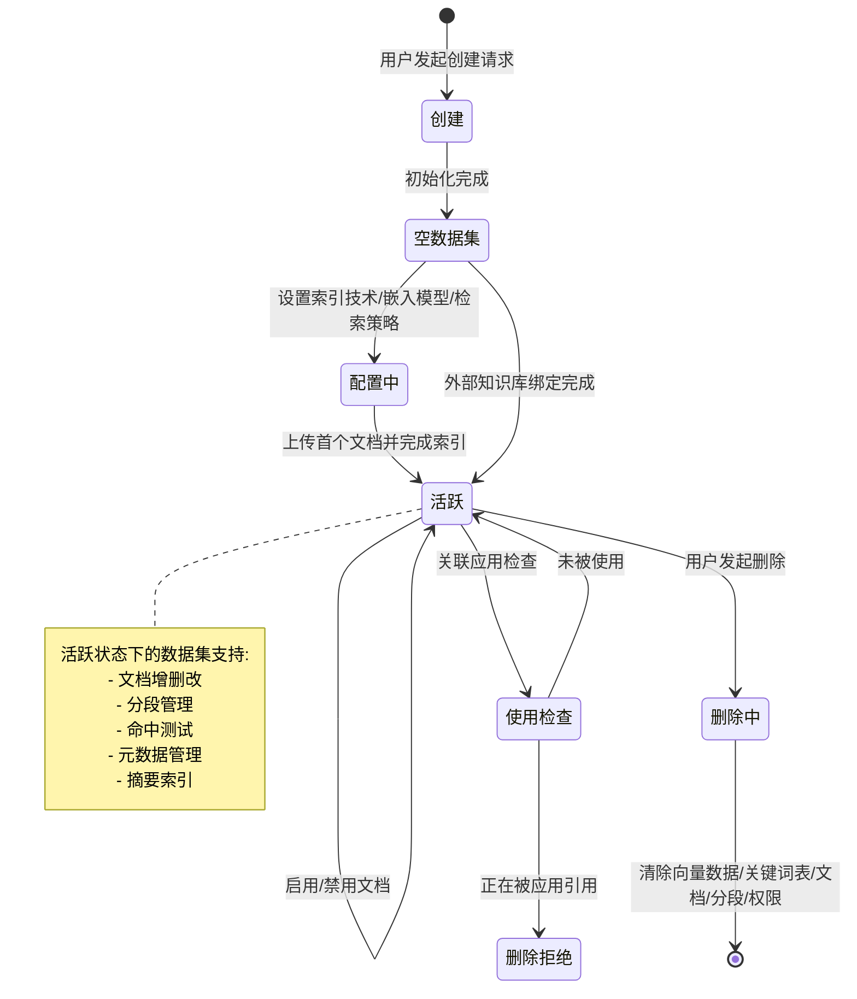
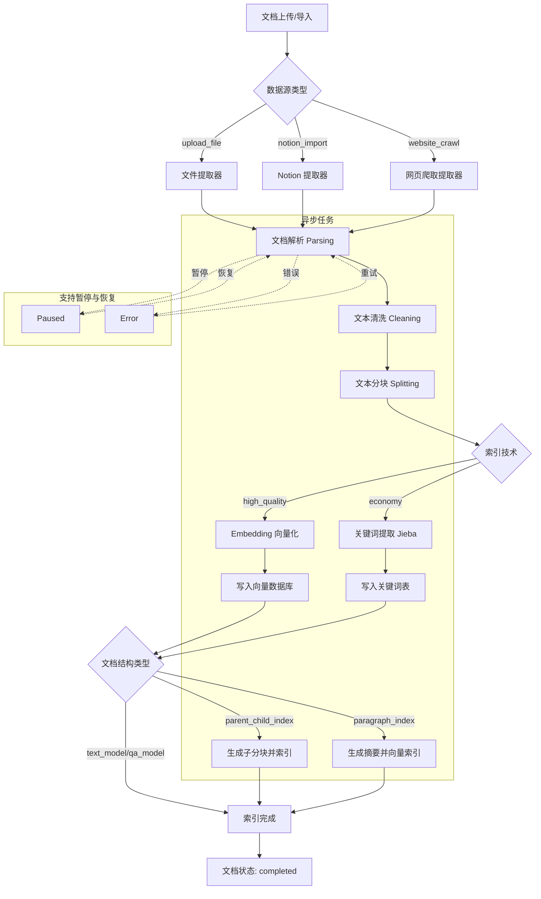
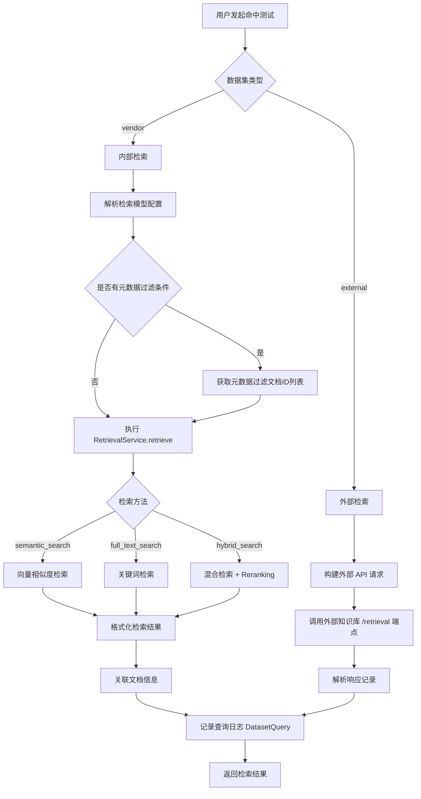
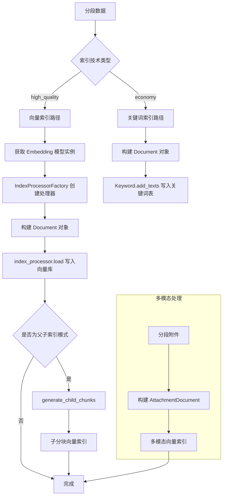

# Dify 数据集与文档管理功能文档

## 1. 数据集概述

数据集（Dataset）是 Dify 知识管理的核心实体，作为文档、分段和向量的容器，为 RAG（检索增强生成）管道提供结构化的知识存储与检索能力。每个数据集隶属于一个租户（Tenant），并支持多种索引技术、检索策略和权限控制。

### 1.1 核心模型

| 模型 | 说明 | 源码位置 |
|------|------|----------|
| `Dataset` | 数据集主模型，包含名称、描述、索引技术、嵌入模型等配置 | `api/models/dataset.py` |
| `Document` | 文档模型，记录数据来源、索引状态、处理规则等 | `api/models/dataset.py` |
| `DocumentSegment` | 文档分段模型，存储分块内容、向量索引节点、命中计数等 | `api/models/dataset.py` |
| `ChildChunk` | 子分块模型，用于父子索引模式下的层级分块 | `api/models/dataset.py` |
| `DatasetProcessRule` | 文档处理规则，定义分块策略和预处理规则 | `api/models/dataset.py` |
| `DocumentSegmentSummary` | 分段摘要模型，存储 LLM 生成的摘要及其向量化状态 | `api/models/dataset.py` |

### 1.2 数据集关键属性

| 属性 | 类型 | 说明 |
|------|------|------|
| `indexing_technique` | `IndexTechniqueType` | 索引技术：`high_quality`（高质量/向量索引）或 `economy`（经济/关键词索引） |
| `provider` | `str` | 数据集提供者：`vendor`（内置）、`external`（外部知识库） |
| `permission` | `DatasetPermissionEnum` | 权限模式：`only_me`、`all_team_members`、`partial_members` |
| `embedding_model` | `str` | 嵌入模型名称 |
| `embedding_model_provider` | `str` | 嵌入模型提供者 |
| `retrieval_model` | `JSON` | 检索模型配置（检索方法、重排序、Top-K 等） |
| `summary_index_setting` | `JSON` | 摘要索引配置 |
| `built_in_field_enabled` | `bool` | 是否启用内置元数据字段 |
| `is_multimodal` | `bool` | 是否支持多模态（图文混合） |
| `runtime_mode` | `DatasetRuntimeMode` | 运行模式：`general` 或 `rag_pipeline` |
| `chunk_structure` | `str` | 分块结构类型（对应 `doc_form`） |

### 1.3 索引技术类型

| 类型 | 标识 | 说明 |
|------|------|------|
| 高质量索引 | `high_quality` | 使用 Embedding 模型生成向量，支持语义检索、混合检索和重排序 |
| 经济索引 | `economy` | 使用关键词表（Jieba 分词），仅支持全文检索 |

### 1.4 文档结构类型（doc_form）

| 类型 | 标识 | 说明 |
|------|------|------|
| 文本模型 | `text_model` | 标准文本分段索引 |
| 问答模型 | `qa_model` | 问答对形式的索引 |
| 父子索引 | `parent_child_index` | 层级分块，父块与子块分别索引 |
| 段落索引 | `paragraph_index` | 段落级别索引，支持摘要生成 |

---

## 2. 数据集生命周期

数据集从创建到删除经历多个状态，以下状态图展示了完整的生命周期：



### 2.1 创建流程

数据集创建通过 `DatasetService.create_empty_dataset()` 完成，主要步骤：

1. **名称唯一性校验**：同一租户下数据集名称不可重复
2. **嵌入模型初始化**：若索引技术为 `high_quality`，需获取或配置 Embedding 模型实例
3. **重排序模型校验**：若配置了 Reranking 模型，需验证其可用性
4. **数据集记录创建**：写入 `datasets` 表
5. **外部知识库绑定**（可选）：若 `provider=external`，创建 `ExternalKnowledgeBindings` 记录

### 2.2 删除流程

数据集删除通过 `DatasetService.delete_dataset()` 完成，触发 `dataset_was_deleted` 事件：

1. **使用检查**：确认数据集未被任何应用引用
2. **向量数据清理**：删除向量数据库中的 Collection
3. **关键词表清理**：删除 `dataset_keyword_tables` 记录
4. **文档与分段清理**：级联删除关联的 Document、DocumentSegment、ChildChunk
5. **权限清理**：删除 `dataset_permissions` 记录
6. **元数据清理**：删除 `dataset_metadatas` 和 `dataset_metadata_bindings` 记录

---

## 3. 文档处理流程

文档从上传到可检索经历解析、清洗、分块和索引四个阶段：



### 3.1 文档索引状态

| 状态 | 标识 | 说明 |
|------|------|------|
| 等待中 | `waiting` | 文档已创建，等待索引任务调度 |
| 解析中 | `parsing` | 正在从数据源提取文本内容 |
| 清洗中 | `cleaning` | 正在执行预处理规则（去空格、去 URL 等） |
| 分块中 | `splitting` | 正在按规则将文本切分为分段 |
| 索引中 | `indexing` | 正在生成向量/关键词索引 |
| 已完成 | `completed` | 索引完成，文档可检索 |
| 错误 | `error` | 处理过程中发生错误 |

### 3.2 文档显示状态（display_status）

| 显示状态 | 条件 |
|----------|------|
| `queuing` | `indexing_status=waiting` |
| `paused` | 非完成/错误/等待状态且 `is_paused=True` |
| `indexing` | `indexing_status` 为 parsing/cleaning/splitting/indexing |
| `error` | `indexing_status=error` |
| `available` | `indexing_status=completed` 且未归档且已启用 |
| `disabled` | `indexing_status=completed` 且未归档且已禁用 |
| `archived` | `indexing_status=completed` 且已归档 |

### 3.3 处理规则（DatasetProcessRule）

处理规则定义了文档如何被分块，支持三种模式：

| 模式 | 标识 | 说明 |
|------|------|------|
| 自动 | `automatic` | 使用默认规则：分隔符 `\n`，最大 Token 500，重叠 50 |
| 自定义 | `custom` | 用户自定义分隔符、最大 Token 和预处理规则 |
| 层级 | `hierarchical` | 支持父子模式的层级分块 |

**预处理规则**：

| 规则 | 说明 |
|------|------|
| `remove_extra_spaces` | 去除多余空格 |
| `remove_urls_emails` | 去除 URL 和邮箱 |
| `remove_stopwords` | 去除停用词 |

### 3.4 提取器（Extractor）

`core/rag/extractor/` 目录包含多种文档格式的提取器：

| 提取器 | 支持格式 |
|--------|----------|
| `PDFExtractor` | PDF 文档 |
| `WordExtractor` | DOC/DOCX 文档 |
| `ExcelExtractor` | CSV/XLSX 表格 |
| `MarkdownExtractor` | Markdown 文档 |
| `HTMLExtractor` | HTML 网页 |
| `NotionExtractor` | Notion 页面 |
| `TextExtractor` | 纯文本文件 |
| `Unstructured*Extractor` | PPT/PPTX/EPUB/EML/MSG/XML 等（通过 Unstructured API） |
| `FirecrawlWebExtractor` | Firecrawl 网页爬取 |
| `JinaReaderExtractor` | Jina Reader 网页提取 |
| `WaterCrawlExtractor` | WaterCrawl 网页爬取 |

---

## 4. 分段管理

分段（DocumentSegment）是文档被分块后的最小索引单元，也是检索和引用的基本单位。

### 4.1 分段核心属性

| 属性 | 类型 | 说明 |
|------|------|------|
| `content` | `LongText` | 分段文本内容 |
| `position` | `int` | 分段在文档中的位置序号 |
| `word_count` | `int` | 字数统计 |
| `tokens` | `int` | Token 数量 |
| `index_node_id` | `str` | 向量数据库中的节点 ID |
| `index_node_hash` | `str` | 内容哈希值，用于去重检查 |
| `enabled` | `bool` | 是否启用（禁用后不参与检索） |
| `status` | `SegmentStatus` | 分段状态 |
| `hit_count` | `int` | 命中计数 |
| `keywords` | `JSON` | 关键词列表 |
| `answer` | `LongText` | 问答模式下的答案内容 |

### 4.2 分段状态

| 状态 | 标识 | 说明 |
|------|------|------|
| 等待中 | `waiting` | 等待索引 |
| 索引中 | `indexing` | 正在生成向量索引 |
| 已完成 | `completed` | 索引完成 |
| 错误 | `error` | 索引失败 |
| 重新分块 | `re_segment` | 文档重新分块时标记旧分段 |

### 4.3 分段操作

| 操作 | API 端点 | 说明 |
|------|----------|------|
| 列表查询 | `GET /datasets/{id}/documents/{id}/segments` | 支持关键词搜索、状态过滤、启用状态过滤 |
| 创建分段 | `POST /datasets/{id}/documents/{id}/segments` | 手动添加分段，支持关键词和附件 |
| 更新分段 | `POST /datasets/{id}/documents/{id}/segments/{id}` | 更新内容、关键词，触发向量重建 |
| 删除分段 | `DELETE /datasets/{id}/documents/{id}/segments/{id}` | 删除分段及其向量索引 |
| 批量导入 | `POST /datasets/{id}/documents/{id}/segments/batch_import` | 通过上传文件批量导入分段 |

### 4.4 子分块（ChildChunk）

在父子索引模式（`parent_child_index`）下，每个分段（父块）可包含多个子分块：

- 子分块独立进行向量索引，用于细粒度检索
- 检索时先匹配子分块，再返回其所属的父块内容
- 子分块支持创建、更新、删除操作
- 通过 `VectorService.generate_child_chunks()` 自动生成

### 4.5 分段摘要

在段落索引模式（`paragraph_index`）下，每个分段可生成 LLM 摘要：

- 摘要通过 `SummaryIndexService` 生成和向量化
- 摘要状态：`not_started` → `generating` → `completed` / `error`
- 摘要支持启用/禁用，禁用时从向量库中移除
- 摘要向量与分段向量存储在同一 Collection 中，通过 `is_summary=True` 元数据标识

---

## 5. 元数据管理

元数据服务（`MetadataService`）为数据集提供自定义元数据字段和内置字段的配置管理。

### 5.1 元数据类型

| 类型 | 标识 | 说明 |
|------|------|------|
| 字符串 | `string` | 文本类型元数据 |
| 时间 | `time` | 时间戳类型元数据 |

### 5.2 内置字段

当 `built_in_field_enabled=True` 时，系统自动为文档注入以下内置字段：

| 字段名 | 类型 | 值来源 |
|--------|------|--------|
| `document_name` | string | 文档名称 |
| `uploader` | string | 上传者姓名 |
| `upload_date` | time | 上传时间戳 |
| `last_update_date` | time | 最后更新时间戳 |
| `source` | string | 数据来源类型映射 |

### 5.3 元数据操作

| 操作 | 方法 | 说明 |
|------|------|------|
| 创建元数据 | `MetadataService.create_metadata()` | 在数据集下创建自定义元数据字段，名称不可与内置字段重复 |
| 更新元数据名称 | `MetadataService.update_metadata_name()` | 重命名元数据字段，同步更新关联文档的 `doc_metadata` |
| 删除元数据 | `MetadataService.delete_metadata()` | 删除元数据字段，同步清理关联文档的 `doc_metadata` |
| 启用内置字段 | `MetadataService.enable_built_in_field()` | 为所有工作文档注入内置字段值 |
| 禁用内置字段 | `MetadataService.disable_built_in_field()` | 从所有工作文档移除内置字段值 |
| 更新文档元数据 | `MetadataService.update_documents_metadata()` | 批量更新文档的元数据值，支持全量替换和增量更新 |

### 5.4 并发控制

元数据操作使用 Redis 分布式锁防止并发冲突：

- 知识库级锁：`dataset_metadata_lock_{dataset_id}`，有效期 3600 秒
- 文档级锁：`document_metadata_lock_{document_id}`，有效期 3600 秒

### 5.5 API 端点

| 端点 | 方法 | 说明 |
|------|------|------|
| `/datasets/{id}/metadata` | POST | 创建元数据字段 |
| `/datasets/{id}/metadata` | GET | 获取数据集元数据列表 |
| `/datasets/{id}/metadata/{id}` | PATCH | 更新元数据名称 |
| `/datasets/{id}/metadata/{id}` | DELETE | 删除元数据字段 |
| `/datasets/metadata/built-in` | GET | 获取内置字段列表 |
| `/datasets/{id}/metadata/built-in/enable` | POST | 启用内置字段 |
| `/datasets/{id}/metadata/built-in/disable` | POST | 禁用内置字段 |
| `/datasets/{id}/documents/metadata` | POST | 批量更新文档元数据 |

---

## 6. 命中测试

命中测试（Hit Testing）允许用户在数据集上执行检索查询，验证知识库的检索效果。

### 6.1 检索方法

| 方法 | 标识 | 说明 |
|------|------|------|
| 语义搜索 | `semantic_search` | 基于向量相似度的检索 |
| 全文搜索 | `full_text_search` | 基于关键词的全文检索 |
| 混合搜索 | `hybrid_search` | 语义 + 全文混合检索 |

### 6.2 检索流程



### 6.3 检索模型配置

| 参数 | 类型 | 默认值 | 说明 |
|------|------|--------|------|
| `search_method` | `RetrievalMethod` | `semantic_search` | 检索方法 |
| `reranking_enable` | `bool` | `false` | 是否启用重排序 |
| `reranking_model` | `dict` | - | 重排序模型配置 |
| `top_k` | `int` | 4 | 返回结果数量 |
| `score_threshold_enabled` | `bool` | `false` | 是否启用分数阈值 |
| `score_threshold` | `float` | 0.0 | 最低相关性分数 |
| `metadata_filtering_conditions` | `dict` | - | 元数据过滤条件 |

### 6.4 外部知识库命中测试

外部知识库的命中测试通过 `HitTestingService.external_retrieve()` 实现：

1. 验证数据集 `provider=external`
2. 调用 `RetrievalService.external_retrieve()` 向外部 API 发起检索请求
3. 外部 API 端点格式：`{endpoint}/retrieval`
4. 请求参数包含 `retrieval_setting`（top_k、score_threshold）、`query`、`knowledge_id`
5. 支持元数据过滤条件传递

### 6.5 API 端点

| 端点 | 方法 | 说明 |
|------|------|------|
| `/datasets/{id}/hit-testing` | POST | 内部知识库命中测试 |
| `/datasets/{id}/external-hit-testing` | POST | 外部知识库命中测试 |

---

## 7. 外部知识库

外部知识库集成（`ExternalDatasetService`）允许 Dify 对接第三方知识库系统，通过 API 调用实现知识检索。

### 7.1 架构模型

```mermaid
flowchart LR
    subgraph Dify
        A[Dataset<br/>provider=external] --> B[ExternalKnowledgeBindings]
        B --> C[ExternalKnowledgeApis]
    end

    subgraph 外部系统
        D[外部知识库 API]
        D --> E[/retrieval 端点]
    end

    C -->|HTTP 请求| D

    C -->|settings| F[endpoint + api_key]
```

### 7.2 核心模型

| 模型 | 说明 |
|------|------|
| `ExternalKnowledgeApis` | 外部知识库 API 模板，存储 endpoint、api_key 等连接配置 |
| `ExternalKnowledgeBindings` | 数据集与外部 API 的绑定关系，含 `external_knowledge_id` |

### 7.3 外部 API 配置

| 配置项 | 说明 |
|--------|------|
| `endpoint` | 外部 API 基础 URL（必须以 http:// 或 https:// 开头） |
| `api_key` | 认证密钥 |

### 7.4 外部 API 请求处理

`ExternalDatasetService.process_external_api()` 支持多种 HTTP 方法和认证方式：

**认证方式**：

| 类型 | 格式 |
|------|------|
| Bearer | `Authorization: Bearer {api_key}` |
| Basic | `Authorization: Basic {api_key}` |
| Custom | `{header}: {api_key}` |

**检索请求参数**：

```json
{
    "retrieval_setting": {
        "top_k": 2,
        "score_threshold": 0.5
    },
    "query": "搜索文本",
    "knowledge_id": "外部知识库ID",
    "metadata_condition": {}
}
```

### 7.5 安全措施

- **SSRF 防护**：所有外部请求通过 `ssrf_proxy` 代理发送
- **URL 校验**：验证 endpoint 格式合法性
- **连接测试**：创建 API 模板时验证 endpoint 可达性
- **租户隔离**：所有查询均按 `tenant_id` 过滤

### 7.6 API 端点

| 端点 | 方法 | 说明 |
|------|------|------|
| `/datasets/external-knowledge-api` | GET | 列出外部 API 模板 |
| `/datasets/external-knowledge-api` | POST | 创建外部 API 模板 |
| `/datasets/external-knowledge-api/{id}` | GET | 获取 API 模板详情 |
| `/datasets/external-knowledge-api/{id}` | PATCH | 更新 API 模板 |
| `/datasets/external-knowledge-api/{id}` | DELETE | 删除 API 模板 |
| `/datasets/external-knowledge-api/{id}/use-check` | GET | 检查 API 模板使用情况 |
| `/datasets/external` | POST | 创建外部知识库数据集 |

---

## 8. 数据集控制器

`api/controllers/console/datasets/` 目录包含所有数据集相关的 Console API 端点。

### 8.1 控制器文件结构

| 文件 | 说明 |
|------|------|
| `datasets.py` | 数据集 CRUD、索引估算、查询历史、API Key 管理 |
| `datasets_document.py` | 文档 CRUD、索引状态、重试、归档、批量操作 |
| `datasets_segments.py` | 分段 CRUD、批量导入、子分块管理 |
| `hit_testing.py` | 内部知识库命中测试 |
| `hit_testing_base.py` | 命中测试基类 |
| `metadata.py` | 元数据字段管理、内置字段控制、文档元数据更新 |
| `external.py` | 外部知识库 API 模板管理、外部数据集创建、外部命中测试 |
| `data_source.py` | 数据源导入（文件上传、Notion、网页爬取） |
| `website.py` | 网站爬取相关 API |
| `error.py` | 数据集相关错误定义 |
| `wraps.py` | 数据集权限校验装饰器 |
| `rag_pipeline/` | RAG Pipeline 相关控制器 |

### 8.2 核心 API 端点一览

#### 数据集管理

| 端点 | 方法 | 说明 |
|------|------|------|
| `/datasets` | GET | 获取数据集列表（分页、搜索、标签过滤） |
| `/datasets` | POST | 创建数据集 |
| `/datasets/{id}` | GET | 获取数据集详情 |
| `/datasets/{id}` | PATCH | 更新数据集配置 |
| `/datasets/{id}` | DELETE | 删除数据集 |
| `/datasets/{id}/use-check` | GET | 检查数据集是否被应用引用 |
| `/datasets/{id}/queries` | GET | 获取查询历史 |
| `/datasets/{id}/indexing-status` | GET | 获取索引状态 |
| `/datasets/{id}/related-apps` | GET | 获取关联应用列表 |
| `/datasets/{id}/error-docs` | GET | 获取错误文档列表 |
| `/datasets/{id}/permission-part-users` | GET | 获取部分权限用户列表 |
| `/datasets/{id}/auto-disable-logs` | GET | 获取自动禁用日志 |
| `/datasets/{id}/api-keys/{status}` | POST | 启用/禁用数据集 API |

#### 索引与检索配置

| 端点 | 方法 | 说明 |
|------|------|------|
| `/datasets/indexing-estimate` | POST | 估算索引成本 |
| `/datasets/retrieval-setting` | GET | 获取检索设置（基于当前向量库类型） |
| `/datasets/retrieval-setting/{vector_type}` | GET | 获取指定向量库类型的检索设置 |
| `/datasets/api-base-info` | GET | 获取 API 基础 URL |

#### API Key 管理

| 端点 | 方法 | 说明 |
|------|------|------|
| `/datasets/api-keys` | GET | 列出数据集 API Key |
| `/datasets/api-keys` | POST | 创建数据集 API Key（最多 10 个） |
| `/datasets/api-keys/{id}` | DELETE | 删除数据集 API Key |

### 8.3 通用装饰器

| 装饰器 | 说明 |
|--------|------|
| `@setup_required` | 系统初始化检查 |
| `@login_required` | 登录认证 |
| `@account_initialization_required` | 账户初始化检查 |
| `@enterprise_license_required` | 企业许可证检查 |
| `@cloud_edition_billing_rate_limit_check` | 云版计费速率限制 |
| `@cloud_edition_billing_resource_check` | 云版计费资源检查 |
| `@cloud_edition_billing_knowledge_limit_check` | 云版知识库限制检查 |

---

## 9. 向量服务

向量服务（`VectorService`）负责管理分段和子分块在向量数据库中的索引操作，是数据集检索能力的底层支撑。

### 9.1 核心方法

| 方法 | 说明 |
|------|------|
| `create_segments_vector()` | 为分段列表创建向量索引，支持文本和多模态文档 |
| `update_segment_vector()` | 更新单个分段的向量索引（先删后建） |
| `generate_child_chunks()` | 为父分段生成子分块并创建向量索引 |
| `create_child_chunk_vector()` | 为单个子分块创建向量索引 |
| `update_child_chunk_vector()` | 批量更新子分块向量（新增/修改/删除） |
| `delete_child_chunk_vector()` | 删除单个子分块向量 |
| `update_multimodel_vector()` | 更新分段的多模态附件向量索引 |

### 9.2 向量索引流程



### 9.3 向量数据库支持

`core/rag/datasource/vdb/` 目录包含多种向量数据库的实现：

| 向量库 | 标识 | 支持的检索方法 |
|--------|------|----------------|
| Qdrant | `qdrant` | 语义/全文/混合 |
| Weaviate | `weaviate` | 语义/全文/混合 |
| Milvus | `milvus` | 语义/全文/混合 |
| PGVector | `pgvector` | 语义/全文/混合 |
| OpenSearch | `opensearch` | 语义/全文/混合 |
| Elasticsearch | `elasticsearch` | 语义/全文/混合 |
| Chroma | `chroma` | 仅语义 |
| TiDB Vector | `tidb_vector` | 仅语义 |
| Relyt | `relyt` | 仅语义 |
| VikingDB | `vikingdb` | 仅语义 |
| Upstash | `upstash` | 仅语义 |

### 9.4 向量索引元数据

每个向量文档携带以下元数据：

| 字段 | 说明 |
|------|------|
| `doc_id` | 索引节点 ID（UUID） |
| `doc_hash` | 内容哈希值 |
| `document_id` | 所属文档 ID |
| `dataset_id` | 所属数据集 ID |
| `doc_type` | 文档类型（`TEXT` / `IMAGE`） |
| `is_summary` | 是否为摘要文档（仅摘要索引） |
| `original_chunk_id` | 原始分段 ID（仅摘要索引） |

### 9.5 向量操作模式

**高质量模式（high_quality）**：

- 使用 `Vector` 类操作向量数据库
- `add_texts()` 写入向量，支持 `duplicate_check` 去重
- `delete_by_ids()` 按节点 ID 删除向量
- 更新操作采用"先删后建"策略

**经济模式（economy）**：

- 使用 `Keyword` 类操作关键词表
- `add_texts()` 写入关键词，支持 `keywords_list` 自定义关键词
- `delete_by_ids()` 按节点 ID 删除关键词映射

### 9.6 Collection 命名规则

向量数据库中的 Collection 名称按以下规则生成：

```
{VECTOR_INDEX_NAME_PREFIX}_{dataset_id_normalized}_Node
```

其中 `dataset_id_normalized` 将 UUID 中的连字符替换为下划线。

---

## 附录：RAG 核心模块结构

```
core/rag/
├── cleaner/                  # 文本清洗
│   ├── cleaner_base.py
│   └── clean_processor.py
├── datasource/               # 数据源
│   ├── keyword/              # 关键词索引
│   │   ├── keyword_factory.py
│   │   ├── keyword_base.py
│   │   └── jieba/           # Jieba 分词实现
│   ├── vdb/                  # 向量数据库
│   │   ├── vector_factory.py
│   │   ├── vector_base.py
│   │   └── vector_type.py
│   └── retrieval_service.py  # 检索服务
├── embedding/                # 嵌入模型
│   ├── embedding_base.py
│   ├── cached_embedding.py
│   └── retrieval.py
├── entities/                 # 实体定义
│   ├── __init__.py           # ParentMode, Rule, MetadataFilteringCondition 等
│   ├── index_entities.py
│   ├── metadata_entities.py
│   └── retrieval_settings.py
├── extractor/                # 文档提取器
│   ├── extract_processor.py  # 提取处理器
│   ├── pdf_extractor.py
│   ├── word_extractor.py
│   ├── excel_extractor.py
│   ├── markdown_extractor.py
│   ├── html_extractor.py
│   ├── notion_extractor.py
│   ├── text_extractor.py
│   ├── csv_extractor.py
│   ├── unstructured/         # Unstructured API 提取器
│   ├── firecrawl/            # Firecrawl 网页爬取
│   ├── jina_reader_extractor.py
│   └── watercrawl/           # WaterCrawl 网页爬取
├── index_processor/          # 索引处理器
│   ├── index_processor_base.py
│   ├── index_processor_factory.py
│   ├── constant/             # 常量定义
│   │   ├── index_type.py     # IndexStructureType, IndexTechniqueType
│   │   ├── doc_type.py       # DocType
│   │   ├── query_type.py     # QueryType
│   │   └── built_in_field.py # BuiltInField
│   └── processor/            # 各类型处理器
│       ├── paragraph_index_processor.py
│       ├── parent_child_index_processor.py
│       └── qa_index_processor.py
├── models/                   # RAG 文档模型
│   └── document.py           # Document, AttachmentDocument
├── rerank/                   # 重排序
│   ├── rerank_factory.py
│   ├── rerank_model.py
│   └── weight_rerank.py
├── retrieval/                # 检索
│   ├── dataset_retrieval.py  # 数据集检索核心
│   ├── retrieval_methods.py  # 检索方法枚举
│   ├── router/               # 多数据集路由
│   └── output_parser/        # 输出解析
├── splitter/                 # 文本分割器
│   ├── fixed_text_splitter.py
│   └── text_splitter.py
├── summary_index/            # 摘要索引
│   └── summary_index.py
├── data_post_processor/      # 数据后处理
│   ├── data_post_processor.py
│   └── reorder.py            # 重排序后处理
├── docstore/                 # 文档存储
│   └── dataset_docstore.py
└── pipeline/                 # RAG 管道
    └── queue.py
```
