# Dify MCP (Model Context Protocol) 集成功能文档

## 1. MCP 概述

### 1.1 什么是 MCP

MCP (Model Context Protocol) 是一种开放协议，为 LLM 应用提供与外部数据源和工具交互的标准化方式。MCP 定义了客户端与服务器之间的通信规范，支持工具调用、资源访问、提示词模板等核心能力，采用 JSON-RPC 2.0 作为消息传输格式。

### 1.2 Dify 如何集成 MCP 协议

Dify 在 MCP 生态中同时扮演 **客户端** 和 **服务器** 两种角色：

| 角色 | 说明 |
|------|------|
| **MCP 客户端** | Dify 作为客户端连接外部 MCP 服务器，发现并调用远程工具，将 MCP 工具集成到 Dify 的 Tool 系统中供工作流和 Agent 使用 |
| **MCP 服务器** | Dify 将自身应用（Chat/Workflow/Completion 等）暴露为 MCP 工具，允许外部 MCP 客户端通过标准协议调用 Dify 应用 |

Dify 支持的 MCP 传输协议：

| 传输方式 | 实现模块 | 说明 |
|----------|----------|------|
| **Streamable HTTP** | `client/streamable_client.py` | MCP 协议推荐的传输方式，支持 HTTP POST + SSE 流式响应，支持会话管理 |
| **SSE (Server-Sent Events)** | `client/sse_client.py` | 传统传输方式，通过 SSE 接收消息、HTTP POST 发送消息 |

### 1.3 协议版本支持

| 版本 | 用途 |
|------|------|
| `2024-11-05` | 服务器端支持版本（兼容 Claude 客户端） |
| `2025-03-26` | 默认协商版本 |
| `2025-06-18` | 客户端最新支持版本 |

---

## 2. MCP 架构

### 2.1 整体架构图

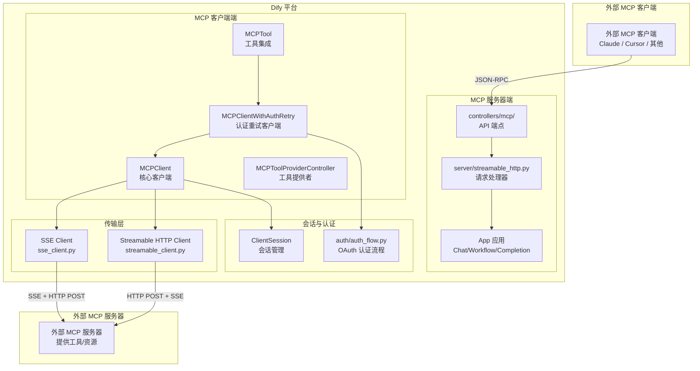

### 2.2 核心模块依赖关系

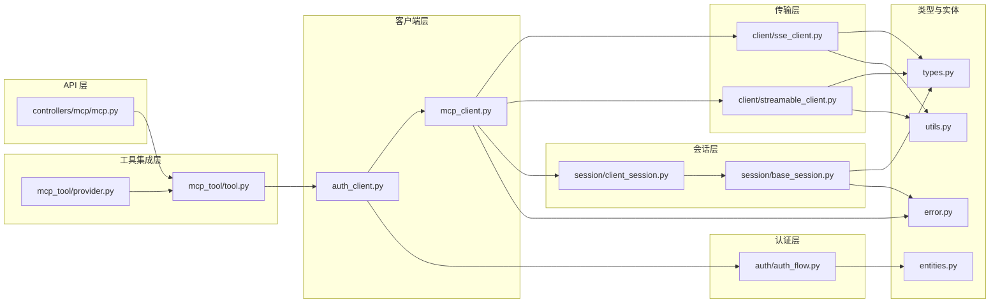

### 2.3 目录结构

```
api/core/mcp/
├── __init__.py                    # 模块模块初始化
├── mcp_client.py                  # MCP 客户端核心类
├── auth_client.py                 # 带认证重试的 MCP 客户端
├── entities.py                    # 实体定义（AuthAction、OAuthCallbackState 等）
├── types.py                       # MCP 协议类型定义（JSON-RPC、Tool、Resource 等）
├── error.py                       # 错误类型定义
├── utils.py                       # 工具函数（SSRF 代理、HTTP 客户端创建等）
├── auth/
│   └── auth_flow.py               # OAuth 2.0 认证流程实现
├── client/
│   ├── sse_client.py              # SSE 传输客户端
│   └── streamable_client.py       # Streamable HTTP 传输客户端
├── server/
│   └── streamable_http.py         # MCP 服务器端请求处理
└── session/
    ├── base_session.py            # 会话基类
    └── client_session.py          # 客户端会话实现
```

---

## 3. MCP 客户端

### 3.1 MCPClient 核心类

`MCPClient` 是 Dify 与外部 MCP 服务器交互的核心入口，位于 [mcp_client.py](file:///home/project/dify/api/core/mcp/mcp_client.py)。它实现了上下文管理器协议，支持自动连接和资源清理。

#### 关键属性

| 属性 | 类型 | 说明 |
|------|------|------|
| `server_url` | `str` | MCP 服务器 URL |
| `headers` | `dict[str, str]` | 请求头 |
| `timeout` | `float \| None` | 请求超时时间 |
| `sse_read_timeout` | `float \| None` | SSE 读取超时时间 |
| `_session` | `ClientSession \| None` | 当前活跃的客户端会话 |
| `_exit_stack` | `ExitStack` | 上下文管理器栈，用于资源管理 |

#### 连接初始化流程

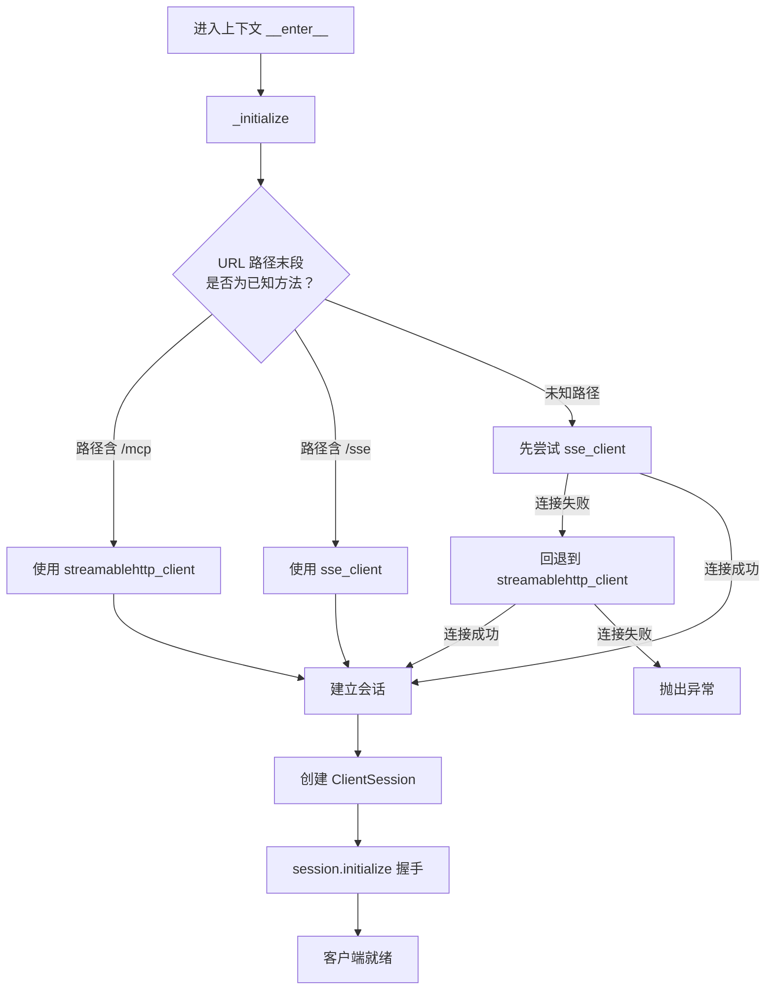

#### 核心方法

| 方法 | 说明 |
|------|------|
| `__enter__()` | 进入上下文，自动初始化连接 |
| `__exit__()` | 退出上下文，自动清理资源 |
| `list_tools()` | 列出 MCP 服务器提供的所有工具 |
| `invoke_tool(tool_name, tool_args)` | 调用指定工具 |
| `cleanup()` | 手动清理连接资源 |

#### 使用示例

```python
with MCPClient(
    server_url="https://mcp-server.example.com/mcp",
    headers={"Authorization": "Bearer token"},
    timeout=30,
) as client:
    tools = client.list_tools()
    result = client.invoke_tool("search", {"query": "hello"})
```

### 3.2 传输自动选择策略

`MCPClient` 根据服务器 URL 的路径末段自动选择传输方式：

| URL 路径 | 传输方式 |
|----------|----------|
| `https://server.com/mcp` | Streamable HTTP |
| `https://server.com/sse` | SSE |
| `https://server.com/other` | 先尝试 SSE，失败后回退到 Streamable HTTP |

---

## 4. MCP 认证

### 4.1 认证架构概览

Dify MCP 客户端支持完整的 OAuth 2.0 认证流程，位于 [auth/](file:///home/project/dify/api/core/mcp/auth) 目录和 [auth_client.py](file:///home/project/dify/api/core/mcp/auth_client.py)。

### 4.2 认证错误类型

| 错误类 | 继承关系 | 说明 |
|--------|----------|------|
| `MCPError` | `Exception` | MCP 基础错误 |
| `MCPConnectionError` | `MCPError` | 连接错误 |
| `MCPAuthError` | `MCPConnectionError` | 认证错误，可从 HTTP 401 响应中提取 `resource_metadata_url` 和 `scope_hint` |
| `MCPRefreshTokenError` | `MCPError` | Token 刷新失败 |

### 4.3 OAuth 2.0 认证流程

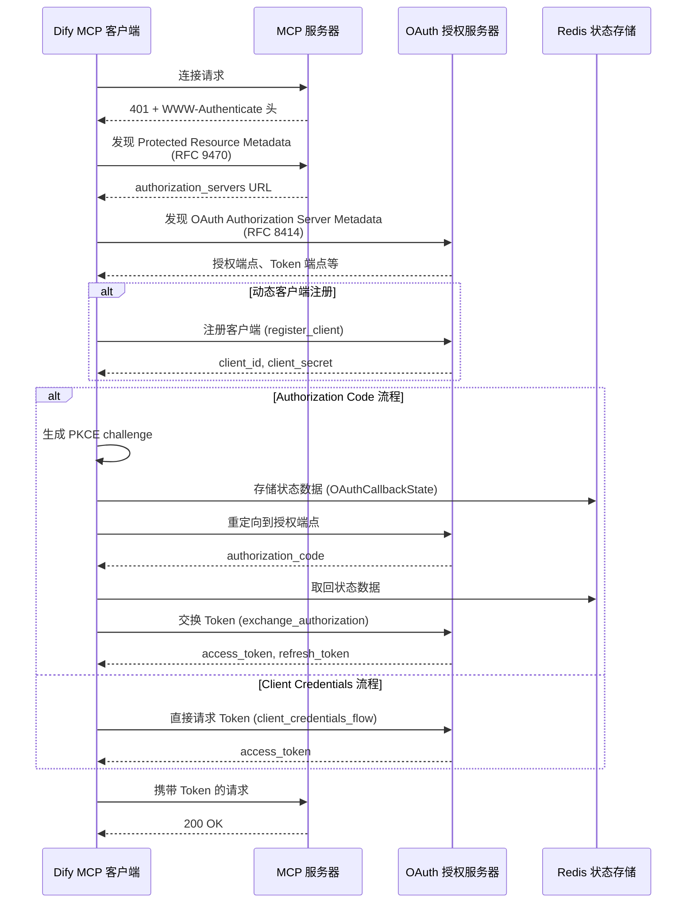

### 4.4 auth_flow.py 核心函数

| 函数 | 说明 |
|------|------|
| `discover_oauth_metadata()` | 发现 OAuth 元数据（RFC 8414/9470） |
| `discover_protected_resource_metadata()` | 发现受保护资源元数据 |
| `discover_oauth_authorization_server_metadata()` | 发现授权服务器元数据 |
| `register_client()` | OAuth 2.0 动态客户端注册 |
| `start_authorization()` | 启动授权码流程，生成 PKCE 挑战 |
| `exchange_authorization()` | 用授权码交换 Token |
| `refresh_authorization()` | 用刷新令牌获取新 Token |
| `client_credentials_flow()` | 客户端凭证流程 |
| `handle_callback()` | 处理 OAuth 回调 |
| `auth()` | 完整认证流程编排 |
| `check_support_resource_discovery()` | 检查服务器是否支持资源发现 |

### 4.5 支持的授权类型

| 授权类型 | 枚举值 | 说明 |
|----------|--------|------|
| Authorization Code | `authorization_code` | 需要用户交互的授权码流程，支持 PKCE |
| Client Credentials | `client_credentials` | 无需用户交互，直接使用客户端凭证获取 Token |
| Refresh Token | `refresh_token` | 使用刷新令牌获取新的访问令牌 |

### 4.6 认证作用域优先级

Dify 按以下优先级确定有效的 OAuth 作用域：

| 优先级 | 来源 | 说明 |
|--------|------|------|
| 1 | WWW-Authenticate 头 | 服务器显式要求 |
| 2 | Protected Resource Metadata | 受保护资源元数据中的 scopes_supported |
| 3 | OAuth Authorization Server Metadata | 授权服务器元数据中的 scopes_supported |
| 4 | 客户端配置 | 用户配置的 scope |

### 4.7 MCPClientWithAuthRetry

`MCPClientWithAuthRetry` 继承自 `MCPClient`，提供自动认证重试能力：

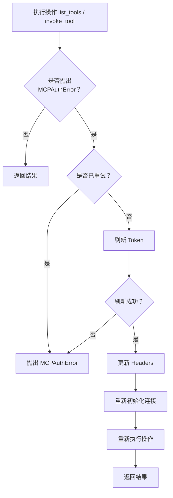

关键特性：
- **惰性数据库会话**：仅在认证重试时创建数据库会话，最小化连接占用时间
- **单次重试**：每次操作最多重试一次，避免无限循环
- **自动重连**：Token 刷新后自动重新初始化 MCP 连接

### 4.8 OAuth 状态存储

OAuth 回调流程中的状态数据通过 Redis 安全存储：

| 配置 | 值 |
|------|-----|
| Redis Key 前缀 | `oauth_state:` |
| 过期时间 | 5 分钟 |
| State Key | `secrets.token_urlsafe(32)` 生成的随机密钥 |
| 存储内容 | `OAuthCallbackState`（provider_id、tenant_id、server_url、code_verifier 等） |

状态数据在读取后立即删除，防止重放攻击。

---

## 5. MCP 服务器

### 5.1 服务器端实现

Dify 的 MCP 服务器端实现位于 [server/streamable_http.py](file:///home/project/dify/api/core/mcp/server/streamable_http.py)，将 Dify 应用暴露为 MCP 工具供外部客户端调用。

### 5.2 请求处理流程

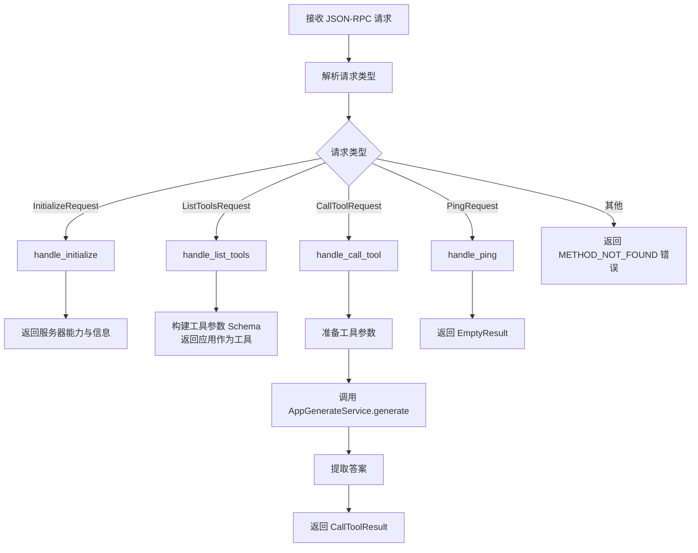

### 5.3 支持的 MCP 方法

| 方法 | 处理函数 | 说明 |
|------|----------|------|
| `initialize` | `handle_initialize()` | 服务器握手，返回协议版本、服务器能力 |
| `tools/list` | `handle_list_tools()` | 列出可用工具（即 Dify 应用本身） |
| `tools/call` | `handle_call_tool()` | 调用工具（执行 Dify 应用） |
| `ping` | `handle_ping()` | 心跳检测 |

### 5.4 服务器能力声明

服务器在 `initialize` 响应中声明以下能力：

```python
ServerCapabilities(
    tools=ToolsCapability(listChanged=False),
)
```

| 能力 | 值 | 说明 |
|------|-----|------|
| `tools` | `listChanged=False` | 支持工具列表，但不支持变更通知 |
| `resources` | 不支持 | — |
| `prompts` | 不支持 | — |
| `sampling` | 不支持 | — |
| `logging` | 不支持 | — |

### 5.5 工具参数 Schema 构建

Dify 根据应用模式构建不同的工具参数 Schema：

| 应用模式 | 参数结构 |
|----------|----------|
| Chat / Agent Chat | `query` (必填) + 其他参数 |
| Workflow | 仅 `inputs` 对象 |
| Completion | 仅 `inputs` 对象 |

参数类型映射：

| Dify 变量类型 | JSON Schema 类型 |
|---------------|------------------|
| TEXT_INPUT / PARAGRAPH | `string` |
| SELECT | `string` + `enum` |
| NUMBER | `number` |
| CHECKBOX | `boolean` |
| JSON_OBJECT | `object`（含 properties/required） |
| FILE / FILE_LIST / EXTERNAL_DATA_TOOL | 跳过（不支持） |

### 5.6 工具调用与响应处理

当外部客户端调用 `tools/call` 时：

1. 解析工具参数，根据应用模式准备调用参数
2. 通过 `AppGenerateService.generate()` 执行 Dify 应用
3. 根据响应类型提取答案：
   - **流式响应**（Agent Chat）：从 SSE 事件中提取 `agent_thought` 内容
   - **映射响应**：根据应用模式提取 `answer` 或 `outputs`
4. 将答案封装为 `CallToolResult` 返回

---

## 6. MCP 会话管理

### 6.1 会话层级结构

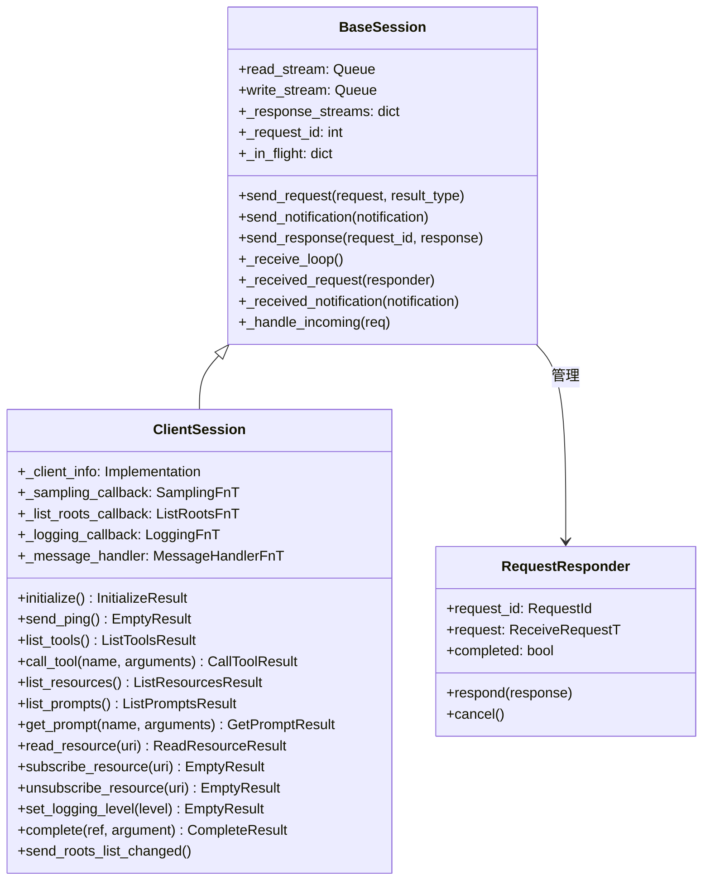

### 6.2 BaseSession 基类

`BaseSession` 位于 [session/base_session.py](file:///home/project/dify/api/core/mcp/session/base_session.py)，是所有 MCP 会话的基类，实现了 MCP 协议的核心通信机制。

#### 核心机制

| 机制 | 说明 |
|------|------|
| **请求-响应关联** | 通过 `request_id` 将请求与响应对应，支持并发请求 |
| **通知发送** | 单向消息，不期望响应 |
| **请求取消** | 通过 `CancelledNotification` 取消正在处理的请求 |
| **消息接收循环** | 在独立线程中运行 `_receive_loop`，持续处理传入消息 |
| **超时控制** | 支持会话级和请求级读取超时 |

#### 消息处理流程

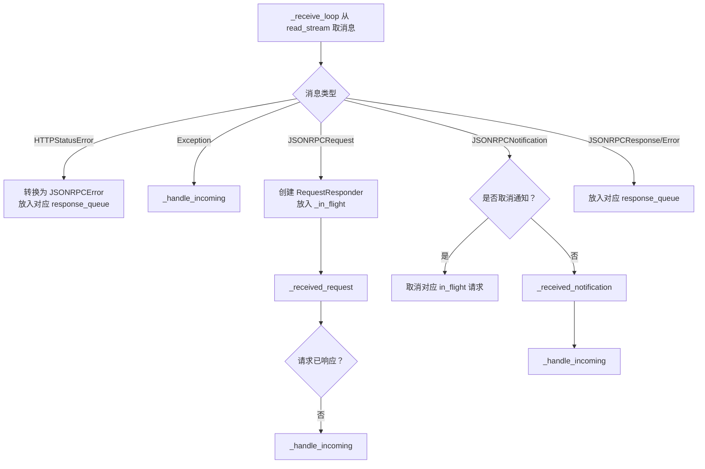

#### RequestResponder

`RequestResponder` 管理单个请求的生命周期，**必须**作为上下文管理器使用：

- `respond(response)` — 发送成功或错误响应
- `cancel()` — 取消请求并发送错误响应
- 上下文退出时自动通知完成回调

### 6.3 ClientSession 客户端会话

`ClientSession` 位于 [session/client_session.py](file:///home/project/dify/api/core/mcp/session/client_session.py)，继承自 `BaseSession`，提供完整的 MCP 客户端操作接口。

#### 初始化握手

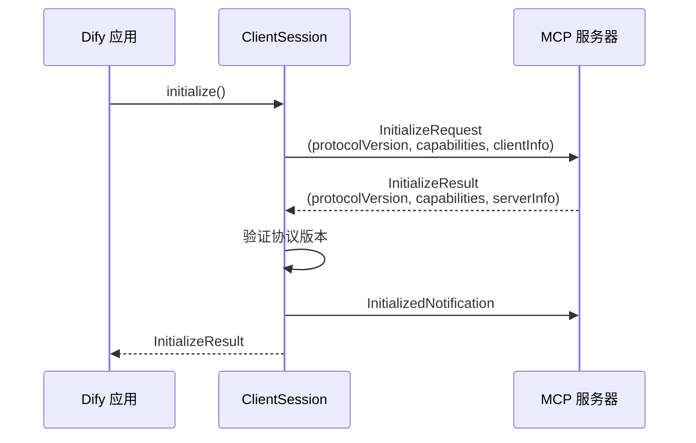

#### 支持的客户端操作

| 方法 | MCP 协议方法 | 返回类型 |
|------|-------------|----------|
| `initialize()` | `initialize` | `InitializeResult` |
| `send_ping()` | `ping` | `EmptyResult` |
| `list_tools()` | `tools/list` | `ListToolsResult` |
| `call_tool(name, arguments)` | `tools/call` | `CallToolResult` |
| `list_resources()` | `resources/list` | `ListResourcesResult` |
| `list_resource_templates()` | `resources/templates/list` | `ListResourceTemplatesResult` |
| `read_resource(uri)` | `resources/read` | `ReadResourceResult` |
| `subscribe_resource(uri)` | `resources/subscribe` | `EmptyResult` |
| `unsubscribe_resource(uri)` | `resources/unsubscribe` | `EmptyResult` |
| `list_prompts()` | `prompts/list` | `ListPromptsResult` |
| `get_prompt(name, arguments)` | `prompts/get` | `GetPromptResult` |
| `complete(ref, argument)` | `completion/complete` | `CompleteResult` |
| `set_logging_level(level)` | `logging/setLevel` | `EmptyResult` |
| `send_roots_list_changed()` | `notifications/roots/list_changed` | — (通知) |
| `send_progress_notification(token, progress)` | `notifications/progress` | — (通知) |

#### 服务端请求回调

`ClientSession` 支持以下来自服务端的请求回调：

| 回调 | 触发条件 | 默认行为 |
|------|----------|----------|
| `sampling_callback` | 服务端发起 `sampling/createMessage` | 返回 "Sampling not supported" 错误 |
| `list_roots_callback` | 服务端发起 `roots/list` | 返回 "List roots not supported" 错误 |
| `logging_callback` | 服务端发送日志通知 | 忽略 |
| `message_handler` | 接收到任意服务端消息 | 忽略 |

---

## 7. MCP 工具集成

### 7.1 集成架构

Dify 通过 `mcp_tool/` 模块将 MCP 远程工具桥接到 Dify 的 Tool 系统，使 MCP 工具可以像内置工具一样在工作流和 Agent 中使用。

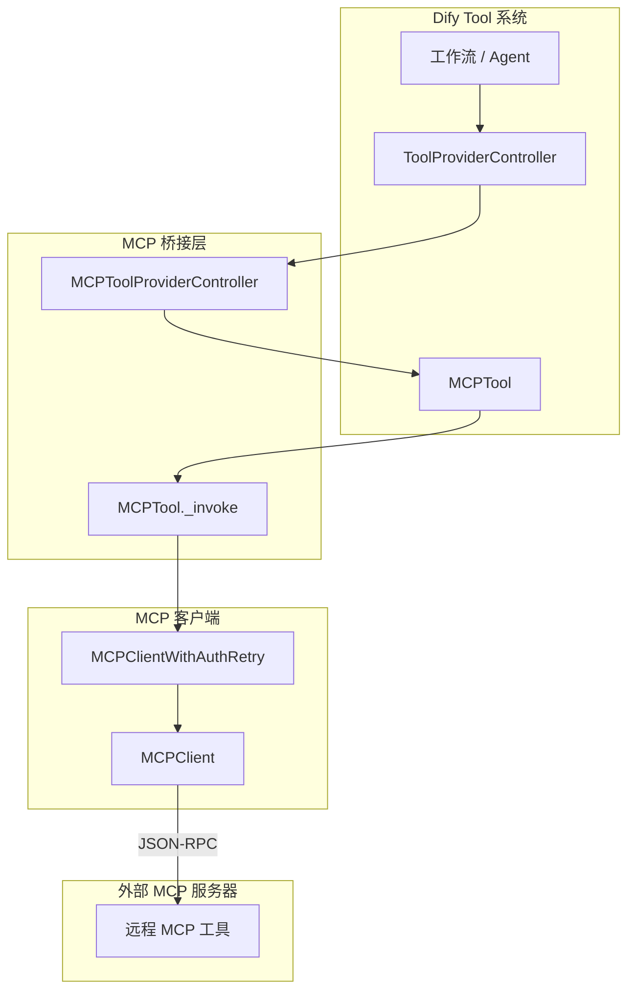

### 7.2 MCPToolProviderController

`MCPToolProviderController` 位于 [provider.py](file:///home/project/dify/api/core/tools/mcp_tool/provider.py)，是 MCP 工具的提供者控制器，负责将远程 MCP 工具转换为 Dify 工具实体。

#### 核心职责

| 职责 | 说明 |
|------|------|
| 工具发现 | 从 `MCPProviderEntity` 中提取远程工具列表 |
| Schema 转换 | 将 MCP 工具的 `inputSchema` 转换为 Dify 工具参数格式 |
| 工具实例化 | 创建 `MCPTool` 实例供工作流调用 |

#### 工厂方法

| 方法 | 说明 |
|------|------|
| `from_db(db_provider)` | 从数据库模型创建控制器 |
| `from_entity(entity)` | 从 `MCPProviderEntity` 创建控制器 |
| `get_tool(tool_name)` | 获取指定名称的工具 |
| `get_tools()` | 获取所有工具 |

### 7.3 MCPTool

`MCPTool` 位于 [tool.py](file:///home/project/dify/api/core/tools/mcp_tool/tool.py)，继承自 Dify 的 `Tool` 基类，封装了对远程 MCP 工具的调用逻辑。

#### 工具调用流程

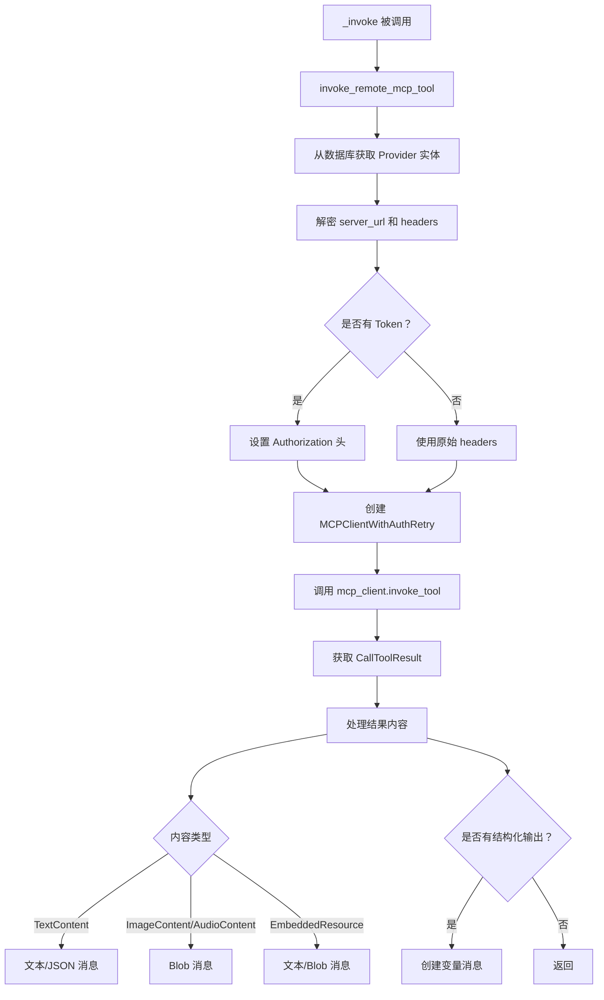

#### 内容类型处理

| MCP 内容类型 | Dify 消息类型 | 说明 |
|--------------|--------------|------|
| `TextContent` | `create_text_message` / `create_json_message` | 自动检测 JSON 格式，分别处理对象、数组和纯文本 |
| `ImageContent` | `create_blob_message` | Base64 解码后以 Blob 消息返回 |
| `AudioContent` | `create_blob_message` | Base64 解码后以 Blob 消息返回 |
| `EmbeddedResource` (Text) | `create_text_message` | 嵌入式文本资源 |
| `EmbeddedResource` (Blob) | `create_blob_message` | 嵌入式二进制资源 |

#### Usage 元数据提取

`MCPTool` 从 MCP 工具调用结果的 `_meta` 字段中递归提取 Usage 信息，支持以下格式：

- 直接 `usage` 字段：`{"usage": {...}}`
- 嵌套在 `metadata` 中：`{"metadata": {"usage": {...}}}`
- 直接包含 Token 计数字段：`total_tokens`、`prompt_tokens`、`completion_tokens` 等

### 7.4 MCP Schema 到 Dify 参数转换

`ToolTransformService.convert_mcp_schema_to_parameter()` 将 MCP 工具的 JSON Schema `inputSchema` 转换为 Dify 工具参数格式，使 MCP 工具可以无缝接入 Dify 的工作流参数系统。

---

## 8. MCP 控制器

### 8.1 API 端点

Dify 的 MCP 控制器位于 [controllers/mcp/](file:///home/project/dify/api/controllers/mcp/)，提供 RESTful API 端点供外部 MCP 客户端访问。

#### 端点信息

| 属性 | 值 |
|------|-----|
| Blueprint | `mcp` |
| URL 前缀 | `/mcp` |
| API 标题 | `MCP API` |
| 命名空间 | `mcp_ns` |

#### 核心 API

| HTTP 方法 | 路径 | 说明 |
|-----------|------|------|
| POST | `/mcp/server/<server_code>/mcp` | 处理 MCP JSON-RPC 请求 |

### 8.2 请求处理流程

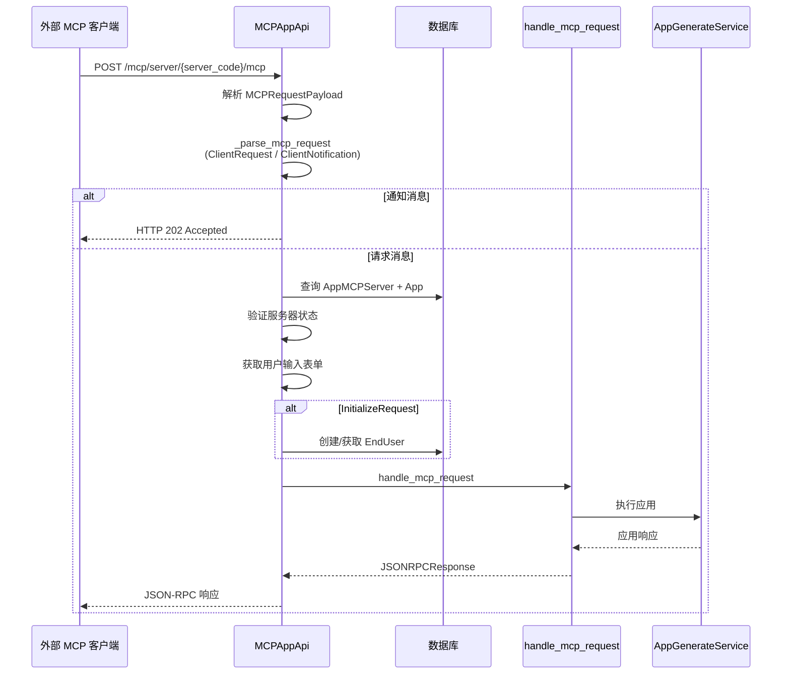

### 8.3 MCPRequestPayload 结构

| 字段 | 类型 | 必填 | 说明 |
|------|------|------|------|
| `jsonrpc` | `str` | 是 | JSON-RPC 版本，应为 `"2.0"` |
| `method` | `str` | 是 | 要调用的方法名 |
| `params` | `dict[str, Any] \| None` | 否 | 方法参数 |
| `id` | `int \| str \| None` | 否 | 请求 ID，用于跟踪响应 |

### 8.4 请求解析策略

控制器首先尝试将请求解析为 `ClientRequest`，失败后尝试解析为 `ClientNotification`：

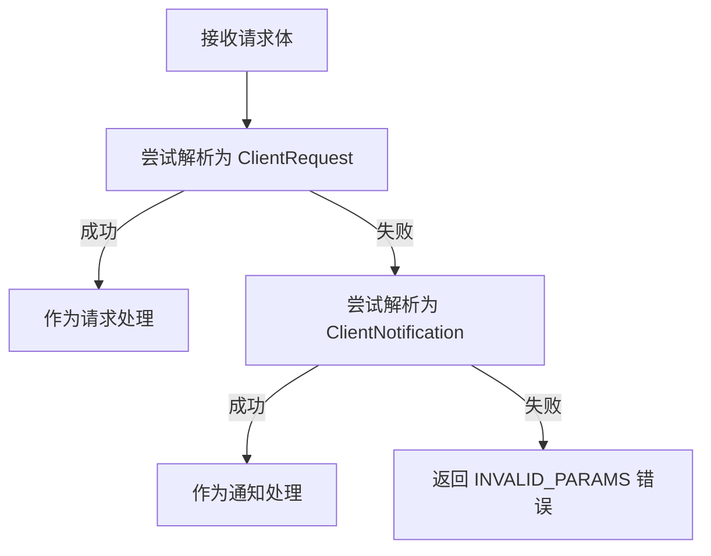

### 8.5 EndUser 管理

当外部客户端首次发起 `InitializeRequest` 时，控制器会自动创建一个 `EndUser` 记录：

| 字段 | 值 |
|------|-----|
| `type` | `"mcp"` |
| `name` | `{clientInfo.name}@{clientInfo.version}` |
| `session_id` | MCP 服务器 ID |
| `tenant_id` | 应用所属租户 ID |
| `app_id` | 关联应用 ID |

### 8.6 错误处理

| HTTP 状态码 | 场景 |
|-------------|------|
| 202 | 通知消息已接受 |
| 400 | 无效的 MCP 请求或参数 |
| 404 | 服务器或应用未找到 |

MCP 协议级错误码：

| 错误码 | 含义 |
|--------|------|
| `-32700` | Parse Error（解析错误） |
| `-32600` | Invalid Request（无效请求） |
| `-32601` | Method Not Found（方法未找到） |
| `-32602` | Invalid Params（无效参数） |
| `-32603` | Internal Error（内部错误） |

---

## 附录 A：SSRF 安全防护

所有 MCP 客户端的 HTTP 请求均通过 SSRF 代理进行安全防护，由 [utils.py](file:///home/project/dify/api/core/mcp/utils.py) 中的工具函数实现：

| 函数 | 说明 |
|------|------|
| `create_ssrf_proxy_mcp_http_client()` | 创建带 SSRF 代理配置的 HTTPX 客户端 |
| `ssrf_proxy_sse_connect()` | 通过 SSRF 代理建立 SSE 连接 |

代理配置优先级：

1. `SSRF_PROXY_ALL_URL` — 统一代理
2. `SSRF_PROXY_HTTP_URL` + `SSRF_PROXY_HTTPS_URL` — 分协议代理
3. 无代理直连

## 附录 B：MCP 协议类型体系

`types.py` 定义了完整的 MCP 协议类型，基于 Pydantic V2 模型：

### JSON-RPC 基础类型

| 类型 | 说明 |
|------|------|
| `JSONRPCRequest` | JSON-RPC 请求 |
| `JSONRPCNotification` | JSON-RPC 通知（不期望响应） |
| `JSONRPCResponse` | JSON-RPC 成功响应 |
| `JSONRPCError` | JSON-RPC 错误响应 |
| `JSONRPCMessage` | 联合类型，自动识别消息类型 |

### MCP 能力类型

| 类型 | 说明 |
|------|------|
| `ClientCapabilities` | 客户端能力声明（sampling、roots 等） |
| `ServerCapabilities` | 服务器能力声明（tools、resources、prompts 等） |

### MCP 操作类型

| 类型 | 说明 |
|------|------|
| `Tool` | 工具定义 |
| `Resource` | 资源定义 |
| `Prompt` | 提示词模板定义 |
| `CallToolResult` | 工具调用结果 |
| `ContentBlock` | 内容块（Text/Image/Audio/ResourceLink/EmbeddedResource） |

### OAuth 类型

| 类型 | 说明 |
|------|------|
| `OAuthClientMetadata` | OAuth 客户端元数据 |
| `OAuthClientInformation` | OAuth 客户端信息（client_id、client_secret） |
| `OAuthTokens` | OAuth 令牌（access_token、refresh_token） |
| `OAuthMetadata` | OAuth 授权服务器元数据 |
| `ProtectedResourceMetadata` | 受保护资源元数据（RFC 9470） |
