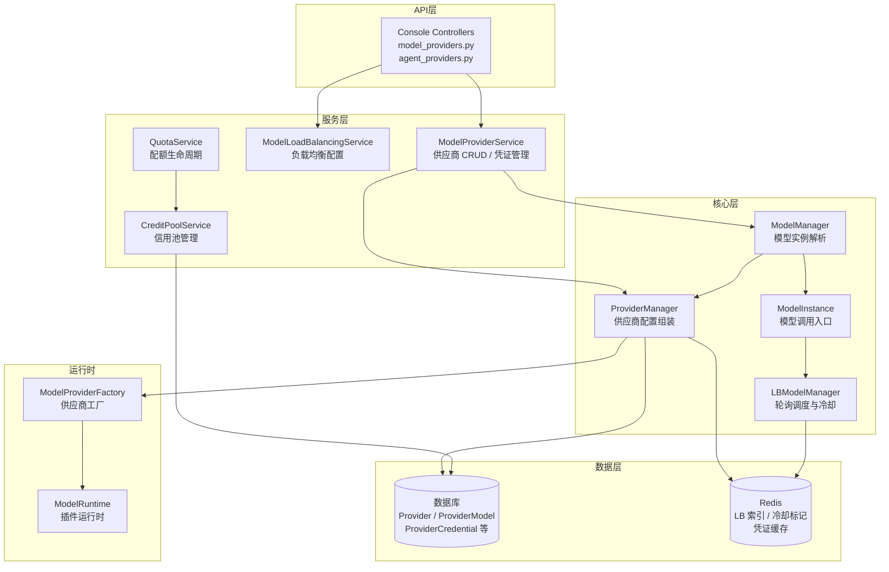
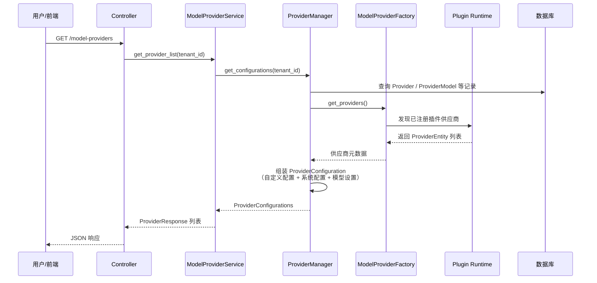
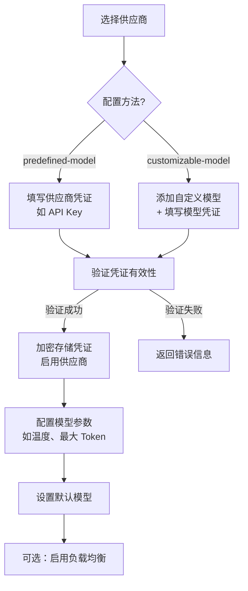
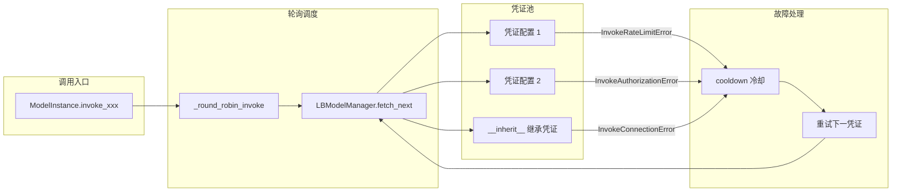
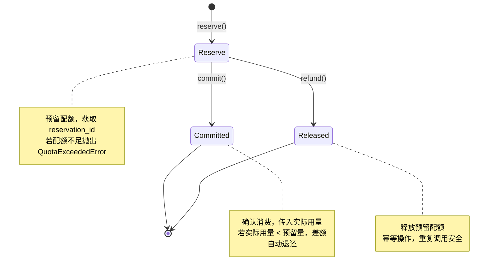
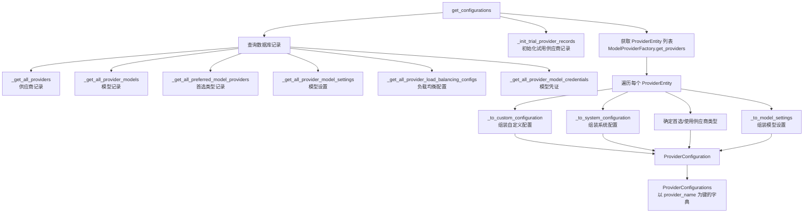
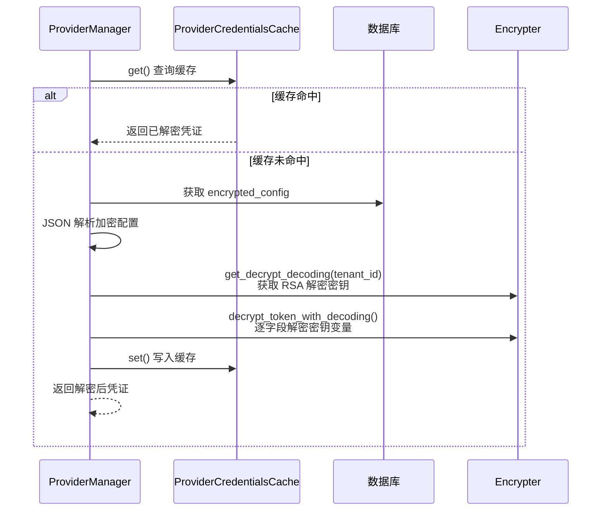

# Model Provider 模型供应商管理

## 1. Model Provider 概述

Model Provider 是 Dify 中管理 LLM 模型供应商的核心模块，负责统一接入、配置和调度各类 AI 模型服务。该模块为上层应用（工作流、Agent、RAG 等）提供透明的模型调用能力，屏蔽不同供应商 API 的差异。

### 1.1 核心职责

| 职责 | 说明 |
|------|------|
| 供应商注册与发现 | 通过插件系统动态注册模型供应商，运行时自动发现可用供应商 |
| 凭证管理 | 支持多凭证存储、加密、切换，保障 API Key 等敏感信息安全 |
| 模型配置 | 支持预定义模型和自定义模型的配置、启用/禁用管理 |
| 负载均衡 | 同一模型多凭证间的轮询调度与故障冷却 |
| 配额管理 | 托管供应商的配额预留、确认、释放生命周期管理 |
| 信用池管理 | 租户级信用额度池的扣减与余额查询 |

### 1.2 关键源文件索引

| 文件 | 角色 |
|------|------|
| `api/core/model_manager.py` | 模型实例管理、负载均衡调度入口 |
| `api/core/provider_manager.py` | 供应商配置组装与凭证解密 |
| `api/services/model_provider_service.py` | 供应商业务逻辑服务层 |
| `api/services/model_load_balancing_service.py` | 负载均衡配置管理服务 |
| `api/services/quota_service.py` | 配额预留/确认/释放服务 |
| `api/services/credit_pool_service.py` | 信用池扣减与查询服务 |
| `api/controllers/console/workspace/model_providers.py` | Console API 控制器 |
| `api/controllers/console/workspace/agent_providers.py` | Agent 供应商 API 控制器 |
| `api/models/provider.py` | 数据库模型定义 |

---

## 2. 供应商架构

### 2.1 整体架构图



### 2.2 供应商注册与调用流程



### 2.3 供应商类型

Dify 支持两种供应商类型（`ProviderType`）：

| 类型 | 枚举值 | 说明 |
|------|--------|------|
| 自定义供应商 | `CUSTOM` | 用户自行配置 API Key 和凭证的第三方供应商 |
| 系统供应商 | `SYSTEM` | Dify 托管提供的供应商，由平台统一管理凭证和配额 |

### 2.4 供应商配置方法

供应商支持两种配置方法（`ConfigurateMethod`）：

| 方法 | 枚举值 | 说明 |
|------|--------|------|
| 预定义模型 | `predefined-model` | 供应商提供固定的模型列表，用户只需配置供应商级凭证 |
| 可定制模型 | `customizable-model` | 用户可自行添加模型并配置模型级凭证 |

### 2.5 Provider ID 体系

供应商标识采用三级命名格式：`{organization}/{plugin_name}/{provider_name}`，由 `ModelProviderID` 类管理：

- 完整格式示例：`langgenius/openai/openai`
- 简写格式：`openai`（自动扩展为 `langgenius/openai/openai`）
- 特殊映射：`langgenius/*/google` → 插件名自动修正为 `gemini`

---

## 3. 模型配置流程

### 3.1 配置流程图



### 3.2 凭证管理

凭证管理支持供应商级和模型级两个维度：

#### 供应商级凭证

- 存储于 `ProviderCredential` 表，每个供应商可存储多组命名凭证
- 通过 `Provider.credential_id` 关联当前活跃凭证
- 支持的操作：创建、更新、删除、切换活跃凭证、验证

#### 模型级凭证

- 存储于 `ProviderModelCredential` 表，每个模型可存储多组命名凭证
- 通过 `ProviderModel.credential_id` 关联当前活跃凭证
- 适用于 `customizable-model` 类型的供应商

#### 凭证安全

- 所有敏感字段使用 RSA 加密存储（`encrypter.encrypt_token`）
- 读取时动态解密（`encrypter.decrypt_token_with_decoding`）
- API 返回时对敏感字段进行混淆处理（`obfuscated_credentials`）
- 解密后的凭证通过 `ProviderCredentialsCache` 缓存至 Redis，减少重复解密开销

### 3.3 模型参数规则

仅 LLM 类型模型支持参数规则查询。通过 `ModelProviderService.get_model_parameter_rules()` 获取模型的 `ParameterRule` 列表，包含温度、Top-P、最大 Token 等可配置参数的定义。

### 3.4 默认模型管理

每种模型类型（LLM、Embedding 等）支持设置一个默认模型：

- 存储于 `TenantDefaultModel` 表
- 若未设置，系统自动选取第一个可用模型作为默认
- 通过 `ProviderManager.update_default_model_record()` 更新

---

## 4. 负载均衡策略

### 4.1 架构概览

负载均衡允许同一模型配置多组凭证，在调用时自动轮询选择，提高吞吐量并实现故障转移。



### 4.2 轮询策略（Round Robin）

`LBModelManager.fetch_next()` 实现基于 Redis 计数器的轮询策略：

1. 使用 Redis `INCR` 命令维护全局轮询索引，键格式：`model_lb_index:{tenant_id}:{provider}:{model_type}:{model}`
2. 索引对配置数量取模，确定当前应使用的凭证配置
3. 索引超过 10,000,000 时自动重置，防止溢出
4. 键 TTL 设为 3600 秒，自动过期清理

### 4.3 冷却机制

当凭证调用失败时，触发冷却：

| 异常类型 | 冷却时间 | 说明 |
|----------|----------|------|
| `InvokeRateLimitError` | 60 秒 | 触发速率限制，等待较长时间冷却 |
| `InvokeAuthorizationError` | 10 秒 | 凭证授权失败，短时间冷却后重试 |
| `InvokeConnectionError` | 10 秒 | 连接异常，短时间冷却后重试 |
| 策略合规检查失败 | 60 秒 | 凭证不符合策略要求 |

冷却状态存储于 Redis，键格式：`model_lb_index:cooldown:{tenant_id}:{provider}:{model_type}:{model}:{config_id}`。

### 4.4 继承凭证（__inherit__）

负载均衡配置中存在特殊的 `__inherit__` 配置项：

- 代表继承供应商级或模型级的当前活跃凭证
- 始终排在配置列表首位
- 若供应商无自定义凭证，则自动移除
- 不允许用户创建名为 `__inherit__` 的新配置

### 4.5 负载均衡配置管理

`ModelLoadBalancingService` 提供以下管理能力：

| 操作 | 方法 | 说明 |
|------|------|------|
| 启用负载均衡 | `enable_model_load_balancing` | 为指定模型启用负载均衡 |
| 禁用负载均衡 | `disable_model_load_balancing` | 为指定模型禁用负载均衡 |
| 获取配置列表 | `get_load_balancing_configs` | 返回所有配置项及其冷却状态 |
| 获取单个配置 | `get_load_balancing_config` | 按 ID 获取配置详情 |
| 更新配置 | `update_load_balancing_configs` | 批量增删改配置项 |
| 验证凭证 | `validate_load_balancing_credentials` | 验证凭证有效性 |

### 4.6 凭证来源类型

负载均衡配置支持两种凭证来源（`CredentialSourceType`）：

| 来源类型 | 说明 |
|----------|------|
| `PROVIDER` | 来自供应商级凭证（`predefined-model` 场景） |
| `CUSTOM_MODEL` | 来自模型级凭证（`customizable-model` 场景） |

---

## 5. 配额管理

### 5.1 配额服务（QuotaService）

`QuotaService` 实现了配额的预留-确认-释放（Reserve-Commit-Release）两阶段生命周期：



#### 核心方法

| 方法 | 说明 |
|------|------|
| `consume(quota_type, tenant_id, amount)` | 一次性模式：预留后立即确认 |
| `reserve(quota_type, tenant_id, amount)` | 预留阶段：返回 `QuotaCharge` 对象 |
| `check(quota_type, tenant_id, amount)` | 检查配额是否充足（不扣减） |
| `release(quota_type, reservation_id, tenant_id, feature_key)` | 释放预留配额 |
| `get_remaining(quota_type, tenant_id)` | 查询剩余配额 |

#### QuotaCharge 对象

`QuotaCharge` 封装了预留结果，提供 `commit()` 和 `refund()` 方法：

- **commit(actual_amount)**：确认消费，支持传入实际用量（如流式响应的实际 Token 数）
- **refund()**：释放预留，保证幂等且不抛异常
- 若既未 commit 也未 refund，计费系统的清理任务将在约 75 秒后自动释放

#### 配额类型

| 类型 | 枚举值 | 说明 |
|------|--------|------|
| `TRIGGER` | `trigger` | 触发器配额 |
| `WORKFLOW` | `workflow` | 工作流配额 |
| `UNLIMITED` | `unlimited` | 无限制配额（计费禁用时的默认行为） |

### 5.2 信用池服务（CreditPoolService）

`CreditPoolService` 管理租户级信用额度池，用于托管供应商的用量计费：

#### 信用池类型

| 类型 | 对应 `ProviderQuotaType` | 说明 |
|------|--------------------------|------|
| 试用池 | `TRIAL` | 托管试用额度 |
| 付费池 | `PAID` | 托管付费额度 |

#### 核心方法

| 方法 | 说明 |
|------|------|
| `create_default_pool(tenant_id)` | 为新租户创建默认试用信用池 |
| `get_pool(tenant_id, pool_type)` | 查询指定类型的信用池 |
| `check_credits_available(tenant_id, credits_required, pool_type)` | 检查余额是否充足（不扣减） |
| `check_and_deduct_credits(tenant_id, credits_required, pool_type)` | 精确扣减：余额不足时抛出 `QuotaExceededError` |
| `deduct_credits_capped(tenant_id, credits_required, pool_type)` | 封顶扣减：扣减至多可用余额，返回实际扣减量 |

#### 并发安全

信用池扣减使用 `SELECT ... FOR UPDATE` 行级锁（`_get_locked_pool`），确保并发扣减的一致性。

### 5.3 配额优先级

系统供应商的配额选择遵循以下优先级：

```
付费配额 (PAID) > 免费配额 (FREE) > 试用配额 (TRIAL)
```

由 `ProviderManager._choice_current_using_quota_type()` 实现，按优先级遍历，选择第一个有效（`is_valid=True`）的配额类型。

---

## 6. 模型类型

### 6.1 支持的模型类型

| 模型类型 | 枚举值 | 原始类型标识 | 基类 | 说明 |
|----------|--------|-------------|------|------|
| LLM | `LLM` | `text-generation` | `LargeLanguageModel` | 大语言模型，支持文本生成、工具调用、流式输出 |
| Text Embedding | `TEXT_EMBEDDING` | `embeddings` | `TextEmbeddingModel` | 文本向量化模型，支持文档和查询嵌入 |
| Rerank | `RERANK` | `reranking` | `RerankModel` | 重排序模型，支持文本和多模态重排序 |
| Speech-to-Text | `SPEECH2TEXT` | `speech2text` | `Speech2TextModel` | 语音转文本模型 |
| TTS | `TTS` | `tts` | `TTSModel` | 文本转语音模型，支持多音色选择 |
| Moderation | `MODERATION` | `moderation` | `ModerationModel` | 内容审核模型，检测文本安全性 |

### 6.2 ModelInstance 调用方法

`ModelInstance` 为每种模型类型提供专用的调用方法：

| 方法 | 模型类型 | 返回类型 | 说明 |
|------|----------|----------|------|
| `invoke_llm` | LLM | `LLMResult` / `Generator` | 支持流式和非流式两种模式 |
| `get_llm_num_tokens` | LLM | `int` | 计算 Token 数量 |
| `invoke_text_embedding` | TEXT_EMBEDDING | `EmbeddingResult` | 文本向量化 |
| `invoke_multimodal_embedding` | TEXT_EMBEDDING | `EmbeddingResult` | 多模态向量化 |
| `get_text_embedding_num_tokens` | TEXT_EMBEDDING | `list[int]` | 计算嵌入 Token 数 |
| `invoke_rerank` | RERANK | `RerankResult` | 文本重排序 |
| `invoke_multimodal_rerank` | RERANK | `RerankResult` | 多模态重排序 |
| `invoke_moderation` | MODERATION | `bool` | 内容审核（True=不安全） |
| `invoke_speech2text` | SPEECH2TEXT | `str` | 语音转文本 |
| `invoke_tts` | TTS | `Iterable[bytes]` | 文本转语音 |
| `get_tts_voices` | TTS | - | 获取可用音色列表 |

所有调用方法均通过 `_round_robin_invoke` 统一入口，自动集成负载均衡和故障转移。

---

## 7. 供应商管理控制器

### 7.1 Model Providers 控制器

文件：`api/controllers/console/workspace/model_providers.py`

提供模型供应商的完整 RESTful API：

| API 端点 | 方法 | 功能 | 权限 |
|----------|------|------|------|
| `/workspaces/current/model-providers` | GET | 获取供应商列表 | 登录用户 |
| `/workspaces/current/model-providers/<provider>/credentials` | GET | 获取供应商凭证 | 登录用户 |
| `/workspaces/current/model-providers/<provider>/credentials` | POST | 创建供应商凭证 | 管理员/所有者 |
| `/workspaces/current/model-providers/<provider>/credentials` | PUT | 更新供应商凭证 | 管理员/所有者 |
| `/workspaces/current/model-providers/<provider>/credentials` | DELETE | 删除供应商凭证 | 管理员/所有者 |
| `/workspaces/current/model-providers/<provider>/credentials/switch` | POST | 切换活跃凭证 | 管理员/所有者 |
| `/workspaces/current/model-providers/<provider>/credentials/validate` | POST | 验证凭证有效性 | 登录用户 |
| `/workspaces/current/model-providers/<provider>/preferred-provider-type` | POST | 切换首选供应商类型 | 管理员/所有者 |
| `/workspaces/current/model-providers/<provider>/checkout-url` | GET | 获取付费结账链接 | 登录用户 |
| `/workspaces/<tenant_id>/model-providers/<provider>/<icon_type>/<lang>` | GET | 获取供应商图标 | 公开 |

#### 请求/响应模型

| Pydantic 模型 | 用途 |
|---------------|------|
| `ParserModelList` | 供应商列表查询参数（可选 model_type 过滤） |
| `ParserCredentialId` | 凭证 ID 参数（可选，不传则返回当前活跃凭证） |
| `ParserCredentialCreate` | 创建凭证请求（credentials + name） |
| `ParserCredentialUpdate` | 更新凭证请求（credential_id + credentials + name） |
| `ParserCredentialDelete` | 删除凭证请求（credential_id） |
| `ParserCredentialSwitch` | 切换凭证请求（credential_id） |
| `ParserCredentialValidate` | 验证凭证请求（credentials） |
| `ParserPreferredProviderType` | 首选类型切换（system / custom） |

### 7.2 Agent Providers 控制器

文件：`api/controllers/console/workspace/agent_providers.py`

提供 Agent 供应商的查询 API：

| API 端点 | 方法 | 功能 | 权限 |
|----------|------|------|------|
| `/workspaces/current/agent-providers` | GET | 获取 Agent 供应商列表 | 登录用户 |
| `/workspaces/current/agent-provider/<provider_name>` | GET | 获取指定 Agent 供应商详情 | 登录用户 |

Agent 供应商通过 `AgentService` 进行管理，与模型供应商独立。

---

## 8. Provider Manager

文件：`api/core/provider_manager.py`

### 8.1 核心功能

`ProviderManager` 是供应商配置组装的核心组件，负责将数据库记录与插件元数据合并为完整的 `ProviderConfiguration` 对象。

### 8.2 配置组装流程



### 8.3 关键方法

| 方法 | 说明 |
|------|------|
| `get_configurations(tenant_id)` | 获取租户的完整供应商配置（带实例级缓存） |
| `get_provider_model_bundle(tenant_id, provider, model_type)` | 获取供应商模型捆绑包 |
| `get_default_model(tenant_id, model_type)` | 获取默认模型 |
| `update_default_model_record(tenant_id, model_type, provider, model)` | 更新默认模型记录 |
| `get_provider_available_credentials(tenant_id, provider_name)` | 获取供应商所有可用凭证 |
| `get_provider_model_available_credentials(tenant_id, provider_name, model_name, model_type)` | 获取模型所有可用凭证 |
| `clear_configurations_cache(tenant_id)` | 清除配置缓存 |

### 8.4 配置缓存策略

- `ProviderManager` 实例级缓存：`_configurations_cache` 字典，以 `tenant_id` 为键
- 适用于请求级共享的 Manager 实例，避免同一请求内重复组装
- 长生命周期的 Manager 需调用 `clear_configurations_cache()` 观察写入变更

### 8.5 凭证解密流程



### 8.6 供应商类型选择逻辑

确定 `using_provider_type` 的优先级：

1. 若存在 `TenantPreferredModelProvider` 记录，使用其 `preferred_provider_type`
2. 云端版本且系统配置可用时，默认使用 `SYSTEM`
3. 存在自定义配置（供应商凭证或模型凭证）时，使用 `CUSTOM`
4. 系统配置可用时，使用 `SYSTEM`
5. 以上均不满足，默认 `CUSTOM`

选定后进行有效性校验：若首选类型不可用（如系统配额耗尽或自定义凭证缺失），自动回退到另一类型。

---

## 附录：数据库模型

| 表名 | 模型类 | 说明 |
|------|--------|------|
| `providers` | `Provider` | 供应商记录，含类型、配额、凭证关联 |
| `provider_models` | `ProviderModel` | 供应商模型记录，含模型名、类型、凭证关联 |
| `provider_credentials` | `ProviderCredential` | 供应商级命名凭证，含加密配置 |
| `provider_model_credentials` | `ProviderModelCredential` | 模型级命名凭证，含加密配置 |
| `provider_model_settings` | `ProviderModelSetting` | 模型设置（启用状态、负载均衡开关） |
| `load_balancing_model_configs` | `LoadBalancingModelConfig` | 负载均衡配置项，含加密凭证和来源类型 |
| `tenant_default_models` | `TenantDefaultModel` | 租户默认模型设置 |
| `tenant_preferred_model_providers` | `TenantPreferredModelProvider` | 租户首选供应商类型 |
| `provider_orders` | `ProviderOrder` | 供应商付费订单记录 |
