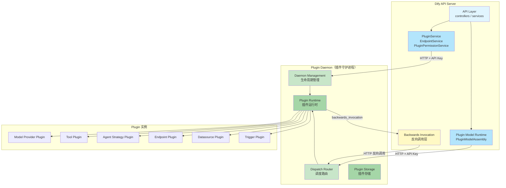
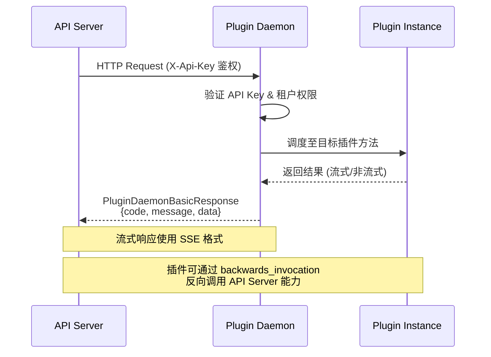
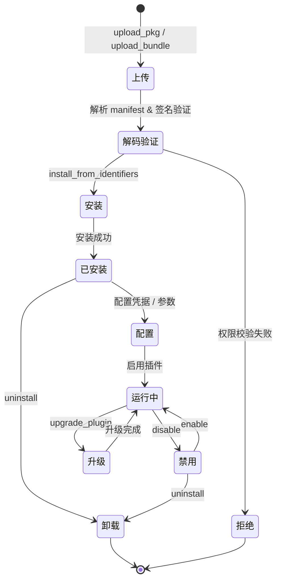
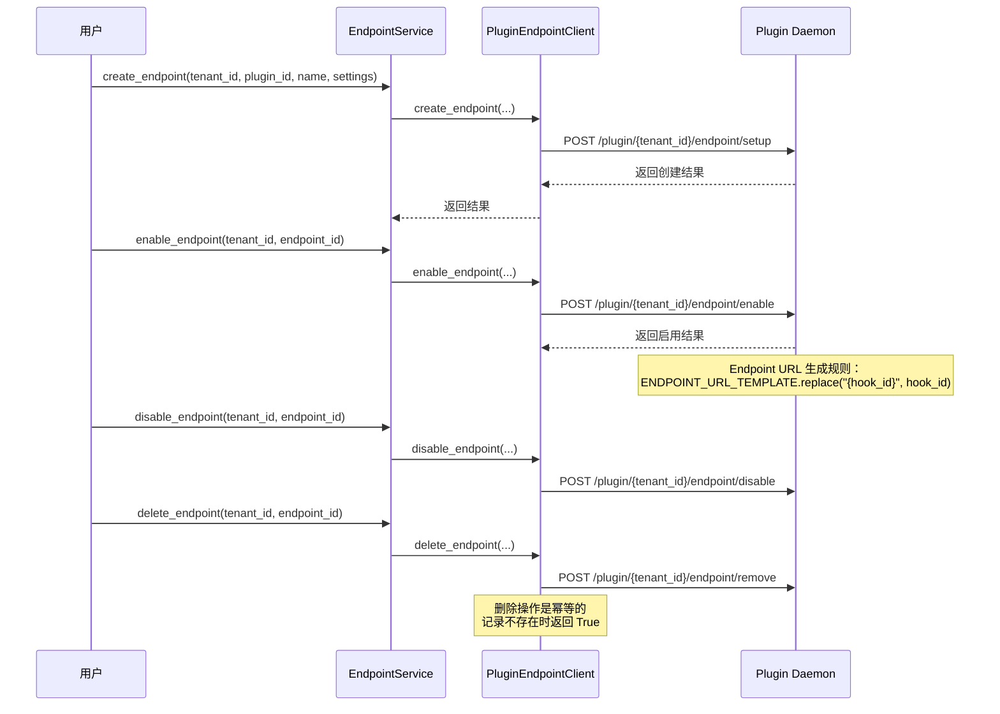
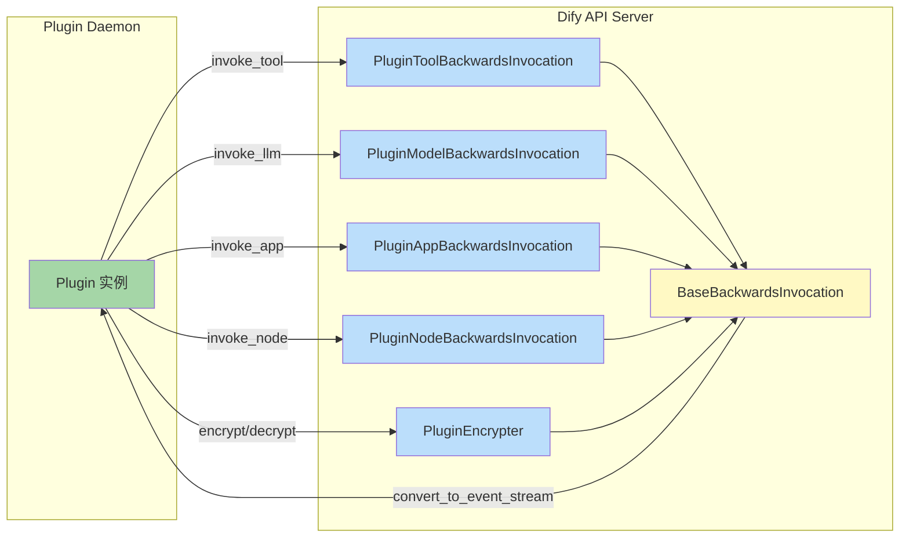
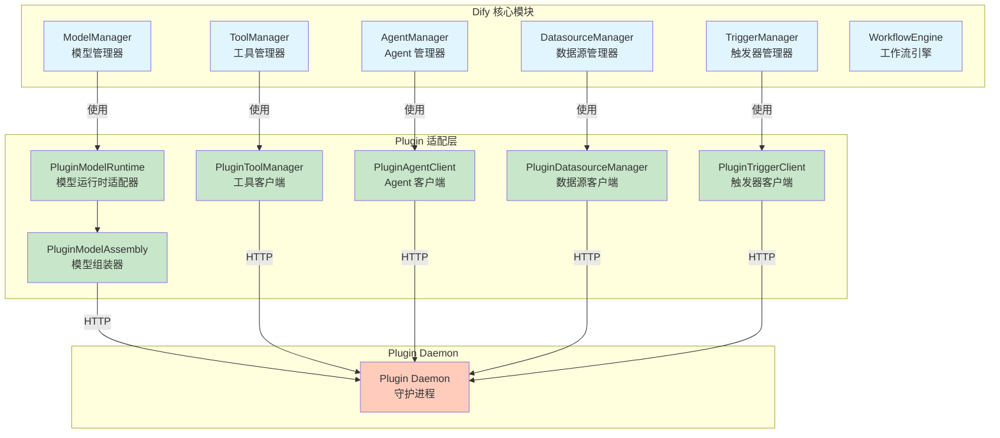
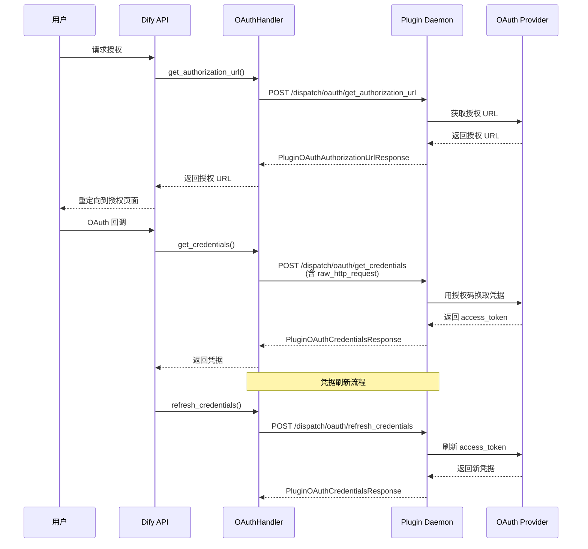

# Dify Plugin 插件系统功能文档

## 1. Plugin 概述

Plugin 是 Dify 的核心扩展机制，允许第三方开发者在无需修改平台源码的前提下，扩展 Dify 的能力边界。通过插件系统，Dify 实现了平台能力与业务扩展的解耦——平台内核保持稳定，而模型供应商、工具、Agent 策略、数据源、触发器等能力均以插件形式动态加载。

插件系统围绕 **Plugin Daemon**（插件守护进程）构建，Dify API Server 通过 HTTP 与 Plugin Daemon 通信，由 Plugin Daemon 负责插件的生命周期管理、运行时调度与安全隔离。这种架构确保了插件代码在独立进程中执行，不会影响主服务的稳定性。

### 核心设计目标

| 目标 | 说明 |
|------|------|
| **可扩展性** | 第三方可开发并安装自定义插件，覆盖模型、工具、Agent 策略等扩展点 |
| **安全隔离** | 插件运行在独立 Daemon 进程中，通过 API Key 鉴权，与主服务进程隔离 |
| **多租户支持** | 插件按租户（tenant）维度安装和管理，不同租户可安装不同插件集 |
| **向后兼容** | 插件可反向调用 Dify 核心能力（LLM、Tool、App 等），通过 backwards_invocation 机制实现 |
| **生命周期管理** | 提供完整的安装、启用、配置、运行、禁用、卸载流程 |

---

## 2. 插件架构图



### 通信协议



API Server 与 Plugin Daemon 之间的通信基于 HTTP 协议，所有请求均携带 `X-Api-Key` 头进行鉴权。响应统一使用 `PluginDaemonBasicResponse` 格式封装：

| 字段 | 类型 | 说明 |
|------|------|------|
| `code` | `int` | 状态码，0 表示成功，非 0 表示错误 |
| `message` | `str` | 错误信息（成功时为空） |
| `data` | `T | None` | 响应数据，泛型类型由具体接口决定 |

流式请求使用 SSE（Server-Sent Events）格式，每行以 `data:` 前缀开头，内容为 JSON 序列化的 `PluginDaemonBasicResponse`。

---

## 3. 插件生命周期

插件从安装到卸载的完整生命周期如下：



### 3.1 安装阶段

插件支持以下安装来源（`PluginInstallationSource`）：

| 来源 | 枚举值 | 说明 |
|------|--------|------|
| Marketplace | `Marketplace` | 从 Dify 插件市场安装 |
| GitHub | `Github` | 从 GitHub Release 安装 |
| 本地包 | `Package` | 上传本地 `.difypkg` 文件安装 |
| 远程 | `Remote` | 远程安装 |

**安装流程**：

1. **上传包文件**：调用 `PluginInstaller.upload_pkg()` 将 `.difypkg` 文件上传至 Plugin Daemon，返回 `PluginDecodeResponse`（含 `unique_identifier` 和 `manifest`）
2. **权限校验**：根据系统特性配置（`PluginInstallationScope`）校验插件验证类别（`AuthorizedCategory`）：
   - `ALL`：允许所有插件
   - `OFFICIAL_ONLY`：仅允许官方（langgenius）插件
   - `OFFICIAL_AND_SPECIFIC_PARTNERS`：允许官方和合作伙伴插件
   - `NONE`：禁止安装
3. **执行安装**：调用 `PluginInstaller.install_from_identifiers()` 创建安装任务，返回 `PluginInstallTaskStartResponse`
4. **任务跟踪**：通过 `PluginInstallTask` 跟踪安装进度，状态包括 `Pending` → `Running` → `Success` / `Failed`

### 3.2 配置阶段

安装完成后，需要为插件配置运行参数和凭据：

- **凭据配置**：通过 `validate_provider_credentials` 验证并保存 API Key、OAuth 等凭据
- **参数配置**：通过 `PluginParameter` 定义插件的运行时参数，支持多种参数类型
- **Endpoint 配置**：对于提供 Endpoint 的插件，需创建并配置 Endpoint 实例

凭据类型（`CredentialType`）：

| 类型 | 枚举值 | 可编辑 | 可验证 |
|------|--------|--------|--------|
| API Key | `api-key` | ✅ | ✅ |
| OAuth2 | `oauth2` | ❌ | ❌ |
| 无需授权 | `unauthorized` | ❌ | ❌ |

### 3.3 运行阶段

插件启用后进入运行状态，可通过 dispatch 路由调用插件能力：

- **Tool 调用**：`POST /plugin/{tenant_id}/dispatch/tool/invoke`
- **Model 调用**：`POST /plugin/{tenant_id}/dispatch/llm/invoke`
- **Agent 策略调用**：`POST /plugin/{tenant_id}/dispatch/agent_strategy/invoke`
- **Datasource 调用**：`POST /plugin/{tenant_id}/dispatch/datasource/*`
- **Trigger 调用**：`POST /plugin/{tenant_id}/dispatch/trigger/*`

### 3.4 升级阶段

调用 `PluginInstaller.upgrade_plugin()` 执行插件升级，需提供原始和新的 `plugin_unique_identifier`。升级过程与安装类似，创建安装任务并跟踪进度。

### 3.5 卸载阶段

调用 `PluginInstaller.uninstall()` 卸载插件。卸载时会自动清理关联数据：

- 删除 `TenantPreferredModelProvider` 中与该插件关联的记录
- 删除 `ProviderCredential` 中与该插件关联的凭据
- 清理 `Provider` 中的凭据引用
- 清除凭据缓存

---

## 4. 端点机制

Endpoint 是插件向外部暴露 HTTP API 的机制。通过 Endpoint，插件可以注册自定义的 HTTP 路由，使外部系统能够通过 Dify 平台调用插件功能。

### 4.1 Endpoint 声明

插件在 manifest 中声明其提供的 Endpoint：

```python
class EndpointDeclaration(BaseModel):
    path: str          # 路由路径
    method: str        # HTTP 方法
    hidden: bool       # 是否在列表中隐藏
```

```python
class EndpointProviderDeclaration(BaseModel):
    settings: list[ProviderConfig]              # Endpoint 配置项
    endpoints: list[EndpointDeclaration]         # Endpoint 列表
```

### 4.2 Endpoint 生命周期



### 4.3 Endpoint 实体

| 字段 | 类型 | 说明 |
|------|------|------|
| `name` | `str` | Endpoint 名称 |
| `enabled` | `bool` | 是否启用 |
| `url` | `str` | 访问 URL（由 `ENDPOINT_URL_TEMPLATE` + `hook_id` 生成） |
| `hook_id` | `str` | 钩子 ID，用于 URL 路由 |
| `settings` | `dict` | Endpoint 配置值 |
| `declaration` | `EndpointProviderDeclaration` | Endpoint 声明信息 |

### 4.4 Endpoint API 操作

| 操作 | HTTP 方法 | 路径 | 说明 |
|------|-----------|------|------|
| 创建 | `POST` | `/plugin/{tenant_id}/endpoint/setup` | 创建 Endpoint 实例 |
| 列表 | `GET` | `/plugin/{tenant_id}/endpoint/list` | 列出所有 Endpoint |
| 插件列表 | `GET` | `/plugin/{tenant_id}/endpoint/list/plugin` | 列出指定插件的 Endpoint |
| 更新 | `POST` | `/plugin/{tenant_id}/endpoint/update` | 更新 Endpoint 配置 |
| 删除 | `POST` | `/plugin/{tenant_id}/endpoint/remove` | 删除 Endpoint（幂等） |
| 启用 | `POST` | `/plugin/{tenant_id}/endpoint/enable` | 启用 Endpoint |
| 禁用 | `POST` | `/plugin/{tenant_id}/endpoint/disable` | 禁用 Endpoint |

---

## 5. 向后兼容调用

Backwards Invocation（反向调用）是插件系统的核心机制之一，允许运行中的插件**反向调用 Dify API Server 的核心能力**。这使得插件无需自行实现 LLM 调用、工具调用等功能，而是复用 Dify 平台已有的基础设施。

### 5.1 架构原理



### 5.2 基类机制

所有反向调用处理器继承自 `BaseBackwardsInvocation`，提供统一的流式响应转换：

```python
class BaseBackwardsInvocation:
    @classmethod
    def convert_to_event_stream(cls, response):
        # 将 Generator / BaseModel / dict / str 统一转换为事件流
        # 每个事件封装为 BaseBackwardsInvocationResponse(data=..., error="")
```

`BaseBackwardsInvocationResponse` 格式：

| 字段 | 类型 | 说明 |
|------|------|------|
| `data` | `T | None` | 响应数据 |
| `error` | `str` | 错误信息（空字符串表示无错误） |

### 5.3 反向调用类型

#### 5.3.1 工具反向调用（PluginToolBackwardsInvocation）

允许插件调用 Dify 平台上的其他工具：

| 方法 | 说明 |
|------|------|
| `invoke_tool` | 调用指定工具，支持 builtin / workflow / api / mcp 类型 |

调用流程：`ToolManager.get_tool_runtime_from_plugin()` → `ToolEngine.generic_invoke()` → `ToolFileMessageTransformer.transform_tool_invoke_messages()`

#### 5.3.2 模型反向调用（PluginModelBackwardsInvocation）

允许插件调用 Dify 平台上的模型能力：

| 方法 | 说明 |
|------|------|
| `invoke_llm` | 调用 LLM，支持流式/非流式 |
| `invoke_llm_with_structured_output` | 调用 LLM 并获取结构化输出 |
| `invoke_text_embedding` | 调用文本嵌入模型 |
| `invoke_rerank` | 调用重排序模型 |
| `invoke_tts` | 调用文本转语音模型 |
| `invoke_speech2text` | 调用语音转文本模型 |
| `invoke_moderation` | 调用内容审核模型 |
| `invoke_summary` | 调用系统模型进行文本摘要 |
| `invoke_system_model` | 调用系统默认模型 |
| `get_system_model_max_tokens` | 获取系统模型最大 Token 数 |
| `get_prompt_tokens` | 计算 Prompt Token 数 |

模型反向调用通过 `ModelManager.for_tenant()` 获取模型实例，并自动处理 LLM 配额扣减（`deduct_llm_quota`）。

#### 5.3.3 应用反向调用（PluginAppBackwardsInvocation）

允许插件调用 Dify 平台上的应用：

| 方法 | 说明 |
|------|------|
| `invoke_app` | 调用指定应用，支持 Chat / Workflow / Completion 模式 |
| `fetch_app_info` | 获取应用信息及参数配置 |

支持的应用模式：

| 模式 | 生成器 |
|------|--------|
| Advanced Chat | `AdvancedChatAppGenerator` |
| Agent Chat | `AgentChatAppGenerator` |
| Chat | `ChatAppGenerator` |
| Workflow | `WorkflowAppGenerator` |
| Completion | `CompletionAppGenerator` |

#### 5.3.4 节点反向调用（PluginNodeBackwardsInvocation）

允许插件调用 Dify 工作流中的节点能力：

| 方法 | 说明 |
|------|------|
| `invoke_parameter_extractor` | 调用参数提取节点 |
| `invoke_question_classifier` | 调用问题分类节点 |

节点反向调用通过 `WorkflowService.run_free_workflow_node()` 执行。

#### 5.3.5 加密反向调用（PluginEncrypter）

提供凭据加密/解密能力：

| 操作 | 说明 |
|------|------|
| `encrypt` | 加密数据 |
| `decrypt` | 解密数据 |
| `clear` | 清除缓存 |

加密器通过 `create_provider_encrypter()` 创建，支持按 `namespace`（如 `endpoint`）和 `identity` 维度管理加密上下文。

---

## 6. 插件类型

插件通过 `PluginCategory` 枚举定义其提供的扩展类型。一个插件可以同时提供多种扩展能力，但其 `category` 由 `PluginDeclaration` 中的主要能力自动推断。

### 6.1 插件类型一览

| 类型 | 枚举值 | 自动推断条件 | 对应实体字段 | 说明 |
|------|--------|-------------|-------------|------|
| 工具 | `Tool` | `declaration.tool` 存在 | `ToolProviderEntity` | 提供外部工具集成能力 |
| 模型 | `Model` | `declaration.model` 存在 | `ProviderEntity` | 提供模型供应商能力 |
| 数据源 | `Datasource` | `declaration.datasource` 存在 | `DatasourceProviderEntity` | 提供数据源接入能力 |
| Agent 策略 | `agent-strategy` | `declaration.agent_strategy` 存在 | `AgentStrategyProviderEntity` | 提供 Agent 推理策略 |
| 触发器 | `trigger` | `declaration.trigger` 存在 | `TriggerProviderEntity` | 提供事件触发能力 |
| 扩展 | `Extension` | 以上均不存在 | — | 通用扩展（如 Endpoint） |

### 6.2 插件声明结构

```python
class PluginDeclaration(BaseModel):
    version: str                          # 插件版本（语义化版本）
    author: str                           # 作者标识
    name: str                             # 插件名称（小写字母、数字、下划线、连字符）
    description: I18nObject               # 多语言描述
    icon: str                             # 图标
    icon_dark: str | None                 # 暗色模式图标
    label: I18nObject                     # 多语言标签
    category: PluginCategory              # 插件类型（自动推断）
    created_at: datetime                  # 创建时间
    resource: PluginResourceRequirements  # 资源需求
    plugins: Plugins                      # 插件提供的扩展列表
    tags: list[str]                       # 标签
    meta: Meta                            # 元信息（最低 Dify 版本等）
    tool: ToolProviderEntity | None       # 工具声明
    model: ProviderEntity | None          # 模型声明
    endpoint: EndpointProviderDeclaration | None  # Endpoint 声明
    agent_strategy: AgentStrategyProviderEntity | None  # Agent 策略声明
    datasource: DatasourceProviderEntity | None  # 数据源声明
    trigger: TriggerProviderEntity | None  # 触发器声明
```

### 6.3 插件资源需求与权限

插件通过 `PluginResourceRequirements` 声明其资源需求和权限请求：

| 权限类型 | 字段 | 说明 |
|----------|------|------|
| Tool | `permission.tool.enabled` | 是否需要工具调用权限 |
| Model | `permission.model.enabled` | 是否需要模型调用权限 |
| Model.LLM | `permission.model.llm` | 是否需要 LLM 调用权限 |
| Model.Text Embedding | `permission.model.text_embedding` | 是否需要文本嵌入权限 |
| Model.Rerank | `permission.model.rerank` | 是否需要重排序权限 |
| Model.TTS | `permission.model.tts` | 是否需要 TTS 权限 |
| Model.Speech2Text | `permission.model.speech2text` | 是否需要语音转文本权限 |
| Model.Moderation | `permission.model.moderation` | 是否需要内容审核权限 |
| Node | `permission.node.enabled` | 是否需要工作流节点调用权限 |
| Endpoint | `permission.endpoint.enabled` | 是否需要 Endpoint 注册权限 |
| Storage | `permission.storage.enabled` | 是否需要存储权限 |
| Storage.Size | `permission.storage.size` | 存储空间大小（1KB ~ 1GB，默认 1MB） |

### 6.4 各类型插件的客户端实现

| 插件类型 | 客户端类 | 核心方法 |
|----------|---------|---------|
| 工具 | `PluginToolManager` | `fetch_tool_providers`, `invoke`, `validate_provider_credentials`, `get_runtime_parameters` |
| 模型 | `PluginModelClient` | `fetch_model_providers`, `invoke_llm`, `invoke_text_embedding`, `invoke_rerank`, `invoke_tts`, `invoke_speech2text`, `invoke_moderation` |
| Agent 策略 | `PluginAgentClient` | `fetch_agent_strategy_providers`, `invoke` |
| 数据源 | `PluginDatasourceManager` | `fetch_datasource_providers`, `get_website_crawl`, `get_online_document_pages`, `online_drive_browse_files` |
| 触发器 | `PluginTriggerClient` | `fetch_trigger_providers`, `invoke_trigger_event`, `subscribe`, `unsubscribe`, `refresh`, `dispatch_event` |
| Endpoint | `PluginEndpointClient` | `create_endpoint`, `list_endpoints`, `update_endpoint`, `delete_endpoint`, `enable_endpoint`, `disable_endpoint` |
| OAuth | `OAuthHandler` | `get_authorization_url`, `get_credentials`, `refresh_credentials` |
| 动态选择 | `DynamicSelectClient` | `fetch_dynamic_select_options` |
| 资源管理 | `PluginAssetManager` | `fetch_asset`, `extract_asset` |
| 调试 | `PluginDebuggingClient` | `get_debugging_key` |
| 安装管理 | `PluginInstaller` | `upload_pkg`, `install_from_identifiers`, `uninstall`, `upgrade_plugin`, `list_plugins` |

---

## 7. 插件与核心模块的交互

### 7.1 交互架构总览



### 7.2 与 Model Provider 模块的集成

插件提供的模型供应商通过 `PluginModelRuntime` 适配器与 Dify 核心模型管理模块集成。`PluginModelRuntime` 实现了 `ModelRuntime` 协议接口，使插件模型对上层透明。

**集成链路**：

```
ModelManager
  → ProviderManager (model_runtime=PluginModelRuntime)
    → PluginModelRuntime
      → PluginModelClient (HTTP 通信)
        → Plugin Daemon
          → Plugin Model Provider
```

**关键组件**：

| 组件 | 职责 |
|------|------|
| `PluginModelAssembly` | 组装请求作用域的模型视图，共享单一 PluginModelRuntime 实例 |
| `PluginModelRuntime` | 模型运行时适配器，绑定租户上下文，实现 `ModelRuntime` 协议 |
| `PluginModelClient` | 底层 HTTP 客户端，与 Plugin Daemon 通信 |
| `create_plugin_model_assembly()` | 工厂函数，创建请求作用域的模型组装器 |

**模型 Schema 缓存**：`PluginModelRuntime` 使用 Redis 缓存模型 Schema，缓存键格式为 `{tenant_id}:{provider}:{model_type}:{model}:{user_id}:{hashed_credentials}`，TTL 由 `PLUGIN_MODEL_SCHEMA_CACHE_TTL` 配置控制。

**Provider 命名空间**：插件模型供应商使用 `{plugin_id}/{provider_name}` 格式的命名空间标识，确保不同插件提供的同名供应商不会冲突。`ModelProviderID` 类负责解析此格式。

### 7.3 与 Tool 模块的集成

插件工具通过 `PluginToolManager` 与 Dify 工具管理模块集成。

**集成链路**：

```
ToolManager
  → PluginToolManager
    → Plugin Daemon (GET /plugin/{tenant_id}/management/tools)
    → 返回 PluginToolProviderEntity 列表
```

**关键特性**：

- **Provider 命名空间**：工具供应商名称使用 `{plugin_id}/{provider_name}` 格式，通过 `ToolProviderID` 解析
- **Output Schema 解析**：工具的 `output_schema` 支持 `$ref` 引用，通过 `resolve_dify_schema_refs()` 解析
- **流式调用**：工具调用使用流式响应，通过 `merge_blob_chunks()` 合并 BLOB 分块
- **凭据类型**：支持 `api-key`、`oauth2`、`unauthorized` 三种凭据类型
- **运行时参数**：支持通过 `get_runtime_parameters()` 获取动态参数

### 7.4 与 Agent 模块的集成

插件 Agent 策略通过 `PluginAgentClient` 与 Dify Agent 管理模块集成。

**集成链路**：

```
AgentManager
  → PluginAgentClient
    → Plugin Daemon (GET /plugin/{tenant_id}/management/agent_strategies)
    → 返回 PluginAgentProviderEntity 列表
```

**调用上下文**：Agent 策略调用时传递 `PluginInvokeContext`，其中包含 `InvokeCredentials`（凭据映射），用于在 Agent 执行过程中访问关联的工具凭据。

### 7.5 与 Datasource 模块的集成

插件数据源通过 `PluginDatasourceManager` 与 Dify 数据源管理模块集成。

**支持的数据源操作**：

| 操作 | Dispatch 路径 | 说明 |
|------|--------------|------|
| 网站爬取 | `dispatch/datasource/get_website_crawl` | 爬取网站内容 |
| 在线文档页面列表 | `dispatch/datasource/get_online_document_pages` | 获取在线文档页面列表 |
| 在线文档页面内容 | `dispatch/datasource/get_online_document_page_content` | 获取在线文档页面内容 |
| 网盘文件浏览 | `dispatch/datasource/online_drive_browse_files` | 浏览网盘文件 |
| 网盘文件下载 | `dispatch/datasource/online_drive_download_file` | 下载网盘文件 |
| 凭据验证 | `dispatch/datasource/validate_credentials` | 验证数据源凭据 |

**内置数据源**：系统内置 `langgenius/file/file` 本地文件数据源，始终出现在数据源列表首位。

### 7.6 与 Trigger 模块的集成

插件触发器通过 `PluginTriggerClient` 与 Dify 触发器管理模块集成，支持事件驱动的插件调用模式。

**触发器操作**：

| 操作 | Dispatch 路径 | 说明 |
|------|--------------|------|
| 触发事件 | `dispatch/trigger/invoke_event` | 触发指定事件 |
| 事件分发 | `dispatch/trigger/dispatch_event` | 分发事件到触发器 |
| 订阅 | `dispatch/trigger/subscribe` | 订阅触发器事件 |
| 取消订阅 | `dispatch/trigger/unsubscribe` | 取消订阅 |
| 刷新订阅 | `dispatch/trigger/refresh` | 刷新订阅状态 |
| 凭据验证 | `dispatch/trigger/validate_credentials` | 验证触发器凭据 |

**HTTP 请求序列化**：触发器调用时，原始 HTTP 请求通过 `serialize_request()` 序列化为十六进制字符串传递给 Plugin Daemon，响应通过 `deserialize_response()` 反序列化。

### 7.7 与 OAuth 模块的集成

插件 OAuth 通过 `OAuthHandler` 与 Dify OAuth 流程集成，支持 OAuth2 授权码流程：



### 7.8 插件参数系统

插件参数通过 `PluginParameter` 定义，支持丰富的参数类型：

| 参数类型 | 枚举值 | 说明 |
|----------|--------|------|
| 字符串 | `string` | 普通文本输入 |
| 数字 | `number` | 数值输入，支持 min/max/precision |
| 布尔 | `boolean` | 布尔开关 |
| 选择 | `select` | 下拉选择，需配合 options |
| 密钥输入 | `secret-input` | 敏感信息输入 |
| 文件 | `file` | 单文件上传 |
| 多文件 | `files` | 多文件上传 |
| 应用选择器 | `app-selector` | 选择 Dify 应用 |
| 模型选择器 | `model-selector` | 选择模型 |
| 工具选择器 | `tools-selector` | 选择工具 |
| 动态选择 | `dynamic-select` | 动态获取选项（通过 `DynamicSelectClient`） |
| 复选框 | `checkbox` | 多选框 |
| 数组 | `array` | JSON 数组 |
| 对象 | `object` | JSON 对象 |
| 任意类型 | `any` | 任意类型值 |

**动态选择**：`dynamic-select` 类型参数通过 `DynamicSelectClient.fetch_dynamic_select_options()` 在运行时动态获取选项列表，支持基于凭据和上下文的动态选项生成。

---

## 附录：核心源码文件索引

| 模块 | 文件路径 | 说明 |
|------|---------|------|
| 基础客户端 | `api/core/plugin/impl/base.py` | HTTP 通信基类，请求/流式请求/错误处理 |
| 插件安装 | `api/core/plugin/impl/plugin.py` | 插件安装、卸载、升级管理 |
| 工具客户端 | `api/core/plugin/impl/tool.py` | 工具调用与凭据验证 |
| 模型客户端 | `api/core/plugin/impl/model.py` | 模型调用（LLM/Embedding/Rerank/TTS 等） |
| 模型运行时 | `api/core/plugin/impl/model_runtime.py` | 模型运行时适配器，实现 ModelRuntime 协议 |
| 模型工厂 | `api/core/plugin/impl/model_runtime_factory.py` | 模型组装器与工厂函数 |
| Agent 客户端 | `api/core/plugin/impl/agent.py` | Agent 策略调用 |
| 数据源客户端 | `api/core/plugin/impl/datasource.py` | 数据源操作 |
| 触发器客户端 | `api/core/plugin/impl/trigger.py` | 触发器操作 |
| Endpoint 客户端 | `api/core/plugin/impl/endpoint.py` | Endpoint 管理 |
| OAuth 处理 | `api/core/plugin/impl/oauth.py` | OAuth2 授权流程 |
| 动态选择 | `api/core/plugin/impl/dynamic_select.py` | 动态参数选项 |
| 资源管理 | `api/core/plugin/impl/asset.py` | 插件资源文件管理 |
| 调试 | `api/core/plugin/impl/debugging.py` | 插件调试密钥 |
| 反向调用基类 | `api/core/plugin/backwards_invocation/base.py` | 反向调用基类与事件流转换 |
| 工具反向调用 | `api/core/plugin/backwards_invocation/tool.py` | 工具反向调用 |
| 模型反向调用 | `api/core/plugin/backwards_invocation/model.py` | 模型反向调用 |
| 应用反向调用 | `api/core/plugin/backwards_invocation/app.py` | 应用反向调用 |
| 节点反向调用 | `api/core/plugin/backwards_invocation/node.py` | 工作流节点反向调用 |
| 加密反向调用 | `api/core/plugin/backwards_invocation/encrypt.py` | 凭据加密/解密 |
| 插件实体 | `api/core/plugin/entities/plugin.py` | 插件声明、安装、依赖实体 |
| Daemon 实体 | `api/core/plugin/entities/plugin_daemon.py` | Daemon 通信响应实体 |
| Endpoint 实体 | `api/core/plugin/entities/endpoint.py` | Endpoint 声明与实例实体 |
| 请求实体 | `api/core/plugin/entities/request.py` | 反向调用请求实体 |
| 参数实体 | `api/core/plugin/entities/parameters.py` | 插件参数类型与转换 |
| 错误定义 | `api/core/plugin/impl/exc.py` | 插件错误类型定义 |
| Chunk 合并 | `api/core/plugin/utils/chunk_merger.py` | 流式 BLOB 分块合并 |
| 参数转换 | `api/core/plugin/utils/converter.py` | 参数格式转换 |
| HTTP 解析 | `api/core/plugin/utils/http_parser.py` | HTTP 请求序列化/反序列化 |
| 插件服务 | `api/services/plugin/plugin_service.py` | 插件业务逻辑服务 |
| Endpoint 服务 | `api/services/plugin/endpoint_service.py` | Endpoint 业务逻辑服务 |
| 权限服务 | `api/services/plugin/plugin_permission_service.py` | 插件权限管理服务 |
