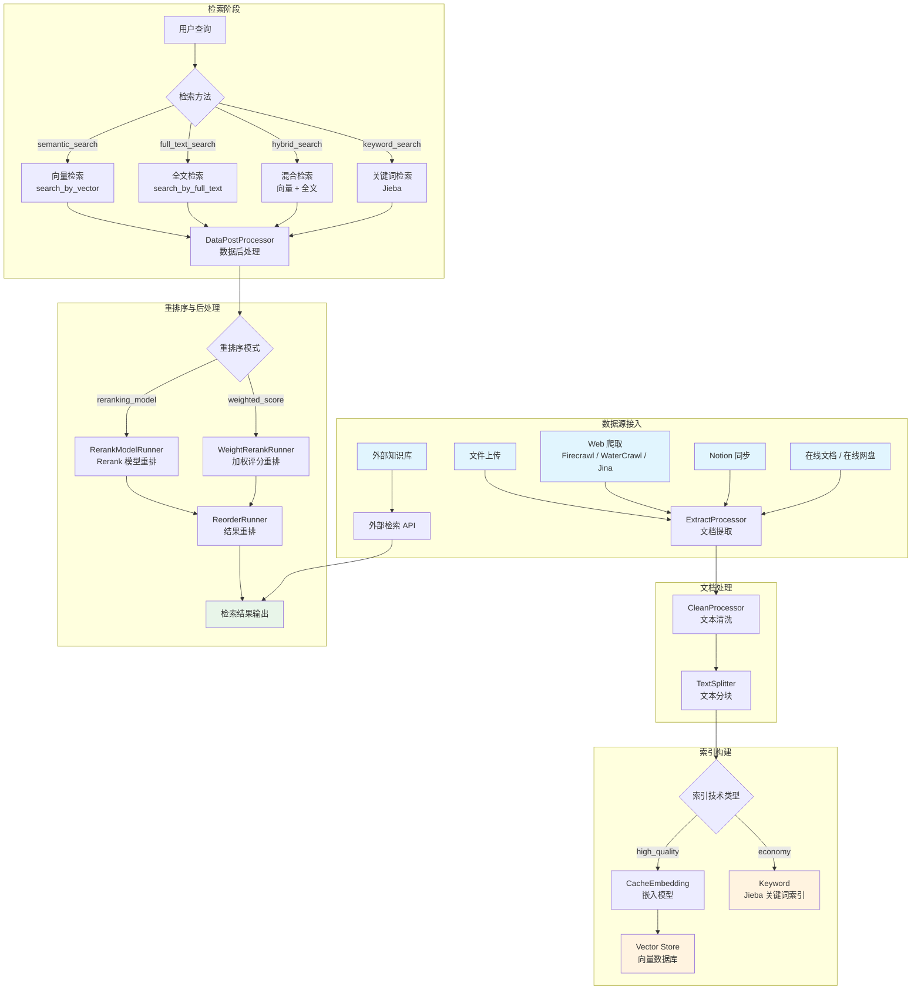
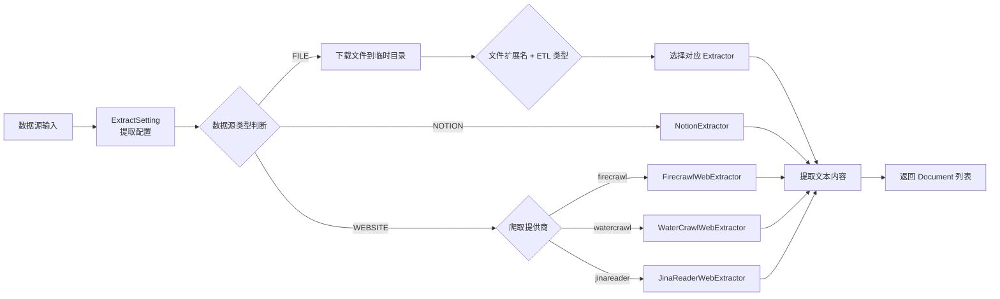
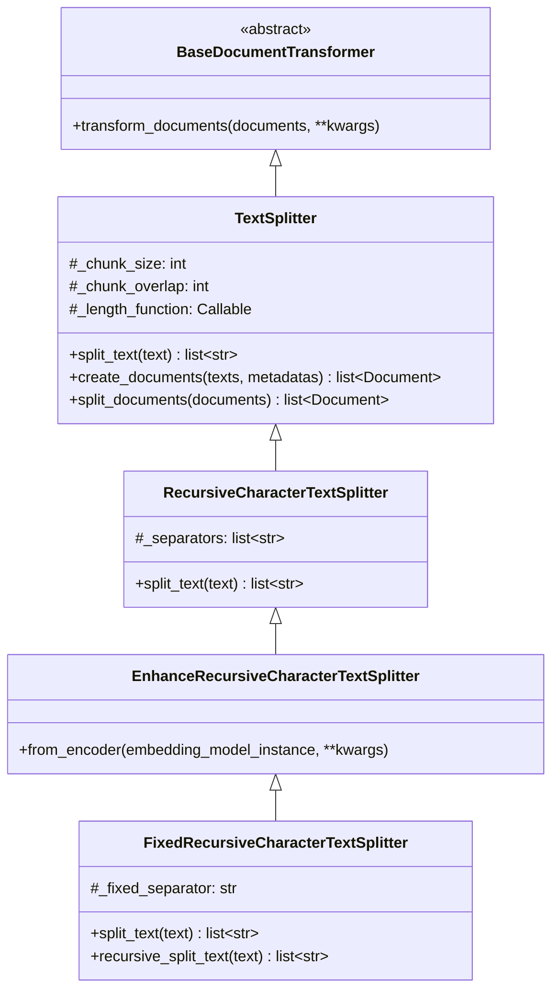
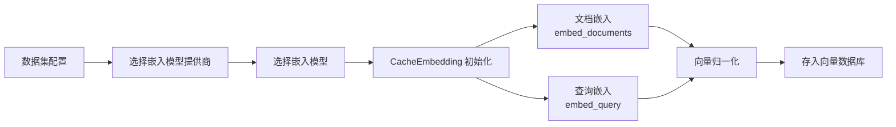
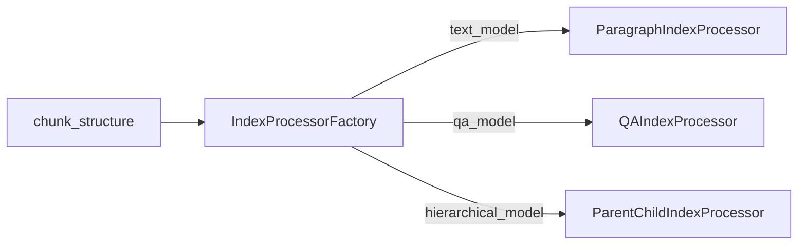
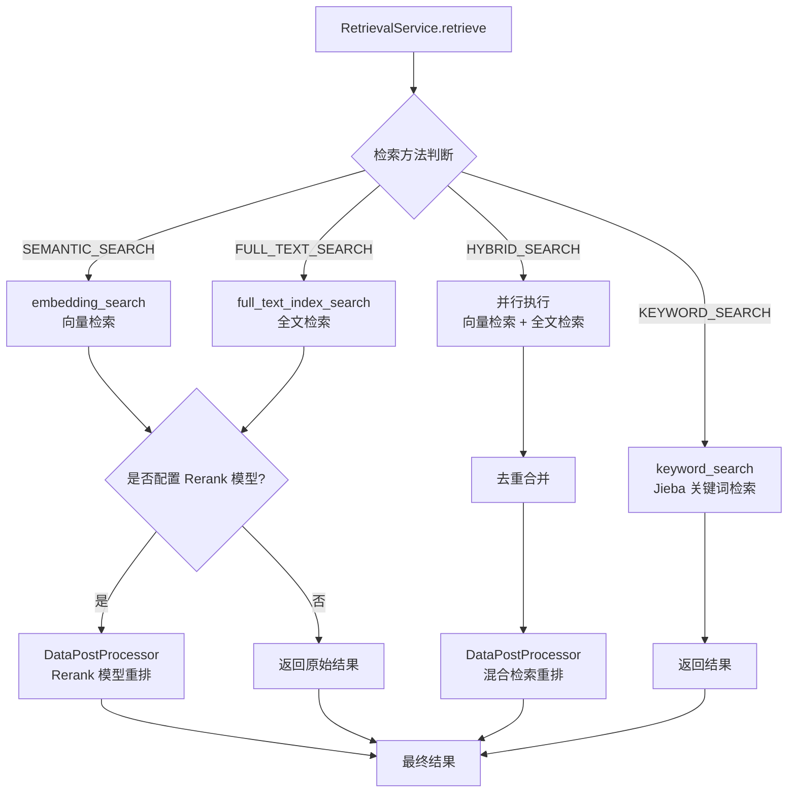
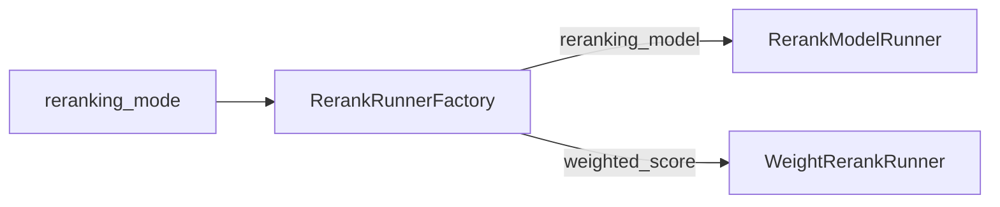
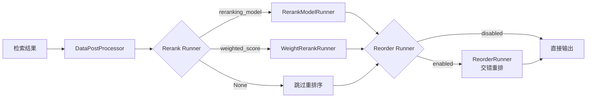
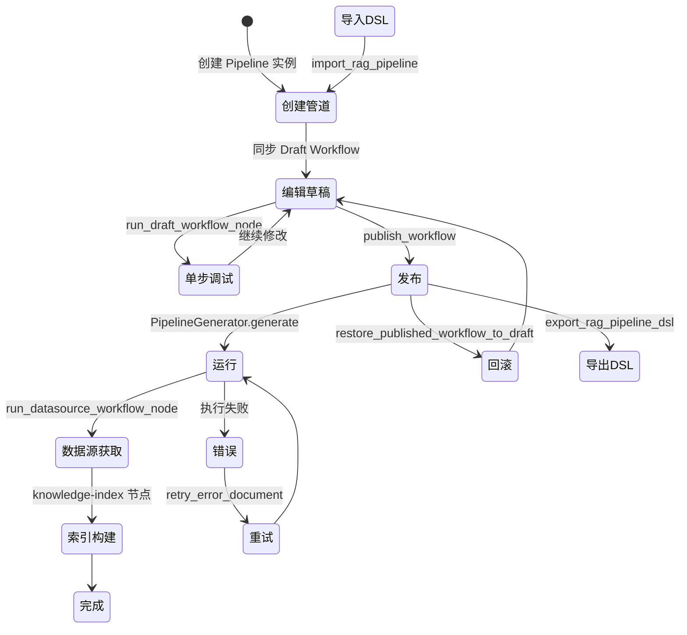

# Dify RAG 管道详细功能文档

## 1. RAG 管道概述

RAG（Retrieval-Augmented Generation，检索增强生成）是 Dify 平台的核心能力之一，旨在通过将外部知识库与 LLM 生成能力相结合，提升大语言模型回答的准确性、时效性和可溯源性。Dify 的 RAG 管道覆盖了从数据源接入、文档解析、分块、嵌入、索引构建到检索与重排序的完整生命周期，并提供可视化的管道编排能力，使用户能够灵活配置和定制知识处理流程。

Dify RAG 管道的核心设计原则：

- **端到端覆盖**：从数据源到检索输出的全链路管理
- **多数据源支持**：文件上传、Web 爬取、Notion 同步、外部知识库等
- **灵活的分块策略**：支持自动分块与自定义分块，以及段落、QA、父子层级等多种索引结构
- **多种检索方法**：向量检索、全文检索、混合检索和关键词检索
- **可插拔的重排序机制**：Rerank 模型与加权评分两种模式
- **管道编排**：基于工作流的 RAG Pipeline 服务，支持 DSL 导入导出

## 2. RAG 完整流程图



## 3. 数据源类型

Dify 支持多种数据源接入方式，每种数据源对应不同的提取器（Extractor）实现。

| 数据源类型 | 枚举值 | 提取器 | 说明 |
|---|---|---|---|
| 文件上传 | `upload_file` | `ExtractProcessor` | 支持多种文件格式，包括 PDF、Word、Excel、CSV、Markdown、HTML、TXT、PPT、EML、MSG、XML、ePub 等 |
| Web 爬取 | `website_crawl` | `FirecrawlWebExtractor` / `WaterCrawlWebExtractor` / `JinaReaderWebExtractor` | 通过第三方爬取服务获取网页内容，支持 Firecrawl、WaterCrawl、Jina Reader 三种提供商 |
| Notion 同步 | `notion_import` | `NotionExtractor` | 通过 Notion API 同步页面内容，支持 workspace 和 page 级别的导入 |
| 外部知识库 | `external` | `ExternalDatasetService` | 通过外部 API 接入第三方知识库，支持自定义检索参数和元数据过滤 |
| 在线文档 | `online_document` | `OnlineDocumentDatasourcePlugin` | 通过插件方式接入在线文档服务（如 Notion），支持页面浏览和内容获取 |
| 在线网盘 | `online_drive` | `OnlineDriveDatasourcePlugin` | 通过插件方式接入在线网盘服务，支持文件浏览和批量导入 |
| 本地文件 | `local_file` | `ExtractProcessor` | RAG Pipeline 模式下的文件上传，与 `upload_file` 共享提取逻辑 |

### 文件格式支持详情

| 文件格式 | 扩展名 | 提取器 | ETL 类型 |
|---|---|---|---|
| PDF | `.pdf` | `PdfExtractor` | 两者均可 |
| Word | `.docx` | `WordExtractor` / `UnstructuredWordExtractor` | dify / Unstructured |
| Word (旧版) | `.doc` | `UnstructuredWordExtractor` | 仅 Unstructured |
| Excel | `.xlsx`, `.xls` | `ExcelExtractor` | 两者均可 |
| CSV | `.csv` | `CSVExtractor` | 两者均可 |
| Markdown | `.md`, `.markdown`, `.mdx` | `MarkdownExtractor` / `UnstructuredMarkdownExtractor` | dify / Unstructured |
| HTML | `.htm`, `.html` | `HtmlExtractor` | 两者均可 |
| 纯文本 | 其他 | `TextExtractor` | 两者均可 |
| PowerPoint | `.ppt` | `UnstructuredPPTExtractor` | 仅 Unstructured |
| PowerPoint | `.pptx` | `UnstructuredPPTXExtractor` | 仅 Unstructured |
| 邮件 | `.eml` | `UnstructuredEmailExtractor` | 仅 Unstructured |
| Outlook | `.msg` | `UnstructuredMsgExtractor` | 仅 Unstructured |
| XML | `.xml` | `UnstructuredXmlExtractor` | 仅 Unstructured |
| ePub | `.epub` | `UnstructuredEpubExtractor` | 两者均可 |

> ETL 类型由环境变量 `ETL_TYPE` 决定，可选值为 `dify`（默认）和 `Unstructured`。当选择 `Unstructured` 时，需要配置 `UNSTRUCTURED_API_URL` 和 `UNSTRUCTURED_API_KEY`。

## 4. 文档处理流程

文档处理流程由 `ExtractProcessor` 统一调度，根据数据源类型和文件格式选择合适的提取器：



### 关键处理步骤

1. **文件下载**：对于文件上传类型，先从对象存储下载到临时目录
2. **格式识别**：根据文件扩展名和 ETL 配置选择提取器
3. **内容提取**：调用对应提取器将文件内容转换为 `Document` 对象列表
4. **文本清洗**：通过 `CleanProcessor` 对提取的文本进行预处理

### 文本清洗规则

`CleanProcessor` 支持以下预处理规则：

| 规则 ID | 功能 | 说明 |
|---|---|---|
| `remove_extra_spaces` | 移除多余空格 | 将连续 3 个以上换行符替换为 2 个，将连续多个空白字符合并为 1 个 |
| `remove_urls_emails` | 移除 URL 和邮箱 | 移除文本中的邮箱地址和 URL，但保留 Markdown 格式的链接和图片 |

此外，`CleanProcessor` 默认执行以下清洗操作：
- 移除无效 Unicode 字符（`\x00-\x08`、`\xEF\xBF\xBE`、`\uFFFE` 等）
- 替换特殊标记 `<\|` 和 `\|>`

## 5. 分块策略

Dify 提供两种分块模式和多种分块参数配置，通过 `Rule` 和 `Segmentation` 实体定义分块规则。

### 分块模式

| 模式 | 说明 | 分块器 |
|---|---|---|
| 自动分块（`automatic`） | 使用系统预设的默认分块规则，无需手动配置 | `EnhanceRecursiveCharacterTextSplitter` |
| 自定义分块（`custom`） | 用户自定义分隔符、最大 Token 数、重叠长度等参数 | `FixedRecursiveCharacterTextSplitter` |

### 分块参数配置

| 参数 | 类型 | 默认值 | 说明 |
|---|---|---|---|
| `separator` | `str` | `"\n"` | 分块分隔符，支持自定义字符串 |
| `max_tokens` | `int` | — | 每个分块的最大 Token 数 |
| `chunk_overlap` | `int` | `0` | 相邻分块之间的重叠字符数 |

### 分块器类层次



### 分块器工作原理

- **`RecursiveCharacterTextSplitter`**：递归地使用分隔符列表（默认 `["\n\n", "\n", " ", ""]`）尝试分割文本，优先使用较大的分隔符，逐步降级到更小的分隔符
- **`EnhanceRecursiveCharacterTextSplitter`**：在递归分割基础上，支持通过嵌入模型实例计算 Token 长度
- **`FixedRecursiveCharacterTextSplitter`**：先按固定分隔符（默认 `"\n\n"`）分割，对超长块再递归分割，分隔符列表为 `["\n\n", "\n", "。", ". ", " ", ""]`

## 6. 嵌入模型配置

嵌入模型负责将文本转换为向量表示，是向量检索的基础。Dify 的嵌入模型通过 `ModelManager` 和 `CacheEmbedding` 进行管理。

### 嵌入模型接口

`Embeddings` 抽象基类定义了以下核心方法：

| 方法 | 说明 |
|---|---|
| `embed_documents(texts)` | 将文档文本列表转换为嵌入向量列表 |
| `embed_query(text)` | 将查询文本转换为嵌入向量 |
| `embed_multimodal_documents(documents)` | 将多模态文档（含图片）转换为嵌入向量列表 |
| `embed_multimodal_query(document)` | 将多模态查询转换为嵌入向量 |

### CacheEmbedding 缓存机制

`CacheEmbedding` 在嵌入模型基础上增加了两层缓存：

1. **数据库缓存**（用于文档嵌入）：通过 `Embedding` 表，以 `(model_name, hash, provider_name)` 为键存储嵌入结果，避免重复计算
2. **Redis 缓存**（用于查询嵌入）：以 `provider_model_name_hash` 为键，TTL 为 600 秒，加速高频查询的嵌入计算

### 嵌入模型配置流程



### 向量数据库支持

Dify 支持以下向量数据库：

| 向量数据库 | 枚举值 |
|---|---|
| Milvus / Zilliz | `milvus` |
| Qdrant | `qdrant` |
| Weaviate | `weaviate` |
| PGVector | `pgvector` |
| Chroma | `chroma` |
| OpenSearch | `opensearch` |
| Elasticsearch | `elasticsearch` |
| Elasticsearch (日文分词) | `elasticsearch-ja` |
| AnalyticDB | `analyticdb` |
| MyScale | `myscale` |
| TiDB Vector | `tidb_vector` |
| Relyt | `relyt` |
| 腾讯云 | `tencent` |
| Oracle | `oracle` |
| Lindorm | `lindorm` |
| Couchbase | `couchbase` |
| 百度云 | `baidu` |
| VikingDB | `vikingdb` |
| Upstash | `upstash` |
| TiDB on Qdrant | `tidb_on_qdrant` |
| OceanBase | `oceanbase` |
| SeekDB | `seekdb` |
| OpenGauss | `opengauss` |
| TableStore | `tablestore` |
| 华为云 | `huawei_cloud` |
| MatrixOne | `matrixone` |
| ClickZetta | `clickzetta` |
| IRIS | `iris` |
| Hologres | `hologres` |
| 阿里云 MySQL | `alibabacloud_mysql` |
| Vastbase | `vastbase` |
| PGVecto.rs | `pgvecto-rs` |

## 7. 索引处理

索引处理器（Index Processor）是 RAG 管道中连接分块与存储的核心组件，负责将提取和分块后的文档转化为可检索的索引结构。

### 索引结构类型

| 索引结构 | 枚举值 | 处理器 | 说明 |
|---|---|---|---|
| 段落索引 | `text_model` | `ParagraphIndexProcessor` | 将文档按段落分块，每个分块独立嵌入和索引 |
| QA 索引 | `qa_model` | `QAIndexProcessor` | 通过 LLM 将文档内容转换为问答对，以问题为索引内容 |
| 父子层级索引 | `hierarchical_model` | `ParentChildIndexProcessor` | 支持父子两层结构，子块用于检索，父块用于提供上下文 |

### 索引技术类型

| 索引技术 | 枚举值 | 说明 |
|---|---|---|
| 高质量模式 | `high_quality` | 使用嵌入模型生成向量，存入向量数据库，支持语义检索 |
| 经济模式 | `economy` | 使用 Jieba 分词构建关键词索引，仅支持关键词检索 |

### 索引处理器工厂

`IndexProcessorFactory` 根据索引结构类型创建对应的处理器实例：



### 索引处理器核心方法

所有索引处理器均继承自 `BaseIndexProcessor`，实现以下核心方法：

| 方法 | 说明 |
|---|---|
| `extract(extract_setting)` | 从数据源提取文档内容 |
| `transform(documents)` | 对文档进行清洗、分块等转换 |
| `load(dataset, documents)` | 将处理后的文档加载到索引中 |
| `clean(dataset, node_ids)` | 清理索引数据 |
| `retrieve(retrieval_method, query, dataset, top_k, score_threshold, reranking_model)` | 执行检索 |
| `index(dataset, document, chunks)` | 直接索引给定的分块内容 |
| `format_preview(chunks)` | 格式化预览输出 |

### 父子层级索引详解

父子层级索引支持两种父块模式：

| 父块模式 | 枚举值 | 说明 |
|---|---|---|
| 全文档模式 | `full-doc` | 整个文档作为一个父块，所有子块关联到同一父块 |
| 段落模式 | `paragraph` | 按段落分割后的每个段落作为父块，子块从父块中进一步分割 |

父子层级索引的检索流程：先通过子块进行向量检索，再返回对应的父块内容，从而在保持检索精度的同时提供更丰富的上下文信息。

### QA 索引详解

QA 索引通过 LLM 自动生成问答对：
1. 文档先按常规方式分块
2. 每个分块通过 `LLMGenerator.generate_qa_document()` 生成问答对
3. 问答对以问题为索引内容，答案存储在元数据的 `answer` 字段中
4. 仅支持高质量索引模式

## 8. 检索方法

Dify 支持四种检索方法，通过 `RetrievalMethod` 枚举定义，由 `RetrievalService` 统一调度。

### 检索方法一览

| 检索方法 | 枚举值 | 适用索引技术 | 说明 |
|---|---|---|---|
| 向量检索 | `semantic_search` | `high_quality` | 通过嵌入向量计算语义相似度，支持文本和图片查询 |
| 全文检索 | `full_text_search` | `high_quality` | 通过向量数据库的全文搜索功能进行关键词匹配 |
| 混合检索 | `hybrid_search` | `high_quality` | 同时执行向量检索和全文检索，合并结果后重排序 |
| 关键词检索 | `keyword_search` | `economy` | 通过 Jieba 分词和 TF-IDF 算法进行关键词匹配 |

### 检索参数

| 参数 | 类型 | 默认值 | 说明 |
|---|---|---|---|
| `top_k` | `int` | `4` | 返回的最大文档数量 |
| `score_threshold` | `float` | `0.0` | 相似度分数阈值，低于此值的结果将被过滤 |
| `score_threshold_enabled` | `bool` | `False` | 是否启用分数阈值过滤 |

### 检索策略

Dify 支持两种检索策略：

| 策略 | 说明 |
|---|---|
| 单数据集检索（`SINGLE`） | 通过 LLM 路由选择最相关的数据集进行检索，支持 ReAct 路由和 Function Call 路由 |
| 多数据集检索（`MULTIPLE`） | 同时在多个数据集中检索，合并结果后统一重排序 |

### 检索服务流程



### 元数据过滤

检索支持基于文档元数据的过滤，提供三种过滤模式：

| 模式 | 说明 |
|---|---|
| `disabled` | 禁用元数据过滤 |
| `automatic` | 通过 LLM 自动从查询中提取元数据过滤条件 |
| `manual` | 用户手动指定元数据过滤条件 |

支持的比较运算符：`contains`、`not contains`、`start with`、`end with`、`is`、`is not`、`empty`、`not empty`、`before`、`after`、`<=`、`>=`、`in`、`not in`。

## 9. 重排序机制

重排序（Rerank）是检索后对结果进行二次排序的关键步骤，用于提升检索结果的相关性。Dify 提供两种重排序模式。

### 重排序模式

| 模式 | 枚举值 | 实现类 | 说明 |
|---|---|---|---|
| Rerank 模型 | `reranking_model` | `RerankModelRunner` | 使用专门的 Rerank 模型对检索结果重新评分排序 |
| 加权评分 | `weighted_score` | `WeightRerankRunner` | 通过向量相似度和关键词 TF-IDF 的加权融合进行排序 |

### Rerank 模型重排

`RerankModelRunner` 的工作流程：

1. 对检索结果去重（基于 `doc_id`）
2. 调用 Rerank 模型 API 对文档重新评分
3. 过滤低于分数阈值的结果
4. 按 Rerank 分数降序排列，返回 Top-N 结果

支持多模态 Rerank：当 Rerank 模型支持视觉能力时，可以对图片文档进行重排序。

### 加权评分重排

`WeightRerankRunner` 的评分公式：

```
最终分数 = 向量权重 × 向量相似度 + 关键词权重 × TF-IDF 相似度
```

配置参数：

| 参数 | 说明 |
|---|---|
| `vector_weight` | 向量相似度权重（0~1） |
| `keyword_weight` | 关键词相似度权重（0~1） |
| `embedding_provider_name` | 嵌入模型提供商名称 |
| `embedding_model_name` | 嵌入模型名称 |

关键词相似度通过 Jieba 分词提取关键词，计算查询与文档之间的 TF-IDF 余弦相似度。向量相似度通过嵌入模型计算查询向量与文档向量的余弦相似度。

### 重排序工厂

`RerankRunnerFactory` 根据重排序模式创建对应的 Runner：



## 10. 数据后处理

数据后处理器（`DataPostProcessor`）在检索结果返回前执行重排序和结果重排操作，是检索流程的最后处理环节。

### DataPostProcessor 工作流程



### ReorderRunner 交错重排

`ReorderRunner` 实现了 Lost in the Middle 现象的缓解策略，通过交错重排将最相关和次相关的文档交替排列：

1. 取出奇数位（0, 2, 4, ...）的文档
2. 取出偶数位（1, 3, 5, ...）的文档并反转
3. 将反转后的偶数位文档追加到奇数位文档之后

这种策略确保最相关的文档出现在上下文的开头和结尾，避免重要信息被"淹没"在中间位置。

### DataPostProcessor 配置参数

| 参数 | 类型 | 说明 |
|---|---|---|
| `tenant_id` | `str` | 租户 ID |
| `reranking_mode` | `str` | 重排序模式：`reranking_model` 或 `weighted_score` |
| `reranking_model` | `RerankingModelDict` | Rerank 模型配置（提供商 + 模型名称） |
| `weights` | `WeightsDict` | 加权评分配置（向量权重 + 关键词权重） |
| `reorder_enabled` | `bool` | 是否启用交错重排 |

## 11. RAG Pipeline 服务

RAG Pipeline 服务位于 `services/rag_pipeline/` 目录下，提供管道编排、模板管理、DSL 导入导出等高级功能，是 Dify RAG 能力的上层编排层。

### 服务模块概览

| 模块 | 类/服务 | 职责 |
|---|---|---|
| `rag_pipeline.py` | `RagPipelineService` | 管道核心服务：工作流管理、节点执行、数据源运行、模板获取 |
| `rag_pipeline_manage_service.py` | `RagPipelineManageService` | 管道管理：列出可用数据源插件 |
| `rag_pipeline_transform_service.py` | `RagPipelineTransformService` | 管道转换：将旧版数据集转换为 RAG Pipeline 模式 |
| `rag_pipeline_dsl_service.py` | `RagPipelineDslService` | DSL 服务：管道的 YAML 导入导出、依赖检查 |
| `rag_pipeline_task_proxy.py` | — | 管道任务代理 |
| `pipeline_generate_service.py` | — | 管道生成服务 |

### 管道模板系统

管道模板系统支持三种模板来源：

| 来源 | 工厂方法 | 说明 |
|---|---|---|
| 内置模板 | `BuiltInPipelineTemplateRetrieval` | Dify 官方提供的预置管道模板 |
| 数据库模板 | `DatabasePipelineTemplateRetrieval` | 从数据库加载的模板 |
| 自定义模板 | `CustomizedPipelineTemplateRetrieval` | 用户创建和发布的自定义模板 |

### 管道转换服务

`RagPipelineTransformService` 负责将旧版数据集转换为 RAG Pipeline 模式，转换映射关系如下：

| 旧版配置 | 转换模板 |
|---|---|
| 文件上传 + 段落索引 + 高质量 | `file-general-high-quality.yml` |
| 文件上传 + 段落索引 + 经济 | `file-general-economy.yml` |
| 文件上传 + 父子层级 | `file-parentchild.yml` |
| Notion + 段落索引 + 高质量 | `notion-general-high-quality.yml` |
| Notion + 段落索引 + 经济 | `notion-general-economy.yml` |
| Notion + 父子层级 | `notion-parentchild.yml` |
| Web 爬取 + 段落索引 + 高质量 | `website-crawl-general-high-quality.yml` |
| Web 爬取 + 段落索引 + 经济 | `website-crawl-general-economy.yml` |
| Web 爬取 + 父子层级 | `website-crawl-parentchild.yml` |

### 管道工作流架构

RAG Pipeline 基于工作流引擎构建，每个管道对应一个 `Workflow` 实例，包含以下节点类型：

| 节点类型 | 说明 |
|---|---|
| `datasource` | 数据源节点，负责从外部获取原始数据 |
| `knowledge-index` | 知识索引节点，负责文档处理、分块和索引构建 |
| `knowledge-retrieval` | 知识检索节点，负责从索引中检索相关内容 |
| `llm` | LLM 节点，用于 QA 生成等场景 |
| `tool` | 工具节点，调用外部工具 |
| `http-request` | HTTP 请求节点 |

### 管道生命周期



### 租户隔离任务队列

`TenantIsolatedTaskQueue` 基于 Redis 实现租户级别的任务隔离，确保不同租户的 RAG 处理任务互不干扰：

- 使用 Redis List 存储任务队列
- 使用 Redis Key 标记任务等待状态
- 默认 TTL 为 1 小时
- 支持任务的序列化（`TaskWrapper`）和反序列化

### DSL 导入导出

`RagPipelineDslService` 支持 YAML 格式的管道 DSL 导入导出：

- **导出**：将管道配置、工作流图、变量、依赖等信息序列化为 YAML
- **导入**：从 YAML 内容或 URL 解析管道配置，自动安装缺失的插件依赖
- **版本兼容**：通过 `check_version_compatibility` 检查 DSL 版本兼容性
- **数据集 ID 加密**：导出时对数据集 ID 进行 AES-CBC 加密，确保租户隔离
