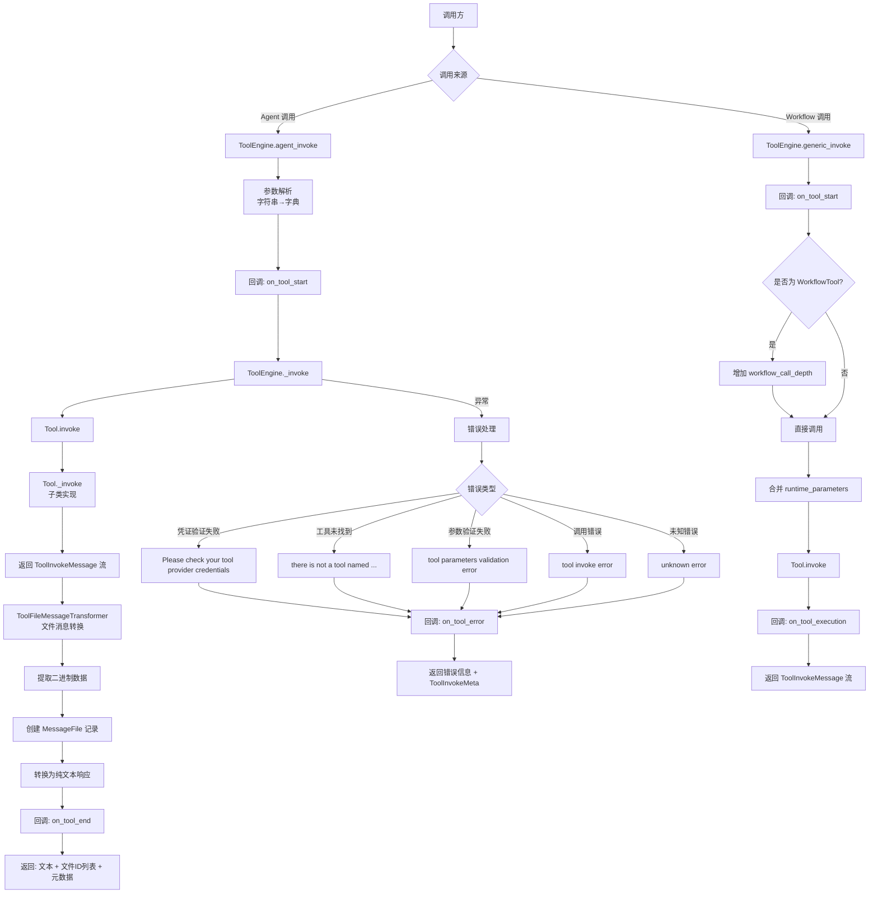
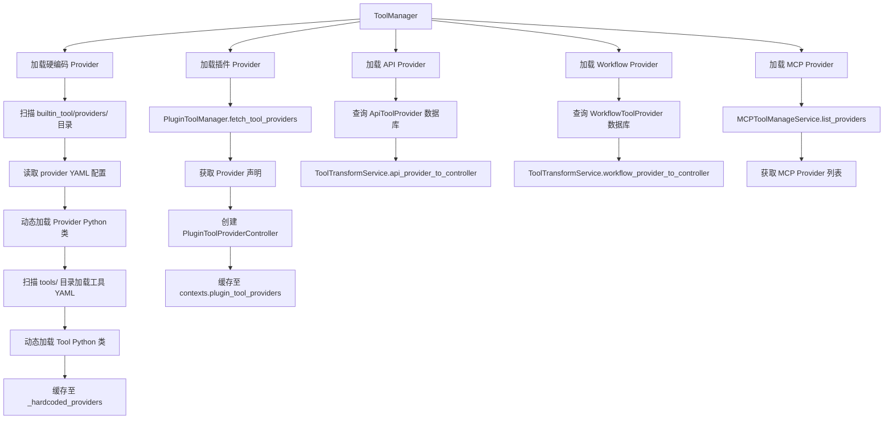
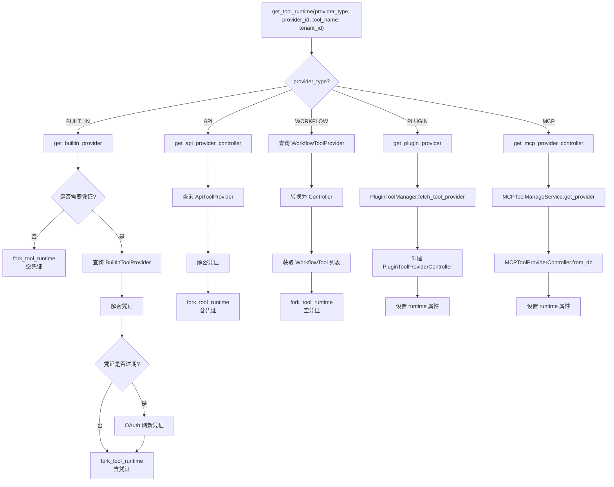
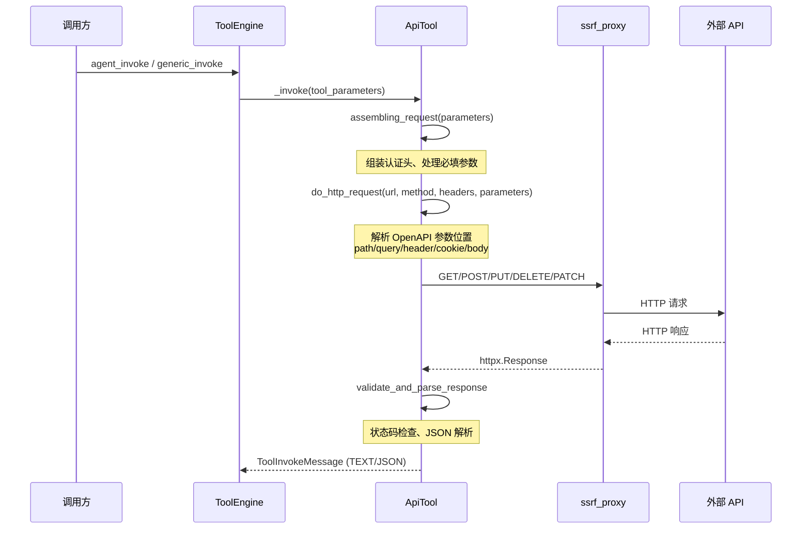
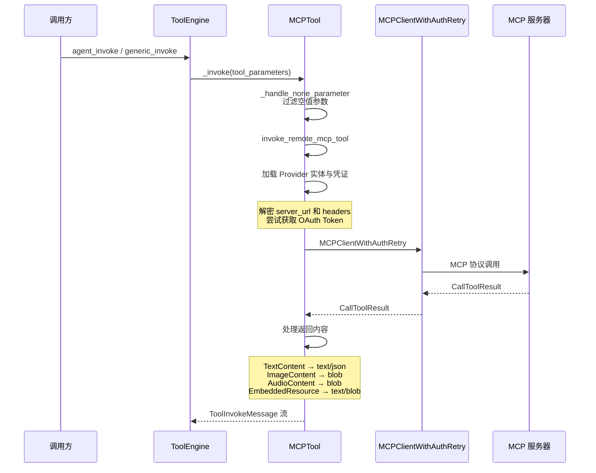
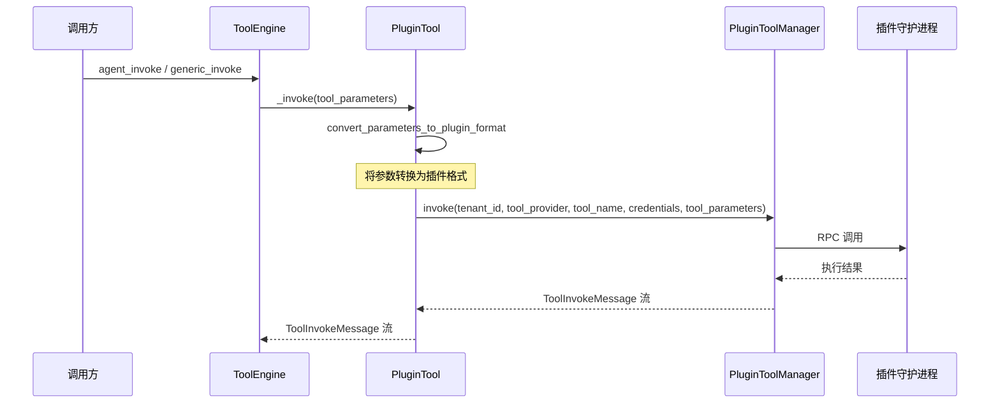
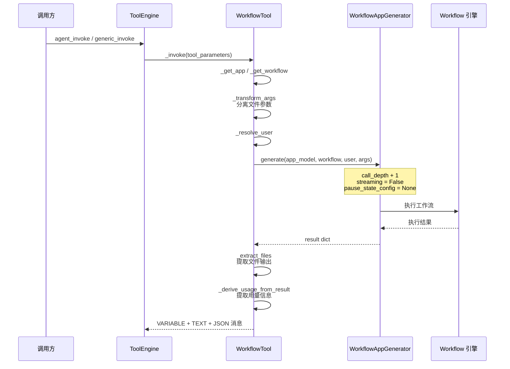
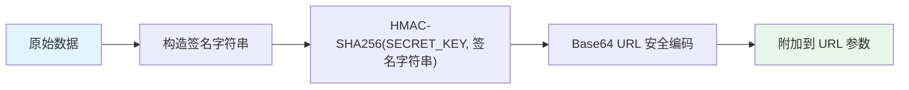
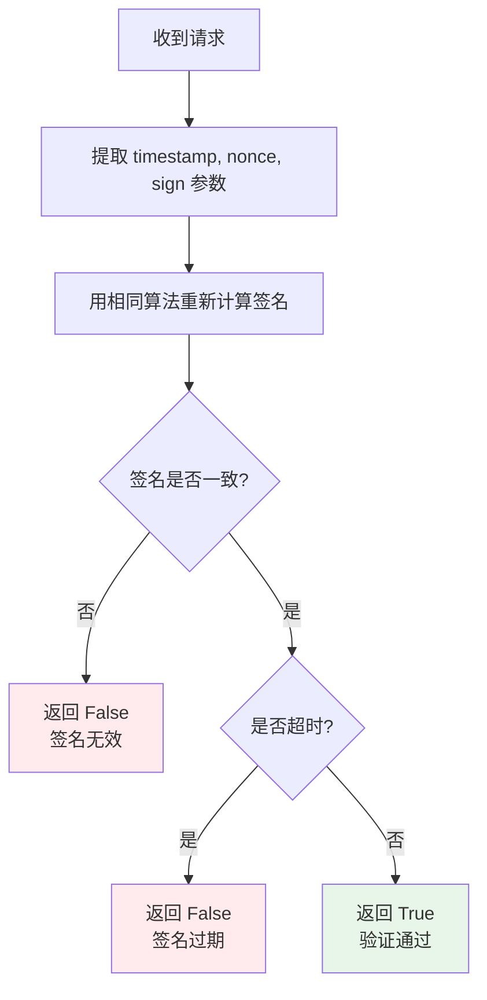

# Dify Tool 工具系统功能文档

## 1. Tool 概述

Tool（工具）是 Dify 平台中可被 Agent 和 Workflow 调用的外部能力单元。工具系统为 LLM 应用提供了与外部世界交互的能力，使其能够执行搜索、调用 API、操作文件、执行代码等超出纯文本生成的任务。

工具系统的核心设计理念：

- **统一抽象**：所有工具类型共享相同的基类接口（`Tool` 和 `ToolProviderController`），调用方无需关心底层实现差异
- **Provider-Tool 两层模型**：每个工具归属于一个 Provider（工具提供者），Provider 负责凭证管理和工具发现，Tool 负责具体的执行逻辑
- **双调用入口**：工具可由 Agent（智能体）和 Workflow（工作流）两种场景调用，分别通过 `ToolEngine.agent_invoke` 和 `ToolEngine.generic_invoke` 执行
- **安全隔离**：通过凭证加密、签名验证、SSRF 防护等机制保障工具调用的安全性

### 核心源码位置

| 模块 | 路径 | 职责 |
|------|------|------|
| 工具引擎 | `api/core/tools/tool_engine.py` | 工具执行调度与结果处理 |
| 工具管理器 | `api/core/tools/tool_manager.py` | 工具发现、注册与运行时实例化 |
| 工具文件管理 | `api/core/tools/tool_file_manager.py` | 工具产生的文件生命周期管理 |
| 签名验证 | `api/core/tools/signature.py` | 文件访问与上传的 HMAC 签名机制 |
| 基类定义 | `api/core/tools/__base/` | Tool、ToolProviderController、ToolRuntime 抽象基类 |
| 实体定义 | `api/core/tools/entities/` | 工具相关的数据模型与类型定义 |

---

## 2. 工具类型列表

Dify 支持以下五种工具类型，每种类型对应不同的工具来源和调用方式：

| 工具类型 | 枚举值 | Provider 控制器 | Tool 类 | 说明 |
|----------|--------|-----------------|---------|------|
| 内置工具 | `builtin` | `BuiltinToolProviderController` | `BuiltinTool` | 平台内置的工具集，如时间、代码执行、网页抓取、音频处理等 |
| 自定义工具 | `api` | `ApiToolProviderController` | `ApiTool` | 用户通过 OpenAPI Schema 自定义的 REST API 工具 |
| MCP 工具 | `mcp` | `MCPToolProviderController` | `MCPTool` | 通过 MCP（Model Context Protocol）协议调用的远程工具 |
| 插件工具 | `plugin` | `PluginToolProviderController` | `PluginTool` | 通过 Dify 插件系统提供的工具 |
| Workflow 作为工具 | `workflow` | `WorkflowToolProviderController` | `WorkflowTool` | 将已发布的 Workflow 发布为可被调用的工具 |

### 工具类型枚举定义

```python
class ToolProviderType(StrEnum):
    PLUGIN = auto()
    BUILT_IN = "builtin"
    WORKFLOW = auto()
    API = auto()
    APP = auto()
    DATASET_RETRIEVAL = "dataset-retrieval"
    MCP = auto()
```

---

## 3. 工具引擎架构

`ToolEngine` 是工具系统的执行引擎，负责工具调用的调度、参数处理、结果转换和错误处理。它提供两个核心入口方法：`agent_invoke` 和 `generic_invoke`。

### 3.1 执行流程



### 3.2 ToolInvokeMessage 消息类型

工具执行结果以 `ToolInvokeMessage` 的形式返回，支持以下消息类型：

| 消息类型 | 枚举值 | 数据结构 | 说明 |
|----------|--------|----------|------|
| 文本 | `TEXT` | `TextMessage` | 纯文本响应 |
| 图片 | `IMAGE` | `TextMessage`（URL） | 图片 URL |
| 链接 | `LINK` | `TextMessage`（URL） | 超链接 |
| 二进制 | `BLOB` | `BlobMessage` | 二进制数据（如音频、文件） |
| JSON | `JSON` | `JsonMessage` | 结构化 JSON 数据 |
| 图片链接 | `IMAGE_LINK` | `TextMessage`（URL） | 图片链接 |
| 变量 | `VARIABLE` | `VariableMessage` | 工作流变量输出 |
| 文件 | `FILE` | `FileMessage` | 文件对象 |
| 日志 | `LOG` | `LogMessage` | 工具执行日志 |

### 3.3 Agent 调用与 Workflow 调用的差异

| 特性 | Agent 调用 (`agent_invoke`) | Workflow 调用 (`generic_invoke`) |
|------|---------------------------|--------------------------------|
| 参数处理 | 支持字符串参数自动解析为字典 | 仅接受字典参数 |
| 结果处理 | 转换为纯文本 + 创建 MessageFile | 直接返回 ToolInvokeMessage 流 |
| 回调机制 | `DifyAgentCallbackHandler` | `DifyWorkflowCallbackHandler` |
| 文件处理 | 自动提取二进制并创建消息文件 | 由 Workflow 节点自行处理 |
| 错误处理 | 捕获异常并返回错误文本 | 捕获异常并向上抛出 |
| Workflow 深度 | 不涉及 | 自动递增 `workflow_call_depth` |

---

## 4. 工具管理器

`ToolManager` 是工具系统的核心管理器，负责工具的发现、注册、运行时实例化和凭证管理。它采用类方法设计，通过缓存机制提升性能。

### 4.1 工具发现与注册机制



### 4.2 运行时实例化

`ToolManager.get_tool_runtime` 是获取工具运行时实例的核心方法，根据 `provider_type` 分发到不同的处理逻辑：



### 4.3 Agent/Workflow 工具运行时获取

| 方法 | 用途 | 特殊处理 |
|------|------|----------|
| `get_agent_tool_runtime` | 获取 Agent 场景的工具运行时 | 不支持 FILE/FILES 类型参数；参数通过 `variable_pool` 解析 |
| `get_workflow_tool_runtime` | 获取 Workflow 场景的工具运行时 | 支持 variable/constant/mixed 三种参数输入模式 |
| `get_tool_runtime_from_plugin` | 获取插件调用的工具运行时 | 使用 SERVICE_API 调用来源 |

### 4.4 Provider 列表 API

`list_providers_from_api` 方法为前端 API 提供统一的 Provider 列表，支持按类型过滤（`builtin`/`api`/`workflow`/`mcp`），并返回排序后的结果。

---

## 5. 各类工具的创建和使用流程

### 5.1 内置工具 (Builtin Tool)

#### 创建流程

内置工具通过文件系统组织，每个 Provider 是 `builtin_tool/providers/` 下的一个目录：

```
builtin_tool/providers/
├── time/
│   ├── time.yaml          # Provider 声明（身份、凭证模式、标签）
│   ├── time.py            # Provider 控制器实现
│   ├── _assets/
│   │   └── icon.svg       # Provider 图标
│   └── tools/
│       ├── current_time.yaml  # 工具参数定义
│       └── current_time.py    # 工具实现逻辑
├── code/
│   ├── code.yaml
│   ├── code.py
│   └── tools/
│       ├── simple_code.yaml
│       └── simple_code.py
└── ...
```

**Provider YAML 示例结构**：

```yaml
identity:
  name: time
  author: Dify
  label:
    en_US: Time
    zh_Hans: 时间
  icon: icon.svg
  tags:
    - productivity
credentials_for_provider:
  api_key:
    type: secret-input
    required: true
    label:
      en_US: API Key
```

**Tool Python 实现**：继承 `BuiltinTool`，实现 `_invoke` 方法：

```python
class CurrentTimeTool(BuiltinTool):
    def _invoke(self, user_id, tool_parameters, conversation_id=None, app_id=None, message_id=None):
        timezone = tool_parameters.get("timezone", "UTC")
        current_time = datetime.now(ZoneInfo(timezone))
        yield self.create_text_message(current_time.isoformat())
```

#### 调用流程

1. `ToolManager.get_builtin_provider` 从缓存或文件系统加载 Provider
2. `BuiltinToolProviderController.get_tool` 获取指定工具
3. `BuiltinTool.fork_tool_runtime` 创建含运行时上下文的新实例
4. `BuiltinTool._invoke` 执行具体逻辑

#### 特有能力

| 能力 | 方法 | 说明 |
|------|------|------|
| 模型调用 | `invoke_model` | 内置工具可直接调用 LLM 模型 |
| 内容摘要 | `summary` | 对超长文本自动分段摘要 |
| Token 计算 | `get_prompt_tokens` | 计算提示词的 Token 数量 |

### 5.2 自定义工具 (Custom Tool / API Tool)

#### 创建流程

自定义工具通过 OpenAPI Schema 定义，用户在 Dify 控制台中创建：

1. 用户提供 OpenAPI/Swagger Schema（URL 或直接粘贴）
2. 系统解析 Schema 生成 `ApiToolBundle` 列表
3. 每个 API Operation 对应一个 `ApiTool` 实例
4. 用户配置认证方式（无认证 / API Key Header / API Key Query）

**认证方式**：

| 认证类型 | 枚举值 | 说明 |
|----------|--------|------|
| 无认证 | `NONE` | 不需要任何凭证 |
| API Key 请求头 | `API_KEY_HEADER` | 通过 HTTP Header 携带 API Key |
| API Key 查询参数 | `API_KEY_QUERY` | 通过 URL Query 参数携带 API Key |

#### 调用流程



#### HTTP 请求参数处理

`ApiTool.do_http_request` 根据 OpenAPI Schema 中的参数定义，将工具参数分发到不同位置：

| 参数位置 | OpenAPI `in` 值 | 处理方式 |
|----------|-----------------|----------|
| 路径参数 | `path` | 替换 URL 中的 `{param_name}` 占位符 |
| 查询参数 | `query` | 添加到 URL query string |
| 请求头 | `header` | 添加到 HTTP headers |
| Cookie | `cookie` | 添加到 cookies |
| 请求体 | `requestBody` | 根据 Content-Type 序列化（JSON / form / multipart） |

### 5.3 MCP 工具 (MCP Tool)

#### 创建流程

MCP 工具通过 MCP（Model Context Protocol）协议连接到远程 MCP 服务器：

1. 用户在 Dify 控制台添加 MCP 服务器（提供 Server URL 和可选的 Headers）
2. 系统通过 MCP 协议发现服务器提供的工具列表
3. 将远程工具的 `inputSchema` 转换为 `ToolParameter` 列表
4. 创建 `MCPToolProviderController` 和 `MCPTool` 实例

#### 调用流程



#### MCP 内容类型处理

| MCP 内容类型 | 转换为 | 说明 |
|-------------|--------|------|
| `TextContent` | `TEXT` / `JSON` | 自动检测 JSON 格式 |
| `ImageContent` | `BLOB` | Base64 解码后创建 blob 消息 |
| `AudioContent` | `BLOB` | Base64 解码后创建 blob 消息 |
| `TextResourceContents` | `TEXT` | 嵌入式文本资源 |
| `BlobResourceContents` | `BLOB` | 嵌入式二进制资源 |

#### 结构化输出

当 MCP 工具定义了 `output_schema` 且返回结果包含 `structuredContent` 时，系统会为每个键值对创建 `VARIABLE` 类型的消息，支持 Workflow 中的变量传递。

### 5.4 插件工具 (Plugin Tool)

#### 创建流程

插件工具通过 Dify 插件系统提供：

1. 插件开发者按照插件规范定义工具声明（包含工具名称、参数、描述等）
2. 插件安装到租户后，`PluginToolManager` 负责发现和加载
3. 创建 `PluginToolProviderController` 和 `PluginTool` 实例

#### 调用流程



#### 特殊机制

- **运行时参数**：插件工具支持动态参数，通过 `PluginToolManager.get_runtime_parameters` 在运行时获取
- **凭证验证**：通过 `PluginToolManager.validate_provider_credentials` 验证插件凭证
- **参数格式转换**：`convert_parameters_to_plugin_format` 将工具参数转换为插件系统所需的格式

### 5.5 Workflow 作为工具 (Workflow as Tool)

#### 创建流程

1. 用户创建一个 Workflow 应用并发布
2. 在 Workflow 设置中，将应用发布为工具
3. 系统创建 `WorkflowToolProvider` 数据库记录
4. Workflow 的输入变量自动映射为工具参数

**变量类型到参数类型的映射**：

| Workflow 变量类型 | 工具参数类型 |
|-------------------|-------------|
| `TEXT_INPUT` | `STRING` |
| `PARAGRAPH` | `STRING` |
| `SELECT` | `SELECT` |
| `NUMBER` | `NUMBER` |
| `CHECKBOX` | `BOOLEAN` |
| `FILE` | `FILE` |
| `FILE_LIST` | `FILES` |
| `JSON_OBJECT` | `OBJECT` |

#### 调用流程



#### 特殊机制

- **调用深度控制**：`workflow_call_depth` 递增防止无限递归调用
- **文件传递**：支持将上游工具产生的文件传递给 Workflow
- **变量输出**：Workflow 输出中除 `text`/`json`/`files` 外的键值对作为 VARIABLE 消息输出
- **追踪上下文**：通过 `ParentTraceContext` 传递父级工作流追踪信息
- **用户解析**：在 Worker/Celery 上下文中从数据库解析用户对象

---

## 6. 工具文件管理

`ToolFileManager` 负责管理工具执行过程中产生的文件，包括文件的创建、存储、读取和签名。

### 6.1 核心功能

| 功能 | 方法 | 说明 |
|------|------|------|
| 通过原始数据创建文件 | `create_file_by_raw` | 接收二进制数据，存储到对象存储，创建 ToolFile 记录 |
| 通过 URL 创建文件 | `create_file_by_url` | 下载远程文件，存储到对象存储，创建 ToolFile 记录 |
| 获取文件二进制 | `get_file_binary` | 通过 ToolFile ID 获取文件内容和 MIME 类型 |
| 通过消息文件获取 | `get_file_binary_by_message_file_id` | 通过 MessageFile ID 间接获取工具文件 |
| 获取文件流 | `get_file_generator_by_tool_file_id` | 获取文件流和 File 引用对象 |
| 文件签名 | `sign_file` | 生成带 HMAC 签名的临时访问 URL |
| 签名验证 | `verify_file` | 验证签名的有效性和时效性 |

### 6.2 文件存储结构

```
tools/{tenant_id}/{uuid}{extension}
```

- 文件存储路径包含租户 ID 实现多租户隔离
- 文件名使用 UUID 保证唯一性
- 保留原始文件名的扩展名

### 6.3 文件签名机制

`ToolFileManager.sign_file` 方法为文件生成带签名的临时访问 URL：

```
{FILES_URL}/files/tools/{tool_file_id}{extension}?timestamp={ts}&nonce={nonce}&sign={sign}
```

签名算法：

1. 生成当前时间戳 `timestamp` 和随机数 `nonce`
2. 构造待签名字符串：`file-preview|{tool_file_id}|{timestamp}|{nonce}`
3. 使用 HMAC-SHA256 算法，以 `SECRET_KEY` 为密钥计算签名
4. 将签名结果进行 Base64 URL 安全编码

### 6.4 File 引用构建

`_build_graph_file_reference` 方法将 `ToolFile` 数据库记录转换为 `File` 对象，用于 Workflow 引擎中的文件传递：

```python
File(
    file_type=get_file_type_by_mime_type(tool_file.mimetype),
    transfer_method=FileTransferMethod.TOOL_FILE,
    remote_url=tool_file.original_url,
    reference=build_file_reference(record_id=str(tool_file.id)),
    filename=tool_file.name,
    extension=extension,
    mime_type=tool_file.mimetype,
    size=tool_file.size,
    storage_key=tool_file.file_key,
)
```

---

## 7. 工具签名验证

`signature.py` 模块提供了基于 HMAC-SHA256 的签名机制，用于保障工具文件访问和上传的安全性。

### 7.1 签名函数列表

| 函数 | 用途 | 签名字符串格式 |
|------|------|---------------|
| `sign_tool_file` | 为工具文件生成签名访问 URL | `file-preview\|{file_id}\|{timestamp}\|{nonce}` |
| `verify_tool_file_signature` | 验证工具文件访问签名 | 同上 |
| `sign_upload_file_preview_url` | 为上传文件生成签名预览 URL | `image-preview\|{upload_file_id}\|{timestamp}\|{nonce}` |
| `get_signed_file_url_for_plugin` | 为插件文件上传生成签名 URL | `upload\|{filename}\|{mimetype}\|{tenant_id}\|{user_id}\|{timestamp}\|{nonce}` |
| `verify_plugin_file_signature` | 验证插件文件上传签名 | 同上 |

### 7.2 签名算法



**签名步骤**：

1. **构造签名字符串**：将操作类型、文件 ID、时间戳、随机数等用 `|` 连接
2. **计算 HMAC**：使用 `SECRET_KEY` 作为密钥，对签名字符串进行 HMAC-SHA256 计算
3. **编码**：将计算结果进行 Base64 URL 安全编码
4. **附加参数**：将 `timestamp`、`nonce`、`sign` 作为 URL 查询参数

### 7.3 验证流程



**验证条件**：

- **签名一致性**：重新计算的签名必须与请求中的签名完全匹配
- **时效性**：当前时间与签名时间戳的差值不超过 `FILES_ACCESS_TIMEOUT` 配置

### 7.4 内外部 URL 区分

| 场景 | Base URL | 说明 |
|------|----------|------|
| 外部访问 | `FILES_URL` | 面向用户的文件访问地址 |
| 内部访问（Docker 环境） | `INTERNAL_FILES_URL` | 容器间通信的内部地址 |
| 插件上传 | `INTERNAL_FILES_URL`（优先） | 插件守护进程使用的内部地址 |

---

## 附录 A：错误类型一览

| 错误类 | 触发场景 |
|--------|----------|
| `ToolProviderNotFoundError` | Provider 不存在或已被删除 |
| `ToolNotFoundError` | 工具名称在 Provider 中不存在 |
| `ToolNotSupportedError` | 工具不支持当前操作 |
| `ToolParameterValidationError` | 工具参数验证失败（缺少必填参数、类型错误等） |
| `ToolProviderCredentialValidationError` | Provider 凭证验证失败 |
| `ToolInvokeError` | 工具执行过程中发生错误 |
| `ToolEngineInvokeError` | 引擎层面调用失败，携带 `ToolInvokeMeta` 元数据 |
| `ToolApiSchemaError` | API Schema 解析错误 |
| `ToolSSRFError` | SSRF 安全检查失败 |
| `ToolCredentialPolicyViolationError` | 凭证策略违规 |
| `ApiToolProviderNotFoundError` | API Provider 不存在 |
| `WorkflowToolHumanInputNotSupportedError` | 含 Human Input 节点的 Workflow 不能发布为工具 |

## 附录 B：核心类继承关系

```mermaid
classDiagram
    class Tool {
        <<abstract>>
        +entity: ToolEntity
        +runtime: ToolRuntime
        +invoke(user_id, tool_parameters) Generator~ToolInvokeMessage~
        +_invoke(user_id, tool_parameters)* Generator~ToolInvokeMessage~
        +tool_provider_type()* ToolProviderType
        +fork_tool_runtime(runtime) Tool
        +create_text_message(text) ToolInvokeMessage
        +create_json_message(object) ToolInvokeMessage
        +create_image_message(image) ToolInvokeMessage
        +create_blob_message(blob, meta) ToolInvokeMessage
        +create_link_message(link) ToolInvokeMessage
        +create_variable_message(name, value) ToolInvokeMessage
        +create_file_message(file) ToolInvokeMessage
    }

    class BuiltinTool {
        +provider: str
        +invoke_model(user_id, prompt_messages, stop) LLMResult
        +summary(user_id, content) str
    }

    class ApiTool {
        +api_bundle: ApiToolBundle
        +provider_id: str
        +assembling_request(parameters) dict
        +do_http_request(url, method, headers, parameters) Response
        +validate_credentials(credentials, parameters) str
    }

    class MCPTool {
        +tenant_id: str
        +server_url: str
        +provider_id: str
        +invoke_remote_mcp_tool(tool_parameters) CallToolResult
    }

    class PluginTool {
        +tenant_id: str
        +plugin_unique_identifier: str
    }

    class WorkflowTool {
        +workflow_app_id: str
        +workflow_call_depth: int
        +_transform_args(tool_parameters) tuple
        +_extract_files(outputs) tuple
    }

    Tool <|-- BuiltinTool
    Tool <|-- ApiTool
    Tool <|-- MCPTool
    Tool <|-- PluginTool
    Tool <|-- WorkflowTool

    class ToolProviderController {
        <<abstract>>
        +entity: ToolProviderEntity
        +get_tool(tool_name)* Tool
        +validate_credentials_format(credentials)
    }

    class BuiltinToolProviderController {
        +tools: list~BuiltinTool~
        +_load_tools()
        +validate_credentials(user_id, credentials)
        +need_credentials: bool
    }

    class ApiToolProviderController {
        +provider_id: str
        +tenant_id: str
        +load_bundled_tools(tools)
    }

    class MCPToolProviderController {
        +server_url: str
        +headers: dict
        +from_db(db_provider) MCPToolProviderController
        +from_entity(entity) MCPToolProviderController
    }

    class PluginToolProviderController {
        +plugin_id: str
        +plugin_unique_identifier: str
        +tenant_id: str
    }

    class WorkflowToolProviderController {
        +provider_id: str
        +from_db(db_provider) WorkflowToolProviderController
    }

    ToolProviderController <|-- BuiltinToolProviderController
    ToolProviderController <|-- ApiToolProviderController
    ToolProviderController <|-- MCPToolProviderController
    BuiltinToolProviderController <|-- PluginToolProviderController
    ToolProviderController <|-- WorkflowToolProviderController
```



## 附录 C：ToolRuntime 运行时上下文

`ToolRuntime` 是工具执行时的上下文对象，携带了调用所需的所有运行时信息：

| 字段 | 类型 | 说明 |
|------|------|------|
| `tenant_id` | `str` | 租户 ID |
| `user_id` | `str \| None` | 调用用户 ID |
| `tool_id` | `str \| None` | 工具 ID |
| `invoke_from` | `InvokeFrom \| None` | 调用来源（DEBUGGER / EXPLORE / SERVICE_API 等） |
| `tool_invoke_from` | `ToolInvokeFrom \| None` | 工具调用来源（AGENT / WORKFLOW / PLUGIN） |
| `credentials` | `dict[str, Any]` | 解密后的凭证信息 |
| `credential_type` | `CredentialType` | 凭证类型（API_KEY / OAUTH2 / UNAUTHORIZED） |
| `runtime_parameters` | `dict[str, Any]` | 运行时参数（由 Agent/Workflow 配置注入） |
