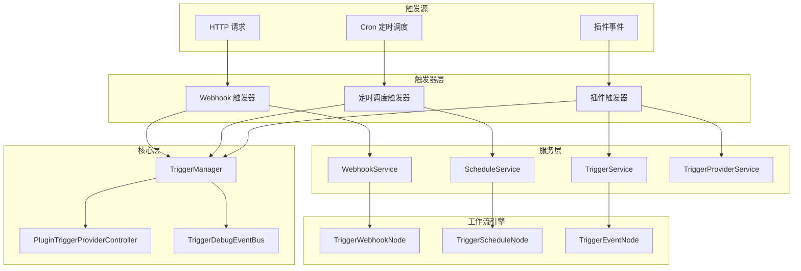
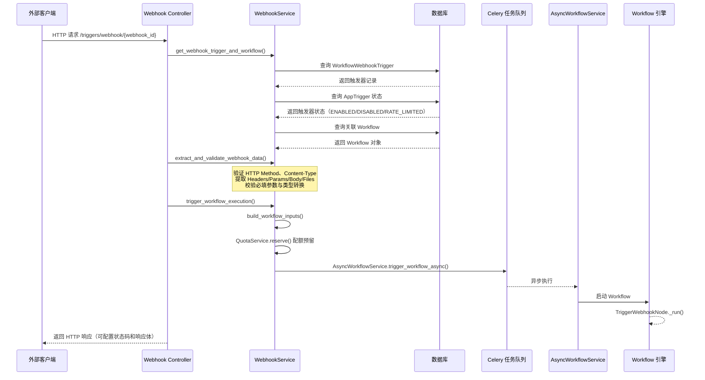
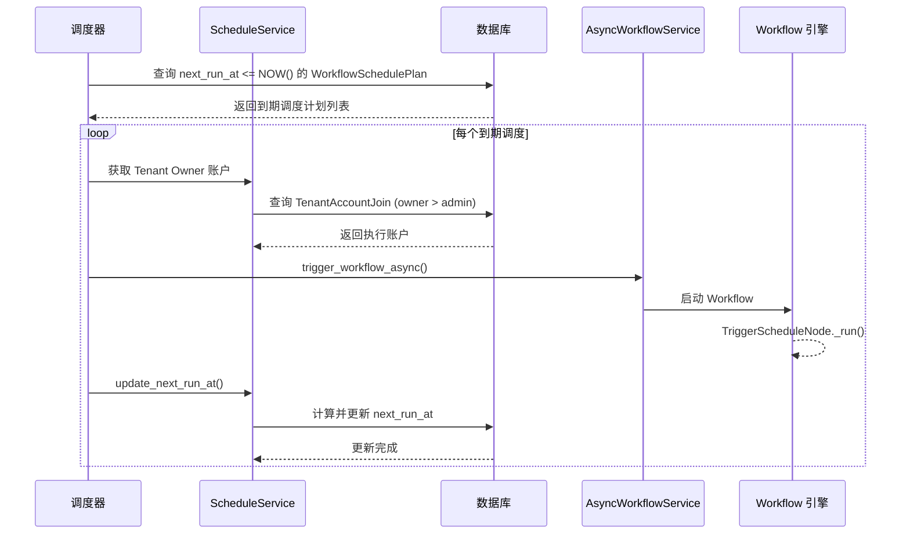
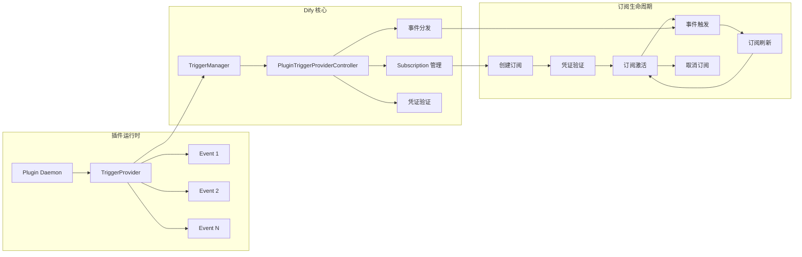
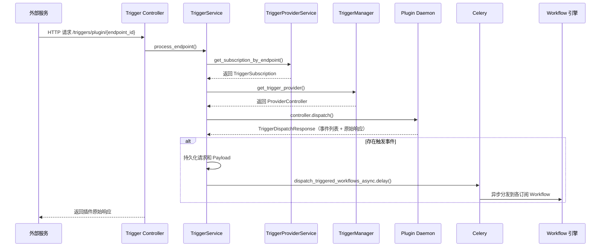
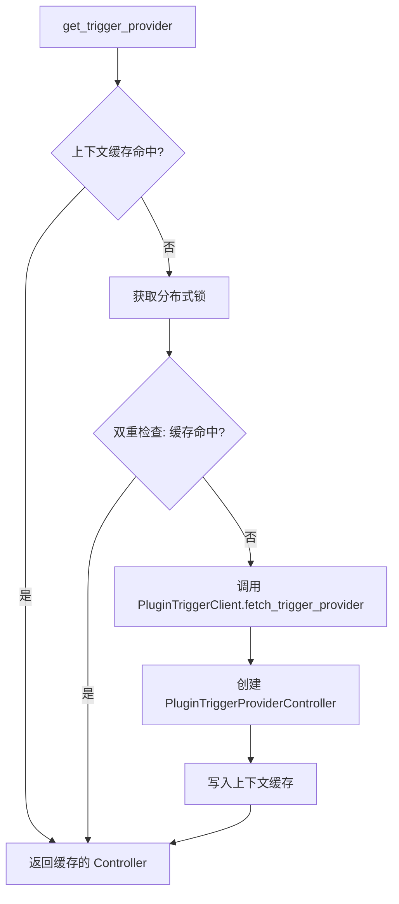
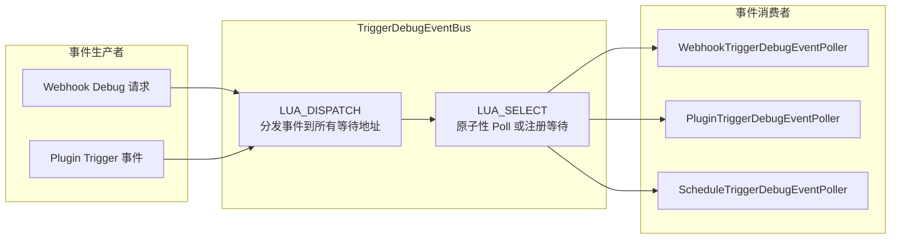

# Dify Trigger 触发器系统

## 1. Trigger 概述

Trigger（触发器）是 Dify Workflow 的核心触发机制，定义了 Workflow 的启动方式。当 Workflow 配置了触发器节点后，系统可以通过外部事件、定时调度或插件事件等方式自动启动 Workflow 执行，而无需人工手动触发。

Trigger 系统的设计遵循以下核心原则：

- **多触发方式支持**：提供 Webhook、定时调度、插件事件三种触发方式，覆盖从外部集成到内部调度的全场景需求
- **插件化扩展**：插件触发器通过 Plugin Daemon 运行时动态加载，支持第三方扩展新的触发源
- **订阅生命周期管理**：插件触发器采用订阅（Subscription）模型，支持创建、验证、刷新、取消订阅的完整生命周期
- **调试支持**：每种触发器均提供 Debug 模式，支持在草稿工作流中实时调试触发事件
- **凭证安全**：通过加密存储和脱敏展示机制保障 OAuth/API Key 等凭证安全

### 系统架构总览



---

## 2. 触发器类型列表

| 触发器类型 | 节点类型标识 | 触发方式 | 核心用途 | 数据来源 |
|---|---|---|---|---|
| **Webhook 触发器** | `trigger-webhook` | HTTP 请求触发 | 接收外部系统的 HTTP 回调通知，实现事件驱动的 Workflow 执行 | HTTP 请求的 Headers、Query Params、Body、Files |
| **定时调度触发器** | `trigger-schedule` | Cron 表达式定时触发 | 按照 Cron 表达式周期性自动执行 Workflow | 系统时间、Cron 配置 |
| **插件触发器** | `trigger-plugin` | 插件事件触发 | 通过插件 Provider 订阅外部事件（如 GitHub Webhook、Slack 消息等），由插件运行时分发事件 | 插件 Dispatch 响应中的事件变量 |

三种触发器类型在 [constants.py](../../api/core/trigger/constants.py) 中统一注册：

```python
TRIGGER_WEBHOOK_NODE_TYPE: Final[str] = "trigger-webhook"
TRIGGER_SCHEDULE_NODE_TYPE: Final[str] = "trigger-schedule"
TRIGGER_PLUGIN_NODE_TYPE: Final[str] = "trigger-plugin"

TRIGGER_NODE_TYPES: Final[frozenset[str]] = frozenset((
    TRIGGER_WEBHOOK_NODE_TYPE,
    TRIGGER_SCHEDULE_NODE_TYPE,
    TRIGGER_PLUGIN_NODE_TYPE,
))
```

---

## 3. Webhook 触发流程

### 3.1 完整触发流程



### 3.2 Webhook 数据提取与验证

Webhook 触发器支持以下 Content-Type：

| Content-Type | 提取方式 | 文件支持 |
|---|---|---|
| `application/json` | JSON 解析 | 否 |
| `application/x-www-form-urlencoded` | Form 表单解析 | 否 |
| `multipart/form-data` | Multipart 解析 | 是 |
| `application/octet-stream` | 二进制流处理 | 是（自动检测 MIME） |
| `text/plain` | 纯文本提取 | 否 |

验证流程包含以下步骤：

1. **请求体大小校验**：检查 `Content-Length` 是否超过 `WEBHOOK_REQUEST_BODY_MAX_SIZE`
2. **HTTP Method 匹配**：请求方法必须与节点配置的 `method` 一致
3. **Content-Type 匹配**：请求内容类型必须与节点配置的 `content_type` 一致
4. **必填参数校验**：检查配置为 `required` 的 Headers、Query Params、Body 参数是否存在
5. **类型转换与验证**：根据参数的 `SegmentType` 进行类型转换（如字符串转数字、布尔值等）

### 3.3 Webhook 节点配置

[WebhookData](../../api/core/workflow/nodes/trigger_webhook/entities.py) 定义了 Webhook 触发器的完整配置：

| 字段 | 类型 | 默认值 | 说明 |
|---|---|---|---|
| `method` | `Method` 枚举 | `GET` | 允许的 HTTP 方法 |
| `content_type` | `ContentType` 枚举 | `application/json` | 请求内容类型 |
| `headers` | `Sequence[WebhookParameter]` | `[]` | 需提取的请求头定义 |
| `params` | `Sequence[WebhookParameter]` | `[]` | 需提取的查询参数定义 |
| `body` | `Sequence[WebhookBodyParameter]` | `[]` | 需提取的请求体参数定义 |
| `status_code` | `int` | `200` | 响应状态码 |
| `response_body` | `str` | `""` | 响应体模板 |
| `timeout` | `int` | `30` | 超时时间（秒） |
| `webhook_id` | `str \| None` | `None` | Webhook 唯一标识（系统生成） |

### 3.4 Webhook 关系同步

[WebhookService.sync_webhook_relationships()](../../api/services/trigger/webhook_service.py) 负责 Workflow 与 Webhook 记录的同步：

- 遍历 Workflow 图中的 `trigger-webhook` 节点
- 与数据库中已有的 `WorkflowWebhookTrigger` 记录进行 Diff
- 新增缺失的 Webhook 记录，删除不再使用的记录
- 使用 Redis 缓存加速查询，分布式锁保证并发安全
- **限制**：每个 Workflow 最多 5 个 Webhook 节点

### 3.5 Webhook Debug 模式

Debug 模式通过 `/triggers/webhook-debug/{webhook_id}` 端点工作：

- 不触发生产 Workflow 执行，不发送 Celery 任务
- 将 Webhook 事件通过 `TriggerDebugEventBus` 分发到活跃的 Variable Inspector 监听器
- 如果没有活跃监听器，返回 `409 Conflict` 并提示使用正式 Webhook URL
- 使用 Redis Lua 脚本实现原子性的 Dispatch/Poll 操作

---

## 4. 定时调度机制

### 4.1 调度配置

定时调度触发器支持两种配置模式：

| 模式 | 说明 | 配置字段 |
|---|---|---|
| **可视化模式** (`visual`) | 通过频率和时间配置生成 Cron 表达式 | `frequency` + `visual_config` |
| **Cron 模式** (`cron`) | 直接输入 Cron 表达式 | `cron_expression` |

#### 可视化模式频率转换

| 频率 | VisualConfig 字段 | 生成的 Cron 表达式格式 | 示例 |
|---|---|---|---|
| `hourly` | `on_minute` | `{minute} * * * *` | `30 * * * *`（每小时第30分钟） |
| `daily` | `time` | `{minute} {hour} * * *` | `0 14 * * *`（每天下午2点） |
| `weekly` | `time` + `weekdays` | `{minute} {hour} * * {days}` | `0 9 * * 1,3,5`（每周一三五上午9点） |
| `monthly` | `time` + `monthly_days` | `{minute} {hour} {days} * *` | `0 10 1,15,L * *`（每月1号、15号、最后一天上午10点） |

### 4.2 调度执行流程



### 4.3 调度服务核心方法

[ScheduleService](../../api/services/trigger/schedule_service.py) 提供以下核心方法：

| 方法 | 说明 |
|---|---|
| `create_schedule()` | 创建调度计划，计算首次执行时间 |
| `update_schedule()` | 更新调度配置，时间相关字段变更时自动重算 `next_run_at` |
| `delete_schedule()` | 删除调度计划 |
| `update_next_run_at()` | 执行完成后推进到下一次执行时间 |
| `to_schedule_config()` | 将节点配置转换为 `ScheduleConfig`（支持 visual/cron 两种模式） |
| `extract_schedule_config()` | 从 Workflow 图中提取调度配置 |
| `visual_to_cron()` | 将可视化配置转换为 Cron 表达式 |

### 4.4 调度 Debug 模式

`ScheduleTriggerDebugEventPoller` 在 Debug 模式下模拟调度触发：

- 在 Redis 中创建调度运行时缓存（`ScheduleDebugRuntime`），包含 Cron 表达式、时区和下次执行时间
- 每次 Poll 时检查 `next_run_at` 是否已到达
- 到达时创建 `ScheduleDebugEvent` 并删除运行时缓存，下次 Poll 将重新计算
- 缓存 TTL 为 5 分钟

---

## 5. 插件触发器集成

### 5.1 插件触发器架构

插件触发器通过 Plugin Daemon 运行时实现动态扩展，采用 Provider-Subscription-Event 三层模型：



### 5.2 触发器 Provider

[PluginTriggerProviderController](../../api/core/trigger/provider.py) 是插件触发器的核心控制器，封装了与 Plugin Daemon 的所有交互：

| 方法 | 说明 |
|---|---|
| `dispatch()` | 将 HTTP 请求分发给插件运行时，返回触发事件列表 |
| `invoke_trigger_event()` | 调用插件触发器事件，将请求数据转换为 Workflow 变量 |
| `subscribe_trigger()` | 向插件运行时注册订阅（如注册 Webhook URL） |
| `unsubscribe_trigger()` | 取消订阅（如删除第三方 Webhook） |
| `refresh_trigger()` | 刷新订阅（如续期 Token） |
| `validate_credentials()` | 验证凭证有效性 |
| `get_events()` | 获取 Provider 支持的事件列表 |
| `get_credentials_schema()` | 获取凭证 Schema（OAuth/API Key） |

### 5.3 订阅创建方式

| 创建方式 | 标识 | 说明 |
|---|---|---|
| **手动创建** | `MANUAL` | 用户手动填写参数，无需自动订阅 |
| **OAuth 授权** | `OAUTH` | 通过 OAuth 2.0 流程获取凭证并自动订阅 |
| **API Key** | `APIKEY` | 通过 API Key 凭证自动订阅 |

### 5.4 插件触发器事件分发流程



### 5.5 订阅构建器

[TriggerSubscriptionBuilderService](../../api/services/trigger/trigger_subscription_builder_service.py) 实现了订阅的渐进式构建流程：

1. **创建 Builder**：生成临时 Builder 对象，缓存到 Redis（TTL 30分钟）
2. **更新 Builder**：逐步填写参数、凭证等信息
3. **验证 Builder**：校验凭证有效性（API Key 验证 / OAuth 状态检查）
4. **构建订阅**：根据凭证类型自动或手动创建最终订阅
5. **验证端点**：Builder 创建期间，临时端点可接收请求用于第三方验证回调

### 5.6 插件触发器关系同步

[TriggerService.sync_plugin_trigger_relationships()](../../api/services/trigger/trigger_service.py) 负责 Workflow 与插件触发器记录的同步：

- 遍历 Workflow 图中的 `trigger-plugin` 节点
- 与数据库中已有的 `WorkflowPluginTrigger` 记录进行 Diff
- 新增缺失的记录，更新变化的记录（subscription_id、provider_id、event_name），删除不再使用的记录
- 使用 Redis 缓存和分布式锁保证并发安全
- **限制**：每个 Workflow 最多 5 个插件触发器节点

### 5.7 插件触发器 Debug 模式

`PluginTriggerDebugEventPoller` 在 Debug 模式下处理插件触发事件：

- 通过 `TriggerDebugEventBus.poll()` 轮询插件触发事件
- 收到事件后调用 `TriggerService.invoke_trigger_event()` 将事件数据转换为 Workflow 变量
- 如果事件被取消（`cancelled=True`），返回 `None` 跳过本次触发

---

## 6. 触发器管理

### 6.1 TriggerManager

[TriggerManager](../../api/core/trigger/trigger_manager.py) 是触发器系统的统一管理入口，提供以下核心能力：

| 方法 | 说明 |
|---|---|
| `list_plugin_trigger_providers()` | 列出租户可用的所有插件触发器 Provider |
| `get_trigger_provider()` | 获取指定 Provider 的控制器（带上下文缓存和双重检查锁） |
| `list_triggers_by_provider()` | 列出 Provider 支持的所有触发事件 |
| `invoke_trigger_event()` | 执行触发器事件 |
| `subscribe_trigger()` | 订阅触发器 |
| `unsubscribe_trigger()` | 取消订阅 |
| `refresh_trigger()` | 刷新订阅 |
| `get_trigger_plugin_icon()` | 获取插件触发器图标 URL |

Provider 加载采用**上下文缓存 + 双重检查锁**机制：



### 6.2 实体模型

触发器系统的核心实体定义在 [entities.py](../../api/core/trigger/entities/entities.py)：

| 实体 | 说明 |
|---|---|
| `TriggerProviderEntity` | Provider 声明，包含身份标识、订阅 Schema、事件列表 |
| `TriggerProviderIdentity` | Provider 身份信息（author、name、label、description、icon、tags） |
| `EventEntity` | 触发事件定义，包含身份、参数列表、输出 Schema |
| `EventParameter` | 事件参数定义，支持多种类型（STRING、NUMBER、BOOLEAN、SELECT、FILE 等） |
| `Subscription` | 订阅结果，包含过期时间、端点 URL、参数和属性 |
| `SubscriptionBuilder` | 订阅构建器，用于渐进式创建订阅 |
| `TriggerCreationMethod` | 订阅创建方式枚举（OAUTH、APIKEY、MANUAL） |
| `UnsubscribeResult` | 取消订阅结果 |

### 6.3 凭证加密与缓存

[encryption.py](../../api/core/trigger/utils/encryption.py) 提供凭证的安全存储和脱敏展示：

| 组件 | 说明 |
|---|---|
| `TriggerProviderCredentialsCache` | 凭证缓存，按 tenant_id + provider_id + credential_id 索引 |
| `TriggerProviderOAuthClientParamsCache` | OAuth 客户端参数缓存 |
| `TriggerProviderPropertiesCache` | 订阅属性缓存 |
| `create_trigger_provider_encrypter_for_subscription()` | 创建订阅凭证加密器 |
| `create_trigger_provider_encrypter_for_properties()` | 创建属性加密器 |
| `masked_credentials()` | 凭证脱敏（SECRET_INPUT 类型字段中间用 `*` 替代） |

### 6.4 分布式锁

[locks.py](../../api/core/trigger/utils/locks.py) 提供订阅刷新的并发保护：

- `build_trigger_refresh_lock_key()`：构建 Redis 锁 Key，格式为 `trigger_provider_refresh_lock:{tenant_id}_{subscription_id}`
- `build_trigger_refresh_lock_keys()`：批量构建锁 Key

### 6.5 端点 URL 生成

[endpoint.py](../../api/core/trigger/utils/endpoint.py) 负责生成触发器端点 URL：

| 函数 | URL 格式 |
|---|---|
| `generate_plugin_trigger_endpoint_url()` | `{TRIGGER_URL}/triggers/plugin/{endpoint_id}` |
| `generate_webhook_trigger_endpoint()` | `{TRIGGER_URL}/triggers/webhook/{webhook_id}` |
| `generate_webhook_trigger_endpoint(debug=True)` | `{TRIGGER_URL}/triggers/webhook-debug/{webhook_id}` |

### 6.6 错误体系

[errors.py](../../api/core/trigger/errors.py) 定义了触发器系统的错误类型：

| 错误类型 | 说明 |
|---|---|
| `TriggerProviderCredentialValidationError` | Provider 凭证验证失败 |
| `TriggerPluginInvokeError` | 插件触发器调用错误 |
| `TriggerInvokeError` | 触发器调用错误 |
| `EventIgnoreError` | 事件被忽略（触发器主动取消） |

---

## 7. 触发器控制器

### 7.1 Blueprint 注册

触发器控制器通过 Flask Blueprint 注册，URL 前缀为 `/triggers`：

```python
bp = Blueprint("trigger", __name__, url_prefix="/triggers")
```

### 7.2 API 端点

| 端点 | 方法 | 说明 | 源文件 |
|---|---|---|---|
| `/triggers/webhook/<webhook_id>` | GET/POST/PUT/PATCH/DELETE/HEAD/OPTIONS | Webhook 触发端点（生产模式） | [webhook.py](../../api/controllers/trigger/webhook.py) |
| `/triggers/webhook-debug/<webhook_id>` | GET/POST/PUT/PATCH/DELETE/HEAD/OPTIONS | Webhook 调试端点（仅草稿模式） | [webhook.py](../../api/controllers/trigger/webhook.py) |
| `/triggers/plugin/<endpoint_id>` | GET/POST/PUT/PATCH/DELETE/HEAD/OPTIONS | 插件触发端点 | [trigger.py](../../api/controllers/trigger/trigger.py) |

### 7.3 Webhook Controller 处理流程

**生产模式** (`/triggers/webhook/<webhook_id>`)：

1. 调用 `_prepare_webhook_execution()` 获取触发器上下文并验证数据
2. 调用 `WebhookService.trigger_workflow_execution()` 通过 Celery 异步执行 Workflow
3. 返回配置的 HTTP 响应（状态码和响应体）

**调试模式** (`/triggers/webhook-debug/<webhook_id>`)：

1. 调用 `_prepare_webhook_execution(is_debug=True)` 获取草稿 Workflow 上下文
2. 构建 `WebhookDebugEvent` 并通过 `TriggerDebugEventBus.dispatch()` 分发
3. 如果没有活跃监听器，返回 `409 Conflict`
4. 返回配置的 HTTP 响应

### 7.4 Plugin Trigger Controller 处理流程

`/triggers/plugin/<endpoint_id>` 端点采用责任链模式处理请求：

1. **第一优先级**：`TriggerService.process_endpoint()` — 处理已创建的订阅触发
2. **第二优先级**：`TriggerSubscriptionBuilderService.process_builder_validation_endpoint()` — 处理订阅构建期间的验证回调
3. 如果两个处理器均未匹配，返回 `404 Not Found`

`endpoint_id` 必须为 UUID 格式，否则直接返回 `404`。

---

## 8. Debug 事件总线

### 8.1 架构设计

[TriggerDebugEventBus](../../api/core/trigger/debug/event_bus.py) 是基于 Redis 的统一调试事件服务，支持 Polling 模式：



### 8.2 Redis Lua 脚本

事件总线使用两个 Redis Lua 脚本保证原子性操作：

**LUA_SELECT**（Poll 或注册等待）：
- 检查收件箱（`trigger_debug_inbox:{tenant_id}:{address_id}`）是否有事件
- 有则返回事件数据并删除 Key
- 无则将地址注册到等待池（`trigger_debug_waiting_pool`）

**LUA_DISPATCH**（分发事件）：
- 获取等待池中所有注册地址
- 清空等待池
- 将事件数据写入每个地址的收件箱

所有 Key 使用 `{tenant_id}` Hash Tag 确保 Redis Cluster 兼容性，事件 TTL 为 300 秒。

### 8.3 Debug 事件类型

| 事件类型 | Pool Key 前缀 | 说明 |
|---|---|---|
| `WebhookDebugEvent` | `webhook_trigger_debug_waiting_pool` | Webhook 调试事件 |
| `PluginTriggerDebugEvent` | `plugin_trigger_debug_waiting_pool` | 插件触发器调试事件 |
| `ScheduleDebugEvent` | `schedule_trigger_debug_waiting_pool` | 定时调度调试事件（由 Poller 内部生成） |

### 8.4 事件轮询器

[event_selectors.py](../../api/core/trigger/debug/event_selectors.py) 提供了三种触发器的 Debug 事件轮询器：

| 轮询器 | 说明 |
|---|---|
| `WebhookTriggerDebugEventPoller` | 轮询 Webhook Debug 事件，构建 Workflow 输入 |
| `PluginTriggerDebugEventPoller` | 轮询插件触发器 Debug 事件，调用 `invoke_trigger_event()` 转换变量 |
| `ScheduleTriggerDebugEventPoller` | 模拟定时调度事件，基于 Redis 缓存的运行时计算下次执行时间 |

`select_trigger_debug_events()` 函数根据节点类型自动创建对应的轮询器，依次 Poll 直到获取到事件。

---

## 9. 服务层概览

| 服务 | 源文件 | 核心职责 |
|---|---|---|
| `WebhookService` | [webhook_service.py](../../api/services/trigger/webhook_service.py) | Webhook 数据提取验证、Workflow 触发执行、关系同步 |
| `ScheduleService` | [schedule_service.py](../../api/services/trigger/schedule_service.py) | 调度计划 CRUD、Cron 表达式转换、执行时间推进 |
| `TriggerService` | [trigger_service.py](../../api/services/trigger/trigger_service.py) | 插件触发器端点处理、事件分发、关系同步 |
| `TriggerProviderService` | [trigger_provider_service.py](../../api/services/trigger/trigger_provider_service.py) | Provider/Subscription 管理、凭证加密存储、OAuth 客户端管理、订阅刷新 |
| `TriggerSubscriptionBuilderService` | [trigger_subscription_builder_service.py](../../api/services/trigger/trigger_subscription_builder_service.py) | 订阅渐进式构建、验证回调端点、请求日志 |
| `TriggerSubscriptionOperatorService` | [trigger_subscription_operator_service.py](../../api/services/trigger/trigger_subscription_operator_service.py) | 订阅触发器查询、插件触发器删除 |
| `TriggerHttpRequestCachingService` | [trigger_request_service.py](../../api/services/trigger/trigger_request_service.py) | HTTP 请求和 Payload 的持久化缓存 |
| `AppTriggerService` | [app_trigger_service.py](../../api/services/trigger/app_trigger_service.py) | AppTrigger 状态管理（如配额超限时标记 RATE_LIMITED） |

---

## 10. 目录结构

```
api/core/trigger/
├── __init__.py
├── constants.py              # 触发器类型常量定义
├── errors.py                 # 错误类型定义
├── trigger_manager.py        # 触发器管理器（统一入口）
├── provider.py               # 插件触发器 Provider 控制器
├── entities/
│   ├── entities.py           # 核心实体定义
│   └── api_entities.py       # API 响应实体定义
├── utils/
│   ├── locks.py              # 分布式锁 Key 构建
│   ├── endpoint.py           # 端点 URL 生成
│   └── encryption.py         # 凭证加密/缓存/脱敏
└── debug/
    ├── events.py             # Debug 事件类型定义
    ├── event_bus.py          # Redis 事件总线
    └── event_selectors.py    # 事件轮询器

api/controllers/trigger/
├── __init__.py               # Blueprint 注册
├── webhook.py                # Webhook 端点控制器
└── trigger.py                # 插件触发器端点控制器

api/core/workflow/nodes/
├── trigger_webhook/
│   ├── entities.py           # Webhook 节点数据模型
│   ├── node.py               # Webhook 节点执行逻辑
│   └── exc.py                # Webhook 节点异常
├── trigger_schedule/
│   ├── entities.py           # 调度节点数据模型
│   ├── trigger_schedule_node.py  # 调度节点执行逻辑
│   └── exc.py                # 调度节点异常
└── trigger_plugin/
    ├── entities.py           # 插件触发器节点数据模型
    ├── trigger_event_node.py # 插件触发器节点执行逻辑
    └── exc.py                # 插件触发器节点异常

api/services/trigger/
├── webhook_service.py                # Webhook 服务
├── schedule_service.py               # 调度服务
├── trigger_service.py                # 触发器核心服务
├── trigger_provider_service.py       # Provider 管理服务
├── trigger_subscription_builder_service.py  # 订阅构建器服务
├── trigger_subscription_operator_service.py # 订阅操作服务
├── trigger_request_service.py        # 请求缓存服务
└── app_trigger_service.py            # AppTrigger 状态服务
```
