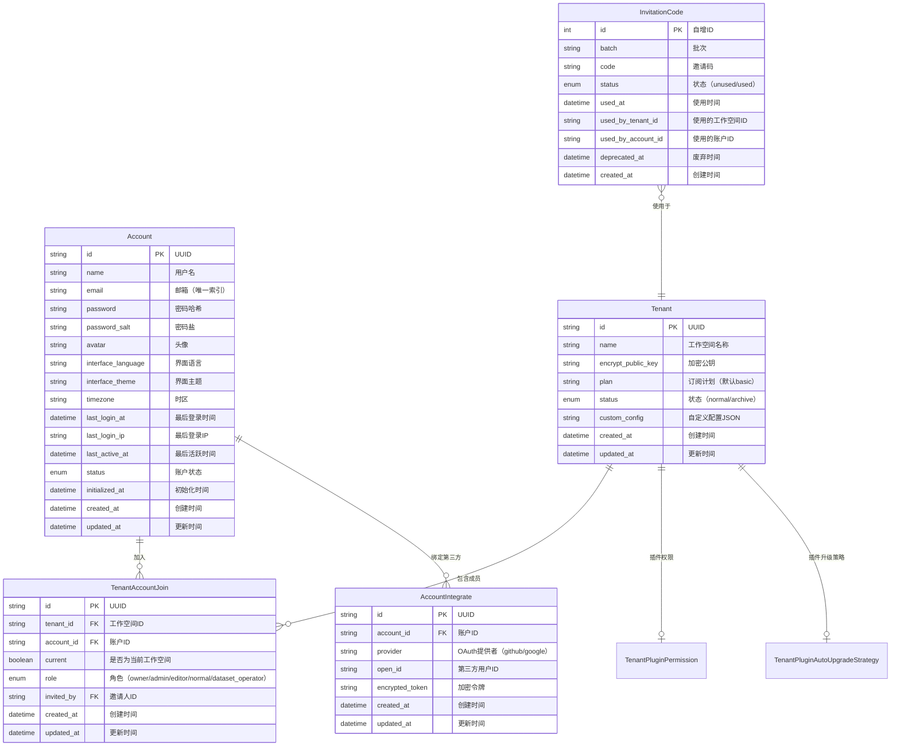
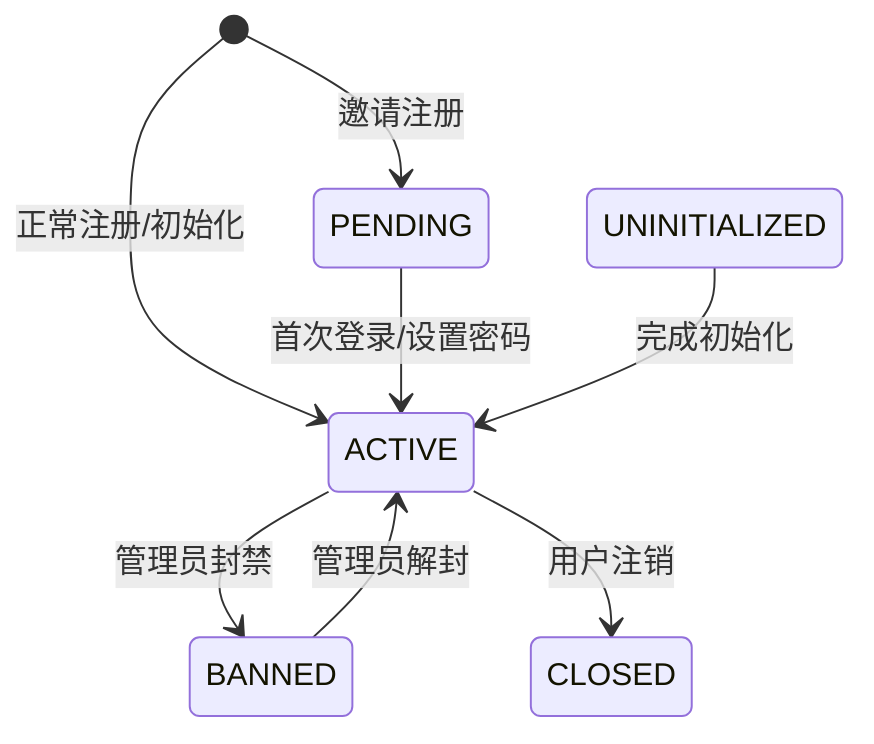
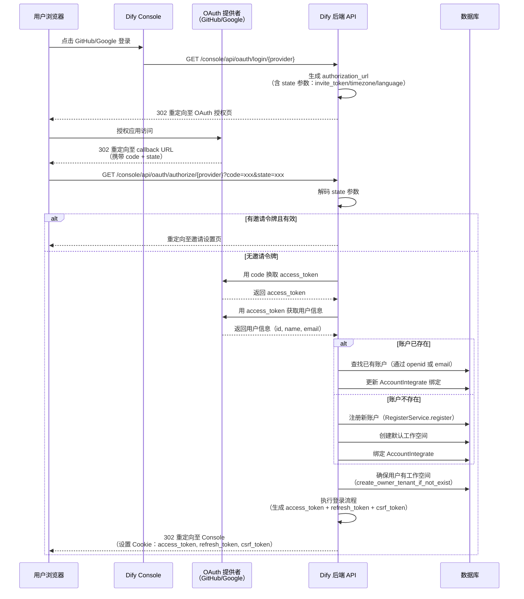
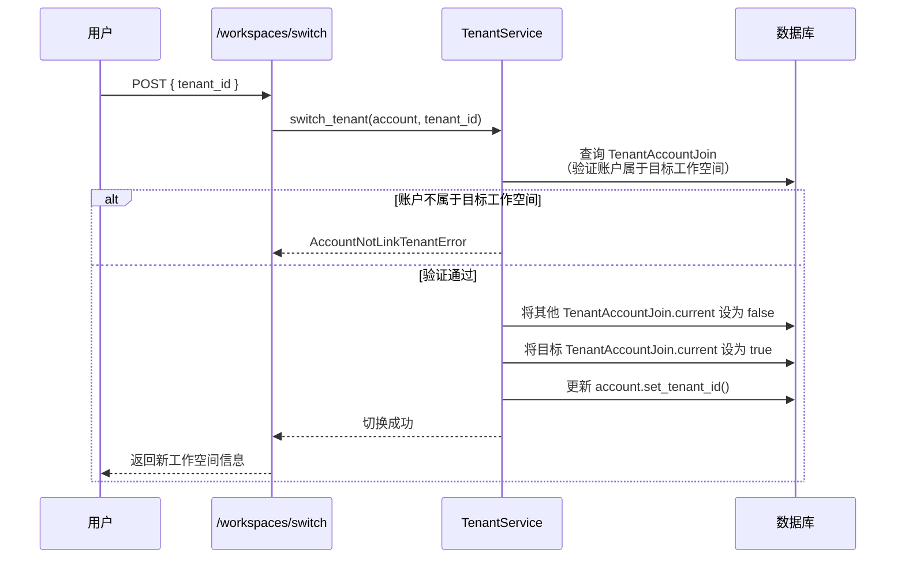
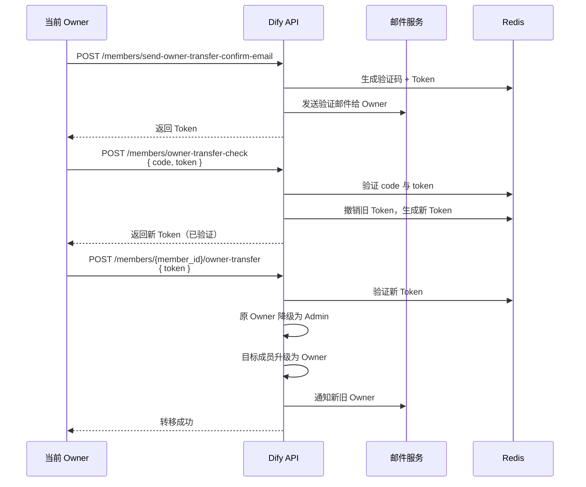
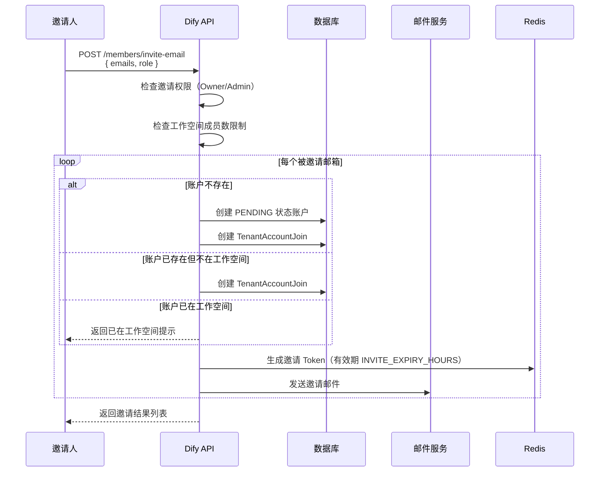
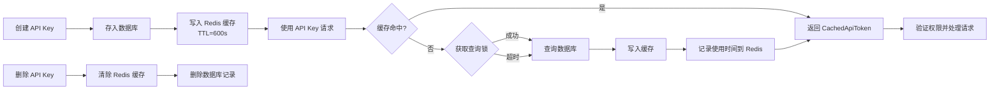
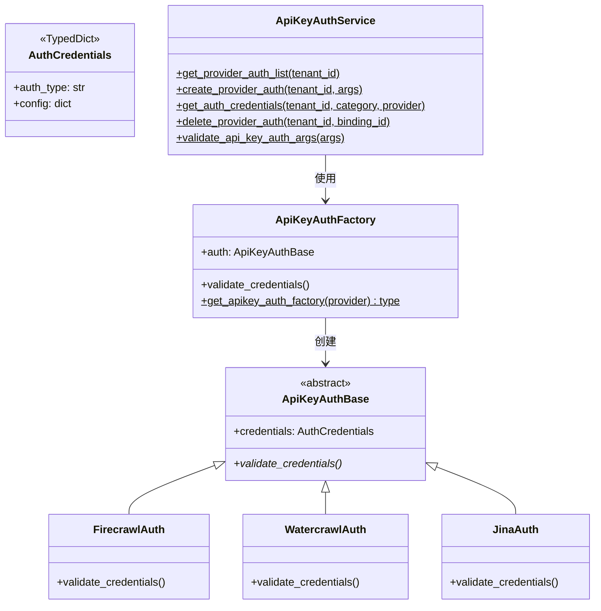
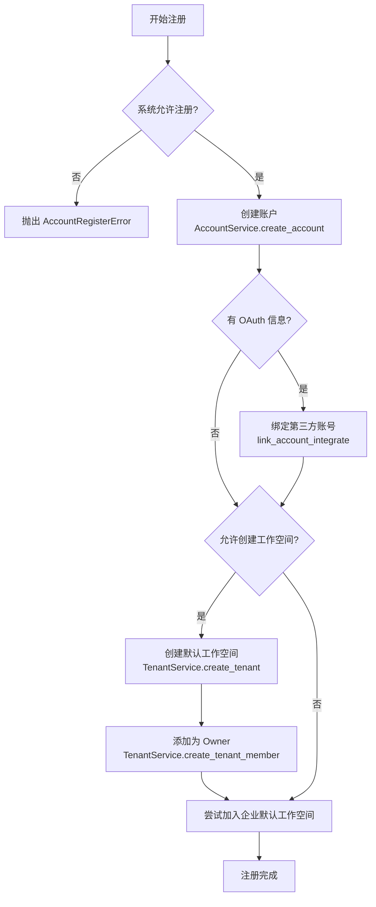

# Dify 用户与工作空间管理 — 功能详细文档

## 目录

- [1. 账户体系说明](#1-账户体系说明)
- [2. OAuth 集成](#2-oauth-集成)
- [3. 工作空间管理](#3-工作空间管理)
- [4. 成员角色与权限](#4-成员角色与权限)
- [5. API Key 管理](#5-api-key-管理)
- [6. 认证服务](#6-认证服务)
- [7. 账户服务](#7-账户服务)
- [8. 工作空间服务](#8-工作空间服务)

---

## 1. 账户体系说明

Dify 的账户体系由三个核心模型组成：**Account**（账户）、**Tenant**（工作空间/租户）、**TenantAccountJoin**（账户-工作空间关联），并辅以 **AccountIntegrate**（第三方账号绑定）和 **InvitationCode**（邀请码）等支撑模型。

### 1.1 核心实体关系



### 1.2 账户状态流转

Account 的 `status` 字段定义了账户的生命周期状态：

| 状态 | 值 | 说明 |
|------|------|------|
| PENDING | `pending` | 已创建但未初始化（如被邀请但未激活） |
| UNINITIALIZED | `uninitialized` | 未初始化 |
| ACTIVE | `active` | 正常活跃状态（默认） |
| BANNED | `banned` | 被封禁，无法登录 |
| CLOSED | `closed` | 已关闭/注销 |



### 1.3 多工作空间模型

Dify 采用**多租户**设计，一个 Account 可以加入多个 Tenant（工作空间），通过 `TenantAccountJoin` 关联表实现多对多关系。每个关联记录包含：

- **role**：成员在该工作空间中的角色
- **current**：标记该工作空间是否为用户当前激活的工作空间
- **invited_by**：记录邀请人

Account 模型通过 `current_tenant` 属性维护当前激活的工作空间上下文，并自动从 `TenantAccountJoin` 加载对应的角色信息。

---

## 2. OAuth 集成

Dify 支持 GitHub 和 Google 两种 OAuth 认证方式，允许用户通过第三方账号快速登录或注册。

### 2.1 支持的 OAuth 提供者

| 提供者 | 配置项 | 授权范围 | 用户信息获取 |
|--------|--------|----------|-------------|
| GitHub | `GITHUB_CLIENT_ID` / `GITHUB_CLIENT_SECRET` | `user:email` | `/user` + `/user/emails` |
| Google | `GOOGLE_CLIENT_ID` / `GOOGLE_CLIENT_SECRET` | `openid email` | `/oauth2/v3/userinfo` |

### 2.2 OAuth 认证流程



### 2.3 OAuth State 参数

OAuth 流程中的 `state` 参数使用 Base64 编码的 JSON，携带以下可选信息：

| 字段 | 说明 |
|------|------|
| `invite_token` | 邀请令牌，用于邀请注册场景 |
| `timezone` | 用户时区偏好 |
| `language` | 用户语言偏好 |

### 2.4 GitHub 邮箱获取策略

GitHub 用户可能启用"Keep my email addresses private"，导致 `/user` 接口不返回邮箱。Dify 的处理策略为：

1. 优先使用 `/user` 接口返回的 `email` 字段
2. 若为空，调用 `/user/emails` 接口获取主邮箱（primary）
3. 若无主邮箱，取第一个已验证邮箱（verified）
4. 若均不可用，使用 `{github_id}@users.noreply.github.com` 作为兜底

---

## 3. 工作空间管理

### 3.1 工作空间创建

工作空间（Tenant）的创建有以下几种触发场景：

| 场景 | 触发方式 | 说明 |
|------|---------|------|
| 系统初始化 | `RegisterService.setup()` | 首次部署 Dify 时自动创建 |
| 用户注册 | `RegisterService.register()` | 新用户注册时自动创建默认工作空间 |
| OAuth 登录 | `_generate_account()` | OAuth 新用户或无工作空间用户登录时创建 |
| 手动创建 | `TenantService.create_tenant()` | 用户在控制台手动创建 |

创建工作空间时会自动完成以下操作：

1. 创建 Tenant 记录
2. 创建 `TenantPluginAutoUpgradeStrategy`（插件自动升级策略，默认 `fix_only`）
3. 生成 RSA 密钥对（`encrypt_public_key`）
4. 创建默认信用池（`CreditPoolService.create_default_pool`）

### 3.2 工作空间配置

| 配置项 | 说明 | API |
|--------|------|-----|
| 名称 | 工作空间名称 | `POST /workspaces/info` |
| 自定义品牌 | 移除 WebApp 品牌 / 替换 Logo | `POST /workspaces/custom-config` |
| Logo 上传 | 上传自定义 WebApp Logo | `POST /workspaces/custom-config/webapp-logo/upload` |

自定义配置存储在 `Tenant.custom_config` JSON 字段中，结构为：

```json
{
  "remove_webapp_brand": false,
  "replace_webapp_logo": "file-id-or-null"
}
```

### 3.3 工作空间切换



### 3.4 工作空间列表

用户可通过 `GET /workspaces` 获取其加入的所有工作空间列表，返回信息包含：

- 工作空间 ID、名称、状态
- 订阅计划（plan）
- 是否为当前工作空间（current）
- 创建时间

### 3.5 工作空间状态

| 状态 | 值 | 说明 |
|------|------|------|
| NORMAL | `normal` | 正常状态 |
| ARCHIVE | `archive` | 已归档，不可使用 |

当用户访问已归档的工作空间时，系统会自动切换到其可用的第一个工作空间。

---

## 4. 成员角色与权限

### 4.1 角色定义

Dify 定义了五种工作空间成员角色：

| 角色 | 值 | 说明 |
|------|------|------|
| Owner | `owner` | 工作空间所有者，每个工作空间仅一个 |
| Admin | `admin` | 管理员，拥有除所有权转移外的全部权限 |
| Editor | `editor` | 编辑者，可创建和编辑应用、知识库等 |
| Normal | `normal` | 普通成员，仅可查看和使用 |
| Dataset Operator | `dataset_operator` | 数据集操作员，仅可编辑知识库数据 |

### 4.2 权限矩阵

| 功能 | Owner | Admin | Editor | Normal | Dataset Operator |
|------|:-----:|:-----:|:------:|:------:|:---------------:|
| 工作空间设置 | ✅ | ✅ | ❌ | ❌ | ❌ |
| 成员管理（添加/移除/更新角色） | ✅ | ✅ | ❌ | ❌ | ❌ |
| 所有权转移 | ✅ | ❌ | ❌ | ❌ | ❌ |
| 创建/编辑应用 | ✅ | ✅ | ✅ | ❌ | ❌ |
| 创建/编辑知识库 | ✅ | ✅ | ✅ | ❌ | ✅ |
| 查看应用 | ✅ | ✅ | ✅ | ✅ | ❌ |
| 删除 API Key | ✅ | ✅ | ❌ | ❌ | ❌ |
| 插件安装（everyone 权限时） | ✅ | ✅ | ✅ | ✅ | ✅ |
| 插件安装（admins 权限时） | ✅ | ✅ | ❌ | ❌ | ❌ |

### 4.3 角色判断方法

Account 模型提供了多个便捷属性用于权限判断：

| 属性/方法 | 对应角色 | 说明 |
|-----------|---------|------|
| `is_admin_or_owner` | Owner, Admin | 判断是否为特权角色 |
| `is_admin` | Admin | 判断是否为管理员 |
| `has_edit_permission` | Owner, Admin, Editor | 判断是否有编辑权限 |
| `is_dataset_editor` | Owner, Admin, Editor, Dataset Operator | 判断是否有数据集编辑权限 |
| `is_dataset_operator` | Dataset Operator | 判断是否为数据集操作员 |

### 4.4 成员管理操作

| 操作 | API | 所需权限 | 说明 |
|------|-----|---------|------|
| 获取成员列表 | `GET /workspaces/current/members` | 任何成员 | 返回所有成员及其角色 |
| 邀请成员 | `POST /workspaces/current/members/invite-email` | Owner, Admin | 通过邮件邀请，支持批量 |
| 移除成员 | `DELETE /workspaces/current/members/{member_id}` | Owner, Admin | 不可操作自身 |
| 更新角色 | `PUT /workspaces/current/members/{member_id}/update-role` | Owner, Admin | Admin 不可操作 Owner |
| 转移所有权 | `POST /workspaces/current/members/{member_id}/owner-transfer` | Owner | 需邮箱验证码确认 |

### 4.5 所有权转移流程

所有权转移是一个安全敏感操作，需要经过严格的验证流程：



### 4.6 成员邀请流程



---

## 5. API Key 管理

### 5.1 API Key 类型

Dify 支持两种 API Key 类型，分别用于不同资源的访问控制：

| 类型 | 枚举值 | Token 前缀 | 关联资源 | 最大数量 |
|------|--------|-----------|---------|---------|
| 应用 API Key | `ApiTokenType.APP` | `app-` | App | 10 |
| 数据集 API Key | `ApiTokenType.DATASET` | `ds-` | Dataset | 10 |

### 5.2 API Key 生命周期



### 5.3 API Key 缓存机制

`ApiTokenCache` 实现了基于 Redis 的高性能缓存层：

| 配置项 | 值 | 说明 |
|--------|-----|------|
| CACHE_TTL_SECONDS | 600 | 正常缓存过期时间（10 分钟） |
| CACHE_NULL_TTL_SECONDS | 60 | 空值缓存过期时间（1 分钟） |
| 缓存键格式 | `api_token:{scope}:{token}` | 按作用域隔离 |
| 租户索引键 | `tenant_tokens:{tenant_id}` | 支持按租户批量失效 |

缓存特性：

- **Single-Flight 模式**：使用 Redis 分布式锁确保同一 Token 的并发查询只有一个到达数据库
- **空值缓存**：对不存在的 Token 缓存空值，防止缓存穿透
- **租户索引**：维护租户到缓存键的映射，支持按租户批量失效
- **使用记录**：通过 `record_token_usage()` 记录 Token 使用时间，由 Celery Beat 定时任务批量更新数据库

### 5.4 API Key 管理 API

| 操作 | API | 权限要求 | 说明 |
|------|-----|---------|------|
| 获取应用 Key 列表 | `GET /apps/{id}/api-keys` | 登录用户 | 返回该应用的所有 API Key |
| 创建应用 Key | `POST /apps/{id}/api-keys` | 编辑权限 | 最多 10 个 |
| 删除应用 Key | `DELETE /apps/{id}/api-keys/{key_id}` | Owner/Admin | 删除前清除缓存 |
| 获取数据集 Key 列表 | `GET /datasets/{id}/api-keys` | 登录用户 | 返回该数据集的所有 API Key |
| 创建数据集 Key | `POST /datasets/{id}/api-keys` | 编辑权限 | 最多 10 个 |
| 删除数据集 Key | `DELETE /datasets/{id}/api-keys/{key_id}` | Owner/Admin | 删除前清除缓存 |

---

## 6. 认证服务

`services/auth/` 目录下的认证服务主要负责**数据源（DataSource）的 API Key 认证**，而非用户登录认证。该模块为第三方数据源服务（如 Firecrawl、Watercrawl、Jina）提供统一的认证验证框架。

### 6.1 目录结构

```
services/auth/
├── __init__.py
├── auth_type.py              # 认证类型枚举
├── api_key_auth_base.py      # API Key 认证基类（抽象）
├── api_key_auth_factory.py   # 工厂模式，按 provider 分发
├── api_key_auth_service.py   # 认证服务（CRUD + 验证）
├── firecrawl/
│   ├── __init__.py
│   └── firecrawl.py          # Firecrawl 认证实现
├── watercrawl/
│   ├── __init__.py
│   └── watercrawl.py         # Watercrawl 认证实现
└── jina/
    ├── __init__.py
    └── jina.py               # Jina 认证实现
```

### 6.2 认证类型

| 类型 | 枚举值 | 说明 |
|------|--------|------|
| Firecrawl | `firecrawl` | Firecrawl 网页抓取服务认证 |
| Watercrawl | `watercrawl` | Watercrawl 网页抓取服务认证 |
| Jina | `jinareader` | Jina Reader 服务认证 |

### 6.3 架构设计



### 6.4 认证流程

1. **创建认证**：`ApiKeyAuthService.create_provider_auth()` 接收 provider 和 credentials，通过 `ApiKeyAuthFactory` 验证凭证有效性，验证通过后将 API Key 加密存储
2. **获取认证**：`ApiKeyAuthService.get_auth_credentials()` 按 tenant_id + category + provider 查询已绑定的认证信息
3. **删除认证**：`ApiKeyAuthService.delete_provider_auth()` 按 binding_id 删除认证绑定
4. **验证凭证**：各 provider 的 `validate_credentials()` 实现具体的 API Key 验证逻辑（如调用远程 API 验证）

---

## 7. 账户服务

`services/account_service.py` 是 Dify 账户系统的核心服务文件，包含三个主要服务类：`AccountService`、`TenantService` 和 `RegisterService`。

### 7.1 AccountService

`AccountService` 负责账户的全生命周期管理，包括认证、令牌管理、密码操作、邮件验证等。

#### 7.1.1 核心功能

| 功能分类 | 方法 | 说明 |
|---------|------|------|
| **用户加载** | `load_user(user_id)` | 加载用户并设置当前工作空间上下文 |
| **认证** | `authenticate(email, password, invite_token)` | 邮箱密码认证 |
| **登录/登出** | `login(account, ip_address)` | 生成 TokenPair（access_token + refresh_token + csrf_token） |
| | `logout(account)` | 清除 Redis 中的 refresh_token |
| **令牌刷新** | `refresh_token(refresh_token)` | 轮换 refresh_token，生成新的 TokenPair |
| **JWT 生成** | `get_account_jwt_token(account)` | 使用 PassportService 签发 JWT |
| **账户创建** | `create_account(...)` | 创建账户（含密码加密、时区解析） |
| | `create_account_and_tenant(...)` | 创建账户并自动创建默认工作空间 |
| **密码管理** | `update_account_password(account, password, new_password)` | 修改密码（验证旧密码） |
| **账户更新** | `update_account(account, **kwargs)` | 通用字段更新 |
| | `update_account_email(account, email)` | 更新邮箱（同时删除第三方绑定） |
| | `update_login_info(account, ip_address)` | 更新登录时间和 IP |
| **第三方绑定** | `link_account_integrate(provider, open_id, account)` | 绑定/更新 OAuth 第三方账号 |
| **账户删除** | `delete_account(account)` | 异步删除账户（Celery 任务） |
| | `close_account(account)` | 关闭账户（状态设为 CLOSED） |
| **邮箱验证** | `send_reset_password_email(...)` | 发送重置密码邮件 |
| | `send_email_register_email(...)` | 发送注册验证邮件 |
| | `send_email_code_login_email(...)` | 发送邮箱验证码登录邮件 |
| | `send_change_email_email(...)` | 发送更换邮箱验证邮件 |
| | `send_owner_transfer_email(...)` | 发送所有权转移验证邮件 |
| **速率限制** | `add_login_error_rate_limit(email)` | 登录错误次数限制 |
| | `is_login_error_rate_limit(email)` | 检查是否超过登录错误限制 |
| | `is_email_send_ip_limit(ip_address)` | IP 维度邮件发送限制 |

#### 7.1.2 令牌机制

Dify 使用**双令牌**机制进行会话管理：

| 令牌类型 | 存储方式 | 有效期 | 说明 |
|---------|---------|--------|------|
| Access Token | HTTP-only Cookie | `ACCESS_TOKEN_EXPIRE_MINUTES`（默认分钟级） | JWT 格式，用于 API 认证 |
| Refresh Token | HTTP-only Cookie | `REFRESH_TOKEN_EXPIRE_DAYS`（默认天级） | 随机字符串，存储在 Redis 中 |
| CSRF Token | Cookie（非 HTTP-only） | 与 Access Token 同步 | 防止跨站请求伪造 |

Refresh Token 的 Redis 存储结构：

- `refresh_token:{token}` → `account_id`（用于验证 Token 有效性）
- `account_refresh_token:{account_id}` → `refresh_token`（用于查找用户的 Token）

#### 7.1.3 速率限制配置

| 限制器 | 最大尝试次数 | 时间窗口 |
|--------|------------|---------|
| 重置密码 | 1 次/窗口 | 60 秒 |
| 邮箱注册 | 1 次/窗口 | 60 秒 |
| 验证码登录 | 3 次/窗口 | 300 秒 |
| 账户删除验证码 | 1 次/窗口 | 60 秒 |
| 更换邮箱 | 1 次/窗口 | 60 秒 |
| 所有权转移 | 1 次/窗口 | 60 秒 |
| 登录错误 | 5 次 | `LOGIN_LOCKOUT_DURATION` |
| 忘记密码错误 | 5 次 | `FORGOT_PASSWORD_LOCKOUT_DURATION` |
| 邮件发送 IP 限制 | `EMAIL_SEND_IP_LIMIT_PER_MINUTE`/分钟 | 超限后冻结 1 小时 |

### 7.2 TenantService

`TenantService` 负责工作空间（租户）的管理，包括创建、成员管理、权限检查等。

#### 7.2.1 核心功能

| 功能分类 | 方法 | 说明 |
|---------|------|------|
| **创建** | `create_tenant(name, is_setup, is_from_dashboard)` | 创建工作空间（含插件策略、密钥对、信用池） |
| | `create_owner_tenant_if_not_exist(account, name, is_setup)` | 确保账户至少有一个工作空间 |
| **成员管理** | `create_tenant_member(tenant, account, role)` | 添加成员（Owner 角色唯一性校验） |
| | `remove_member_from_tenant(tenant, account, operator)` | 移除成员（含孤儿账户清理） |
| | `update_member_role(tenant, member, new_role, operator)` | 更新成员角色（含所有权转移逻辑） |
| | `get_tenant_members(tenant)` | 获取工作空间所有成员 |
| | `get_dataset_operator_members(tenant)` | 获取数据集操作员列表 |
| **查询** | `get_join_tenants(account)` | 获取账户加入的所有工作空间 |
| | `get_current_tenant_by_account(account)` | 获取当前工作空间（含角色） |
| | `get_user_role(account, tenant)` | 获取用户在指定工作空间的角色 |
| **切换** | `switch_tenant(account, tenant_id)` | 切换当前工作空间 |
| **权限** | `check_member_permission(tenant, operator, member, action)` | 检查成员操作权限 |
| | `has_roles(tenant, roles)` | 检查工作空间是否有指定角色的成员 |
| | `is_owner(account, tenant)` | 判断是否为 Owner |
| | `is_member(account, tenant)` | 判断是否为成员 |
| **配置** | `get_custom_config(tenant_id)` | 获取工作空间自定义配置 |

#### 7.2.2 成员操作权限矩阵

`check_member_permission` 方法定义了成员操作的权限要求：

| 操作 | 允许的角色 | 特殊规则 |
|------|-----------|---------|
| `add`（添加成员） | Owner, Admin | — |
| `remove`（移除成员） | Owner, Admin | Admin 不可移除 Owner；不可操作自身 |
| `update`（更新角色） | Owner, Admin | Admin 不可操作 Owner 角色的成员 |

#### 7.2.3 孤儿账户清理

当移除成员时，如果该账户状态为 `PENDING`（被邀请但从未激活）且不再属于任何工作空间，系统会自动删除该孤儿账户记录，避免产生无效数据。

### 7.3 RegisterService

`RegisterService` 负责用户注册和邀请流程。

#### 7.3.1 核心功能

| 方法 | 说明 |
|------|------|
| `setup(email, name, password, ip_address, language)` | 系统初始化注册（首次部署） |
| `register(email, name, password, open_id, provider, ...)` | 通用注册（含 OAuth 绑定、工作空间创建） |
| `invite_new_member(tenant, email, language, role, inviter)` | 邀请新成员（含邮件发送） |
| `generate_invite_token(tenant, account)` | 生成邀请令牌（Redis 存储，有效期 `INVITE_EXPIRY_HOURS`） |
| `is_valid_invite_token(token)` | 验证邀请令牌有效性 |
| `get_invitation_if_token_valid(workspace_id, email, token)` | 获取邀请详情 |
| `revoke_token(workspace_id, email, token)` | 撤销邀请令牌 |

#### 7.3.2 注册流程



---

## 8. 工作空间服务

`services/workspace_service.py` 中的 `WorkspaceService` 负责工作空间信息的组装与展示，是工作空间相关 API 的核心服务层。

### 8.1 核心功能

| 方法 | 说明 |
|------|------|
| `get_tenant_info(tenant)` | 获取工作空间完整信息（含角色、自定义配置、信用额度等） |

### 8.2 返回信息结构

`get_tenant_info` 方法返回以下信息：

| 字段 | 类型 | 说明 |
|------|------|------|
| `id` | str | 工作空间 ID |
| `name` | str | 工作空间名称 |
| `plan` | str | 订阅计划 |
| `status` | str | 工作空间状态 |
| `created_at` | datetime | 创建时间 |
| `trial_end_reason` | str \| None | 试用结束原因 |
| `role` | str | 当前用户在该工作空间的角色 |
| `custom_config` | dict \| None | 自定义品牌配置（仅 Owner/Admin 可见） |
| `trial_credits` | int \| None | 试用信用额度（仅云版本） |
| `trial_credits_used` | int \| None | 已使用试用信用（仅云版本） |
| `next_credit_reset_date` | int \| None | 下次信用重置日期（仅云版本） |

### 8.3 自定义品牌配置

当功能特性允许替换 Logo（`can_replace_logo`）且用户角色为 Owner 或 Admin 时，返回 `custom_config` 字段：

```json
{
  "remove_webapp_brand": true,
  "replace_webapp_logo": "https://files.example.com/files/workspaces/{tenant_id}/webapp-logo"
}
```

### 8.4 信用额度逻辑（云版本）

在云版本（`EDITION == "CLOUD"`）中，信用额度的展示逻辑为：

1. 如果工作空间非 Sandbox 计划且付费池（paid pool）未满，显示付费池额度
2. 否则显示试用池（trial pool）额度

---

## 附录：API 端点汇总

### 认证相关

| 端点 | 方法 | 说明 |
|------|------|------|
| `/console/api/login` | POST | 邮箱密码登录 |
| `/console/api/logout` | POST | 登出 |
| `/console/api/oauth/login/{provider}` | GET | 发起 OAuth 登录 |
| `/console/api/oauth/authorize/{provider}` | GET | OAuth 回调 |
| `/console/api/reset-password` | POST | 发送重置密码邮件 |
| `/console/api/email-code-login` | POST | 发送邮箱验证码 |
| `/console/api/email-code-login/validity` | POST | 验证邮箱验证码并登录 |
| `/console/api/refresh-token` | POST | 刷新令牌 |

### 工作空间相关

| 端点 | 方法 | 说明 |
|------|------|------|
| `/console/api/workspaces` | GET | 获取工作空间列表 |
| `/console/api/workspaces/current` | POST | 获取当前工作空间信息 |
| `/console/api/workspaces/switch` | POST | 切换工作空间 |
| `/console/api/workspaces/info` | POST | 更新工作空间名称 |
| `/console/api/workspaces/custom-config` | POST | 更新自定义品牌配置 |
| `/console/api/workspaces/custom-config/webapp-logo/upload` | POST | 上传 WebApp Logo |
| `/console/api/workspaces/current/members` | GET | 获取成员列表 |
| `/console/api/workspaces/current/members/invite-email` | POST | 邀请成员 |
| `/console/api/workspaces/current/members/{id}` | DELETE | 移除成员 |
| `/console/api/workspaces/current/members/{id}/update-role` | PUT | 更新成员角色 |
| `/console/api/workspaces/current/members/{id}/owner-transfer` | POST | 转移所有权 |

### 账户相关

| 端点 | 方法 | 说明 |
|------|------|------|
| `/console/api/account/init` | POST | 初始化账户 |
| `/console/api/account/profile` | GET | 获取账户信息 |
| `/console/api/account/name` | POST | 更新用户名 |
| `/console/api/account/avatar` | GET/POST | 获取/更新头像 |
| `/console/api/account/interface-language` | POST | 更新界面语言 |
| `/console/api/account/interface-theme` | POST | 更新界面主题 |
| `/console/api/account/timezone` | POST | 更新时区 |
| `/console/api/account/password` | POST | 修改密码 |
| `/console/api/account/integrates` | GET | 获取第三方绑定状态 |
| `/console/api/account/delete/verify` | GET | 发送账户删除验证码 |
| `/console/api/account/delete` | POST | 删除账户 |
| `/console/api/account/change-email` | POST | 发送更换邮箱验证码 |
| `/console/api/account/change-email/validity` | POST | 验证更换邮箱验证码 |
| `/console/api/account/change-email/reset` | POST | 执行更换邮箱 |

### API Key 相关

| 端点 | 方法 | 说明 |
|------|------|------|
| `/console/api/apps/{id}/api-keys` | GET | 获取应用 API Key 列表 |
| `/console/api/apps/{id}/api-keys` | POST | 创建应用 API Key |
| `/console/api/apps/{id}/api-keys/{key_id}` | DELETE | 删除应用 API Key |
| `/console/api/datasets/{id}/api-keys` | GET | 获取数据集 API Key 列表 |
| `/console/api/datasets/{id}/api-keys` | POST | 创建数据集 API Key |
| `/console/api/datasets/{id}/api-keys/{key_id}` | DELETE | 删除数据集 API Key |
