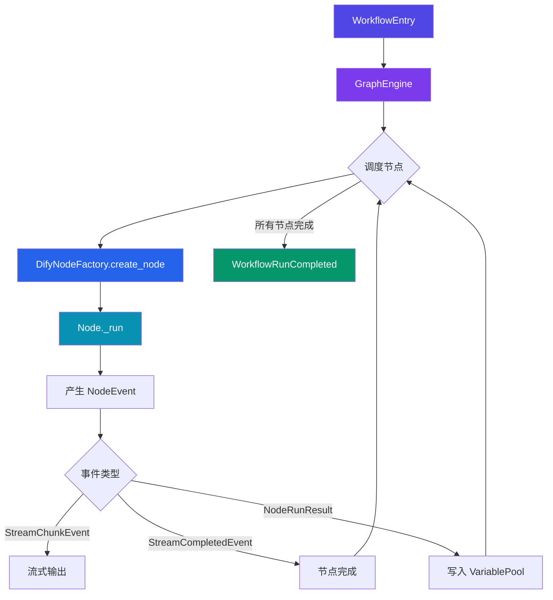
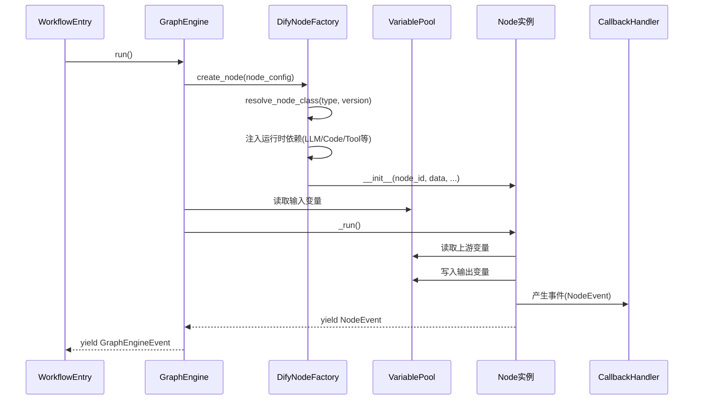
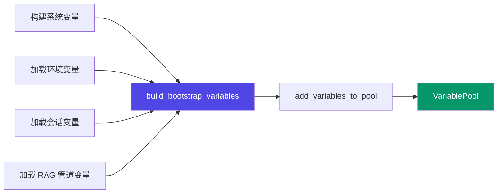
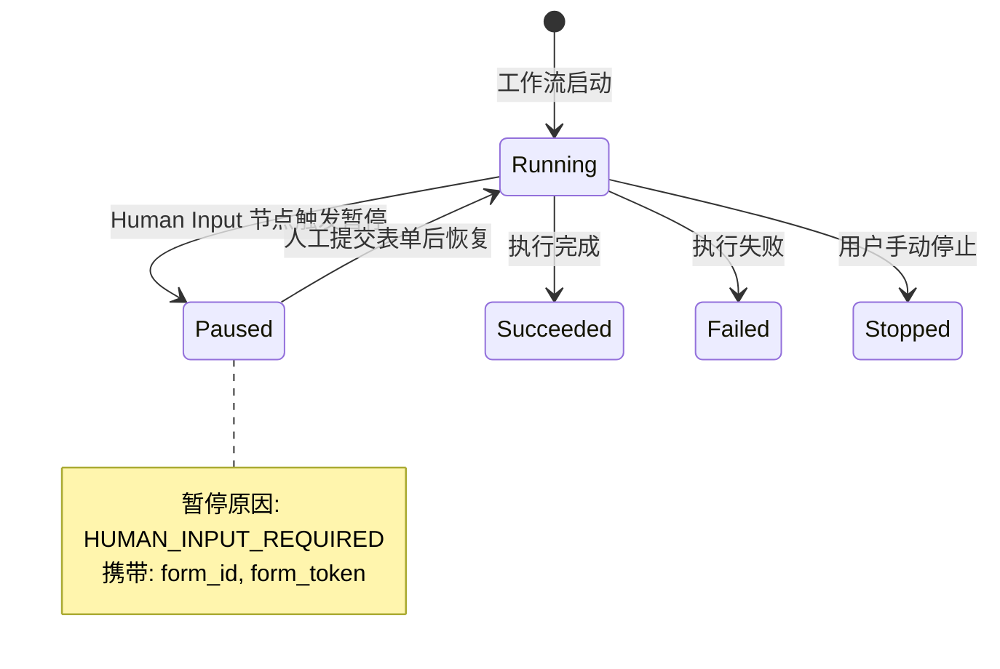
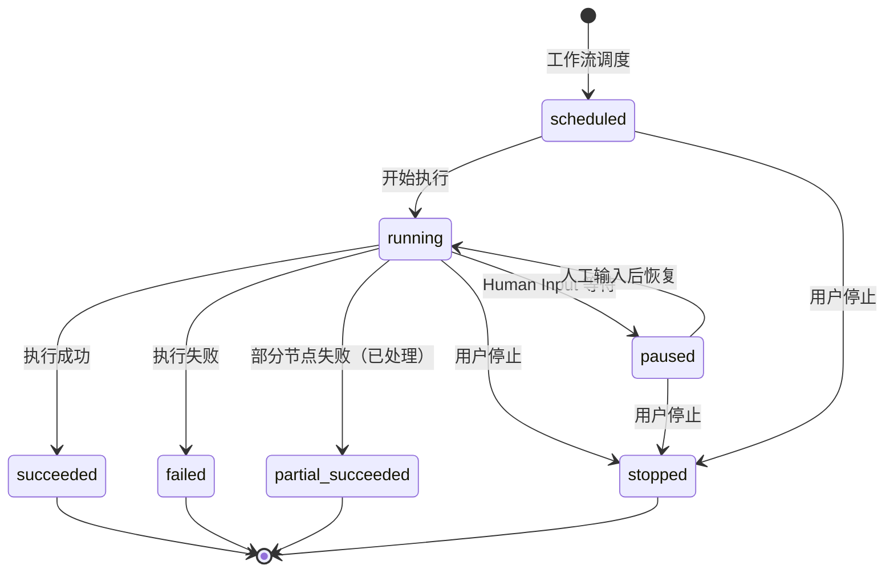

# Dify Workflow 引擎功能文档

## 1. Workflow 概述

Workflow 是 Dify 平台的核心编排引擎，为用户提供了可视化构建 AI 应用的能力。通过拖拽节点、连接边的方式，用户可以快速搭建复杂的 AI 工作流，实现从数据输入、模型推理到结果输出的全流程编排。

Workflow 引擎的核心设计理念：

- **可视化编排**：通过 DAG（有向无环图）描述工作流拓扑，节点为执行单元，边定义数据流向
- **类型化节点体系**：每种节点类型拥有独立的配置 Schema 和执行逻辑，通过 `BuiltinNodeTypes` 注册中心统一管理
- **变量池驱动**：所有节点间数据传递通过 `VariablePool` 完成，支持变量引用、模板渲染和类型安全的读写
- **分层执行架构**：基于 `GraphEngine` 驱动，支持 Layer 机制注入横切关注点（配额控制、可观测性、执行限制等）
- **可暂停与恢复**：通过 `Human Input` 节点和暂停/恢复机制，支持人机协同工作流

### 核心模块关系

| 模块                  | 职责                                 |
| ------------------- | ---------------------------------- |
| `WorkflowEntry`     | 工作流入口，负责初始化 `GraphEngine` 并启动执行    |
| `DifyNodeFactory`   | 节点工厂，根据节点配置创建具体的 `Node` 实例并注入运行时依赖 |
| `VariablePool`      | 变量池，存储和管理工作流执行期间的所有变量              |
| `GraphEngine`       | 图执行引擎，驱动 DAG 中节点的调度和执行             |
| `HumanInputAdapter` | 人工输入适配器，桥接工作流暂停与外部表单系统             |

***

## 2. 节点类型列表

Dify Workflow 引擎通过 `BuiltinNodeTypes` 定义了所有内置节点类型。以下为完整的节点类型清单：

| 节点类型                   | 类型标识                  | 说明                                                |
| ---------------------- | --------------------- | ------------------------------------------------- |
| Start 节点               | `start`               | 工作流入口节点，定义输入变量并接收外部传入的用户输入                        |
| End 节点                 | `end`                 | 工作流出口节点，定义输出变量并终止工作流执行                            |
| LLM 节点                 | `llm`                 | 大语言模型调用节点，支持流式/非流式推理、结构化输出、对话记忆和上下文检索             |
| Knowledge Retrieval 节点 | `knowledge-retrieval` | 知识检索节点，从指定知识库中检索相关文档片段，支持单路/多路检索和 Reranking       |
| Question Classifier 节点 | `question-classifier` | 问题分类节点，利用 LLM 对用户输入进行分类并路由到不同分支                   |
| IF/ELSE 节点             | `if-else`             | 条件分支节点，根据条件表达式选择执行路径                              |
| Code 节点                | `code`                | 代码执行节点，在沙箱环境中运行用户自定义代码（Python / JavaScript）       |
| Template Transform 节点  | `template-transform`  | 模板转换节点，使用 Jinja2 语法对变量进行文本渲染和格式转换                 |
| Variable Assigner 节点   | `assigner`            | 变量赋值节点，将值写入指定变量，支持会话级变量持久化                        |
| Variable Aggregator 节点 | `variable-aggregator` | 变量聚合节点，将多个分支的输出变量聚合为统一输出（旧称 `variable-assigner`）  |
| Iteration 节点           | `iteration`           | 迭代循环节点，对列表类型数据逐项执行子工作流                            |
| Loop 节点                | `loop`                | 循环节点，支持条件循环和计数循环，包含 `loop-start` / `loop-end` 子节点 |
| Parameter Extractor 节点 | `parameter-extractor` | 参数提取节点，利用 LLM 从自然语言中提取结构化参数                       |
| HTTP Request 节点        | `http-request`        | HTTP 请求节点，发送 HTTP/HTTPS 请求并处理响应，支持 SSRF 防护        |
| Tool 节点                | `tool`                | 工具调用节点，调用内置工具或插件工具，支持运行时参数解析                      |
| Agent 节点               | `agent`               | 智能体节点，通过策略模式调用 Agent 策略，支持工具编排和多轮推理               |
| Human Input 节点         | `human-input`         | 人工输入节点，暂停工作流等待人工审批或表单填写后继续执行                      |
| Datasource 节点          | `datasource`          | 数据源节点，接入外部数据源（在线文档、网盘、本地文件、网站爬取等）                 |
| Document Extractor 节点  | `document-extractor`  | 文档提取节点，从上传文件中提取文本内容                               |
| List Operator 节点       | `list-operator`       | 列表操作节点，对列表进行过滤、排序、去重等操作                           |
| Answer 节点              | `answer`              | 回答节点，在 Chat 类型工作流中输出中间回复                          |

### 节点执行类型分类

| 执行类型 | 标识           | 说明          | 典型节点                        |
| ---- | ------------ | ----------- | --------------------------- |
| 可执行  | `executable` | 常规执行节点，产生输出 | LLM、Code、HTTP Request       |
| 响应   | `response`   | 流式输出节点      | Answer、End                  |
| 分支   | `branch`     | 条件分支节点      | IF/ELSE、Question Classifier |
| 容器   | `container`  | 管理子图的容器节点   | Iteration、Loop              |
| 根节点  | `root`       | 可作为执行入口的节点  | Start、Datasource、Trigger    |

***

## 3. 执行引擎架构

Workflow 执行引擎采用分层架构，从入口到节点执行经过多层抽象和依赖注入。

### 3.1 执行流程



### 3.2 核心组件交互



### 3.3 Layer 机制

`GraphEngine` 支持 Layer 机制，在执行过程中注入横切关注点：

| Layer                  | 功能                   | 配置项                                                           |
| ---------------------- | -------------------- | ------------------------------------------------------------- |
| `ExecutionLimitsLayer` | 限制最大执行步数和执行时间        | `WORKFLOW_MAX_EXECUTION_STEPS`, `WORKFLOW_MAX_EXECUTION_TIME` |
| `LLMQuotaLayer`        | LLM 调用配额控制           | `tenant_id`                                                   |
| `DebugLoggingLayer`    | 调试日志输出（仅 DEBUG 模式）   | 日志级别、输入输出包含控制                                                 |
| `ObservabilityLayer`   | OpenTelemetry 可观测性追踪 | `ENABLE_OTEL`                                                 |

### 3.4 节点工厂依赖注入

`DifyNodeFactory` 为不同节点类型注入特定的运行时依赖：

| 节点类型                | 注入的运行时依赖                                                                                                                   |
| ------------------- | -------------------------------------------------------------------------------------------------------------------------- |
| LLM                 | `DifyPreparedLLM`, `PromptMessageMemory`, `DifyRetrieverAttachmentLoader`, `DifyPromptMessageSerializer`, `LLMFileSaver`   |
| Code                | `DefaultWorkflowCodeExecutor`, `CodeNodeLimits`                                                                            |
| Template Transform  | `CodeExecutorJinja2TemplateRenderer`, `max_output_length`                                                                  |
| HTTP Request        | `graphon_ssrf_proxy`, `HTTP请求配置`, `DifyToolFileManager`                                                                    |
| Tool                | `DifyToolFileManager`, `DifyToolNodeRuntime`                                                                               |
| Agent               | `PluginAgentStrategyResolver`, `PluginAgentStrategyPresentationProvider`, `AgentRuntimeSupport`, `AgentMessageTransformer` |
| Human Input         | `DifyHumanInputNodeRuntime`, `DifyFileReferenceFactory`, `HumanInputFormRepository`                                        |
| Question Classifier | 同 LLM（不含 RetrieverAttachmentLoader）                                                                                        |
| Parameter Extractor | 同 LLM（不含 HttpClient 和 RetrieverAttachmentLoader）                                                                           |
| Document Extractor  | `UnstructuredApiConfig`, `graphon_ssrf_proxy`                                                                              |

***

## 4. 变量池机制

### 4.1 变量前缀系统

变量池通过前缀标识不同来源的变量，前缀即变量选择器（Selector）的第一个元素：

| 前缀标识           | 常量名                             | 说明                           |
| -------------- | ------------------------------- | ---------------------------- |
| `sys`          | `SYSTEM_VARIABLE_NODE_ID`       | 系统变量，由引擎自动注入                 |
| `env`          | `ENVIRONMENT_VARIABLE_NODE_ID`  | 环境变量，由用户在应用配置中预设             |
| `conversation` | `CONVERSATION_VARIABLE_NODE_ID` | 会话变量，跨轮次持久化                  |
| `rag`          | `RAG_PIPELINE_VARIABLE_NODE_ID` | RAG 管道变量，用于 RAG Pipeline 工作流 |
| `{node_id}`    | —                               | 节点输出变量，前缀为具体节点 ID            |

### 4.2 系统变量

系统变量由 `SystemVariableKey` 枚举定义，在工作流启动时自动注入到变量池：

| 变量键               | 说明                                     |
| ----------------- | -------------------------------------- |
| `query`           | 用户输入的查询文本                              |
| `files`           | 用户上传的文件列表                              |
| `conversation_id` | 当前会话 ID                                |
| `user_id`         | 当前用户 ID                                |
| `dialogue_count`  | 当前会话的对话轮数                              |
| `app_id`          | 当前应用 ID                                |
| `workflow_id`     | 当前工作流 ID                               |
| `workflow_run_id` | 当前工作流执行 ID                             |
| `timestamp`       | 当前时间戳                                  |
| `invoke_from`     | 调用来源（debugger / service-api / console） |
| `dataset_id`      | 数据集 ID（Datasource 节点使用）                |
| `document_id`     | 文档 ID（Knowledge Index 节点使用）            |
| `datasource_type` | 数据源类型                                  |
| `datasource_info` | 数据源信息                                  |

### 4.3 变量池初始化流程



变量池初始化由 `variable_pool_initializer.py` 中的函数完成：

- `add_variables_to_pool(variable_pool, variables)`：批量将变量添加到变量池
- `add_node_inputs_to_pool(variable_pool, node_id, inputs)`：将节点输入映射到变量池，Selector 为 `(node_id, key)`

### 4.4 变量引用机制

节点间数据传递通过变量选择器（Variable Selector）实现。变量选择器是一个字符串序列，格式为 `[prefix, key1, key2, ...]`：

- 引用系统变量：`["sys", "query"]`
- 引用节点输出：`["llm_node_id", "text"]`
- 引用环境变量：`["env", "api_key"]`
- 引用会话变量：`["conversation", "summary"]`

在节点配置中，变量引用通过模板语法 `{{#prefix.key1.key2#}}` 表达，由 `VariableTemplateParser` 解析并替换为实际值。

### 4.5 用户输入映射

`WorkflowEntry.mapping_user_inputs_to_variable_pool` 方法负责将用户输入映射到变量池：

1. 遍历 `variable_mapping`，获取每个变量对应的选择器
2. 从 `user_inputs` 中查找输入值
3. 处理文件类型输入（通过 `file_factory` 构建 `File` 对象）
4. 处理结构化输出（`structured_output`）的合并逻辑
5. 将值写入变量池：`variable_pool.add([node_id] + key_list, value)`

***

## 5. 人工输入流程

Human Input 节点实现了工作流的暂停-恢复机制，允许在工作流执行过程中暂停并等待人工输入后继续执行。

### 5.1 工作机制



### 5.2 表单策略

`DifyHumanInputNodeRuntime` 负责管理人工输入表单的生命周期：

| 操作   | 方法                        | 说明                               |
| ---- | ------------------------- | -------------------------------- |
| 创建表单 | `create_form()`           | 创建表单实例并持久化到数据库                   |
| 获取表单 | `get_form()`              | 根据节点 ID 查询已有表单状态                 |
| 构建仓库 | `build_form_repository()` | 创建 `HumanInputFormRepository` 实例 |

表单创建参数（`FormCreateParams`）：

| 参数                        | 说明                         |
| ------------------------- | -------------------------- |
| `workflow_execution_id`   | 工作流执行 ID                   |
| `node_id`                 | 节点 ID                      |
| `form_config`             | 表单配置（`HumanInputNodeData`） |
| `rendered_content`        | 渲染后的表单内容                   |
| `delivery_methods`        | 投递方式配置列表                   |
| `display_in_ui`           | 是否在 UI 中展示                 |
| `resolved_default_values` | 解析后的默认值                    |

### 5.3 投递方式适配器

Human Input 节点支持多种投递方式，通过 `DeliveryChannelConfig` 联合类型定义：

| 投递方式      | 类型标识     | 说明                  |
| --------- | -------- | ------------------- |
| WebApp 投递 | `WEBAPP` | 在独立 Web 应用界面中展示表单   |
| 邮件投递      | `EMAIL`  | 通过邮件发送表单链接，支持自定义收件人 |

#### 邮件投递配置

`EmailDeliveryConfig` 包含以下字段：

| 字段           | 说明                                                       |
| ------------ | -------------------------------------------------------- |
| `recipients` | 收件人配置，支持绑定成员（`BoundRecipient`）和外部邮箱（`ExternalRecipient`） |
| `subject`    | 邮件主题                                                     |
| `body`       | 邮件正文（支持 Markdown 渲染和变量模板）                                |
| `debug_mode` | 调试模式标识                                                   |

邮件正文支持：

- URL 占位符 `{{#url#}}` 自动替换为表单链接
- 变量模板 `{{#selector#}}` 引用变量池中的值
- Markdown 渲染为 HTML（通过 `bleach` 进行安全过滤）

### 5.4 投递方式过滤逻辑

`DifyHumanInputNodeRuntime._resolve_delivery_methods` 根据调用来源过滤投递方式：

| 调用来源       | 过滤规则                        |
| ---------- | --------------------------- |
| `debugger` | 移除 WebApp 投递，邮件收件人替换为当前调试用户 |
| `explore`  | 移除 WebApp 投递                |
| 其他         | 保留所有已启用的投递方式                |

### 5.5 表单访问控制

`HumanInputSurface` 定义了两种访问面：

| 访问面         | 标识            | 允许的收件人类型               |
| ----------- | ------------- | ---------------------- |
| Service API | `service_api` | `STANDALONE_WEB_APP`   |
| Console     | `console`     | `CONSOLE`, `BACKSTAGE` |

表单令牌优先级（`_RECIPIENT_TOKEN_PRIORITY`）：

| 优先级   | 收件人类型                |
| ----- | -------------------- |
| 0（最高） | `BACKSTAGE`          |
| 1     | `CONSOLE`            |
| 2     | `STANDALONE_WEB_APP` |

***

## 6. 触发器类型

Workflow 支持多种触发方式，每种触发方式对应一种入口节点类型。触发器节点均为 `ROOT` 执行类型，可作为工作流的入口节点。

### 6.1 触发器类型概览

| 触发器类型      | 节点类型标识             | 实现类                   | 说明                    |
| ---------- | ------------------ | --------------------- | --------------------- |
| Webhook 触发 | `trigger-webhook`  | `TriggerWebhookNode`  | 通过 HTTP Webhook 触发工作流 |
| 定时调度触发     | `trigger-schedule` | `TriggerScheduleNode` | 通过 Cron 表达式定时触发工作流    |
| 插件事件触发     | `trigger-plugin`   | `TriggerEventNode`    | 通过插件事件订阅触发工作流         |

### 6.2 Webhook 触发器

Webhook 触发器允许外部系统通过 HTTP 请求触发工作流执行。

**配置项：**

| 配置              | 说明                                                   |
| --------------- | ---------------------------------------------------- |
| `method`        | HTTP 方法（GET / POST 等）                                |
| `content_type`  | 请求内容类型（`application/json` / `text/plain` / `binary`） |
| `headers`       | 需要提取的请求头参数列表                                         |
| `params`        | 需要提取的查询参数列表                                          |
| `body`          | 需要提取的请求体参数列表                                         |
| `async_mode`    | 是否异步执行                                               |
| `status_code`   | 响应状态码                                                |
| `response_body` | 响应体模板                                                |
| `timeout`       | 超时时间（秒）                                              |

**执行流程：**

1. 外部系统发送 HTTP 请求到 Webhook URL
2. Trigger Controller 接收请求，将数据注入变量池
3. `TriggerWebhookNode._run()` 从变量池读取 Webhook 数据
4. 根据节点配置提取 Headers / Params / Body 参数
5. 处理文件类型参数（通过 `DifyFileReferenceFactory` 构建 File 对象）
6. 将提取的参数作为节点输出传递给下游节点

**输出变量：**

| 变量                  | 说明                        |
| ------------------- | ------------------------- |
| `{header_name}`     | 提取的请求头值（名称中的 `-` 替换为 `_`） |
| `{param_name}`      | 提取的查询参数值                  |
| `{body_param_name}` | 提取的请求体参数值                 |
| `_webhook_raw`      | 原始 Webhook 数据（用于调试）       |

### 6.3 定时调度触发器

定时调度触发器支持通过 Cron 表达式定时触发工作流。

**配置项：**

| 配置              | 说明                                              |
| --------------- | ----------------------------------------------- |
| `mode`          | 配置模式（`visual` 可视化 / 自定义 Cron）                   |
| `frequency`     | 调度频率（`daily` / `weekly` / `monthly` / `custom`） |
| `visual_config` | 可视化配置（时间、分钟、星期、日期）                              |
| `timezone`      | 时区设置                                            |

**默认配置：**

```json
{
  "mode": "visual",
  "frequency": "daily",
  "visual_config": {
    "time": "12:00 AM",
    "on_minute": 0,
    "weekdays": ["sun"],
    "monthly_days": [1]
  },
  "timezone": "UTC"
}
```

### 6.4 插件事件触发器

插件事件触发器通过订阅插件事件来触发工作流，实现插件与工作流的解耦联动。

**配置项：**

| 配置                         | 说明     |
| -------------------------- | ------ |
| `plugin_id`                | 插件 ID  |
| `provider_id`              | 提供者 ID |
| `event_name`               | 事件名称   |
| `subscription_id`          | 订阅 ID  |
| `plugin_unique_identifier` | 插件唯一标识 |
| `event_parameters`         | 事件参数配置 |

**执行流程：**

1. 插件发布事件
2. 事件路由到匹配的 `TriggerEventNode`
3. 节点从变量池读取触发数据
4. 将事件参数和系统变量作为输出传递给下游节点
5. 在执行元数据中记录 `trigger_info`（包含 `provider_id`、`event_name`、`plugin_unique_identifier`）

***

## 附录 A：Workflow 执行状态机



## 附录 B：节点执行状态

| 状态        | 标识          | 说明          |
| --------- | ----------- | ----------- |
| PENDING   | `pending`   | 已调度但未开始执行   |
| RUNNING   | `running`   | 正在执行        |
| SUCCEEDED | `succeeded` | 执行成功        |
| FAILED    | `failed`    | 执行失败        |
| EXCEPTION | `exception` | 执行异常        |
| STOPPED   | `stopped`   | 已停止         |
| PAUSED    | `paused`    | 已暂停（等待人工输入） |

## 附录 C：关键源码文件索引

| 文件路径                                             | 说明                                              |
| ------------------------------------------------ | ----------------------------------------------- |
| `api/core/workflow/workflow_entry.py`            | 工作流入口，GraphEngine 初始化与执行                        |
| `api/core/workflow/node_factory.py`              | 节点工厂，节点类解析与依赖注入                                 |
| `api/core/workflow/node_runtime.py`              | 运行时适配器（LLM / Tool / HumanInput / FileReference） |
| `api/core/workflow/variable_prefixes.py`         | 变量前缀常量定义                                        |
| `api/core/workflow/variable_pool_initializer.py` | 变量池初始化逻辑                                        |
| `api/core/workflow/system_variables.py`          | 系统变量定义与操作                                       |
| `api/core/workflow/human_input_adapter.py`       | 人工输入适配器与投递方式解析                                  |
| `api/core/workflow/human_input_policy.py`        | 人工输入策略与访问控制                                     |
| `api/core/workflow/human_input_forms.py`         | 人工输入表单令牌加载                                      |
| `api/core/workflow/template_rendering.py`        | Jinja2 模板渲染器                                    |
| `api/core/workflow/nodes/agent/`                 | Agent 节点实现                                      |
| `api/core/workflow/nodes/knowledge_retrieval/`   | 知识检索节点实现                                        |
| `api/core/workflow/nodes/knowledge_index/`       | 知识索引节点实现                                        |
| `api/core/workflow/nodes/datasource/`            | 数据源节点实现                                         |
| `api/core/workflow/nodes/trigger_webhook/`       | Webhook 触发器节点实现                                 |
| `api/core/workflow/nodes/trigger_schedule/`      | 定时调度触发器节点实现                                     |
| `api/core/workflow/nodes/trigger_plugin/`        | 插件事件触发器节点实现                                     |

