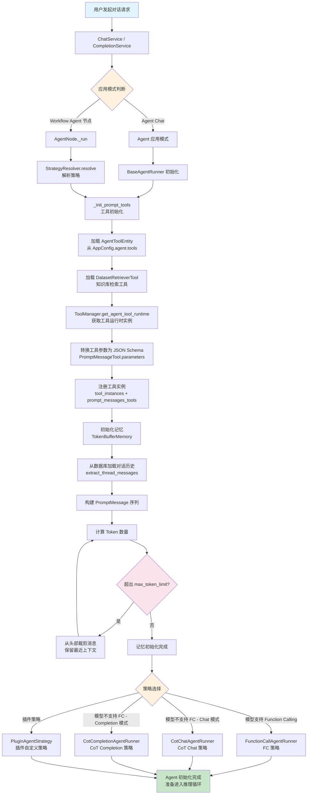
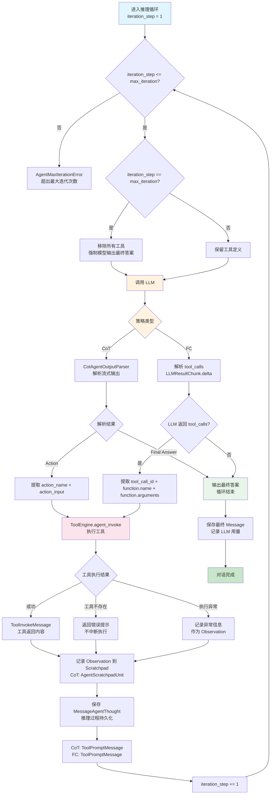
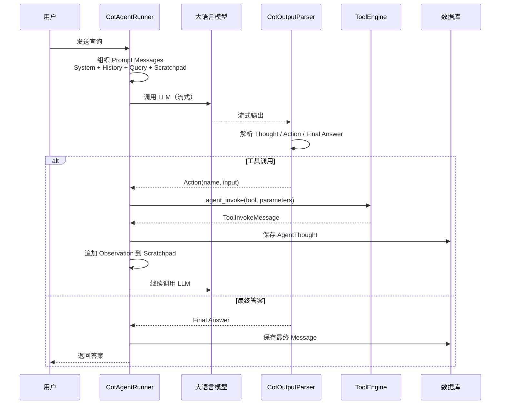
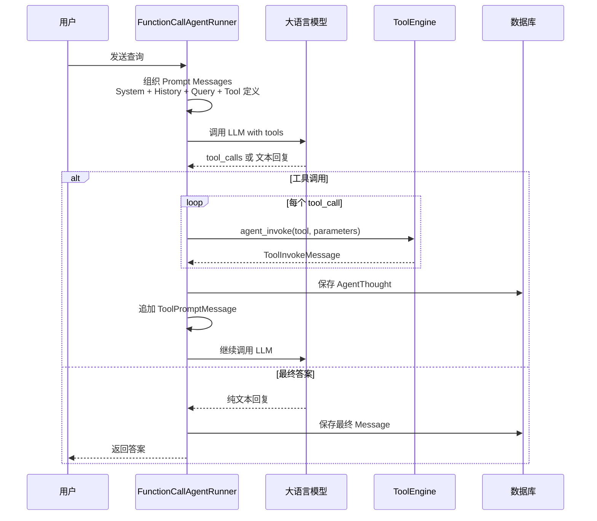
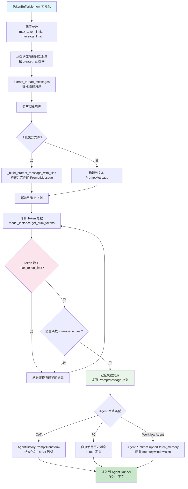
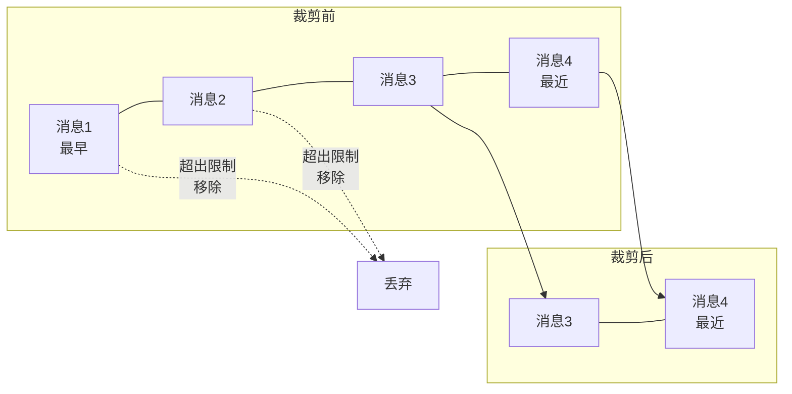
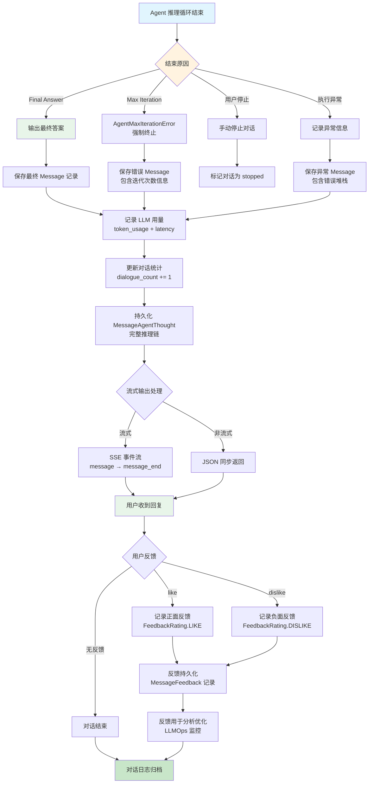

# Agent 对话闭环流程

## 1. 流程概述

本文档描述 Dify 平台中 Agent（智能体）对话从初始化到结束的完整闭环流程。Agent 是 Dify 中的核心执行模式之一，赋予大语言模型自主推理和工具调用的能力，使其能够在多轮迭代中自主决定何时调用工具、如何组合工具输出，并最终生成完整回答。Agent 系统采用策略驱动设计，支持 CoT（思维链）和 Function Calling 两种核心策略，并通过 Token Buffer Memory 机制管理对话历史。

核心流程包括：
- **Agent 对话初始化**：创建会话 → 加载工具 → 初始化记忆 → 选择策略
- **Agent 推理与工具调用循环**：推理 → 解析工具调用 → 执行工具 → 观察结果 → 继续推理
- **Agent 记忆管理**：加载历史消息 → Token 裁剪 → 上下文窗口管理
- **Agent 对话结束与反馈**：输出最终答案 → 记录 Thought → 用户反馈 → 日志持久化

---

## 2. Agent 对话初始化流程图

### 策略选择逻辑

| 条件 | 策略 | 实现类 | Prompt 组织方式 |
|------|------|--------|----------------|
| LLM 支持 Function Calling | FC 策略 | `FunctionCallAgentRunner` | System Prompt + 历史消息 + Tool 定义 |
| LLM 不支持 FC + Chat 模式 | CoT Chat | `CotChatAgentRunner` | System Prompt + 历史消息 + Scratchpad |
| LLM 不支持 FC + Completion 模式 | CoT Completion | `CotCompletionAgentRunner` | 拼接为单一 UserPromptMessage |
| 插件自定义策略 | 插件策略 | `PluginAgentStrategy` | 由插件定义 |

### 工具类型

| 工具来源 | 类型标识 | 说明 |
|----------|----------|------|
| 内置工具 | `BUILT_IN` | Dify 预置工具（网页搜索、天气查询等） |
| API 工具 | `API` | 用户自定义 API 工具 |
| 数据集检索 | `DATASET_RETRIEVAL` | 知识库检索工具 |
| 插件工具 | `PLUGIN` | 插件系统提供的工具 |
| MCP 工具 | `MCP` | MCP 协议提供的工具 |

---

## 3. Agent 推理与工具调用循环流程图

### CoT 策略推理循环时序图

### FC 策略推理循环时序图

### 迭代控制参数

| 参数 | 默认值 | 说明 |
|------|--------|------|
| `max_iteration` | 用户配置 | Agent 最大迭代次数 |
| 实际上限 | `min(max_iteration, 99) + 1` | 系统硬性上限为 100 次 |
| `function_call_state` | `True` | 是否继续调用工具 |

### AgentThought 持久化内容

| 字段 | 说明 |
|------|------|
| `thought` | 推理过程文本（Thought） |
| `tool` | 调用的工具名称 |
| `tool_input` | 工具调用参数 |
| `observation` | 工具返回结果（Observation） |
| `message_id` | 关联的消息 ID |
| `message_chain_id` | 消息链 ID |

---

## 4. Agent 记忆管理流程图

### 记忆裁剪策略

### 记忆管理参数

| 参数 | 默认值 | 说明 |
|------|--------|------|
| `max_token_limit` | 2000 | 历史消息最大 Token 数 |
| `message_limit` | 500 | 加载的最大消息条数 |
| `memory.window.size` | 可配置 | Workflow Agent 记忆窗口大小 |

### 记忆在 Agent 中的应用

| Agent 类型 | 记忆组件 | 组织方式 |
|------------|----------|----------|
| CoT Chat Runner | `AgentHistoryPromptTransform` + `TokenBufferMemory` | System Prompt + 历史消息 + Scratchpad |
| CoT Completion Runner | `AgentHistoryPromptTransform` + `TokenBufferMemory` | 拼接为单一 UserPromptMessage |
| FC Runner | `AgentHistoryPromptTransform` | System Prompt + 历史消息 + Tool 定义 |
| Workflow Agent Node | `AgentRuntimeSupport.fetch_memory()` | 通过 `memory.window.size` 配置 |

---

## 5. Agent 对话结束与反馈流程图

### 对话结束场景

| 结束原因 | 触发条件 | 处理方式 | 用户体验 |
|----------|----------|----------|----------|
| Final Answer | LLM 输出最终答案 | 正常保存 Message | 收到完整回复 |
| 最大迭代 | 超过 max_iteration | 抛出 AgentMaxIterationError | 收到错误提示 |
| 用户停止 | 用户主动停止 | 标记 stopped | 对话中断 |
| 执行异常 | LLM 调用失败等 | 记录异常信息 | 收到错误提示 |

### 反馈机制

| 反馈类型 | 标识 | 来源 | 用途 |
|----------|------|------|------|
| 点赞 | `like` | 用户 / 管理员标注 | 优化 Prompt 和模型选择 |
| 点踩 | `dislike` | 用户 / 管理员标注 | 定位问题、改进回答质量 |
| 管理员标注 | `admin` | 管理员后台标注 | 训练数据收集、Annotation Reply |

### 消息持久化内容

| 实体 | 说明 |
|------|------|
| `Message` | 对话消息记录，包含查询、回复、Token 用量 |
| `MessageAgentThought` | 每轮推理的 Thought/Action/Observation |
| `MessageFile` | 消息中的文件附件 |
| `MessageChain` | 消息链，关联同一对话的多条消息 |
| `MessageFeedback` | 用户反馈记录 |

---

## 6. 流程步骤说明表格

### Agent 对话初始化步骤

| 步骤 | 操作 | 执行组件 | 输入 | 输出 |
|------|------|----------|------|------|
| 1 | 接收对话请求 | ChatService | 用户查询 + 会话 ID | 请求上下文 |
| 2 | 初始化 Agent Runner | BaseAgentRunner | AppConfig + 模型配置 | Runner 实例 |
| 3 | 加载工具 | _init_prompt_tools | AgentToolEntity + DatasetRetrieverTool | tool_instances + prompt_messages_tools |
| 4 | 初始化记忆 | TokenBufferMemory | 会话 ID + max_token_limit | PromptMessage 序列 |
| 5 | 选择策略 | 策略选择逻辑 | 模型能力检测 | 具体 Runner 实例 |
| 6 | 组织 Prompt | AgentRunner | System Prompt + 历史 + 工具 | 完整 Prompt Messages |

### Agent 推理循环步骤

| 步骤 | 操作 | 执行组件 | 输入 | 输出 |
|------|------|----------|------|------|
| 1 | 调用 LLM | AgentRunner | Prompt Messages + Tool 定义 | LLM 流式输出 |
| 2 | 解析输出 | CotOutputParser / FC 解析 | 流式 Chunk | Action / Final Answer |
| 3 | 提取工具调用 | AgentRunner | action_name + action_input | 工具调用参数 |
| 4 | 执行工具 | ToolEngine.agent_invoke | Tool 实例 + 参数 | ToolInvokeMessage |
| 5 | 记录 Observation | AgentRunner | 工具返回结果 | Scratchpad 更新 |
| 6 | 持久化 Thought | MessageAgentThought | thought + tool + observation | 数据库记录 |
| 7 | 追加工具结果 | AgentRunner | ToolPromptMessage | 更新 Prompt Messages |
| 8 | 检查迭代 | AgentRunner | iteration_step | 继续循环 / 结束 |

### Agent 记忆管理步骤

| 步骤 | 操作 | 执行组件 | 输入 | 输出 |
|------|------|----------|------|------|
| 1 | 加载历史消息 | TokenBufferMemory | conversation_id | 消息列表 |
| 2 | 提取线程消息 | extract_thread_messages | 消息列表 | PromptMessage 序列 |
| 3 | 构建 PromptMessage | TokenBufferMemory | 消息 + 文件 | PromptMessage |
| 4 | 计算 Token 数 | model_instance | PromptMessage 序列 | Token 总数 |
| 5 | 裁剪超限消息 | TokenBufferMemory | max_token_limit | 裁剪后序列 |
| 6 | 格式化历史 | AgentHistoryPromptTransform | PromptMessage 序列 | ReAct / FC 格式 |

### Agent 对话结束步骤

| 步骤 | 操作 | 执行组件 | 输入 | 输出 |
|------|------|----------|------|------|
| 1 | 输出最终答案 | AgentRunner | Final Answer | 流式 / 同步响应 |
| 2 | 保存 Message | MessageService | 查询 + 回复 + 用量 | Message 记录 |
| 3 | 更新对话统计 | ConversationService | dialogue_count | 统计更新 |
| 4 | 发送响应 | Controller | 响应数据 | HTTP 响应 |
| 5 | 接收反馈 | FeedbackService | like / dislike | Feedback 记录 |
| 6 | 日志归档 | LLMOps | 完整对话链 | 分析数据 |

---

## 7. 关键决策点说明

### 决策点 1：策略选择

| 决策 | 条件 | 影响 |
|------|------|------|
| Function Calling | LLM 原生支持 FC | 模型直接输出结构化 tool_calls，解析效率高 |
| CoT Chat | LLM 不支持 FC + Chat 模式 | 通过 ReAct Prompt 引导，输出 Action 格式 |
| CoT Completion | LLM 不支持 FC + Completion 模式 | 拼接为单一 Prompt，适合单轮场景 |
| 插件策略 | 用户配置了插件 Agent 策略 | 由插件定义推理逻辑，通过 PluginAgentClient 调用 |

### 决策点 2：工具调用判断

| 决策 | 条件 | 影响 |
|------|------|------|
| CoT - Final Answer | 解析输出为 Final Answer | 推理循环结束，输出最终答案 |
| CoT - Action | 解析输出包含 Action | 提取工具名和参数，执行工具调用 |
| FC - tool_calls | LLM 返回 tool_calls | 逐个执行工具调用，结果追加到对话 |
| FC - 纯文本 | LLM 返回纯文本 | 推理循环结束，输出最终答案 |
| 工具不存在 | 工具名称不在注册列表 | 返回错误提示，不中断执行循环 |

### 决策点 3：迭代控制

| 决策 | 条件 | 影响 |
|------|------|------|
| 继续迭代 | iteration_step < max_iteration 且有工具调用 | 继续推理循环 |
| 强制结束 | iteration_step == max_iteration | 移除所有工具，强制模型输出最终答案 |
| 超出上限 | iteration_step > min(max_iteration, 99) + 1 | 抛出 AgentMaxIterationError |
| 用户停止 | 用户主动停止对话 | 标记对话为 stopped |

### 决策点 4：记忆裁剪

| 决策 | 条件 | 影响 |
|------|------|------|
| 保留全部 | Token 数 ≤ max_token_limit | 使用完整历史消息 |
| 从头部裁剪 | Token 数 > max_token_limit | 移除最早的消息，保留最近上下文 |
| 最低保留 | 仅剩 1 条消息 | 保留至少 1 条消息，确保上下文不空 |

### 决策点 5：对话结束处理

| 决策 | 条件 | 影响 |
|------|------|------|
| 正常结束 | LLM 输出 Final Answer | 保存完整 Message，记录 Token 用量 |
| 迭代超限 | 超过最大迭代次数 | 保存错误信息，提示用户调整 |
| 异常终止 | LLM 调用失败等 | 保存异常信息，支持重试 |
| 用户停止 | 用户主动停止 | 标记 stopped，保留已有输出 |
