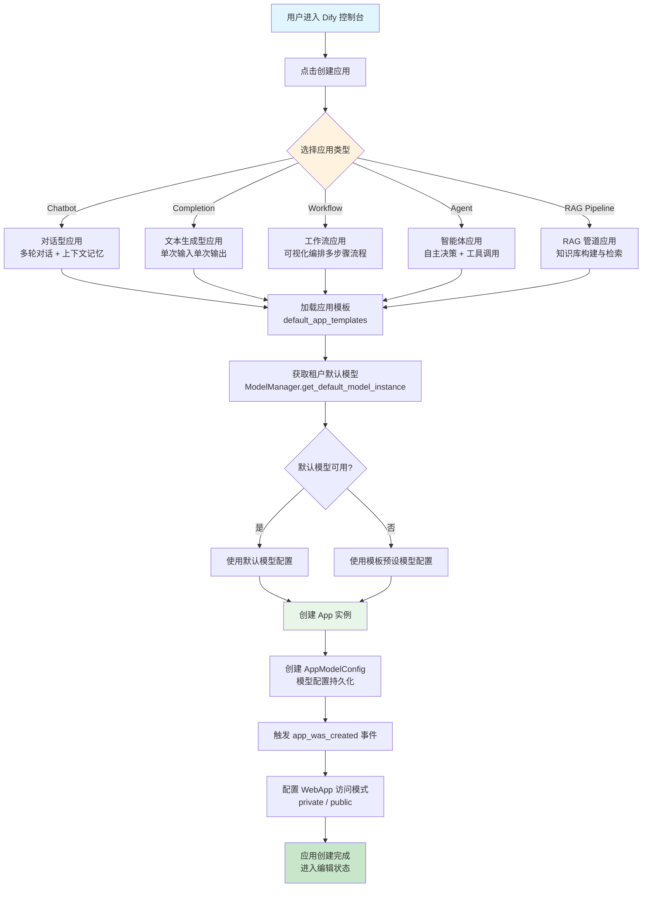
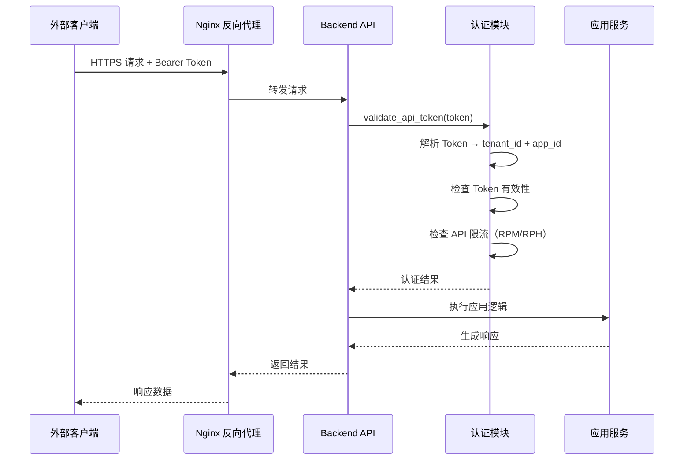
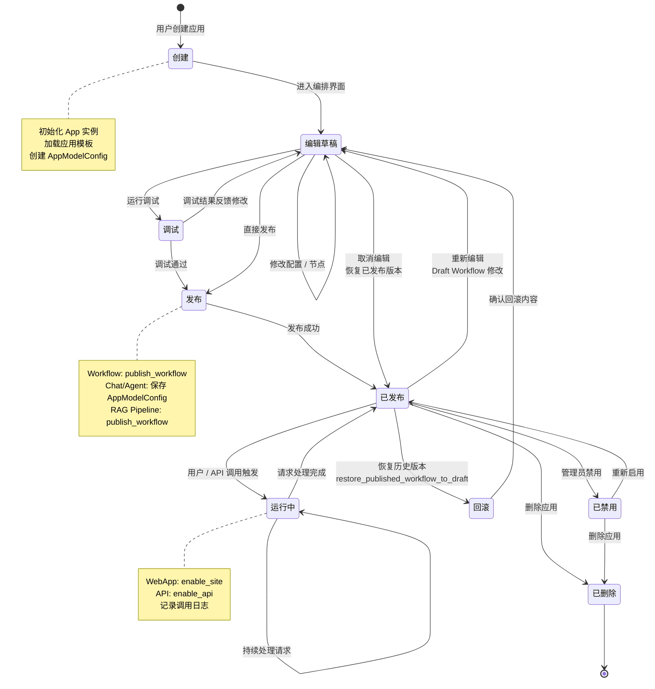

# 应用创建与发布闭环流程

## 1. 流程概述

本文档描述 Dify 平台中应用（App）从创建到发布的完整闭环流程。Dify 支持四种核心应用类型：Chatbot（对话型）、Completion（文本生成型）、Workflow（工作流型）和 Agent（智能体型），以及 RAG Pipeline 类型。每个应用经历创建、配置、调试、发布、访问的完整生命周期，形成从开发到运行的闭环。

核心流程包括：
- **应用创建**：选择应用类型 → 基于模板初始化 → 配置模型与参数
- **应用发布为 WebApp**：启用站点访问 → 配置认证策略 → 用户通过 Web 界面交互
- **应用通过 API 调用**：启用 API 访问 → 生成 API 密钥 → 外部系统集成调用
- **应用生命周期管理**：创建 → 编辑 → 发布 → 运行 → 迭代更新

---

## 2. 应用创建流程图



### 应用类型能力矩阵

| 应用类型 | 模式标识 | 对话模式 | 工作流编排 | 工具调用 | 记忆管理 |
|----------|----------|----------|------------|----------|----------|
| Chatbot | `chat` | 多轮对话 | 否 | 否 | 会话记忆 |
| Completion | `completion` | 单轮 | 否 | 否 | 无 |
| Workflow | `workflow` | 否 | 是 | 否 | 否 |
| Agent | `agent-chat` | 多轮对话 | 否 | 是 | 会话记忆 |
| Advanced Chat | `advanced-chat` | 多轮对话 | 是 | 否 | 会话记忆 |
| RAG Pipeline | `rag-pipeline` | 否 | 是 | 否 | 否 |

---

## 3. 应用发布为 WebApp 的流程

```mermaid
flowchart TD
    A[应用编辑完成] --> B[发布工作流 / 配置]
    B --> C{应用类型判断}
    C -->|Chatbot / Agent| D[发布 AppModelConfig]
    C -->|Workflow / Advanced Chat| E[发布 Draft Workflow<br/>WorkflowService.publish_workflow]
    C -->|RAG Pipeline| F[发布 Pipeline Workflow<br/>RagPipelineService.publish_workflow]

    D --> G[启用站点访问<br/>enable_site = true]
    E --> G
    F --> G

    G --> H{WebApp 认证模式}
    H -->|public| I[公开访问<br/>任何人可访问]
    H -->|private| J[需登录访问<br/>EnterpriseService.WebAppAuth]

    I --> K[生成 WebApp URL<br/>/apps/{app_id}]
    J --> K

    K --> L[用户访问 WebApp]
    L --> M{应用模式}
    M -->|Chat| N[对话界面交互<br/>ChatService.handle]
    M -->|Completion| O[单次生成界面<br/>CompletionService.handle]
    M -->|Workflow| P[参数输入界面<br/>WorkflowEntry.run]

    N --> Q[流式响应输出]
    O --> Q
    P --> Q

    Q --> R[记录对话日志<br/>Message + MessageAgentThought]
    R --> S[用户反馈<br/>like / dislike]

    style A fill:#e1f5fe
    style B fill:#fff3e0
    style G fill:#fce4ec
    style Q fill:#e8f5e9
    style S fill:#c8e6c9
```

### WebApp 发布配置项

| 配置项 | 字段 | 说明 |
|--------|------|------|
| 启用站点 | `enable_site` | 是否启用 WebApp 访问 |
| 公开访问 | `is_public` | 是否允许未登录用户访问 |
| API 限频（RPM） | `api_rpm` | 每分钟请求限制 |
| API 限频（RPH） | `api_rph` | 每小时请求限制 |
| 最大并发 | `max_active_requests` | 最大活跃请求数 |

---

## 4. 应用通过 API 调用的流程

```mermaid
flowchart TD
    A[应用发布完成] --> B[启用 API 访问<br/>enable_api = true]
    B --> C[生成 API 密钥<br/>AppApiKeyService]
    C --> D[外部系统集成]

    D --> E[构造 API 请求<br/>Authorization: Bearer {api_key}]
    E --> F{API 端点路由}

    F -->|/chat-messages| G[Chat API<br/>对话型接口]
    F -->|/completion-messages| H[Completion API<br/>文本生成接口]
    F -->|/workflows/run| I[Workflow API<br/>工作流执行接口]

    G --> J[认证与限流检查<br/>validate_api_token + rate_limit]
    H --> J
    I --> J

    J --> K{认证通过?}
    K -->|否| L[返回 401 Unauthorized]
    K -->|是| M[执行应用逻辑]

    M --> N{流式 / 非流式}
    N -->|streaming| O[SSE 流式响应<br/>event: message / end]
    N -->|blocking| P[同步等待响应<br/>JSON 返回]

    O --> Q[记录调用日志<br/>invoke_from = service-api]
    P --> Q

    Q --> R[返回结果给调用方]

    style A fill:#e1f5fe
    style C fill:#fff3e0
    style J fill:#fce4ec
    style O fill:#e8f5e9
    style P fill:#e8f5e9
    style R fill:#c8e6c9
```

### API 调用认证流程



### API 端点一览

| 端点 | 方法 | 适用应用类型 | 说明 |
|------|------|-------------|------|
| `/v1/chat-messages` | POST | Chatbot / Agent | 发送对话消息 |
| `/v1/completion-messages` | POST | Completion | 发送文本生成请求 |
| `/v1/workflows/run` | POST | Workflow | 执行工作流 |
| `/v1/messages/{message_id}/feedbacks` | POST | 所有 | 提交消息反馈 |
| `/v1/messages` | GET | Chatbot / Agent | 获取对话历史 |
| `/v1/conversations` | GET | Chatbot / Agent | 获取会话列表 |
| `/v1/files/upload` | POST | 所有 | 上传文件 |

---

## 5. 应用生命周期状态图



### 生命周期阶段说明

| 阶段 | 触发条件 | 持久化操作 | 可执行操作 |
|------|----------|------------|------------|
| 创建 | 用户点击创建应用 | 插入 `apps` 表记录 | 选择类型、命名 |
| 编辑草稿 | 进入编排界面 | 更新 Draft Workflow / AppModelConfig | 修改节点、配置参数 |
| 调试 | 用户点击运行调试 | 创建调试 WorkflowRun（不持久化） | 查看输出、检查变量 |
| 发布 | 用户点击发布 | 创建新版本 Workflow / 更新 AppModelConfig | 发布到生产环境 |
| 已发布 | 发布成功 | 更新 `workflow_id` 指向已发布版本 | WebApp / API 调用 |
| 运行中 | 用户或 API 触发调用 | 创建 Message / WorkflowRun | 流式响应、日志记录 |
| 回滚 | 恢复历史版本 | 将历史版本复制为 Draft | 编辑后重新发布 |
| 已禁用 | 管理员操作 | 更新 `status` 字段 | 重新启用 |
| 已删除 | 用户删除应用 | 删除 `apps` 及关联数据 | 不可恢复 |

---

## 6. 流程步骤说明表格

### 应用创建步骤

| 步骤 | 操作 | 执行组件 | 输入 | 输出 |
|------|------|----------|------|------|
| 1 | 选择应用类型 | 前端 UI | 用户选择 | AppMode 枚举值 |
| 2 | 加载应用模板 | AppService.create_app | AppMode | 模板配置（app + model_config） |
| 3 | 获取默认模型 | ModelManager | tenant_id | ModelInstance |
| 4 | 创建 App 实例 | AppService | 模板 + 用户参数 | App 数据库记录 |
| 5 | 创建模型配置 | AppService | default_model_config | AppModelConfig 记录 |
| 6 | 触发创建事件 | app_was_created | App 实例 | 通知订阅者 |
| 7 | 配置访问模式 | WebAppAuth | app_id | 访问权限设置 |

### 应用发布步骤

| 步骤 | 操作 | 执行组件 | 输入 | 输出 |
|------|------|----------|------|------|
| 1 | 验证草稿完整性 | WorkflowService | Draft Workflow | 验证结果 |
| 2 | 验证凭据合规性 | WorkflowService | 节点凭据 | 合规检查结果 |
| 3 | 验证图结构 | WorkflowService | graph_dict | 结构校验结果 |
| 4 | 创建发布版本 | Workflow.new | Draft 内容 | 新版本 Workflow |
| 5 | 触发发布事件 | app_published_workflow_was_updated | App + Workflow | 通知订阅者 |
| 6 | 启用访问方式 | AppService | enable_site / enable_api | 访问配置更新 |

### API 调用步骤

| 步骤 | 操作 | 执行组件 | 输入 | 输出 |
|------|------|----------|------|------|
| 1 | 请求到达 | Nginx | HTTP 请求 | 转发至 API |
| 2 | Token 认证 | validate_api_token | Bearer Token | 认证上下文 |
| 3 | 限流检查 | RateLimit | api_rpm / api_rph | 通过 / 拒绝 |
| 4 | 执行应用逻辑 | ChatService / WorkflowEntry | 用户输入 | 执行结果 |
| 5 | 记录日志 | MessageService | 执行过程 | 日志记录 |
| 6 | 返回响应 | Controller | 执行结果 | HTTP 响应 |

---

## 7. 关键决策点说明

### 决策点 1：应用类型选择

| 决策 | 条件 | 影响 |
|------|------|------|
| 选择 Chatbot | 需要多轮对话、上下文记忆 | 使用 AppModelConfig 配置，支持会话管理 |
| 选择 Completion | 单次输入输出场景 | 使用 AppModelConfig 配置，无会话管理 |
| 选择 Workflow | 复杂多步骤流程 | 使用 Workflow 引擎编排，支持条件分支和迭代 |
| 选择 Agent | 需要自主决策和工具调用 | 使用 Agent Runner，支持 CoT / FC 策略 |

### 决策点 2：模型可用性

| 决策 | 条件 | 影响 |
|------|------|------|
| 使用默认模型 | 租户已配置默认 LLM | 自动匹配租户默认模型实例 |
| 使用模板预设模型 | 默认模型不可用 | 回退到模板中预设的模型配置 |
| 模型完全不可用 | 无可用模型提供商 | 应用创建成功但需手动配置模型 |

### 决策点 3：WebApp 认证模式

| 决策 | 条件 | 影响 |
|------|------|------|
| 公开模式 | `is_public = true` | 任何人无需登录即可访问 |
| 私有模式 | `is_public = false` | 需要登录或 Token 验证 |
| 企业模式 | WebAppAuth 启用 | 由 EnterpriseService 管理访问权限 |

### 决策点 4：发布验证

| 决策 | 条件 | 影响 |
|------|------|------|
| 发布成功 | 草稿完整、凭据合规、图结构有效 | 创建新版本，更新发布状态 |
| 凭据不合规 | 节点凭据违反策略 | 阻止发布，提示修正 |
| 图结构无效 | 存在孤立节点或循环依赖 | 阻止发布，提示修正 |
| 计费限制 | SANDBOX 计划触发节点超限 | 阻止发布，提示升级 |

### 决策点 5：API 调用限流

| 决策 | 条件 | 影响 |
|------|------|------|
| 请求通过 | 未超过 RPM / RPH 限制 | 正常处理请求 |
| 请求被限流 | 超过配置的限流阈值 | 返回 429 Too Many Requests |
| 并发超限 | 超过 max_active_requests | 返回 429 或排队等待 |
