# Dify 功能逻辑流程图文档

## 1. 模块间关系图

### 1.1 核心模块全景关系

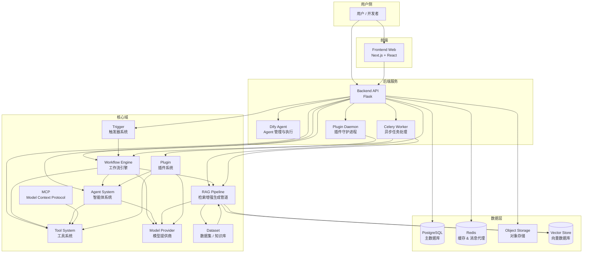
```mermaid
graph TB
    subgraph 用户侧
        User[用户 / 开发者]
    end

    subgraph 前端
        WebUI["Frontend Web<br/>Next.js + React"]
    end

    subgraph 后端服务
        API["Backend API<br/>Flask"]
        Agent["Dify Agent<br/>Agent 管理与执行"]
        PluginDaemon["Plugin Daemon<br/>插件守护进程"]
        Worker["Celery Worker<br/>异步任务处理"]
    end

    subgraph 核心域
        WE["Workflow Engine<br/>工作流引擎"]
        RAG["RAG Pipeline<br/>检索增强生成管道"]
        AS["Agent System<br/>智能体系统"]
        TS["Tool System<br/>工具系统"]
        MP["Model Provider<br/>模型提供商"]
        DS["Dataset<br/>数据集 / 知识库"]
        TR["Trigger<br/>触发器系统"]
        MCP["MCP<br/>Model Context Protocol"]
        Plugin["Plugin<br/>插件系统"]
    end

    subgraph 数据层
        DB[("PostgreSQL<br/>主数据库")]
        Redis[("Redis<br/>缓存 & 消息代理")]
        Storage["Object Storage<br/>对象存储"]
        VectorDB[("Vector Store<br/>向量数据库")]
    end

    User --> WebUI
    User --> API
    WebUI --> API

    API --> WE
    API --> RAG
    API --> AS
    API --> TS
    API --> TR
    API --> PluginDaemon
    API --> Agent
    API --> Worker

    WE --> RAG
    WE --> AS
    WE --> TS
    WE --> MP

    AS --> TS
    AS --> MP

    RAG --> MP
    RAG --> DS
    RAG --> VectorDB

    DS --> RAG

    TR --> WE

    MCP --> TS
    Plugin --> TS
    Plugin --> AS
    Plugin --> MP

    PluginDaemon --> Plugin

    Worker --> WE
    Worker --> RAG

    API --> DB
    API --> Redis
    API --> Storage
    RAG --> VectorDB
```

### 1.2 核心模块交互矩阵

| 交互路径 | 交互方式 | 说明 |
|----------|----------|------|
| Backend API ↔ Frontend Web | RESTful API | 前端通过 HTTP 请求与后端通信，涵盖所有控制台与终端用户操作 |
| Backend API ↔ Dify Agent | HTTP | 主 API 通过 PluginAgentClient 将 Agent 策略调用转发至 Dify Agent 服务 |
| Backend API ↔ Plugin Daemon | HTTP + API Key | 通过 X-Api-Key 鉴权通信，支持流式 SSE 响应 |
| Workflow Engine ↔ RAG Pipeline | Knowledge Retrieval 节点 | 工作流通过知识检索节点调用 RAG 管道获取相关文档片段 |
| Workflow Engine ↔ Agent System | Agent 节点 | 工作流通过 Agent 节点嵌入智能体推理能力，支持策略解析与工具编排 |
| Workflow Engine ↔ Tool System | Tool 节点 | 工作流通过工具节点调用内置/自定义/MCP/插件/Workflow 工具 |
| Agent System ↔ Tool System | ToolEngine.agent_invoke | Agent 在迭代循环中通过 ToolEngine 调用工具并获取观察结果 |
| Agent System ↔ Model Provider | LLM 推理调用 | Agent 通过 ModelManager 获取 LLM 实例，支持 CoT 和 Function Calling |
| RAG Pipeline ↔ Model Provider | Embedding / Rerank | RAG 管道通过嵌入模型生成向量，通过 Rerank 模型重排序检索结果 |
| Dataset ↔ RAG Pipeline | 索引构建与检索 | 数据集提供文档存储，RAG 管道负责文档处理、索引构建与检索 |
| Trigger ↔ Workflow Engine | 触发执行 | Webhook/定时/插件触发器通过 AsyncWorkflowService 触发工作流执行 |
| MCP ↔ Tool System | MCPTool 桥接 | MCP 远程工具通过 MCPToolProviderController 桥接到 Dify 工具系统 |
| Plugin ↔ Tool System | PluginTool 桥接 | 插件工具通过 PluginToolManager 注册到工具系统供调用 |
| Plugin ↔ Agent System | PluginAgentStrategy | 插件通过 PluginAgentClient 提供自定义 Agent 策略 |
| Plugin ↔ Model Provider | PluginModelRuntime | 插件模型供应商通过 PluginModelRuntime 适配器接入模型管理模块 |

### 1.3 插件系统与核心模块集成关系

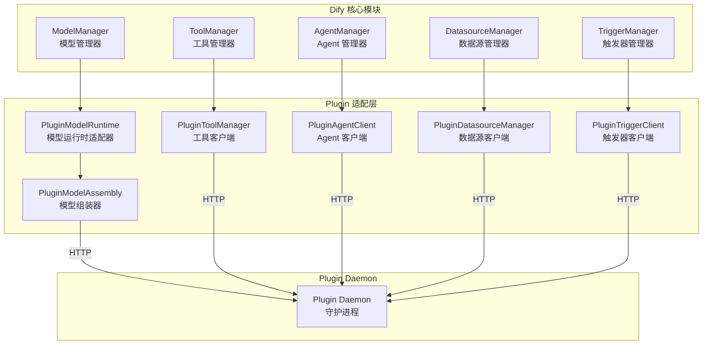
```mermaid
graph TB
    subgraph "Dify 核心模块"
        MM["ModelManager<br/>模型管理器"]
        TM["ToolManager<br/>工具管理器"]
        AM["AgentManager<br/>Agent 管理器"]
        DM["DatasourceManager<br/>数据源管理器"]
        TRM["TriggerManager<br/>触发器管理器"]
    end

    subgraph "Plugin 适配层"
        PMR["PluginModelRuntime<br/>模型运行时适配器"]
        PMA["PluginModelAssembly<br/>模型组装器"]
        PTM["PluginToolManager<br/>工具客户端"]
        PAC["PluginAgentClient<br/>Agent 客户端"]
        PDM["PluginDatasourceManager<br/>数据源客户端"]
        PTC["PluginTriggerClient<br/>触发器客户端"]
    end

    subgraph "Plugin Daemon"
        PD["Plugin Daemon<br/>守护进程"]
    end

    MM --> PMR
    PMR --> PMA
    PMA -->|"HTTP"| PD
    TM --> PTM
    PTM -->|"HTTP"| PD
    AM --> PAC
    PAC -->|"HTTP"| PD
    DM --> PDM
    PDM -->|"HTTP"| PD
    TRM --> PTC
    PTC -->|"HTTP"| PD
```

---

## 2. 数据流向图

### 2.1 用户请求通用数据流

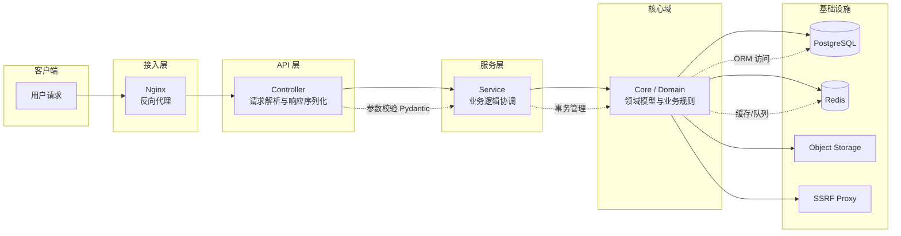
```mermaid
flowchart LR
    subgraph 客户端
        A[用户请求]
    end

    subgraph 接入层
        B[Nginx<br/>反向代理]
    end

    subgraph API 层
        C[Controller<br/>请求解析与响应序列化]
    end

    subgraph 服务层
        D[Service<br/>业务逻辑协调]
    end

    subgraph 核心域
        E[Core / Domain<br/>领域模型与业务规则]
    end

    subgraph 基础设施
        F1[("PostgreSQL")]
        F2[("Redis")]
        F3["Object Storage"]
        F4["SSRF Proxy"]
    end

    A --> B --> C --> D --> E
    E --> F1
    E --> F2
    E --> F3
    E --> F4

    C -.->|"参数校验 Pydantic"| D
    D -.->|"事务管理"| E
    E -.->|"ORM 访问"| F1
    E -.->|"缓存/队列"| F2
```

### 2.2 文档上传与索引构建数据流

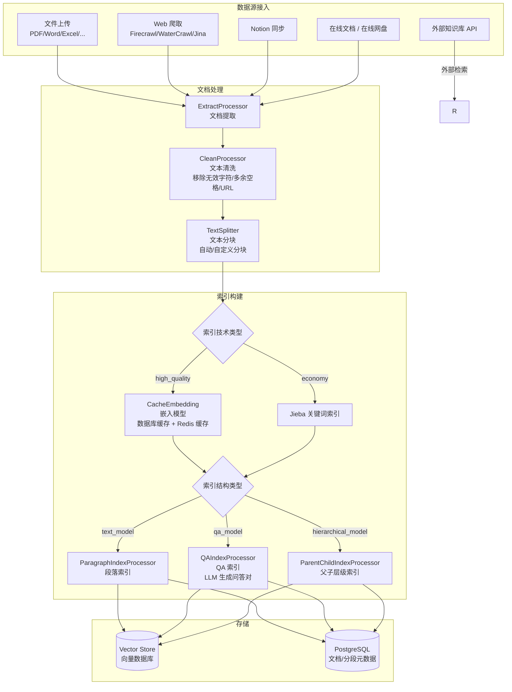
```mermaid
flowchart TD
    subgraph 数据源接入
        A1["文件上传<br/>PDF/Word/Excel/..."]
        A2["Web 爬取<br/>Firecrawl/WaterCrawl/Jina"]
        A3["Notion 同步"]
        A4["外部知识库 API"]
        A5["在线文档 / 在线网盘"]
    end

    subgraph 文档处理
        B["ExtractProcessor<br/>文档提取"]
        C["CleanProcessor<br/>文本清洗<br/>移除无效字符/多余空格/URL"]
        D["TextSplitter<br/>文本分块<br/>自动/自定义分块"]
    end

    subgraph 索引构建
        E{"索引技术类型"}
        F["CacheEmbedding<br/>嵌入模型<br/>数据库缓存 + Redis 缓存"]
        G["Jieba 关键词索引"]
        H{"索引结构类型"}
        H1["ParagraphIndexProcessor<br/>段落索引"]
        H2["QAIndexProcessor<br/>QA 索引<br/>LLM 生成问答对"]
        H3["ParentChildIndexProcessor<br/>父子层级索引"]
    end

    subgraph 存储
        I[("Vector Store<br/>向量数据库")]
        J[("PostgreSQL<br/>文档/分段元数据")]
    end

    A1 --> B
    A2 --> B
    A3 --> B
    A4 -->|"外部检索"| R
    A5 --> B

    B --> C --> D
    D --> E
    E -->|"high_quality"| F
    E -->|"economy"| G
    F --> H
    G --> H
    H -->|"text_model"| H1
    H -->|"qa_model"| H2
    H -->|"hierarchical_model"| H3
    H1 --> I
    H2 --> I
    H3 --> I
    H1 --> J
    H2 --> J
    H3 --> J
```

### 2.3 查询检索与响应数据流

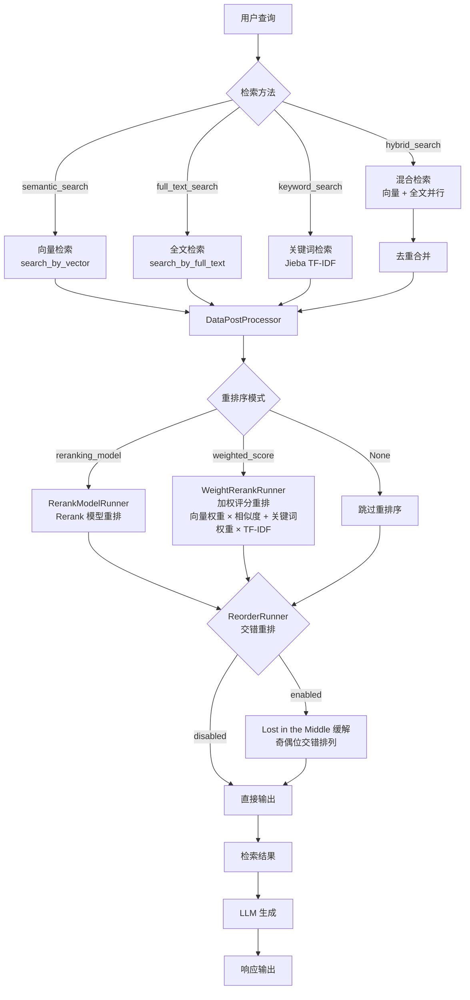
```mermaid
flowchart TD
    A["用户查询"] --> B{"检索方法"}

    B -->|"semantic_search"| C["向量检索<br/>search_by_vector"]
    B -->|"full_text_search"| D["全文检索<br/>search_by_full_text"]
    B -->|"hybrid_search"| E["混合检索<br/>向量 + 全文并行"]
    B -->|"keyword_search"| F["关键词检索<br/>Jieba TF-IDF"]

    C --> G["DataPostProcessor"]
    D --> G
    E --> H["去重合并"]
    F --> G
    H --> G

    G --> I{"重排序模式"}
    I -->|"reranking_model"| J["RerankModelRunner<br/>Rerank 模型重排"]
    I -->|"weighted_score"| K["WeightRerankRunner<br/>加权评分重排<br/>向量权重 × 相似度 + 关键词权重 × TF-IDF"]
    I -->|"None"| L["跳过重排序"]

    J --> M{"ReorderRunner<br/>交错重排"}
    K --> M
    L --> M

    M -->|"enabled"| N["Lost in the Middle 缓解<br/>奇偶位交错排列"]
    M -->|"disabled"| O["直接输出"]
    N --> O

    O --> P["检索结果"]
    P --> Q["LLM 生成"]
    Q --> R["响应输出"]
```

### 2.4 Workflow 执行数据流

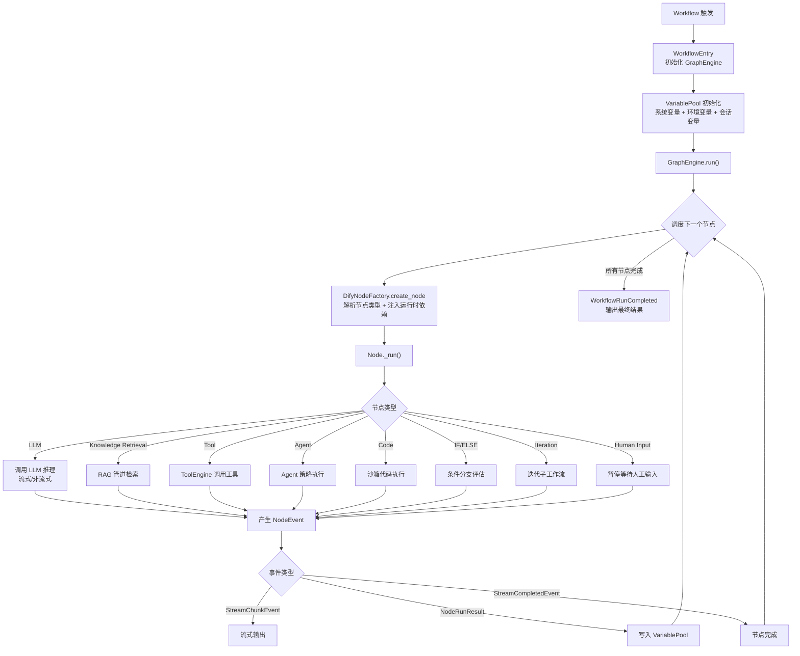
```mermaid
flowchart TD
    A["Workflow 触发"] --> B["WorkflowEntry<br/>初始化 GraphEngine"]

    B --> C["VariablePool 初始化<br/>系统变量 + 环境变量 + 会话变量"]

    C --> D["GraphEngine.run()"]
    D --> E{"调度下一个节点"}

    E --> F["DifyNodeFactory.create_node<br/>解析节点类型 + 注入运行时依赖"]
    F --> G["Node._run()"]

    G --> H{"节点类型"}
    H -->|"LLM"| I["调用 LLM 推理<br/>流式/非流式"]
    H -->|"Knowledge Retrieval"| J["RAG 管道检索"]
    H -->|"Tool"| K["ToolEngine 调用工具"]
    H -->|"Agent"| L["Agent 策略执行"]
    H -->|"Code"| M["沙箱代码执行"]
    H -->|"IF/ELSE"| N["条件分支评估"]
    H -->|"Iteration"| O["迭代子工作流"]
    H -->|"Human Input"| P["暂停等待人工输入"]

    I --> Q["产生 NodeEvent"]
    J --> Q
    K --> Q
    L --> Q
    M --> Q
    N --> Q
    O --> Q
    P --> Q

    Q --> R{"事件类型"}
    R -->|"StreamChunkEvent"| S["流式输出"]
    R -->|"NodeRunResult"| T["写入 VariablePool"]
    R -->|"StreamCompletedEvent"| U["节点完成"]

    T --> E
    U --> E
    E -->|"所有节点完成"| V["WorkflowRunCompleted<br/>输出最终结果"]
```

---

## 3. 核心功能交互图

### 3.1 创建应用并配置 Workflow 的完整交互

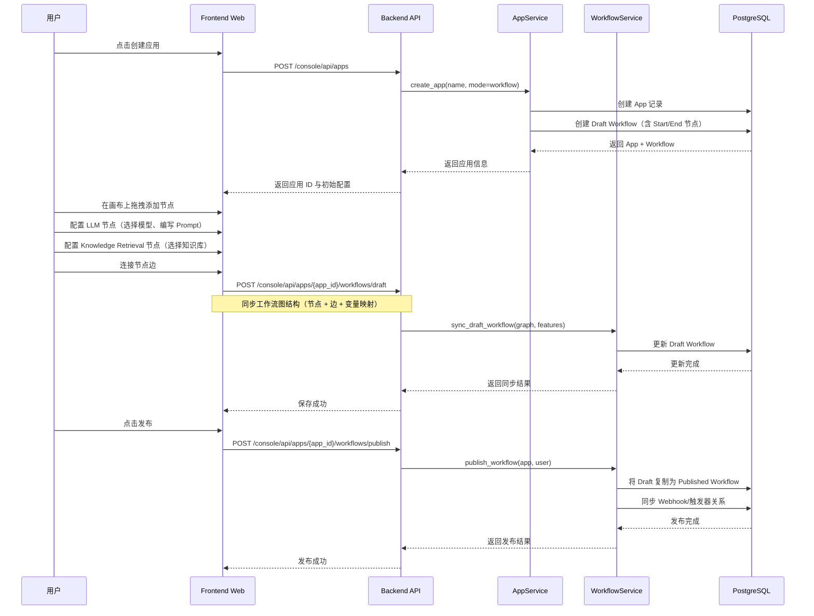
```mermaid
sequenceDiagram
    participant User as 用户
    participant WebUI as Frontend Web
    participant API as Backend API
    participant AppSvc as AppService
    participant WFSvc as WorkflowService
    participant DB as PostgreSQL

    User->>WebUI: 点击创建应用
    WebUI->>API: POST /console/api/apps
    API->>AppSvc: create_app(name, mode=workflow)
    AppSvc->>DB: 创建 App 记录
    AppSvc->>DB: 创建 Draft Workflow（含 Start/End 节点）
    DB-->>AppSvc: 返回 App + Workflow
    AppSvc-->>API: 返回应用信息
    API-->>WebUI: 返回应用 ID 与初始配置

    User->>WebUI: 在画布上拖拽添加节点
    User->>WebUI: 配置 LLM 节点（选择模型、编写 Prompt）
    User->>WebUI: 配置 Knowledge Retrieval 节点（选择知识库）
    User->>WebUI: 连接节点边

    WebUI->>API: POST /console/api/apps/{app_id}/workflows/draft
    Note over WebUI,API: 同步工作流图结构（节点 + 边 + 变量映射）
    API->>WFSvc: sync_draft_workflow(graph, features)
    WFSvc->>DB: 更新 Draft Workflow
    DB-->>WFSvc: 更新完成
    WFSvc-->>API: 返回同步结果
    API-->>WebUI: 保存成功

    User->>WebUI: 点击发布
    WebUI->>API: POST /console/api/apps/{app_id}/workflows/publish
    API->>WFSvc: publish_workflow(app, user)
    WFSvc->>DB: 将 Draft 复制为 Published Workflow
    WFSvc->>DB: 同步 Webhook/触发器关系
    DB-->>WFSvc: 发布完成
    WFSvc-->>API: 返回发布结果
    API-->>WebUI: 发布成功
```

### 3.2 上传文档到知识库并在 Workflow 中检索的交互

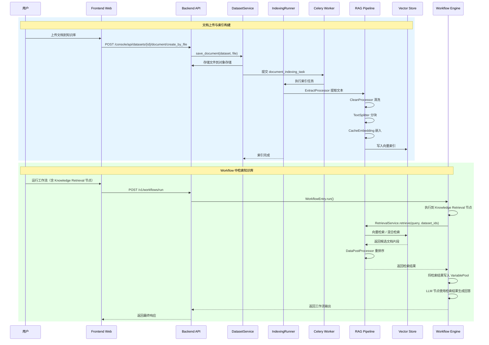
```mermaid
sequenceDiagram
    participant User as 用户
    participant WebUI as Frontend Web
    participant API as Backend API
    participant DatasetSvc as DatasetService
    participant IndexRunner as IndexingRunner
    participant Celery as Celery Worker
    participant RAG as RAG Pipeline
    participant VectorDB as Vector Store
    participant WF as Workflow Engine

    rect rgb(230, 245, 255)
        Note over User,VectorDB: 文档上传与索引构建
        User->>WebUI: 上传文档到知识库
        WebUI->>API: POST /console/api/datasets/{id}/document/create_by_file
        API->>DatasetSvc: save_document(dataset, file)
        DatasetSvc->>API: 存储文件到对象存储
        DatasetSvc->>Celery: 提交 document_indexing_task
        Celery->>IndexRunner: 执行索引任务
        IndexRunner->>RAG: ExtractProcessor 提取文本
        RAG->>RAG: CleanProcessor 清洗
        RAG->>RAG: TextSplitter 分块
        RAG->>RAG: CacheEmbedding 嵌入
        RAG->>VectorDB: 写入向量索引
        IndexRunner-->>DatasetSvc: 索引完成
    end

    rect rgb(230, 255, 230)
        Note over User,WF: Workflow 中检索知识库
        User->>WebUI: 运行工作流（含 Knowledge Retrieval 节点）
        WebUI->>API: POST /v1/workflows/run
        API->>WF: WorkflowEntry.run()
        WF->>WF: 执行到 Knowledge Retrieval 节点
        WF->>RAG: RetrievalService.retrieve(query, dataset_ids)
        RAG->>VectorDB: 向量检索 / 混合检索
        VectorDB-->>RAG: 返回候选文档片段
        RAG->>RAG: DataPostProcessor 重排序
        RAG-->>WF: 返回检索结果
        WF->>WF: 将检索结果写入 VariablePool
        WF->>WF: LLM 节点使用检索结果生成回答
        WF-->>API: 返回工作流输出
        API-->>WebUI: 返回最终响应
    end
```

### 3.3 Agent 对话中调用工具的交互

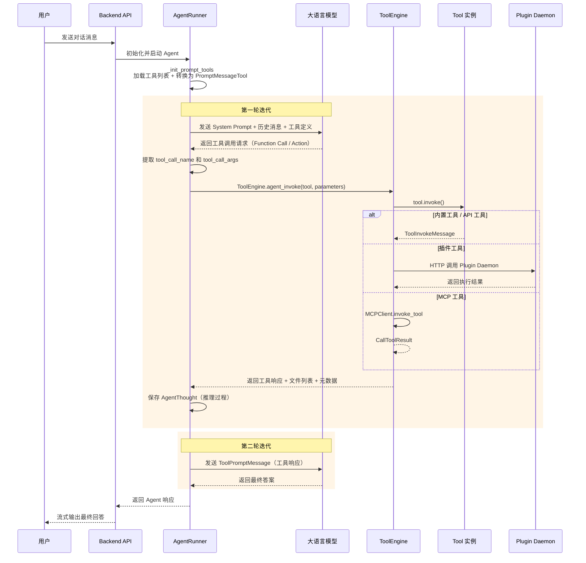
```mermaid
sequenceDiagram
    participant User as 用户
    participant API as Backend API
    participant AgentRunner as AgentRunner
    participant LLM as 大语言模型
    participant TE as ToolEngine
    participant Tool as Tool 实例
    participant Daemon as Plugin Daemon

    User->>API: 发送对话消息
    API->>AgentRunner: 初始化并启动 Agent

    AgentRunner->>AgentRunner: _init_prompt_tools<br/>加载工具列表 + 转换为 PromptMessageTool

    rect rgb(255, 245, 230)
        Note over AgentRunner,LLM: 第一轮迭代
        AgentRunner->>LLM: 发送 System Prompt + 历史消息 + 工具定义
        LLM-->>AgentRunner: 返回工具调用请求（Function Call / Action）

        AgentRunner->>AgentRunner: 提取 tool_call_name 和 tool_call_args
        AgentRunner->>TE: ToolEngine.agent_invoke(tool, parameters)
        TE->>Tool: tool.invoke()

        alt 内置工具 / API 工具
            Tool-->>TE: ToolInvokeMessage
        else 插件工具
            TE->>Daemon: HTTP 调用 Plugin Daemon
            Daemon-->>TE: 返回执行结果
        else MCP 工具
            TE->>TE: MCPClient.invoke_tool
            TE-->>TE: CallToolResult
        end

        TE-->>AgentRunner: 返回工具响应 + 文件列表 + 元数据
        AgentRunner->>AgentRunner: 保存 AgentThought（推理过程）
    end

    rect rgb(255, 245, 230)
        Note over AgentRunner,LLM: 第二轮迭代
        AgentRunner->>LLM: 发送 ToolPromptMessage（工具响应）
        LLM-->>AgentRunner: 返回最终答案
    end

    AgentRunner-->>API: 返回 Agent 响应
    API-->>User: 流式输出最终回答
```

### 3.4 触发器触发 Workflow 执行的交互

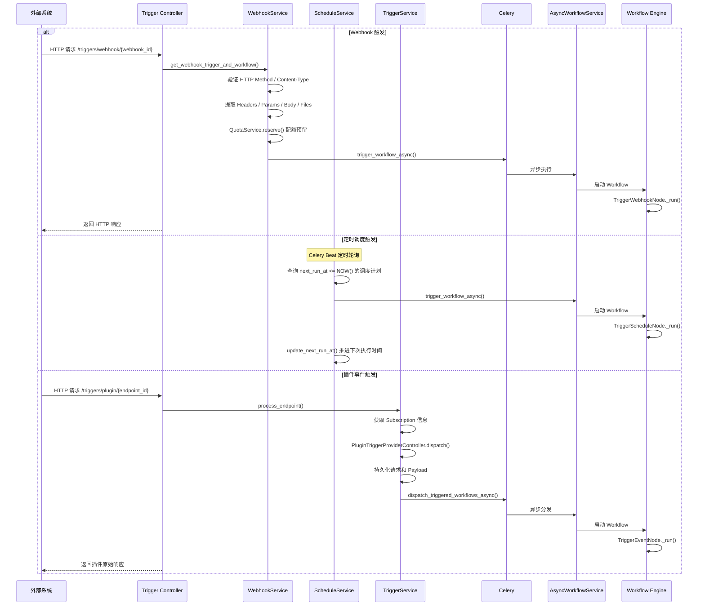
```mermaid
sequenceDiagram
    participant Ext as 外部系统
    participant Ctrl as Trigger Controller
    participant WebhookSvc as WebhookService
    participant ScheduleSvc as ScheduleService
    participant TriggerSvc as TriggerService
    participant Celery as Celery
    participant AsyncSvc as AsyncWorkflowService
    participant WF as Workflow Engine

    alt Webhook 触发
        Ext->>Ctrl: HTTP 请求 /triggers/webhook/{webhook_id}
        Ctrl->>WebhookSvc: get_webhook_trigger_and_workflow()
        WebhookSvc->>WebhookSvc: 验证 HTTP Method / Content-Type
        WebhookSvc->>WebhookSvc: 提取 Headers / Params / Body / Files
        WebhookSvc->>WebhookSvc: QuotaService.reserve() 配额预留
        WebhookSvc->>Celery: trigger_workflow_async()
        Celery->>AsyncSvc: 异步执行
        AsyncSvc->>WF: 启动 Workflow
        WF->>WF: TriggerWebhookNode._run()
        Ctrl-->>Ext: 返回 HTTP 响应

    else 定时调度触发
        Note over ScheduleSvc: Celery Beat 定时轮询
        ScheduleSvc->>ScheduleSvc: 查询 next_run_at <= NOW() 的调度计划
        ScheduleSvc->>AsyncSvc: trigger_workflow_async()
        AsyncSvc->>WF: 启动 Workflow
        WF->>WF: TriggerScheduleNode._run()
        ScheduleSvc->>ScheduleSvc: update_next_run_at() 推进下次执行时间

    else 插件事件触发
        Ext->>Ctrl: HTTP 请求 /triggers/plugin/{endpoint_id}
        Ctrl->>TriggerSvc: process_endpoint()
        TriggerSvc->>TriggerSvc: 获取 Subscription 信息
        TriggerSvc->>TriggerSvc: PluginTriggerProviderController.dispatch()
        TriggerSvc->>TriggerSvc: 持久化请求和 Payload
        TriggerSvc->>Celery: dispatch_triggered_workflows_async()
        Celery->>AsyncSvc: 异步分发
        AsyncSvc->>WF: 启动 Workflow
        WF->>WF: TriggerEventNode._run()
        Ctrl-->>Ext: 返回插件原始响应
    end
```

---

## 4. 系统分层架构图

### 4.1 完整分层架构

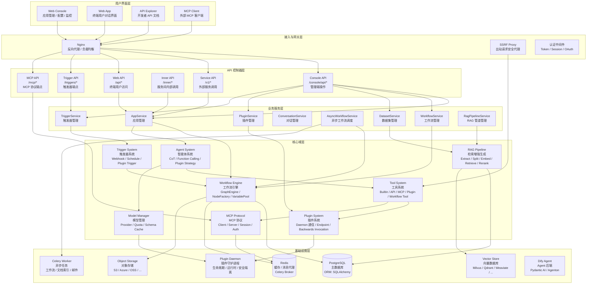
```mermaid
graph TB
    subgraph "用户界面层"
        U1["Web Console<br/>应用管理 / 配置 / 监控"]
        U2["Web App<br/>终端用户对话界面"]
        U3["API Explorer<br/>开发者 API 文档"]
        U4["MCP Client<br/>外部 MCP 客户端"]
    end

    subgraph "接入与网关层"
        G1["Nginx<br/>反向代理 / 负载均衡"]
        G2["SSRF Proxy<br/>出站请求安全代理"]
        G3["认证中间件<br/>Token / Session / OAuth"]
    end

    subgraph "API 控制器层"
        A1["Console API<br/>/console/api/*<br/>管理端操作"]
        A2["Service API<br/>/v1/*<br/>外部服务调用"]
        A3["Web API<br/>/api/*<br/>终端用户访问"]
        A4["Inner API<br/>/inner/*<br/>服务间内部调用"]
        A5["Trigger API<br/>/triggers/*<br/>触发器端点"]
        A6["MCP API<br/>/mcp/*<br/>MCP 协议端点"]
    end

    subgraph "业务服务层"
        S1["AppService<br/>应用管理"]
        S2["WorkflowService<br/>工作流管理"]
        S3["DatasetService<br/>数据集管理"]
        S4["ConversationService<br/>对话管理"]
        S5["AsyncWorkflowService<br/>异步工作流调度"]
        S6["PluginService<br/>插件管理"]
        S7["TriggerService<br/>触发器管理"]
        S8["RagPipelineService<br/>RAG 管道管理"]
    end

    subgraph "核心域层"
        C1["Workflow Engine<br/>工作流引擎<br/>GraphEngine / NodeFactory / VariablePool"]
        C2["RAG Pipeline<br/>检索增强生成<br/>Extract / Split / Embed / Retrieve / Rerank"]
        C3["Agent System<br/>智能体系统<br/>CoT / Function Calling / Plugin Strategy"]
        C4["Tool System<br/>工具系统<br/>Builtin / API / MCP / Plugin / Workflow Tool"]
        C5["Plugin System<br/>插件系统<br/>Daemon 通信 / Endpoint / Backwards Invocation"]
        C6["MCP Protocol<br/>MCP 协议<br/>Client / Server / Session / Auth"]
        C7["Trigger System<br/>触发器系统<br/>Webhook / Schedule / Plugin Trigger"]
        C8["Model Manager<br/>模型管理<br/>Provider / Quota / Schema Cache"]
    end

    subgraph "基础设施层"
        I1[("PostgreSQL<br/>主数据库<br/>ORM: SQLAlchemy")]
        I2[("Redis<br/>缓存 / 消息代理<br/>Celery Broker")]
        I3["Object Storage<br/>对象存储<br/>S3 / Azure / OSS / ..."]
        I4["Vector Store<br/>向量数据库<br/>Milvus / Qdrant / Weaviate / ..."]
        I5["Celery Worker<br/>异步任务<br/>工作流 / 文档索引 / 邮件"]
        I6["Plugin Daemon<br/>插件守护进程<br/>生命周期 / 运行时 / 安全隔离"]
        I7["Dify Agent<br/>Agent 后端<br/>Pydantic AI / Agenton"]
    end

    U1 --> G1
    U2 --> G1
    U3 --> G1
    U4 --> G1

    G1 --> A1
    G1 --> A2
    G1 --> A3
    G1 --> A5
    G1 --> A6
    G2 --> C4

    A1 --> S1
    A1 --> S2
    A1 --> S3
    A1 --> S6
    A1 --> S7
    A2 --> S1
    A3 --> S1
    A4 --> S1
    A5 --> S7
    A6 --> C6

    S1 --> C1
    S1 --> C3
    S2 --> C1
    S3 --> C2
    S5 --> C1
    S5 --> I5
    S6 --> C5
    S7 --> C7
    S8 --> C2

    C1 --> I1
    C1 --> I2
    C1 --> I3
    C2 --> I1
    C2 --> I4
    C3 --> C4
    C3 --> C8
    C4 --> C5
    C4 --> C6
    C5 --> I6
    C6 --> I2
    C7 --> C1
    C8 --> I6
```

### 4.2 后端 DDD 分层架构

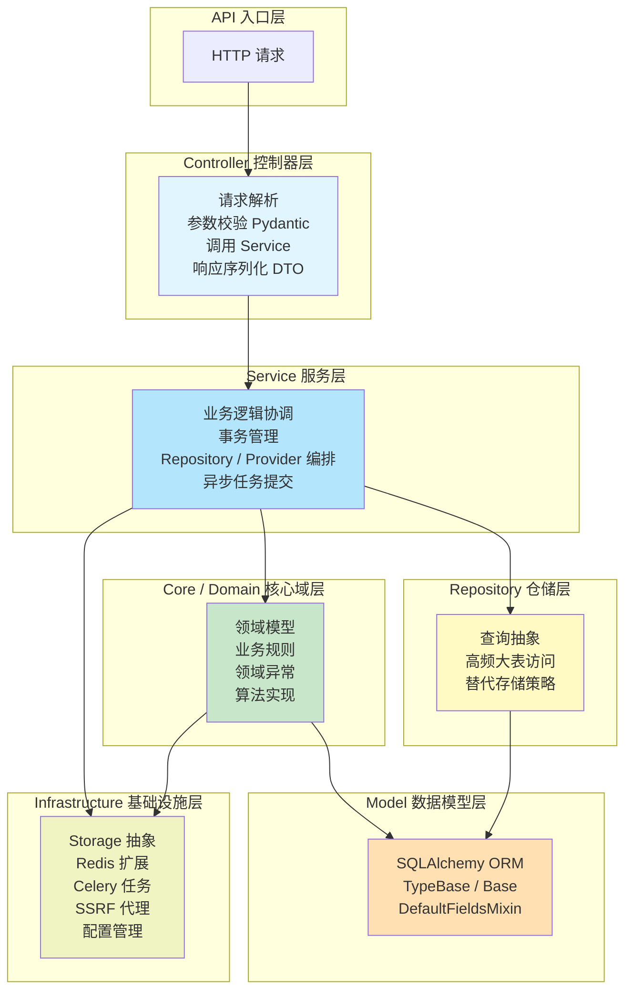
```mermaid
graph TB
    subgraph "API 入口层"
        API_IN["HTTP 请求"]
    end

    subgraph "Controller 控制器层"
        CT["请求解析<br/>参数校验 Pydantic<br/>调用 Service<br/>响应序列化 DTO"]
    end

    subgraph "Service 服务层"
        SV["业务逻辑协调<br/>事务管理<br/>Repository / Provider 编排<br/>异步任务提交"]
    end

    subgraph "Core / Domain 核心域层"
        CO["领域模型<br/>业务规则<br/>领域异常<br/>算法实现"]
    end

    subgraph "Repository 仓储层"
        RP["查询抽象<br/>高频大表访问<br/>替代存储策略"]
    end

    subgraph "Model 数据模型层"
        MD["SQLAlchemy ORM<br/>TypeBase / Base<br/>DefaultFieldsMixin"]
    end

    subgraph "Infrastructure 基础设施层"
        IF["Storage 抽象<br/>Redis 扩展<br/>Celery 任务<br/>SSRF 代理<br/>配置管理"]
    end

    API_IN --> CT
    CT --> SV
    SV --> CO
    SV --> RP
    CO --> MD
    RP --> MD
    SV --> IF
    CO --> IF

    style CT fill:#e1f5fe
    style SV fill:#b3e5fc
    style CO fill:#c8e6c9
    style RP fill:#fff9c4
    style MD fill:#ffe0b2
    style IF fill:#f0f4c3
```

### 4.3 前端架构分层

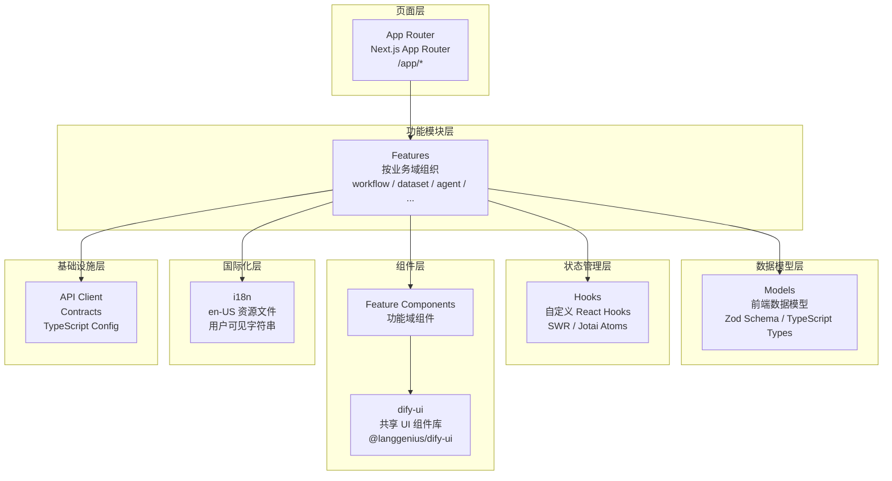
```mermaid
graph TB
    subgraph "页面层"
        P1["App Router<br/>Next.js App Router<br/>/app/*"]
    end

    subgraph "功能模块层"
        F1["Features<br/>按业务域组织<br/>workflow / dataset / agent / ..."]
    end

    subgraph "数据模型层"
        D1["Models<br/>前端数据模型<br/>Zod Schema / TypeScript Types"]
    end

    subgraph "状态管理层"
        S1["Hooks<br/>自定义 React Hooks<br/>SWR / Jotai Atoms"]
    end

    subgraph "组件层"
        C1["dify-ui<br/>共享 UI 组件库<br/>@langgenius/dify-ui"]
        C2["Feature Components<br/>功能域组件"]
    end

    subgraph "国际化层"
        I18N["i18n<br/>en-US 资源文件<br/>用户可见字符串"]
    end

    subgraph "基础设施层"
        INF["API Client<br/>Contracts<br/>TypeScript Config"]
    end

    P1 --> F1
    F1 --> D1
    F1 --> S1
    F1 --> C2
    C2 --> C1
    F1 --> I18N
    F1 --> INF
```

---

## 5. 关键流程补充

### 5.1 插件生命周期流程

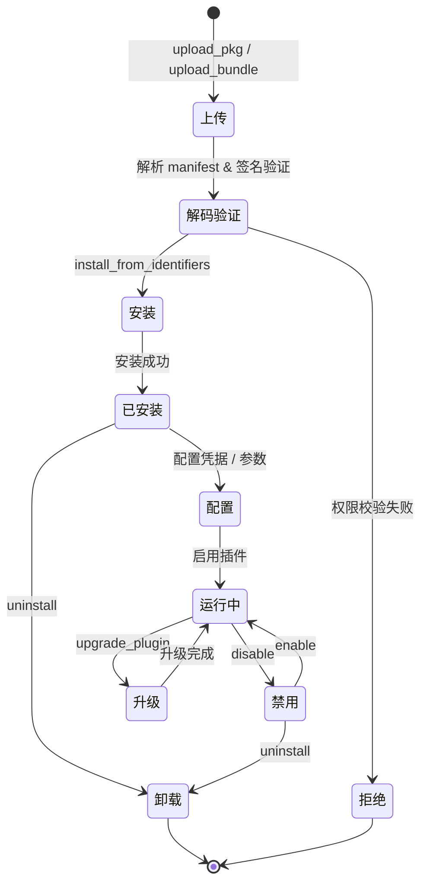
```mermaid
stateDiagram-v2
    [*] --> 上传: upload_pkg / upload_bundle
    上传 --> 解码验证: 解析 manifest & 签名验证
    解码验证 --> 安装: install_from_identifiers
    解码验证 --> 拒绝: 权限校验失败
    安装 --> 已安装: 安装成功
    已安装 --> 配置: 配置凭据 / 参数
    配置 --> 运行中: 启用插件
    运行中 --> 禁用: disable
    禁用 --> 运行中: enable
    运行中 --> 升级: upgrade_plugin
    升级 --> 运行中: 升级完成
    已安装 --> 卸载: uninstall
    禁用 --> 卸载: uninstall
    卸载 --> [*]
    拒绝 --> [*]
```

### 5.2 Workflow 执行状态机

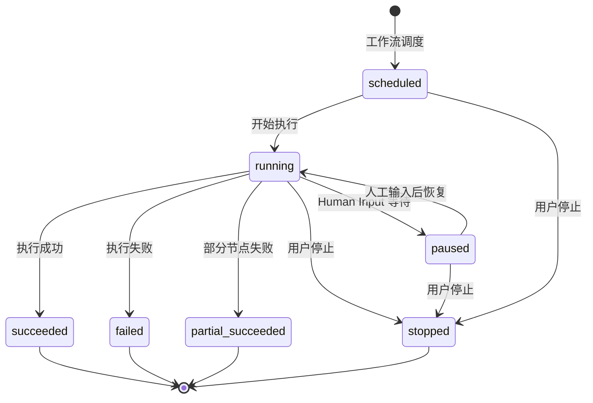
```mermaid
stateDiagram-v2
    [*] --> scheduled: 工作流调度
    scheduled --> running: 开始执行
    running --> paused: Human Input 等待
    running --> succeeded: 执行成功
    running --> failed: 执行失败
    running --> partial_succeeded: 部分节点失败
    running --> stopped: 用户停止
    paused --> running: 人工输入后恢复
    paused --> stopped: 用户停止
    scheduled --> stopped: 用户停止
    succeeded --> [*]
    failed --> [*]
    partial_succeeded --> [*]
    stopped --> [*]
```

### 5.3 Agent 迭代执行流程

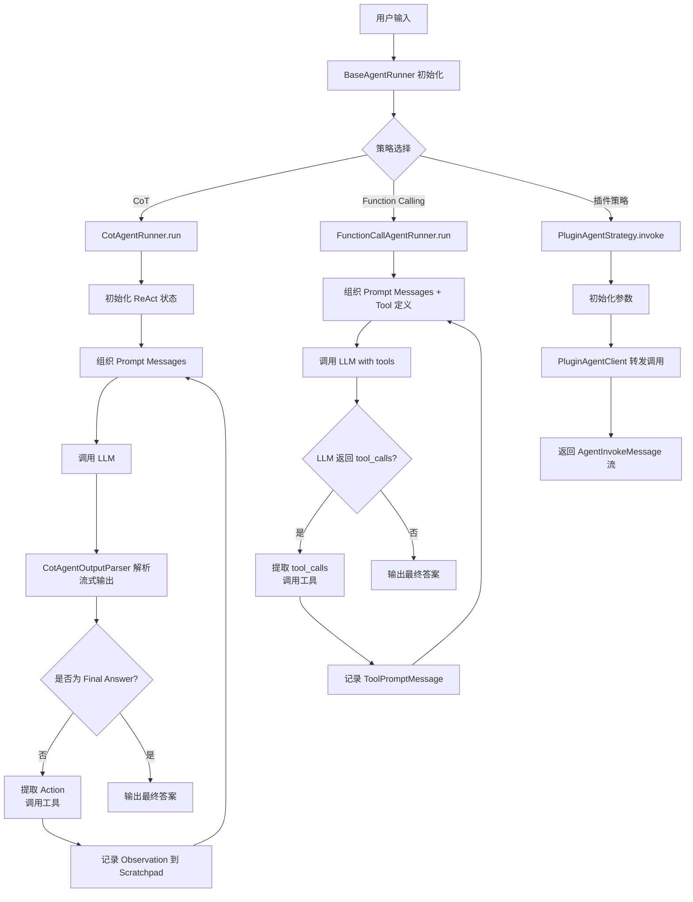
```mermaid
flowchart TD
    A["用户输入"] --> B["BaseAgentRunner 初始化"]
    B --> C{"策略选择"}

    C -->|"CoT"| D["CotAgentRunner.run"]
    C -->|"Function Calling"| E["FunctionCallAgentRunner.run"]
    C -->|"插件策略"| F["PluginAgentStrategy.invoke"]

    D --> D1["初始化 ReAct 状态"]
    D1 --> D2["组织 Prompt Messages"]
    D2 --> D3["调用 LLM"]
    D3 --> D4["CotAgentOutputParser 解析流式输出"]
    D4 --> D5{"是否为 Final Answer?"}
    D5 -->|"否"| D6["提取 Action<br/>调用工具"]
    D6 --> D7["记录 Observation 到 Scratchpad"]
    D7 --> D2
    D5 -->|"是"| D8["输出最终答案"]

    E --> E1["组织 Prompt Messages + Tool 定义"]
    E1 --> E2["调用 LLM with tools"]
    E2 --> E3{"LLM 返回 tool_calls?"}
    E3 -->|"是"| E4["提取 tool_calls<br/>调用工具"]
    E4 --> E5["记录 ToolPromptMessage"]
    E5 --> E1
    E3 -->|"否"| E6["输出最终答案"]

    F --> F1["初始化参数"]
    F1 --> F2["PluginAgentClient 转发调用"]
    F2 --> F3["返回 AgentInvokeMessage 流"]
```

### 5.4 MCP 工具集成桥接流程

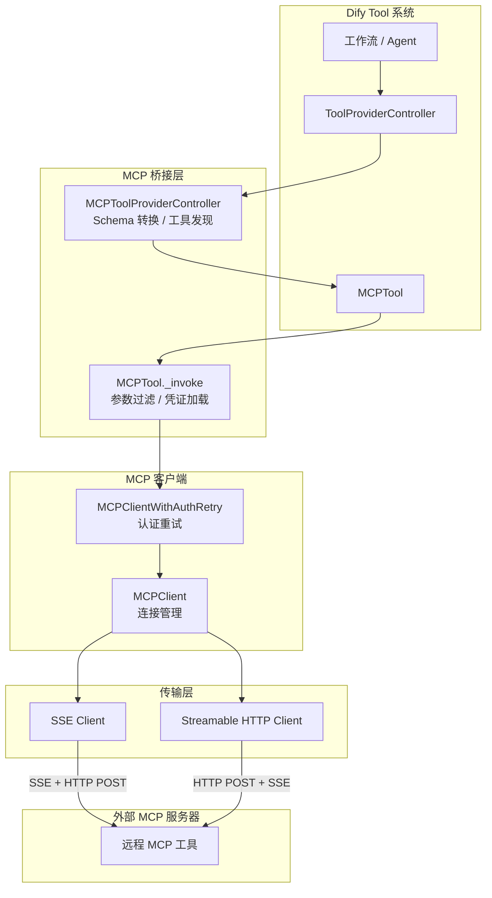
```mermaid
flowchart TD
    subgraph "Dify Tool 系统"
        WF["工作流 / Agent"]
        TP["ToolProviderController"]
        MT["MCPTool"]
    end

    subgraph "MCP 桥接层"
        MTPC["MCPToolProviderController<br/>Schema 转换 / 工具发现"]
        MT_INVOKE["MCPTool._invoke<br/>参数过滤 / 凭证加载"]
    end

    subgraph "MCP 客户端"
        AUTH_RETRY["MCPClientWithAuthRetry<br/>认证重试"]
        MC["MCPClient<br/>连接管理"]
    end

    subgraph "传输层"
        SSE["SSE Client"]
        STREAM["Streamable HTTP Client"]
    end

    subgraph "外部 MCP 服务器"
        EXT["远程 MCP 工具"]
    end

    WF --> TP
    TP --> MTPC
    MTPC --> MT
    MT --> MT_INVOKE
    MT_INVOKE --> AUTH_RETRY
    AUTH_RETRY --> MC
    MC --> SSE
    MC --> STREAM
    SSE -->|"SSE + HTTP POST"| EXT
    STREAM -->|"HTTP POST + SSE"| EXT
```

### 5.5 触发器 Debug 事件总线流程

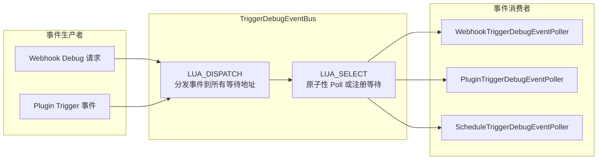
```mermaid
flowchart LR
    subgraph "事件生产者"
        A["Webhook Debug 请求"]
        B["Plugin Trigger 事件"]
    end

    subgraph "TriggerDebugEventBus"
        C["LUA_DISPATCH<br/>分发事件到所有等待地址"]
        D["LUA_SELECT<br/>原子性 Poll 或注册等待"]
    end

    subgraph "事件消费者"
        E["WebhookTriggerDebugEventPoller"]
        F["PluginTriggerDebugEventPoller"]
        G["ScheduleTriggerDebugEventPoller"]
    end

    A --> C
    B --> C
    C --> D
    D --> E
    D --> F
    D --> G
```
