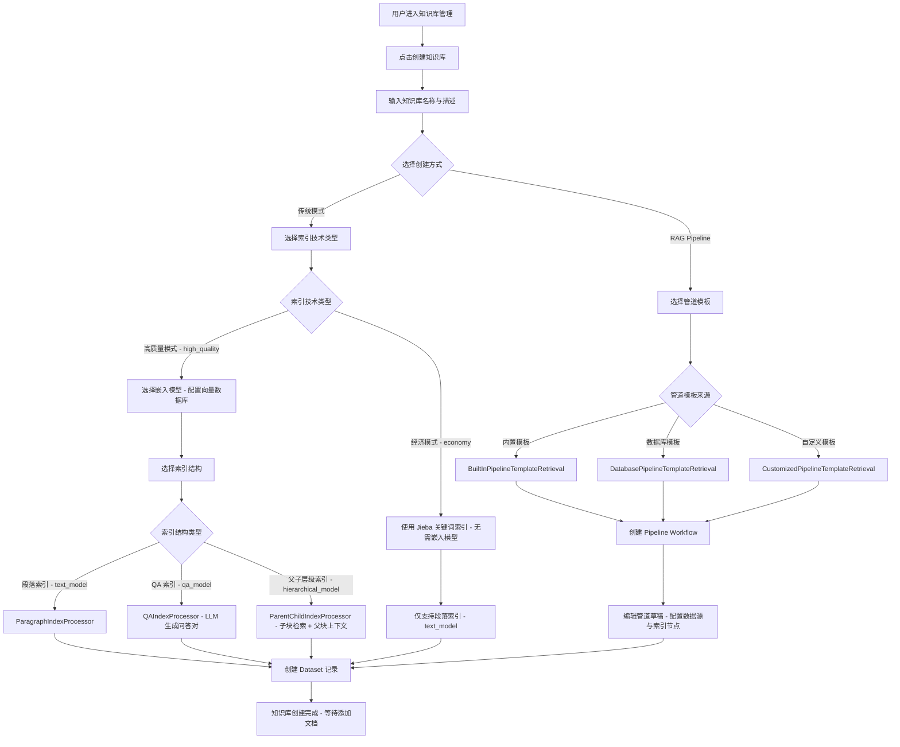
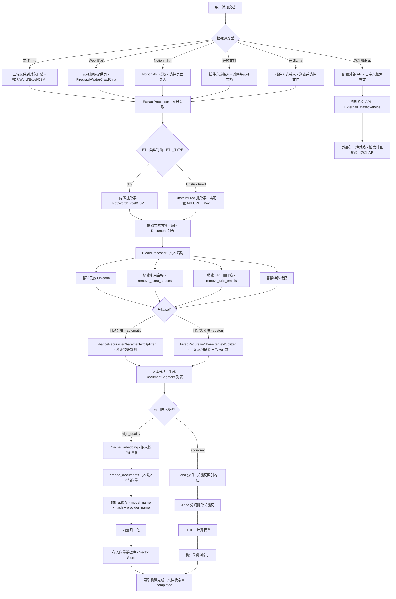
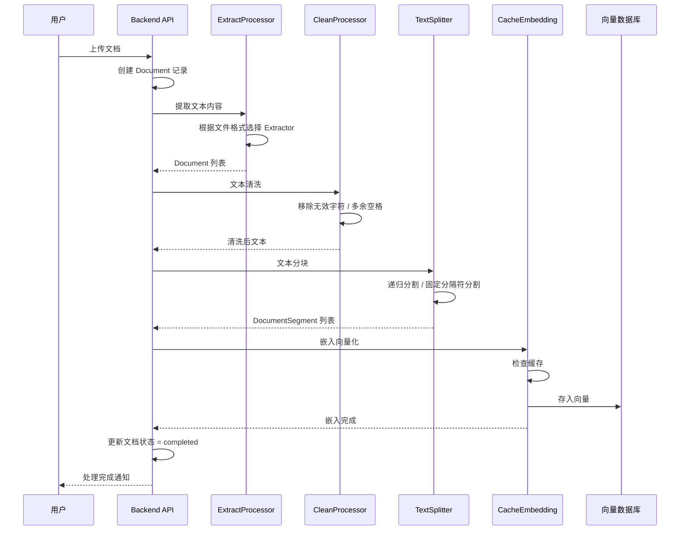
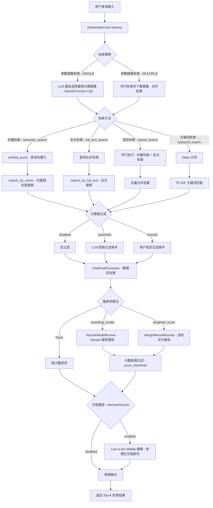
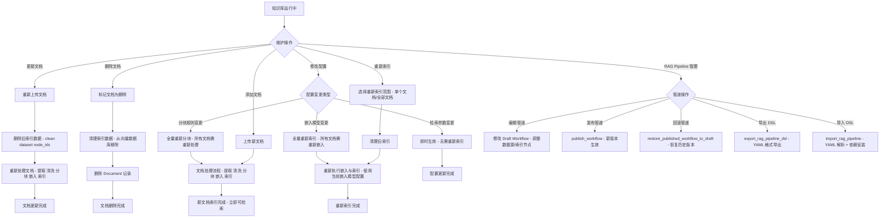
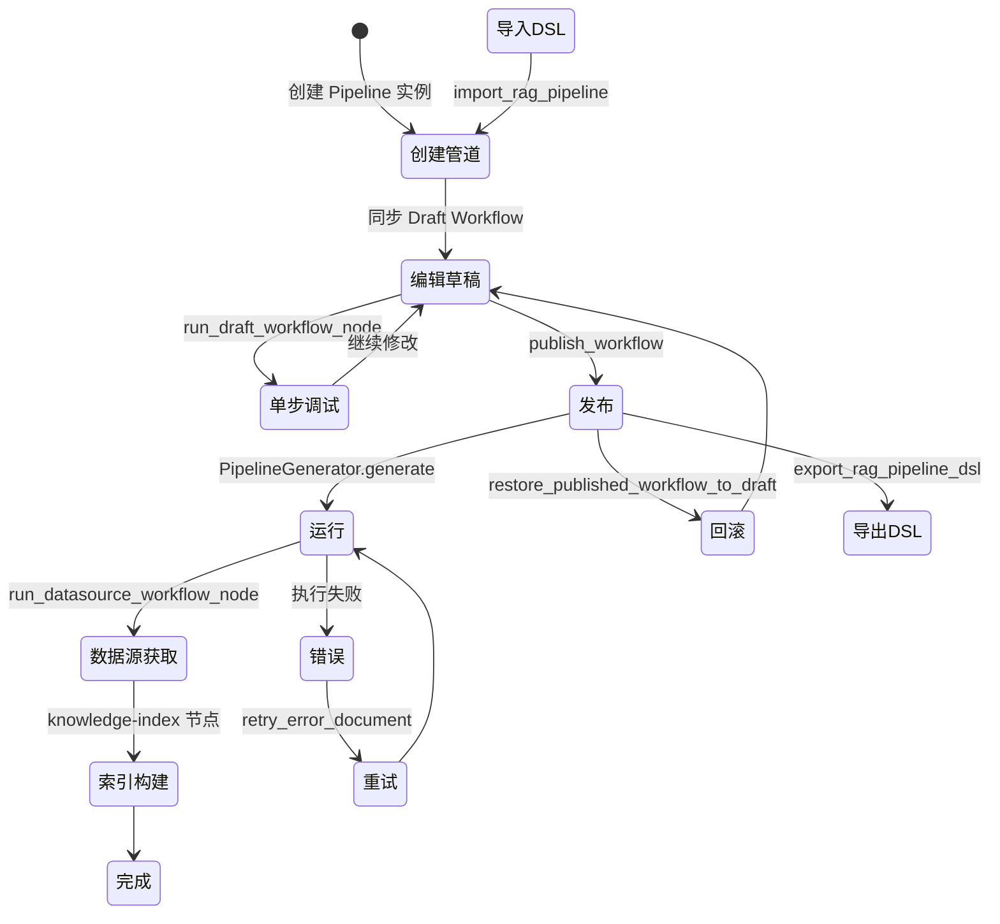

# RAG 知识库构建闭环流程

## 1. 流程概述

本文档描述 Dify 平台中 RAG（Retrieval-Augmented Generation，检索增强生成）知识库从创建到维护的完整闭环流程。Dify 的 RAG 管道覆盖了从数据源接入、文档解析、分块、嵌入、索引构建到检索与重排序的完整生命周期，并提供可视化的管道编排能力。

核心流程包括：
- **知识库创建**：选择索引模式 → 配置嵌入模型 → 初始化知识库
- **文档上传与处理**：上传 → 提取 → 清洗 → 分块 → 嵌入 → 索引
- **检索与重排序**：查询 → 检索方法选择 → 结果合并 → 重排序 → 输出
- **知识库维护**：文档更新、删除、重新索引、管道版本管理

---

## 2. 知识库创建流程图

### 索引技术类型对比

| 索引技术 | 标识 | 嵌入模型 | 检索方法 | 适用场景 |
|----------|------|----------|----------|----------|
| 高质量模式 | `high_quality` | 需要 | 向量/全文/混合检索 | 语义理解要求高 |
| 经济模式 | `economy` | 不需要 | 关键词检索 | 成本敏感、关键词匹配 |

### 索引结构类型对比

| 索引结构 | 标识 | 处理器 | 特点 |
|----------|------|--------|------|
| 段落索引 | `text_model` | ParagraphIndexProcessor | 每个分块独立嵌入和索引 |
| QA 索引 | `qa_model` | QAIndexProcessor | LLM 生成问答对，以问题为索引 |
| 父子层级索引 | `hierarchical_model` | ParentChildIndexProcessor | 子块检索，父块提供上下文 |

---

## 3. 文档上传与处理流程图

### 文档处理时序图

### 支持的文件格式

| 文件格式 | 扩展名 | ETL=dify | ETL=Unstructured |
|----------|--------|----------|------------------|
| PDF | `.pdf` | ✅ | ✅ |
| Word | `.docx` | ✅ | ✅ |
| Word (旧版) | `.doc` | ❌ | ✅ |
| Excel | `.xlsx`, `.xls` | ✅ | ✅ |
| CSV | `.csv` | ✅ | ✅ |
| Markdown | `.md`, `.markdown` | ✅ | ✅ |
| HTML | `.htm`, `.html` | ✅ | ✅ |
| 纯文本 | 其他 | ✅ | ✅ |
| PowerPoint | `.pptx` | ❌ | ✅ |
| 邮件 | `.eml` | ❌ | ✅ |
| Outlook | `.msg` | ❌ | ✅ |
| XML | `.xml` | ❌ | ✅ |
| ePub | `.epub` | ✅ | ✅ |

---

## 4. 检索与重排序流程图

### 检索方法对比

| 检索方法 | 标识 | 适用索引 | 原理 | 优势 |
|----------|------|----------|------|------|
| 向量检索 | `semantic_search` | high_quality | 嵌入向量余弦相似度 | 语义理解能力强 |
| 全文检索 | `full_text_search` | high_quality | 向量数据库全文搜索 | 关键词精确匹配 |
| 混合检索 | `hybrid_search` | high_quality | 向量 + 全文并行 | 兼顾语义与关键词 |
| 关键词检索 | `keyword_search` | economy | Jieba + TF-IDF | 成本低，速度快 |

### 重排序模式对比

| 模式 | 实现类 | 原理 | 适用场景 |
|------|--------|------|----------|
| Rerank 模型 | `RerankModelRunner` | 专用 Rerank 模型重新评分 | 精度要求高 |
| 加权评分 | `WeightRerankRunner` | 向量权重 × 相似度 + 关键词权重 × TF-IDF | 无 Rerank 模型时 |

### 检索参数

| 参数 | 类型 | 默认值 | 说明 |
|------|------|--------|------|
| `top_k` | int | 4 | 返回最大文档数 |
| `score_threshold` | float | 0.0 | 相似度阈值 |
| `score_threshold_enabled` | bool | False | 是否启用阈值过滤 |

---

## 5. 知识库维护流程图

### RAG Pipeline 生命周期

### 管道模板转换映射

| 旧版配置 | 转换模板 |
|----------|----------|
| 文件上传 + 段落索引 + 高质量 | `file-general-high-quality.yml` |
| 文件上传 + 段落索引 + 经济 | `file-general-economy.yml` |
| 文件上传 + 父子层级 | `file-parentchild.yml` |
| Notion + 段落索引 + 高质量 | `notion-general-high-quality.yml` |
| Notion + 段落索引 + 经济 | `notion-general-economy.yml` |
| Notion + 父子层级 | `notion-parentchild.yml` |
| Web 爬取 + 段落索引 + 高质量 | `website-crawl-general-high-quality.yml` |
| Web 爬取 + 段落索引 + 经济 | `website-crawl-general-economy.yml` |
| Web 爬取 + 父子层级 | `website-crawl-parentchild.yml` |

---

## 6. 流程步骤说明表格

### 知识库创建步骤

| 步骤 | 操作 | 执行组件 | 输入 | 输出 |
|------|------|----------|------|------|
| 1 | 输入知识库名称 | 前端 UI | 名称 + 描述 | 表单数据 |
| 2 | 选择索引技术 | 前端 UI | high_quality / economy | 索引技术类型 |
| 3 | 选择嵌入模型 | ModelManager | tenant_id | ModelInstance |
| 4 | 选择索引结构 | IndexProcessorFactory | chunk_structure | IndexProcessor |
| 5 | 创建 Dataset | DatasetService | 配置参数 | Dataset 记录 |
| 6 | 初始化向量集合 | VectorStore | dataset_id | 向量存储空间 |

### 文档处理步骤

| 步骤 | 操作 | 执行组件 | 输入 | 输出 |
|------|------|----------|------|------|
| 1 | 上传文件 | ObjectStorage | 文件二进制 | 存储路径 |
| 2 | 创建 Document 记录 | DocumentService | 文件元数据 | Document 记录 |
| 3 | 提取文本 | ExtractProcessor | 文件路径 + 格式 | Document 列表 |
| 4 | 文本清洗 | CleanProcessor | 原始文本 | 清洗后文本 |
| 5 | 文本分块 | TextSplitter | 清洗后文本 + 分块规则 | DocumentSegment 列表 |
| 6 | 嵌入向量化 | CacheEmbedding | 文本列表 | 向量列表 |
| 7 | 存入向量库 | VectorStore | 向量 + 元数据 | 索引记录 |
| 8 | 更新文档状态 | DocumentService | completed | 状态更新 |

### 检索步骤

| 步骤 | 操作 | 执行组件 | 输入 | 输出 |
|------|------|----------|------|------|
| 1 | 查询输入 | RetrievalService | 查询文本 | 检索请求 |
| 2 | 选择检索方法 | RetrievalService | 检索配置 | 检索策略 |
| 3 | 执行检索 | VectorStore / Jieba | 查询向量/关键词 | 候选结果 |
| 4 | 元数据过滤 | RetrievalService | 过滤条件 | 过滤后结果 |
| 5 | 重排序 | RerankModelRunner / WeightRerankRunner | 候选结果 | 重排序结果 |
| 6 | 交错重排 | ReorderRunner | 排序结果 | 最终结果 |
| 7 | 阈值过滤 | DataPostProcessor | score_threshold | Top-K 结果 |

---

## 7. 关键决策点说明

### 决策点 1：索引技术类型选择

| 决策 | 条件 | 影响 |
|------|------|------|
| 高质量模式 | 需要语义检索、有嵌入模型配额 | 使用嵌入模型生成向量，支持向量/全文/混合检索 |
| 经济模式 | 成本敏感、仅需关键词匹配 | 使用 Jieba 分词，仅支持关键词检索 |

### 决策点 2：索引结构选择

| 决策 | 条件 | 影响 |
|------|------|------|
| 段落索引 | 通用场景 | 每个分块独立索引，简单直接 |
| QA 索引 | 需要问答对形式 | LLM 生成问答对，仅支持高质量模式 |
| 父子层级索引 | 需要上下文增强 | 子块检索 + 父块上下文，精度与上下文兼顾 |

### 决策点 3：检索方法选择

| 决策 | 条件 | 影响 |
|------|------|------|
| 向量检索 | 语义理解为主 | 通过嵌入向量计算语义相似度 |
| 全文检索 | 关键词精确匹配为主 | 通过向量数据库全文搜索 |
| 混合检索 | 兼顾语义与关键词 | 并行执行向量+全文，合并后重排序 |
| 关键词检索 | 经济模式 | Jieba 分词 + TF-IDF |

### 决策点 4：重排序模式选择

| 决策 | 条件 | 影响 |
|------|------|------|
| Rerank 模型 | 已配置 Rerank 模型 | 使用专用模型重新评分，精度最高 |
| 加权评分 | 无 Rerank 模型 | 向量权重 × 相似度 + 关键词权重 × TF-IDF |
| 不重排序 | 无需精排 | 直接使用检索结果排序 |

### 决策点 5：配置变更影响

| 决策 | 条件 | 影响 |
|------|------|------|
| 嵌入模型变更 | 更换嵌入模型 | 需全量重新索引，向量维度可能不同 |
| 分块规则变更 | 修改分隔符或 Token 数 | 需全量重新分块和索引 |
| 检索参数变更 | 修改 top_k / 阈值 | 即时生效，无需重新处理 |
| 重排序配置变更 | 修改 Rerank 模型或权重 | 即时生效，无需重新处理 |
