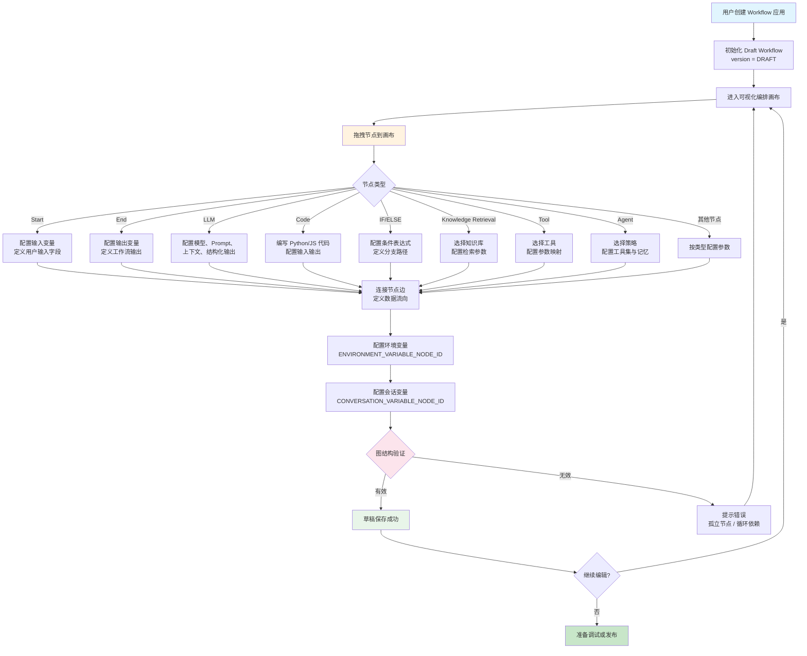
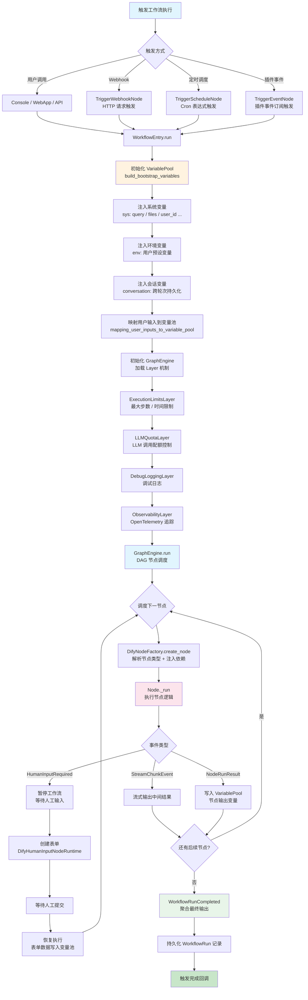
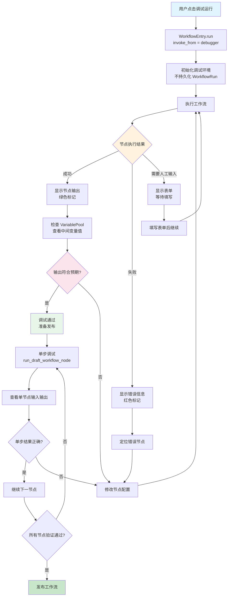
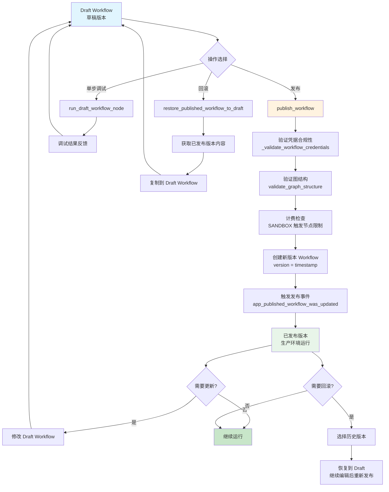
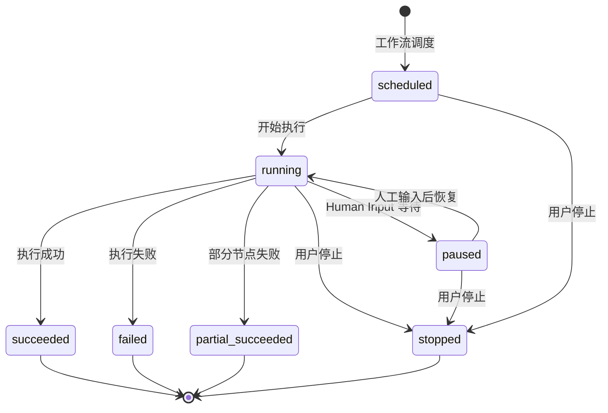

# Workflow 执行闭环流程

## 1. 流程概述

本文档描述 Dify Workflow 引擎从创建到执行的完整闭环流程。Workflow 是 Dify 平台的核心编排引擎，基于 DAG（有向无环图）描述工作流拓扑，通过可视化拖拽方式构建 AI 工作流。引擎采用分层执行架构，由 `GraphEngine` 驱动节点调度，通过 `VariablePool` 实现节点间数据传递，并支持暂停/恢复的人机协同机制。

核心流程包括：
- **Workflow 创建与编辑**：创建草稿 → 拖拽节点 → 连接边 → 配置参数
- **Workflow 执行**：触发 → 节点调度 → 变量传递 → 事件输出 → 结果聚合
- **Workflow 调试**：单步调试 → 检查变量 → 修正配置 → 重新调试
- **Workflow 版本管理**：草稿编辑 → 发布 → 版本记录 → 回滚恢复

---

## 2. Workflow 创建与编辑流程图

### 节点类型分类

| 执行类型 | 标识 | 说明 | 典型节点 |
|----------|------|------|----------|
| 可执行 | `executable` | 常规执行节点，产生输出 | LLM、Code、HTTP Request、Tool |
| 响应 | `response` | 流式输出节点 | Answer、End |
| 分支 | `branch` | 条件分支节点 | IF/ELSE、Question Classifier |
| 容器 | `container` | 管理子图的容器节点 | Iteration、Loop |
| 根节点 | `root` | 可作为执行入口的节点 | Start、Datasource、Trigger |

---

## 3. Workflow 执行流程图

### 变量池前缀系统

| 前缀标识 | 常量名 | 说明 | 示例 |
|----------|--------|------|------|
| `sys` | `SYSTEM_VARIABLE_NODE_ID` | 系统变量，引擎自动注入 | `["sys", "query"]` |
| `env` | `ENVIRONMENT_VARIABLE_NODE_ID` | 环境变量，用户预设 | `["env", "api_key"]` |
| `conversation` | `CONVERSATION_VARIABLE_NODE_ID` | 会话变量，跨轮次持久化 | `["conversation", "summary"]` |
| `rag` | `RAG_PIPELINE_VARIABLE_NODE_ID` | RAG 管道变量 | `["rag", "query"]` |
| `{node_id}` | — | 节点输出变量 | `["llm_1", "text"]` |

### 变量引用语法

| 引用方式 | 语法 | 说明 |
|----------|------|------|
| 系统变量 | `{{#sys.query#}}` | 引用用户输入查询 |
| 节点输出 | `{{#llm_node_id.text#}}` | 引用 LLM 节点输出文本 |
| 环境变量 | `{{#env.api_key#}}` | 引用预设环境变量 |
| 会话变量 | `{{#conversation.summary#}}` | 引用会话级持久化变量 |

---

## 4. Workflow 调试流程图

### 调试模式特性

| 特性 | 说明 |
|------|------|
| 非持久化执行 | 调试运行不创建 WorkflowRun 记录 |
| 实时变量检查 | 可查看每个节点的 VariablePool 状态 |
| 单步调试 | 可单独运行某个节点，检查输入输出 |
| 流式输出 | 实时查看 LLM 节点的流式响应 |
| Human Input | 调试模式下移除 WebApp 投递，邮件收件人替换为当前用户 |
| DebugLoggingLayer | DEBUG 模式下输出详细日志 |

### 调试与生产环境差异

| 维度 | 调试模式 | 生产模式 |
|------|----------|----------|
| invoke_from | `debugger` | `service-api` / `console` |
| 执行记录 | 不持久化 | 持久化 WorkflowRun |
| Human Input 投递 | 移除 WebApp 投递 | 保留所有投递方式 |
| 限流 | 宽松 | 严格 RPM/RPH 限制 |
| 日志级别 | DEBUG | INFO |

---

## 5. Workflow 版本管理流程

### Workflow 执行状态机

### 节点执行状态

| 状态 | 标识 | 说明 |
|------|------|------|
| PENDING | `pending` | 已调度但未开始执行 |
| RUNNING | `running` | 正在执行 |
| SUCCEEDED | `succeeded` | 执行成功 |
| FAILED | `failed` | 执行失败 |
| EXCEPTION | `exception` | 执行异常 |
| STOPPED | `stopped` | 已停止 |
| PAUSED | `paused` | 已暂停（等待人工输入） |

### 版本管理操作

| 操作 | 方法 | 说明 |
|------|------|------|
| 发布草稿 | `WorkflowService.publish_workflow` | 将 Draft 版本发布为新版本 |
| 获取草稿 | `WorkflowService.get_draft_workflow` | 获取当前草稿版本 |
| 获取已发布 | `WorkflowService.get_published_workflow` | 获取当前已发布版本 |
| 回滚 | `restore_published_workflow_to_draft` | 将已发布版本恢复为草稿 |
| 列出历史 | `WorkflowService.get_workflow_history` | 获取版本历史列表 |

---

## 6. 流程步骤说明表格

### Workflow 创建步骤

| 步骤 | 操作 | 执行组件 | 输入 | 输出 |
|------|------|----------|------|------|
| 1 | 创建 Workflow 应用 | AppService.create_app | AppMode.WORKFLOW | App 实例 |
| 2 | 初始化 Draft Workflow | Workflow.new | app_id | Draft Workflow |
| 3 | 添加 Start 节点 | 前端画布 | 输入变量定义 | Start 节点配置 |
| 4 | 添加功能节点 | 前端画布 | 节点类型 + 参数 | 节点配置 |
| 5 | 连接节点边 | 前端画布 | 源节点 + 目标节点 | 边配置 |
| 6 | 配置变量引用 | 前端画布 | Variable Selector | 变量绑定 |
| 7 | 保存草稿 | WorkflowService | graph_dict | 更新 Draft Workflow |

### Workflow 执行步骤

| 步骤 | 操作 | 执行组件 | 输入 | 输出 |
|------|------|----------|------|------|
| 1 | 触发执行 | WorkflowEntry | 用户输入 / Webhook / 定时 | 执行请求 |
| 2 | 初始化变量池 | variable_pool_initializer | 系统变量 + 环境变量 + 会话变量 | VariablePool |
| 3 | 映射用户输入 | mapping_user_inputs_to_variable_pool | user_inputs + variable_mapping | 变量池更新 |
| 4 | 初始化 GraphEngine | GraphEngine | graph + VariablePool + Layers | 引擎实例 |
| 5 | 调度节点 | GraphEngine | DAG 拓扑 | 待执行节点列表 |
| 6 | 创建节点实例 | DifyNodeFactory | node_config + 运行时依赖 | Node 实例 |
| 7 | 执行节点 | Node._run | VariablePool | NodeEvent 流 |
| 8 | 处理事件 | GraphEngine | NodeEvent | 变量写入 / 流式输出 |
| 9 | 聚合输出 | WorkflowEntry | 所有节点输出 | 最终结果 |

### Workflow 调试步骤

| 步骤 | 操作 | 执行组件 | 输入 | 输出 |
|------|------|----------|------|------|
| 1 | 启动调试 | WorkflowEntry.run | invoke_from=debugger | 调试执行 |
| 2 | 查看节点状态 | 前端画布 | 执行事件 | 节点颜色标记 |
| 3 | 检查变量值 | VariablePool | Variable Selector | 变量当前值 |
| 4 | 单步调试 | run_draft_workflow_node | node_id + 输入 | 单节点输出 |
| 5 | 修正配置 | 前端画布 | 错误信息 | 更新节点配置 |
| 6 | 重新调试 | WorkflowEntry.run | 修改后草稿 | 新执行结果 |

---

## 7. 关键决策点说明

### 决策点 1：触发方式选择

| 决策 | 条件 | 影响 |
|------|------|------|
| 用户手动调用 | Chat/Completion/Workflow 应用 | 通过 Console / WebApp / API 触发 |
| Webhook 触发 | 需要外部系统事件驱动 | 配置 HTTP 端点，外部系统发送请求 |
| 定时调度 | 需要周期性执行 | 配置 Cron 表达式，系统自动触发 |
| 插件事件触发 | 需要与插件联动 | 订阅插件事件，事件到达时触发 |

### 决策点 2：节点调度顺序

| 决策 | 条件 | 影响 |
|------|------|------|
| 按拓扑序执行 | 无分支节点 | 严格按 DAG 边的顺序执行 |
| 分支路由 | IF/ELSE / Question Classifier | 根据条件选择执行路径 |
| 并行执行 | 多个入度为 0 的节点 | 可并行调度执行 |
| 迭代执行 | Iteration / Loop 节点 | 对列表逐项执行子工作流 |

### 决策点 3：Human Input 处理

| 决策 | 条件 | 影响 |
|------|------|------|
| 暂停等待 | Human Input 节点触发 | 工作流暂停，创建表单等待人工输入 |
| WebApp 投递 | 调用来源非 debugger/explore | 在 WebApp 界面展示表单 |
| 邮件投递 | 配置了邮件投递方式 | 发送邮件通知，包含表单链接 |
| 调试模式 | invoke_from = debugger | 移除 WebApp 投递，邮件收件人替换 |

### 决策点 4：执行限制

| 决策 | 条件 | 影响 |
|------|------|------|
| 正常执行 | 步数 ≤ max_steps 且 时间 ≤ max_time | 继续执行 |
| 步数超限 | 超过 WORKFLOW_MAX_EXECUTION_STEPS | 终止执行，返回错误 |
| 时间超限 | 超过 WORKFLOW_MAX_EXECUTION_TIME | 终止执行，返回错误 |
| LLM 配额超限 | 超过租户 LLM 调用配额 | 终止执行，返回配额错误 |

### 决策点 5：版本发布验证

| 决策 | 条件 | 影响 |
|------|------|------|
| 发布成功 | 凭据合规 + 图结构有效 + 计费通过 | 创建新版本，更新生产环境 |
| 凭据不合规 | 节点凭据违反安全策略 | 阻止发布，提示修正凭据 |
| 图结构无效 | 存在孤立节点或循环依赖 | 阻止发布，提示修正结构 |
| 计费限制 | SANDBOX 计划触发节点 > 2 | 阻止发布，提示升级计划 |
