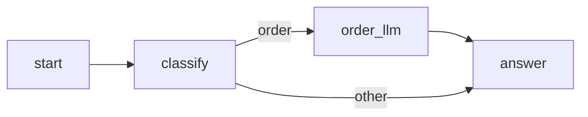

# Plan phase

Start only when the human has approved `spec.md`. The plan phase ends when the human approves `difyctl/<app-slug>/plan.md` and chooses how to build.

## How to plan

1. Turn each spec step into nodes. Use only node types `difyctl get node_type` lists. Read each type's schema, defaults and `version` with `difyctl describe node_type --node-type <type>`.
2. Settle every config in full, so the build only changes format:
   - LLM: model, prompt text and outputs.
   - If-else: conditions, and where each branch goes.
   - Tool: the row from `difyctl get tool --provider <id>`, and a value for every parameter. Never guess one.
   - Human input: the form, the actions, the timeout, and where each action and `__timeout` goes.
   - Code: the code itself.
   - Variable references, written as `{{#node_id.var#}}`.
3. Draw the node-level Mermaid graph with real node ids, every edge, and a label on every branch.
4. Cut the build into slices. Each slice is small and connected, and imports and runs on its own. Slice 1 is the skeleton: start → end (Chatflow: start → answer) with the final inputs and outputs.
5. Map the tests: a `difyctl test node <mode>` call with inputs for each new node, and a full draft run (`difyctl test console_app <mode>`) at the end of each slice on the cases it can pass. `<mode>` is `workflow` or `advanced_chat`.
6. Check coverage. Every requirement maps to a node and a test. Every resource is confirmed, and each chosen plugin is installed and configured. An open resource blocks approval.
7. Ask the human to review the plan, and to choose how to build:
   - you build it alone; or
   - one fresh subagent per slice, one after another, given the slice text, the file paths and the `app_id`. A reviewer subagent checks each slice. Never run two on one app at once: their imports collide on the draft hash.

## Template

Copy this into `plan.md` and fill it in.

````markdown
# <App name>: plan

App: <name>. Mode: <workflow or advanced_chat>. `app_id`: <filled in at build>. Spec: spec.md.

## Node graph



## Node table

| Id        | Type | Version | Title       | Config                                               | Inputs used       | Outputs | Covers |
| --------- | ---- | ------- | ----------- | ---------------------------------------------------- | ----------------- | ------- | ------ |
| order_llm | llm  | 1       | Order reply | model: <provider>/<model>; system prompt: "<prompt>" | `{{#sys.query#}}` | text    | R1     |

## Slices

- [ ] Slice 2: add `classify`, `order_llm`. Covers R1. Node tests: `order_llm` with query "Où est ma commande ?". Full run: A1. Runs: <run ids>

## Test map

- A1: `test console_app advanced_chat`, query "Où est ma commande ?", judged.

## Changes during build

- <what changed>: <why>. Cost if wrong: <cost>. Approved: <when>.
````
