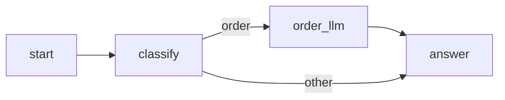

# Plan phase

## Contents

- How to plan
- What `plan.md` holds
- Reviews
- Template

Start only when the human has approved `spec.md`. The plan phase ends when the human approves `difyctl/<app-slug>/plan.md` and chooses how to build.

## How to plan

1. Turn each spec step into nodes. Confirm each node type exists with `difyctl get node_type`. Read its schema, defaults and `version` with `difyctl describe node_type --node-type <type>`. Never use a node type the server doesn't list.
2. Settle every config in full:
   - LLM: model, prompt text and outputs.
   - If-else: conditions.
   - Tool: the chosen tool's row from `difyctl get tool --provider <id>`, and a value for every parameter. Never guess a parameter.
   - Code: the code itself.
   - Variable references, written as `{{#node_id.var#}}`.

   Leave nothing for the build phase to decide. Writing the YAML afterwards is only a change of format.

3. Draw the node-level Mermaid graph. Use real node ids. Draw every edge. Label each branch: if-else true and false, classifier classes, error branches.
4. Cut the build into slices. Each slice is small and connected, and it imports and runs on its own.
   - Slice 1 is always the skeleton: start → end (Chatflow: start → answer), with the final inputs and outputs.
   - Each later slice adds a few nodes.
5. Map the tests.
   - Give each new node a `difyctl test node <mode>` call with specific inputs. `<mode>` is `workflow` for a Workflow app and `advanced_chat` for a Chatflow app.
   - End each slice with a full draft run (`difyctl test console_app workflow` or `difyctl test console_app advanced_chat`) on the acceptance cases that slice can already pass.
6. Check coverage. Every requirement maps to a node and a test. Every resource is confirmed. An open resource blocks approval. Each chosen plugin is installed and configured. An HTTP Request or Code node that calls an outside service needs that choice recorded in the spec.
7. Ask the human to review the plan. Offer two ways to build:
   - you build it alone;
   - one subagent per slice, one after another.

## What `plan.md` holds

| Section              | Content                                                                                      |
| -------------------- | -------------------------------------------------------------------------------------------- |
| Header               | App name, mode, `app_id` (filled in at build), link to the spec                              |
| Node graph           | Node-level Mermaid                                                                           |
| Node table           | Id, type, version, title, full config, inputs used, outputs, covers `R…`                     |
| Slices               | Ordered; each lists nodes added, `R`s covered, `test node` calls, full-run cases, a checkbox |
| Test map             | Acceptance case → command, inputs, check type                                                |
| Changes during build | Filled in during build (read [build.md](build.md))                                           |

## Reviews

After each slice, review the slice against the plan. Use a reviewer subagent if you have one; otherwise check your own work. Ask the human at hand over. Ask earlier only when the spec has to change.

## Template

Copy this into `difyctl/<app-slug>/plan.md` and fill it in.

````markdown
# <App name>: plan

App: <name>. Mode: <workflow or advanced_chat>. `app_id`: <filled in at build>. Spec: spec.md.

## Node graph



## Node table

| Id        | Type | Version | Title       | Config                                                                                                                | Inputs used       | Outputs | Covers |
| --------- | ---- | ------- | ----------- | --------------------------------------------------------------------------------------------------------------------- | ----------------- | ------- | ------ |
| order_llm | llm  | 1       | Order reply | model: <provider>/<model>; system prompt: "Answer in the customer's language. Give the order status in one sentence." | `{{#sys.query#}}` | text    | R1     |

## Slices

- [ ] Slice 2: add `classify` and `order_llm`. Covers R1. Node tests: `test node advanced_chat` on `order_llm` with query "Où est ma commande ?". Full run: A1. Runs: <run ids>

## Test map

| Case | Command                        | Inputs                        | Check type |
| ---- | ------------------------------ | ----------------------------- | ---------- |
| A1   | test console_app advanced_chat | query: "Où est ma commande ?" | judged     |

## Changes during build

| What changed | Why | Cost if wrong |
| ------------ | --- | ------------- |
````
