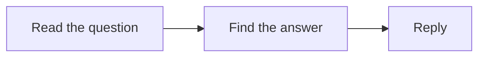

# Spec phase

## Contents

- How to run the spec talk
- What `spec.md` holds
- Check types for acceptance cases
- Template

The spec phase ends when the human approves `difyctl/<app-slug>/spec.md`. Don't start the plan before that.

## How to run the spec talk

1. Start from intent. Ask what the app is for, who uses it, and what a good result looks like. Ask one question at a time. Offer multiple choice where you can.
2. Choose the mode early and say why.
   - Workflow: one run, inputs to outputs.
   - Chatflow: a conversation with memory.
3. Build two things side by side as you talk.
   - **Requirements list.** Whenever the human states a condition or a feature, at any point, add it as `R<n>` in their own words. Give each one a type:
     - **feature**: something the app must do.
     - **rule**: a condition or a limit.
     - **failure**: what happens when something goes wrong.
   - **Process graph.** A Mermaid graph of business steps, not nodes. If you have a way to draw richer visuals, offer that too.
4. Walk scenarios with the human. Take 3 to 6 realistic cases through the graph. Include edge cases: empty input, wrong language, a tool failing, an answer too long. Each walk confirms or changes the graph and the requirements.
5. Collect resources: models, tools and plugins, knowledge bases, agents, credentials.
   - For each step that calls an outside service or needs a model, search before you suggest anything: `difyctl get tool --query <service>`, `difyctl get model --model-type llm`, then `difyctl get marketplace plugin --query <service>`.
   - Show the human a short list per step: name, brief, official, partner or community, install count, installed and configured or not. List HTTP Request or Code last. Say which you recommend and why: an installed and configured tool first, then an official or partner plugin, then a workflow tool.
   - The human picks. Record the choice and the options shown.
   - Never invent a name. Write an unknown item as open; don't guess it.
6. Before you ask for approval:
   - Read the requirements back and ask "anything missing?"
   - Trace both ways. Each requirement names its graph step, or "every step". Each requirement has at least one acceptance case. A requirement missing either is a gap. Raise it with the human.
7. Write the spec. Check it against itself. Ask the human to review it. Don't plan until it is approved.

## What `spec.md` holds

| Section                         | Content                                                                                               |
| ------------------------------- | ----------------------------------------------------------------------------------------------------- |
| Goal                            | What it does, for whom, what success looks like                                                       |
| Mode                            | Workflow or Chatflow, and why                                                                         |
| Requirements                    | `R1…Rn`: type, the requirement in plain words, where it lives in the graph                            |
| Inputs and outputs              | Each variable: name, type, required or optional, example. Chatflow: query and conversation memory too |
| Process                         | The final Mermaid graph; steps may be tagged with requirement ids                                     |
| Acceptance cases                | Id, scenario, inputs, expected result, check type, covers (`R` ids)                                   |
| Resources                       | Each need, the options shown, the human's choice, confirmed or open, and who provides it              |
| Out of scope and open questions |                                                                                                       |

## Check types for acceptance cases

- `exact`: the output must match.
- `contains`: the output must contain given text, or match a pattern.
- `judged`: you grade the output against a short rubric written in the case, and show your reasoning.

## Template

Copy this into `difyctl/<app-slug>/spec.md` and fill it in.

````markdown
# <App name>: spec

## Goal

<What it does, for whom, what success looks like.>

## Mode

<Workflow or Chatflow>, because <why>.

## Requirements

| Id  | Type    | Requirement                                 | Graph step |
| --- | ------- | ------------------------------------------- | ---------- |
| R1  | feature | Reply in the language the customer wrote in | Answer     |

## Inputs and outputs

| Variable | Type   | Required               | Example   |
| -------- | ------ | ---------------------- | --------- |
| <name>   | <type> | <required or optional> | <example> |

<Chatflow: also the query and what the conversation must remember.>

## Process



## Acceptance cases

| Id  | Scenario                | Inputs                        | Expected result                               | Check type                                       | Covers |
| --- | ----------------------- | ----------------------------- | --------------------------------------------- | ------------------------------------------------ | ------ |
| A1  | Customer asks in French | query: "Où est ma commande ?" | Reply is in French and gives the order status | judged: French, names the status, under 80 words | R1     |

## Resources

| Need                                               | Choice   | Options shown        | Status              | Provided by |
| -------------------------------------------------- | -------- | -------------------- | ------------------- | ----------- |
| <model, tool, knowledge base, agent or credential> | <picked> | <what the human saw> | <confirmed or open> | <who>       |

## Out of scope and open questions

- <item>
````
