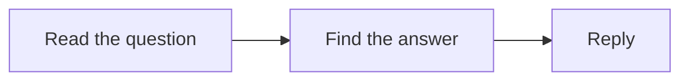

# Spec phase

The spec phase ends when the human approves `difyctl/<app-slug>/spec.md`. Don't plan before that.

## How to run the spec talk

1. Start from intent: what the app is for, who uses it, what a good result looks like. Ask one question at a time, with choices where you can.
2. Choose the mode early and say why. Workflow: one run, inputs to outputs. Chatflow: a conversation with memory.
3. As you talk, keep two things:
   - **Requirements.** Each condition or feature the human states becomes `R<n>`, in their words, typed `feature` (something the app does), `rule` (a condition or limit) or `failure` (what happens when something goes wrong).
   - **Process graph.** A Mermaid graph of business steps, not nodes.
4. Walk 3 to 6 realistic cases through the graph with the human. Include edge cases: empty input, a tool failing, an answer too long.
5. Collect resources: models, tools and plugins, knowledge bases, credentials.
   - For each step that calls an outside service or needs a model, search first: `difyctl get tool --query <service>`, `difyctl get model --model-type llm`, `difyctl get knowledge_base --query <words>`, then `difyctl get marketplace plugin --query <service>`.
   - Show the human a short list per step: name, brief, publisher type, install count, installed and configured or not. Recommend an installed and configured tool first, then an official or partner plugin, then a workflow tool. List HTTP Request or Code last.
   - If the best option needs something from the human (an API key, an install, a knowledge base to upload), ask for it. A missing key is not a reason to pick HTTP Request or Code.
   - The human picks. Record the choice and the options shown. Write an unknown item as open; never guess a name.
6. Before you ask for approval, read the requirements back and ask "anything missing?". Each requirement needs a graph step and at least one acceptance case. Raise any gap with the human.
7. Write the spec, check it against itself, and ask the human to review it.

Acceptance check types: `exact` (the output must match), `contains` (given text or a pattern), `judged` (you grade against the case's rubric and show your reasoning).

## Template

Copy this into `spec.md` and fill it in.

````markdown
# <App name>: spec

## Goal

<What it does, for whom, what success looks like.>

## Mode

<Workflow or Chatflow>, because <why>.

## Requirements

- R1 (feature): Reply in the language the customer wrote in. Step: Answer.

## Inputs and outputs

- <name>: <type>, <required or optional>, e.g. <example>.

## Process



## Acceptance cases

- A1: Customer asks in French. Inputs: query "Où est ma commande ?". Expected: French, gives the status. Check: judged, French and under 80 words. Covers R1.

## Resources

- <need>: <choice>. Shown: <options>. <confirmed or open>, provided by <who>.

## Out of scope and open questions

- <item>
````
