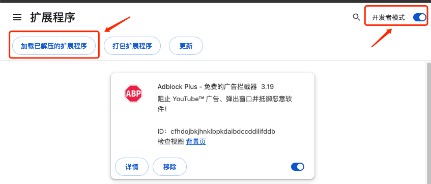
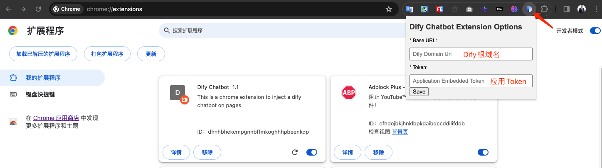
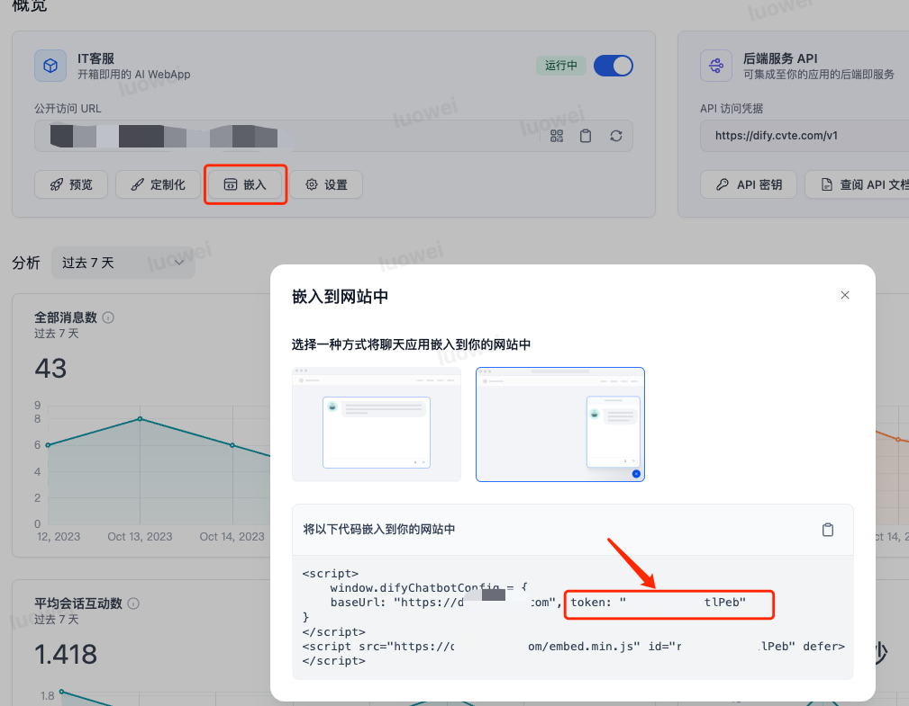
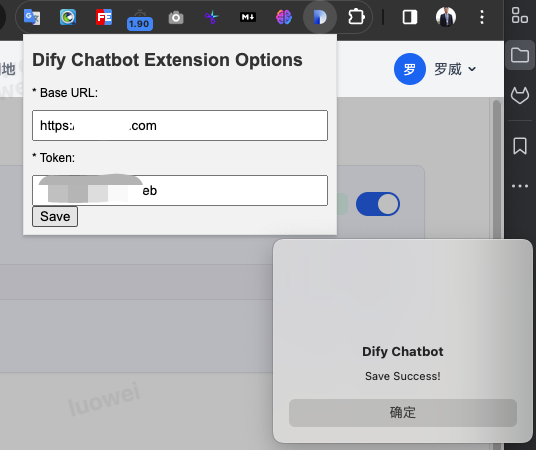

## Chrome Dify ChatBot插件

### 方式1：Chrome插件商店 * [点击访问](https://chrome.google.com/webstore/detail/dify-chatbot/ceehdapohffmjmkdcifjofadiaoeggaf/related?hl=zh-CN&authuser=0) *
 
### 方式2：本地开发者模式加载

- 进入Chrome浏览器管理扩展程序，可直接访问 [chrome://extensions/](chrome://extensions/)
- 选择开启 “开发者模式”，并点击 “加载已解压的扩展程序”

- 然后打开插件源文件所在根目录
  - third-party
    - chrome plug-in
      - content.js          浮动按钮JS脚本
      - favicon.png         插件图标
      - manifest.json       插件描述文件
      - options.css         插件配置页面样式文件
      - options.html        插件配置静态HTML页面
      - options.js          插件配置JS脚本

### 插件导入完成后，后续配置无差异
- 创建Dify应用配置，在应用概览中点击嵌入，切换到安装Chrome浏览器扩展视图，点击copy按钮获取ChatBot Url，如图：

- 点击保存，确认提示配置成功即可

- 保险起见重启浏览器确保所有分页刷新成功
- Chrome打开任意页面均可正常加载DIfy机器人浮动栏，后续如需更换机器人只需要变更ChatBot Url即可

