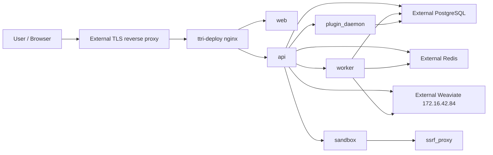

# TTRI Dify Deploy

這個目錄是 TTRI 本地部署用的 Dify 精簡版 Docker Compose。它保留 Dify control plane，並把 PostgreSQL、Redis、Weaviate 視為外部服務。

## 目前部署邊界

本 compose 會啟動：

- `api`: Dify API service
- `worker`: Celery worker
- `worker_beat`: Celery beat 排程服務
- `web`: Dify frontend
- `nginx`: 對外 HTTP 入口
- `sandbox`: 程式碼執行沙箱
- `ssrf_proxy`: sandbox 專用 SSRF proxy
- `plugin_daemon`: plugin 執行環境

外部依賴：

- PostgreSQL
- Redis
- Weaviate REST/GraphQL: `http://172.16.42.84:8080`
- Weaviate gRPC: `grpc://172.16.42.84:50051`
- Docker external network: `ttri-network`

目前 image 版本固定在：

- `langgenius/dify-api:1.14.1`
- `langgenius/dify-web:1.14.1`
- `langgenius/dify-sandbox:0.2.15`
- `langgenius/dify-plugin-daemon:0.6.1-local`

升級 Dify 時要先確認這些版本是否要跟 repo 目前 `docker/docker-compose.yaml` 對齊。

## 架構



注意：`.env.example` 預設使用 `https://...` 與 `wss://...` URL，但本 compose 的 nginx 預設只 expose HTTP port。正式環境應由外部 reverse proxy 負責 TLS。

## 前置需求

1. 建立外部 Docker network：

```bash
docker network create ttri-network
```

2. 準備外部 PostgreSQL。

需要至少兩個 database：

- `dify`
- `dify_plugin`

若 PostgreSQL 使用者不是 superuser，請先用 DB admin 建好 plugin daemon 專用 database，並把 owner 指給 Dify 使用者：

```sql
CREATE USER dify WITH PASSWORD 'o*Xx3aPQ';
CREATE DATABASE dify_plugin OWNER dify;
```

`plugin_daemon` 啟動時會連到 `.env` 的 `DB_PLUGIN_DATABASE`，預設是 `dify_plugin`。如果 database 不存在，而且 `DB_USERNAME` 沒有 `CREATE DATABASE` 權限，`plugin_daemon` 會直接啟動失敗並進入 restart loop。

3. 準備外部 Redis。

Redis 需要讓 Dify containers 可連線，且 `CELERY_BROKER_URL` 必須和 Redis 帳密、DB index 對齊。

4. 準備外部 Weaviate。

Dify 會連到：

- REST/GraphQL: `http://172.16.42.84:8080`
- gRPC: `grpc://172.16.42.84:50051`

`WEAVIATE_API_KEY` 必須和外部 Weaviate 的 API key 設定一致。

5. 確認 reverse proxy。

若對外 URL 使用 HTTPS，請讓外部 reverse proxy 導到本機 `${EXPOSE_NGINX_PORT}`，預設是 `8160`。

## 啟動

在本目錄執行：

```bash
cp .env.example .env
```

編輯 `.env`，至少確認：

- `SECRET_KEY`
- `INIT_PASSWORD`
- `CONSOLE_API_URL`
- `CONSOLE_WEB_URL`
- `SERVICE_API_URL`
- `APP_API_URL`
- `APP_WEB_URL`
- `FILES_URL`
- `DB_HOST`
- `DB_PORT`
- `DB_USERNAME`
- `DB_PASSWORD`
- `DB_DATABASE`
- `REDIS_HOST`
- `REDIS_PORT`
- `REDIS_PASSWORD`
- `CELERY_BROKER_URL`
- `WEAVIATE_ENDPOINT`
- `WEAVIATE_GRPC_ENDPOINT`
- `WEAVIATE_API_KEY`
- `PLUGIN_DAEMON_KEY`
- `PLUGIN_DIFY_INNER_API_KEY`
- `CODE_EXECUTION_API_KEY`
- `SANDBOX_API_KEY`
- `NEXT_PUBLIC_SOCKET_URL`

`./sandbox/conf/config.yaml` 已提供 baseline 設定，預設 `app.key=dify-sandbox`。若調整 `.env` 的 `SANDBOX_API_KEY` 或 `CODE_EXECUTION_API_KEY`，請同步更新 `config.yaml` 的 `app.key`，三者必須一致。

啟動：

```bash
docker compose up -d
```

檢查：

```bash
docker compose ps
docker compose logs -f api worker worker_beat web nginx plugin_daemon
```

啟動後至少確認：

```bash
docker compose exec -T api printenv PLUGIN_DAEMON_URL
docker compose exec -T api getent hosts plugin_daemon
docker compose logs --tail=120 plugin_daemon sandbox
```

正常狀態下：

- `PLUGIN_DAEMON_URL` 應為 `http://plugin_daemon:5002`
- `getent hosts plugin_daemon` 應回傳 Docker network 內的 IP
- `plugin_daemon` 與 `sandbox` 不應停在 `Restarting`

停止：

```bash
docker compose down
```

## 常見啟動故障

### `plugin_daemon` 解析不到或外掛初始化失敗

API log 若出現：

```text
httpx.ConnectError: [Errno -3] Temporary failure in name resolution
```

第一層含義是 API container 解析不到 `plugin_daemon`。不要先查 plugin 安裝包，先查 daemon 是否真的存活：

```bash
docker compose ps plugin_daemon
docker compose logs --tail=120 plugin_daemon
docker compose exec -T api getent hosts plugin_daemon
```

若 `plugin_daemon` log 出現：

```text
FATAL: database "dify_plugin" does not exist
ERROR: permission denied to create database
panic: failed to init dify plugin db
```

代表外部 PostgreSQL 上缺少 `dify_plugin` database，且 `.env` 的 `DB_USERNAME` 沒有建立 database 權限。用 DB admin 建立：

```sql
CREATE DATABASE dify_plugin OWNER dify;
```

再重啟：

```bash
docker compose restart plugin_daemon
```

### `sandbox` 一直重啟

若 sandbox log 出現：

```text
failed to init config: open conf/config.yaml: no such file or directory
```

代表 host bind mount 的 `./sandbox/conf` 裡沒有 `config.yaml`。本部署包已提供 baseline 檔案，遠端部署目錄應該要有：

```text
/home/ttri/dify/sandbox/conf/config.yaml
```

然後確認 `config.yaml` 的 `app.key`、`.env` 的 `SANDBOX_API_KEY`、`.env` 的 `CODE_EXECUTION_API_KEY` 一致。若 `.env` 使用預設值，三者都應是 `dify-sandbox`。

最後重啟：

```bash
docker compose restart sandbox
```

## Runtime 資料

本 compose 使用 host bind mount：

- `./app/storage` -> Dify 檔案 storage
- `./plugin_daemon` -> plugin daemon storage
- `./sandbox/dependencies` -> sandbox dependencies
- `./sandbox/conf` -> sandbox config
- `./nginx/conf.d` -> nginx runtime config
- `./nginx/ssl` -> nginx certificate files, if local TLS is enabled later

這些目錄是 runtime state，不應直接刪除。正式環境要納入備份。Weaviate 資料已在外部主機，備份與 restore 要在 `172.16.42.84` 那台服務上處理。

## 多台擴充前必須處理

目前這套適合單台 Dify control plane。要擴成多台，先處理下面幾點。

1. 外部化檔案儲存。

`STORAGE_TYPE=opendal` + local fs 只能保證單台一致。多台 `api` / `worker` 需要共享 storage，例如 S3、MinIO 或 NAS。

2. 外部化 plugin storage。

目前 `plugin_daemon` 使用本機 `./plugin_daemon`。若 plugin daemon 要水平擴充，`PLUGIN_STORAGE_TYPE` 也要改成共享後端。

3. 指定單一 migration owner。

現在 `MIGRATION_ENABLED=true`。多台同時啟動時，不應讓每個 `api` 都嘗試跑 migration。正式部署應改成單一 migration job 或只讓一台啟用。

4. 維護外部 Weaviate contract。

目前 Weaviate 已經不是 compose service。正式部署要固定下面幾件事：

- `WEAVIATE_ENDPOINT=http://172.16.42.84:8080`
- `WEAVIATE_GRPC_ENDPOINT=grpc://172.16.42.84:50051`
- Dify 主機可連到 8080 與 50051
- 建立 Weaviate backup / restore 流程

5. 收斂安全設定。

正式環境建議：

- 將 `WEB_API_CORS_ALLOW_ORIGINS` 與 `CONSOLE_CORS_ALLOW_ORIGINS` 從 `*` 改成實際網域
- 若不需要遠端 plugin install/debug，不要對外開放 `EXPOSE_PLUGIN_DEBUGGING_PORT`
- 確認 PostgreSQL、Redis、Weaviate 只允許內網或 VPN 存取

## 升級注意事項

這個目錄是客製化部署副本，不會自動跟上 `docker/docker-compose.yaml`。升級 Dify 前要手動比對：

- image tag
- 新增或移除的 env var
- plugin daemon env
- sandbox image/env
- nginx template
- ssrf proxy template
- vector store env

最低限度先跑：

```bash
docker compose --env-file .env -f docker-compose.yml config
```

確認 compose 可展開後，再進行正式升級。
