# Deployments

Deployment app instance, release, runtime target, access, and developer API feature modules.

## Internal Module Dependency Graph

The graph shows dependencies between modules inside `web/features/deployments`. Edges are aggregated to module boundaries instead of individual files.

```mermaid
flowchart TD
  routeState["route-state"]
  shared["shared"]

  list["list"]
  detail["detail"]
  createGuide["create-guide"]
  createRelease["create-release"]
  deployDrawer["deploy-drawer"]
  deploymentActions["deployment-actions"]

  detailOverview["detail/overview"]
  detailInstances["detail/instances"]
  detailAccess["detail/access"]
  detailApiTokens["detail/api-tokens"]
  detailReleases["detail/releases"]

  accessChannels["detail/access/channels"]
  accessPermissions["detail/access/permissions"]
  accessSubjectSelector["detail/access/permissions/access-subject-selector"]
  apiTokenManagement["detail/api-tokens/api-token-management"]
  apiKeys["detail/api-tokens/api-keys"]
  apiDocs["detail/api-tokens/docs"]
  instanceEnvironmentList["detail/instances/environment-list"]
  instanceHeaderActions["detail/instances/header-actions"]
  instanceRowActions["detail/instances/row-actions"]
  overviewAccessSummary["detail/overview/access-summary"]
  overviewEnvironmentStatus["detail/overview/environment-status"]
  overviewReleaseSummary["detail/overview/release-summary"]
  releaseActions["detail/releases/release-actions"]
  releaseHistory["detail/releases/release-history"]

  list --> createGuide
  list --> createRelease
  list --> deployDrawer
  list --> deploymentActions
  list --> detail
  list --> shared

  detail --> routeState
  detail --> shared
  detail --> createRelease
  detail --> deploymentActions
  detail --> detailOverview
  detail --> detailInstances
  detail --> detailAccess
  detail --> detailApiTokens
  detail --> detailReleases

  createGuide --> shared
  createRelease --> shared
  deployDrawer --> shared

  detailOverview --> routeState
  detailOverview --> shared
  detailOverview --> overviewAccessSummary
  detailOverview --> overviewEnvironmentStatus
  detailOverview --> overviewReleaseSummary

  overviewAccessSummary --> routeState
  overviewAccessSummary --> shared
  overviewEnvironmentStatus --> routeState
  overviewEnvironmentStatus --> shared
  overviewEnvironmentStatus --> deployDrawer
  overviewReleaseSummary --> routeState
  overviewReleaseSummary --> shared
  overviewReleaseSummary --> createRelease

  detailInstances --> shared
  detailInstances --> detail
  detailInstances --> instanceEnvironmentList
  detailInstances --> instanceHeaderActions
  instanceEnvironmentList --> shared
  instanceEnvironmentList --> detailInstances
  instanceEnvironmentList --> instanceRowActions
  instanceHeaderActions --> routeState
  instanceHeaderActions --> deployDrawer
  instanceHeaderActions --> detail
  instanceRowActions --> routeState
  instanceRowActions --> shared
  instanceRowActions --> deployDrawer

  detailAccess --> routeState
  detailAccess --> accessChannels
  detailAccess --> accessPermissions
  accessChannels --> routeState
  accessChannels --> shared
  accessChannels --> detailAccess
  accessPermissions --> routeState
  accessPermissions --> shared
  accessPermissions --> detailAccess
  accessPermissions --> accessSubjectSelector

  detailApiTokens --> routeState
  detailApiTokens --> apiTokenManagement
  apiTokenManagement --> routeState
  apiTokenManagement --> shared
  apiTokenManagement --> detailApiTokens
  apiTokenManagement --> apiKeys
  apiTokenManagement --> apiDocs
  apiKeys --> routeState
  apiKeys --> shared
  apiKeys --> detailApiTokens
  apiDocs --> routeState

  detailReleases --> routeState
  detailReleases --> releaseActions
  detailReleases --> releaseHistory
  releaseActions --> routeState
  releaseActions --> shared
  releaseActions --> deployDrawer
  releaseHistory --> shared
  releaseHistory --> detailReleases
  releaseHistory --> releaseActions
```

## Internal Modules

| Module               | Why this module uses it                                                |
| -------------------- | ---------------------------------------------------------------------- |
| `route-state`        | Bridges route identity into deployment feature atoms.                  |
| `shared`             | Provides shared deployment domain rules, hooks, UI, and local helpers. |
| `list`               | Owns the deployment app instance list surface.                         |
| `detail`             | Owns the deployment app instance detail shell and route tabs.          |
| `create-guide`       | Owns the create deployment guide workflow.                             |
| `create-release`     | Owns release creation entry points and dialog state.                   |
| `deploy-drawer`      | Owns deployment target selection and submit workflow state.            |
| `deployment-actions` | Owns app instance edit and delete action surfaces.                     |

## External Modules

None.
